## Effective Degrees of Freedom: Measuring Model Complexity

### Defining Effective Degrees of Freedom

The concept of **effective degrees of freedom** ($df_\lambda$) provides a way to measure the complexity of a model produced by a smoothing spline. Unlike standard linear regression, where the degrees of freedom are simply the number of parameters in the model, in smoothing splines, the complexity is also controlled by the smoothing parameter $\lambda$. The effective degrees of freedom capture the number of "free" parameters that are used by the model during the optimization, providing a more nuanced measure of model complexity that takes into account the imposed smoothness constraints. In smoothing splines, the relationship between the observed data $y$ and the fitted values $\hat{f}$ is linear:

$$\hat{f} = S_\lambda y$$

where $S_\lambda$ is the smoother matrix. Thus the effective degrees of freedom can be obtained by the trace of the smoother matrix:

```mermaid
graph LR
    subgraph "Calculation of Effective Degrees of Freedom"
        direction LR
        A["Smoother Matrix (Sλ)"] --> B["Trace Operator (trace)"]
        B --> C["Effective Degrees of Freedom (dfλ)"]
        style C fill:#ccf,stroke:#333,stroke-width:2px
    end
```

$$df_\lambda = \text{trace}(S_\lambda)$$

This definition gives a continuous measure of complexity, ranging from a small number when the model is very smooth (high regularization), to a large number, up to N (the number of data points), when the regularization is small. This definition captures the fact that the parameters are not entirely free and their impact is controlled by the smoothing parameter.

> 💡 **Exemplo Numérico:**
>
> Let's consider a simple scenario with 5 data points. Suppose we have a smoother matrix $S_\lambda$ resulting from a smoothing spline with a specific $\lambda$ value. Let's assume the smoother matrix is:
>
> $$ S_\lambda = \begin{bmatrix} 0.2 & 0.1 & 0.05 & 0.02 & 0.01 \\ 0.1 & 0.3 & 0.1 & 0.05 & 0.02 \\ 0.05 & 0.1 & 0.4 & 0.1 & 0.05 \\ 0.02 & 0.05 & 0.1 & 0.3 & 0.1 \\ 0.01 & 0.02 & 0.05 & 0.1 & 0.2 \end{bmatrix} $$
>
> To calculate the effective degrees of freedom, we need to compute the trace of this matrix, which is the sum of its diagonal elements:
>
> $$ df_\lambda = \text{trace}(S_\lambda) = 0.2 + 0.3 + 0.4 + 0.3 + 0.2 = 1.4 $$
>
> This result, $df_\lambda = 1.4$, indicates that the model's complexity is equivalent to having roughly 1.4 free parameters. This value is smaller than the total number of data points (5), reflecting the smoothing effect imposed by the regularization parameter $\lambda$.
>
> Now, let's consider another scenario where we have a different smoother matrix $S_{\lambda'}$ resulting from a different $\lambda'$. This time, let's assume the smoothing is less intense, and the smoother matrix is closer to an identity matrix:
>
> $$ S_{\lambda'} = \begin{bmatrix} 0.9 & 0.05 & 0.01 & 0.005 & 0.001 \\ 0.05 & 0.85 & 0.05 & 0.01 & 0.005 \\ 0.01 & 0.05 & 0.9 & 0.05 & 0.01 \\ 0.005 & 0.01 & 0.05 & 0.85 & 0.05 \\ 0.001 & 0.005 & 0.01 & 0.05 & 0.9 \end{bmatrix} $$
>
> Computing the trace for this matrix:
>
> $$ df_{\lambda'} = \text{trace}(S_{\lambda'}) = 0.9 + 0.85 + 0.9 + 0.85 + 0.9 = 4.4 $$
>
> Here, $df_{\lambda'} = 4.4$, indicating a much higher effective degree of freedom. This means the model is now more complex, fitting the data more closely, which is consistent with a smaller value of lambda.

```mermaid
graph LR
    subgraph "Impact of Smoothing Parameter (λ)"
        direction LR
        A["High λ (Strong Smoothing)"] --> B["Smoother Matrix (Sλ) closer to Projection"]
        B --> C["Lower Effective Degrees of Freedom (dfλ)"]
        C --> D["Less Complex Model"]
        E["Low λ (Weak Smoothing)"] --> F["Smoother Matrix (Sλ) closer to Identity"]
        F --> G["Higher Effective Degrees of Freedom (dfλ)"]
        G --> H["More Complex Model"]
        style C fill:#ccf,stroke:#333,stroke-width:2px
        style G fill:#ccf,stroke:#333,stroke-width:2px
    end
```

> These examples illustrate how the effective degrees of freedom, $df_\lambda$, capture the model complexity controlled by the smoothing parameter $\lambda$. A higher $df_\lambda$ means that the model is more flexible and can fit the data more closely, whereas a lower $df_\lambda$ corresponds to a smoother fit with less flexibility.
>
> In practice, the smoother matrix $S_\lambda$ is derived from basis functions and the regularization parameter, and the trace is calculated based on that. The $df_\lambda$ is used in model selection criteria such as AIC or BIC to penalize model complexity.

```mermaid
graph LR
    subgraph "Model Selection with dfλ"
    direction TB
    A["Effective Degrees of Freedom (dfλ)"]
    B["Model Complexity"]
    C["Model Selection Criteria (e.g., AIC, BIC)"]
    D["Penalization of Model Complexity"]
    A --> B
    B --> D
    C --> D
    style A fill:#ccf,stroke:#333,stroke-width:2px
    end
```

[^5.4.1]: "The expression M = trace(He) gives the dimension of the projection space, which is also the number of basis functions, and hence the number of parameters involved in the fit. By analogy we define the effective degrees of freedom of a smoothing spline to be" *(Trecho de <Basis Expansions and Regularization>)*
