## SVD Interpretation of Smoothing Splines: Decomposing and Shrinking

```mermaid
graph LR
    subgraph "SVD of Smoother Matrix"
        direction TB
        A["Input Data 'y'"] --> B["Project onto Eigenvectors 'uk'"];
        B --> C["Shrink by Eigenvalues 'ρk(λ)'"];
        C --> D["Reconstruct Smoothed Function 'ŷ'"];
    end
    style A fill:#f9f,stroke:#333,stroke-width:2px
    style D fill:#ccf,stroke:#333,stroke-width:2px
```



### SVD of the Smoother Matrix

The **Singular Value Decomposition (SVD)** is a powerful technique used to analyze matrices by decomposing them into simpler components. When applied to the smoother matrix ($S_\lambda$), the SVD provides insights into how smoothing splines operate. As discussed before, a smoother matrix is symmetric, therefore its SVD is equivalent to an **eigen-decomposition**. The eigen-decomposition of the smoother matrix $S_\lambda$ can be written as:

$$
S_\lambda = \sum_{k=1}^{N} \rho_k(\lambda) u_k u_k^T
$$
where $\rho_k(\lambda)$ are the eigenvalues of the matrix $S_\lambda$, and $u_k$ are the corresponding eigenvectors. The eigenvectors are orthonormal and form a basis for the data space. The eigenvalues, which are real and positive, quantify how much each eigenvector contributes to the transformation of the data through the smoother matrix. This decomposition allows us to see the smoother matrix as a sum of rank one matrices that operate on the data through their eigenvectors.

> 💡 **Exemplo Numérico:**
>
> Let's consider a simplified scenario with a smoother matrix $S_\lambda$ of size 3x3.  Suppose we have the following eigenvalues and eigenvectors:
>
>   - $\rho_1(\lambda) = 0.9$, $u_1 = \begin{bmatrix} 0.6 \\ 0.8 \\ 0 \end{bmatrix}$
>   - $\rho_2(\lambda) = 0.5$, $u_2 = \begin{bmatrix} -0.8 \\ 0.6 \\ 0 \end{bmatrix}$
>   - $\rho_3(\lambda) = 0.1$, $u_3 = \begin{bmatrix} 0 \\ 0 \\ 1 \end{bmatrix}$
>
> In this case, the smoother matrix can be constructed as:
>
> $S_\lambda = 0.9 \begin{bmatrix} 0.6 \\ 0.8 \\ 0 \end{bmatrix} \begin{bmatrix} 0.6 & 0.8 & 0 \end{bmatrix} + 0.5 \begin{bmatrix} -0.8 \\ 0.6 \\ 0 \end{bmatrix} \begin{bmatrix} -0.8 & 0.6 & 0 \end{bmatrix} + 0.1 \begin{bmatrix} 0 \\ 0 \\ 1 \end{bmatrix} \begin{bmatrix} 0 & 0 & 1 \end{bmatrix}$
>
> $S_\lambda = 0.9 \begin{bmatrix} 0.36 & 0.48 & 0 \\ 0.48 & 0.64 & 0 \\ 0 & 0 & 0 \end{bmatrix} + 0.5 \begin{bmatrix} 0.64 & -0.48 & 0 \\ -0.48 & 0.36 & 0 \\ 0 & 0 & 0 \end{bmatrix} + 0.1 \begin{bmatrix} 0 & 0 & 0 \\ 0 & 0 & 0 \\ 0 & 0 & 1 \end{bmatrix}$
>
> $S_\lambda = \begin{bmatrix} 0.324 & 0.432 & 0 \\ 0.432 & 0.576 & 0 \\ 0 & 0 & 0 \end{bmatrix} + \begin{bmatrix} 0.32 & -0.24 & 0 \\ -0.24 & 0.18 & 0 \\ 0 & 0 & 0 \end{bmatrix} + \begin{bmatrix} 0 & 0 & 0 \\ 0 & 0 & 0 \\ 0 & 0 & 0.1 \end{bmatrix}$
>
> $S_\lambda = \begin{bmatrix} 0.644 & 0.192 & 0 \\ 0.192 & 0.756 & 0 \\ 0 & 0 & 0.1 \end{bmatrix}$
>
> Now consider a data vector $y = \begin{bmatrix} 1 \\ 2 \\ 3 \end{bmatrix}$. We can understand how the smoother acts by projecting $y$ onto the eigenvectors and shrinking them by their respective eigenvalues:
>
> 1. **Projection onto $u_1$:** $y^T u_1 = \begin{bmatrix} 1 & 2 & 3 \end{bmatrix} \begin{bmatrix} 0.6 \\ 0.8 \\ 0 \end{bmatrix} = 0.6 + 1.6 + 0 = 2.2$
> 2. **Projection onto $u_2$:** $y^T u_2 = \begin{bmatrix} 1 & 2 & 3 \end{bmatrix} \begin{bmatrix} -0.8 \\ 0.6 \\ 0 \end{bmatrix} = -0.8 + 1.2 + 0 = 0.4$
> 3. **Projection onto $u_3$:** $y^T u_3 = \begin{bmatrix} 1 & 2 & 3 \end{bmatrix} \begin{bmatrix} 0 \\ 0 \\ 1 \end{bmatrix} = 0 + 0 + 3 = 3$
>
> Now we shrink these projections by the respective eigenvalues:
>
> 1. **Shrunk component 1:** $2.2 * 0.9 = 1.98$
> 2. **Shrunk component 2:** $0.4 * 0.5 = 0.2$
> 3. **Shrunk component 3:** $3 * 0.1 = 0.3$
>
> Finally, we reconstruct the smoothed vector $\hat{y}$ by multiplying these shrunk projections by the eigenvectors and summing them:
>
> $\hat{y} = 1.98 \begin{bmatrix} 0.6 \\ 0.8 \\ 0 \end{bmatrix} + 0.2 \begin{bmatrix} -0.8 \\ 0.6 \\ 0 \end{bmatrix} + 0.3 \begin{bmatrix} 0 \\ 0 \\ 1 \end{bmatrix} = \begin{bmatrix} 1.188 \\ 1.584 \\ 0 \end{bmatrix} + \begin{bmatrix} -0.16 \\ 0.12 \\ 0 \end{bmatrix} + \begin{bmatrix} 0 \\ 0 \\ 0.3 \end{bmatrix} = \begin{bmatrix} 1.028 \\ 1.704 \\ 0.3 \end{bmatrix}$
>
>  This example shows how the smoother matrix shrinks components of the input data along its eigenvectors, with the largest eigenvalue corresponding to the least shrunk component.  The component associated with $u_3$ has the smallest eigenvalue and thus it is shrunk the most.
>
> This process can be summarized with the following Mermaid diagram:
> ```mermaid
> graph LR
>     A["Input Data 'y'"] -->|Project onto 'u1'| B1["y^T u1"]
>     A -->|Project onto 'u2'| B2["y^T u2"]
>     A -->|Project onto 'u3'| B3["y^T u3"]
>     B1 -->|Shrink by 'ρ1'| C1["ρ1 * y^T u1"]
>     B2 -->|Shrink by 'ρ2'| C2["ρ2 * y^T u2"]
>     B3 -->|Shrink by 'ρ3'| C3["ρ3 * y^T u3"]
>     C1 -->|Multiply by 'u1'| D1
>     C2 -->|Multiply by 'u2'| D2
>     C3 -->|Multiply by 'u3'| D3
>     D1 -->|Sum| E["Smoothed Data 'ŷ'"]
>     D2 -->|Sum| E
>     D3 -->|Sum| E
> ```

```mermaid
graph LR
    subgraph "Eigen-decomposition of Smoother Matrix"
        direction TB
        A["Smoother Matrix 'Sλ'"] --> B["Eigenvalues 'ρk(λ)'"];
        A --> C["Eigenvectors 'uk'"];
        B --> D["'ρk(λ)' quantify contribution of 'uk'"];
        C --> D;
        D --> E["'Sλ' as sum of rank-1 matrices"];
    end
```

[^5.4.1]: "Since Sx is symmetric (and positive semidefinite), it has a real eigen-decomposition." *(Trecho de <Basis Expansions and Regularization>)*
