## The Reinsch Form and SVD: Unveiling the Shrinking Process

```mermaid
graph LR
    subgraph "Reinsch Form"
        direction TB
        A["Smoother Matrix Sλ"]
        B["Identity Matrix I"]
        C["Penalty Matrix K"]
        D["Smoothing Parameter λ"]
        E["Sλ = (I + λK)⁻¹"]
        B & C & D --> F["I + λK"]
        F --> G["(I + λK)⁻¹"]
        G --> A
        A --> E
     end
```



### Reinsch Form of the Smoother Matrix

The **Reinsch form** provides an alternative representation of the smoother matrix $S_\lambda$ that highlights the role of the penalty matrix in smoothing. The Reinsch form of the smoother matrix is defined as:

$$
S_\lambda = (I + \lambda K)^{-1}
$$

where $I$ is the identity matrix and $K$ is the **penalty matrix**. This representation is mathematically equivalent to the expression that arises from minimizing the penalized residual sum of squares, and it explicitly separates the smoothing operation as being determined by a penalty matrix $K$ and a parameter $\lambda$. The matrix $K$ does not depend on $\lambda$ and is directly related to the basis matrix $N$ and to the penalty matrix used in the penalized RSS minimization. However, the explicit form of $K$ is not needed in our present discussion and can be complex to derive. The form is particularly useful because it reveals that the smoother matrix is the result of shrinking a function in the direction determined by $K$.

> 💡 **Exemplo Numérico:**
>
> Let's illustrate the Reinsch form with a simplified example. Suppose we have a small 3x3 identity matrix $I$ and a 3x3 penalty matrix $K$ representing the second derivative penalty (often used in smoothing):
>
> $$ I = \begin{bmatrix} 1 & 0 & 0 \\ 0 & 1 & 0 \\ 0 & 0 & 1 \end{bmatrix} $$
>
> $$ K = \begin{bmatrix} 2 & -1 & 0 \\ -1 & 2 & -1 \\ 0 & -1 & 2 \end{bmatrix} $$
>
> Let's choose a smoothing parameter $\lambda = 0.5$.  Then, we calculate $I + \lambda K$:
>
> $$ I + \lambda K = \begin{bmatrix} 1 & 0 & 0 \\ 0 & 1 & 0 \\ 0 & 0 & 1 \end{bmatrix} + 0.5 \begin{bmatrix} 2 & -1 & 0 \\ -1 & 2 & -1 \\ 0 & -1 & 2 \end{bmatrix} = \begin{bmatrix} 2 & -0.5 & 0 \\ -0.5 & 2 & -0.5 \\ 0 & -0.5 & 2 \end{bmatrix} $$
>
> Now, we need to calculate the inverse of this matrix, $(I + \lambda K)^{-1}$, which is our smoother matrix $S_\lambda$.  Using a numerical computation tool (like numpy), we find:
>
> ```python
> import numpy as np
>
> I = np.array([[1, 0, 0], [0, 1, 0], [0, 0, 1]])
> K = np.array([[2, -1, 0], [-1, 2, -1], [0, -1, 2]])
> lambda_val = 0.5
>
> S_lambda = np.linalg.inv(I + lambda_val * K)
> print(S_lambda)
> ```
>
> This gives us:
>
> $$ S_\lambda \approx \begin{bmatrix} 0.571 & 0.143 & 0.071 \\ 0.143 & 0.643 & 0.143 \\ 0.071 & 0.143 & 0.571 \end{bmatrix} $$
>
>
> The matrix $S_\lambda$ is the smoother matrix. Notice how the diagonal elements are larger than off-diagonal elements. When $S_\lambda$ is applied to a vector, it will give a smoothed version of that vector. The effect of $K$ is to penalize large differences between adjacent values, and $\lambda$ controls the strength of this penalization.  Higher values of $\lambda$ lead to stronger shrinking, and thus smoother curves.

```mermaid
graph LR
    subgraph "Effect of K on Smoothing"
        direction LR
        A["Original Data"] --> B["Apply Smoother Matrix Sλ"]
        B --> C["Smoothed Data"]
        D["Penalty Matrix K"]
        E["Smoothing Parameter λ"]
        D & E --> F["Influence on Sλ"]
        F --> B
        D --> G["Penalizes Differences"]
        G --> C
    end
```



> Intuitively, the Reinsch form shows that the smoothing operation is achieved by inverting a matrix that is modified by a penalty matrix. This reveals how the penalty matrix $K$ influences the smoothing process by shrinking the original data towards a smoother version.

[^5.17]: "Since Sx is symmetric (and positive semidefinite), it has a real eigen-decomposition. Before we proceed, it is convenient to rewrite Sx in the Reinsch form Sx = (I + \lambda K)^{-1}," *(Trecho de <Basis Expansions and Regularization>)*
