## The Bias-Variance Tradeoff: A Fundamental Balancing Act


### Defining Bias and Variance

In the realm of statistical modeling, **bias** and **variance** are two crucial concepts that describe different aspects of a model’s performance. They are intimately related and exhibit a tradeoff, where reducing one tends to increase the other.

**Bias** refers to the error introduced by approximating a real-world, possibly complex, problem with a simplified model. A model with high bias makes strong assumptions about the underlying data-generating process and therefore may miss important relationships. Such models are said to *underfit* the data, as they cannot capture the complexity of the true underlying patterns and have a tendency to perform poorly both on the data used to fit the model and new data. Bias is a measure of how far away the average prediction of a model, across all possible training data sets, is from the true relationship.

```mermaid
graph LR
    subgraph "Bias Definition"
        direction TB
        A["True Relationship: f(x)"]
        B["Model Prediction: f̂(x)"]
        C["Bias: E[f̂(x)] - f(x)"]
        A --> C
        B --> C
    end
```



> 💡 **Exemplo Numérico:**
>
> Imagine we are trying to model the relationship between study hours and exam scores. The true relationship is quadratic: $score = 50 + 2 \times hours + 0.5 \times hours^2$.
>
> **High Bias Model:** We use a linear model: $score = \beta_0 + \beta_1 \times hours$.
>
> Let's say we have the following data:
>
> | Hours | True Score |
> |-------|------------|
> | 1     | 52.5       |
> | 2     | 56         |
> | 3     | 60.5       |
> | 4     | 66         |
> | 5     | 72.5       |
>
> Our linear model, after being trained on this data, might give us something like: $score = 50 + 4.5 \times hours$. This model will consistently underestimate the true score, especially as study hours increase. This systematic underestimation is the **bias**. No matter how many different datasets we use, the linear model will always struggle to capture the quadratic curvature, showing a consistent bias.

**Variance**, on the other hand, refers to the model’s sensitivity to fluctuations in the training data. A model with high variance is very flexible and can fit the training data almost perfectly, including noise and random fluctuations. Such models are said to *overfit* the data, performing well on the training data but poorly on new, unseen data. Variance quantifies how much the model’s predictions change as the training data changes. Models with high variance are often characterized by a high number of parameters, as well as the ability to perfectly fit the training data, at the cost of reduced predictive power on new data. Ideally, we want models that have low bias and low variance, but this is generally not possible, and it is necessary to find a good balance.

```mermaid
graph LR
    subgraph "Variance Definition"
        direction TB
        A["Model Prediction: f̂(x)"]
        B["Expected Prediction: E[f̂(x)]"]
        C["Variance: E[(f̂(x) - E[f̂(x)])²]"]
        A --> C
        B --> C
    end
```



> 💡 **Exemplo Numérico:**
>
> Using the same scenario as above, let's consider a high variance model.
>
> **High Variance Model:** We use a high degree polynomial model, say a 4th degree polynomial: $score = \beta_0 + \beta_1 \times hours + \beta_2 \times hours^2 + \beta_3 \times hours^3 + \beta_4 \times hours^4$.
>
> If we were to fit this model to the limited data we have, it could potentially fit the training data almost perfectly.
>
> Let's assume the fitted model is: $score = 49 + 5*hours + 0.2*hours^2 + 0.05*hours^3 - 0.002*hours^4$. This model perfectly fits the training data, but if we add a new data point, for example, 6 hours of study, where the true score should be 79, the model might predict something very different, say 85 or 72.
>
> If we were to get a different set of training data, the coefficients of the polynomial model could change drastically, resulting in large variations in predictions for the same input. This is high **variance**. The model is too sensitive to small changes in the training data.
>
> ```python
> import numpy as np
> import matplotlib.pyplot as plt
> from sklearn.preprocessing import PolynomialFeatures
> from sklearn.linear_model import LinearRegression
>
> # Training data
> hours = np.array([1, 2, 3, 4, 5]).reshape(-1, 1)
> true_scores = 50 + 2*hours + 0.5*hours**2
>
> # Generate test data
> test_hours = np.linspace(0, 7, 100).reshape(-1, 1)
> true_test_scores = 50 + 2*test_hours + 0.5*test_hours**2
>
> # Linear Model (High Bias)
> linear_model = LinearRegression()
> linear_model.fit(hours, true_scores)
> linear_predictions = linear_model.predict(test_hours)
>
> # Polynomial Model (High Variance)
> poly = PolynomialFeatures(degree=4)
> hours_poly = poly.fit_transform(hours)
> test_hours_poly = poly.transform(test_hours)
> poly_model = LinearRegression()
> poly_model.fit(hours_poly, true_scores)
> poly_predictions = poly_model.predict(test_hours_poly)
>
> # Plotting the results
> plt.figure(figsize=(10, 6))
> plt.scatter(hours, true_scores, color='red', label='Training Data')
> plt.plot(test_hours, true_test_scores, color='black', linestyle='--', label='True Relationship')
> plt.plot(test_hours, linear_predictions, color='blue', label='Linear Model (High Bias)')
> plt.plot(test_hours, poly_predictions, color='green', label='Polynomial Model (High Variance)')
> plt.xlabel('Study Hours')
> plt.ylabel('Exam Score')
> plt.title('Bias-Variance Tradeoff')
> plt.legend()
> plt.grid(True)
> plt.show()
> ```
>
> This python code will plot how the linear model (high bias) underfits the true data points and how the polynomial model (high variance) closely fits the training data, but with more variation in the test region.
>
> The linear model consistently underestimates because it cannot capture the quadratic trend, exhibiting bias. In contrast, the polynomial model has high variance. If we had slightly different training data, the polynomial curve could change dramatically, demonstrating its sensitivity to variations in the training set.


[^5.5.2]: "Figure 5.9 shows the effect of the choice of dfx when using a smoothing spline on a simple example" *(Trecho de <Basis Expansions and Regularization>)*
