## Degrees of Freedom: Controlling Bias and Variance


### Degrees of Freedom and Complexity

The **degrees of freedom** of a model serve as a measure of its complexity and flexibility. A model with high degrees of freedom can adapt more closely to the training data, fitting complex patterns and relationships. However, this increased flexibility comes at the cost of higher variance, making the model more sensitive to fluctuations in the training data. On the other hand, a model with low degrees of freedom is more constrained and less flexible, leading to a simpler model with potentially higher bias and a lower variance. Therefore, the degrees of freedom, by controlling the complexity of the model, play a fundamental role in balancing the bias-variance tradeoff. In standard linear regression, the degrees of freedom correspond directly to the number of parameters in the model (e.g., the number of coefficients in the model). However, in models using basis expansions, this correspondence becomes more complex since the basis functions themselves introduce a layer of model flexibility.

> 💡 **Exemplo Numérico:**
>
> Let's consider a simple linear regression model:
>
> $y = \beta_0 + \beta_1 x_1 + \beta_2 x_2 + \epsilon$
>
> Here, we have three parameters: $\beta_0$, $\beta_1$, and $\beta_2$. Therefore, the degrees of freedom for this model is 3. This means the model has the flexibility to fit a plane in a 3D space.

```mermaid
graph LR
    subgraph "Linear Regression Model"
        direction TB
        A["Model: y = β₀ + β₁x₁ + β₂x₂ + ε"]
        B["Parameters: β₀, β₁, β₂"]
        C["Degrees of Freedom: 3"]
        A --> B
        B --> C
    end
```



> Now, let's consider a scenario where we have 10 data points. If we were to use a polynomial regression with a degree of 9, we would have 10 parameters (including the intercept). The degrees of freedom would be 10. This high degree of freedom allows the model to perfectly fit all training points (zero training error) but is likely to overfit, leading to poor generalization on new data.
>
> In contrast, a linear model ($y = \beta_0 + \beta_1 x$) has only 2 degrees of freedom. It is much less flexible and might not capture complex relationships in the data, potentially leading to higher bias (underfitting).
>
> To illustrate this further, let's use Python and scikit-learn to generate some data and fit models with different complexities:
> ```python
> import numpy as np
> import matplotlib.pyplot as plt
> from sklearn.linear_model import LinearRegression
> from sklearn.preprocessing import PolynomialFeatures
> from sklearn.metrics import mean_squared_error
>
> # Generate some sample data
> np.random.seed(0)
> n_samples = 20
> X = np.sort(np.random.rand(n_samples))
> y = 2*X + 0.5*np.sin(5*X) + 0.2 * np.random.randn(n_samples) # true relationship is a bit more complex
> X = X.reshape(-1, 1)
>
> # Linear model (2 degrees of freedom)
> linear_model = LinearRegression()
> linear_model.fit(X, y)
> y_linear_pred = linear_model.predict(X)
>
> # Polynomial model of degree 3 (4 degrees of freedom)
> poly_features = PolynomialFeatures(degree=3)
> X_poly = poly_features.fit_transform(X)
> poly_model = LinearRegression()
> poly_model.fit(X_poly, y)
> y_poly_pred = poly_model.predict(X_poly)
>
> # Polynomial model of degree 10 (11 degrees of freedom)
> poly_features_10 = PolynomialFeatures(degree=10)
> X_poly_10 = poly_features_10.fit_transform(X)
> poly_model_10 = LinearRegression()
> poly_model_10.fit(X_poly_10, y)
> y_poly_pred_10 = poly_model_10.predict(X_poly_10)
>
> # Calculate MSE
> mse_linear = mean_squared_error(y, y_linear_pred)
> mse_poly_3 = mean_squared_error(y, y_poly_pred)
> mse_poly_10 = mean_squared_error(y, y_poly_pred_10)
>
> print(f'MSE Linear: {mse_linear:.4f}')
> print(f'MSE Polynomial (degree 3): {mse_poly_3:.4f}')
> print(f'MSE Polynomial (degree 10): {mse_poly_10:.4f}')
>
> # Plotting
> plt.figure(figsize=(10, 6))
> plt.scatter(X, y, color='blue', label='Data')
> plt.plot(X, y_linear_pred, color='red', label='Linear (df=2)')
> plt.plot(X, y_poly_pred, color='green', label='Poly (df=4)')
> plt.plot(X, y_poly_pred_10, color='purple', label='Poly (df=11)')
> plt.xlabel('X')
> plt.ylabel('y')
> plt.legend()
> plt.title('Model Complexity and Fit')
> plt.show()
> ```
>
> In this example, the linear model has the highest MSE because it cannot capture the non-linear relationship in the data. The polynomial model of degree 3 has a lower MSE, indicating a better fit. However, the polynomial model of degree 10 fits the training data almost perfectly, achieving a very low training MSE but might not generalize well (it is overfitting). The degree of freedom directly influences the model's ability to adapt to the data, demonstrating the trade-off between bias and variance.


> This example illustrates how the number of parameters (degrees of freedom) affects model complexity and its ability to fit the training data. Higher degrees of freedom allow the model to learn more intricate patterns, potentially leading to overfitting if not handled carefully.

[^5.4.1]: "The expression M = trace(He) gives the dimension of the projection space, which is also the number of basis functions, and hence the number of parameters involved in the fit. By analogy we define the effective degrees of freedom of a smoothing spline to be" *(Trecho de <Basis Expansions and Regularization>)*
[^5.5.2]:"Figure 5.9 shows the effect of the choice of dfx when using a smoothing spline on a simple example" *(Trecho de <Basis Expansions and Regularization>)*
