## The Integrated Squared Prediction Error (EPE): A Comprehensive Measure of Model Performance

```mermaid
graph LR
    subgraph "Integrated Squared Prediction Error (EPE)"
        direction TB
        A["True Value: Y"]
        B["Predicted Value: f(X)"]
        C["Squared Error: (Y - f(X))²"]
        D["Expectation: E[(Y - f(X))²]"]
        E["Integrated EPE over Feature Space"]
        A --> C
        B --> C
        C --> D
        D --> E
    end
```



### Defining Integrated Squared Prediction Error

The **Integrated Squared Prediction Error (EPE)** is a metric used to evaluate the performance of a statistical model, specifically in regression settings. It quantifies the expected squared difference between the true value of the variable and the prediction made by the model, integrated over the entire range of possible values for the features. This metric is a comprehensive measure of model performance because it combines two important sources of error: bias and variance. The EPE is defined as:
$$
EPE(f_x) = E[(Y - f(X))^2]
$$
where $Y$ is the observed response, $f(X)$ is the predicted value from the model, and $E[\cdot]$ represents the expectation over the joint distribution of the input features $X$ and the corresponding variable $Y$. Essentially, the EPE is an *integrated measure* that looks at performance over the entire range of data, and is therefore a comprehensive measure of a model's performance. The goal in model selection is, therefore, to choose models that minimize the integrated squared prediction error.

[^5.5.2]: "The integrated squared prediction error (EPE) combines both bias and variance in a single summary: EPE(fx) = E(Y − f(X))²" *(Trecho de <Basis Expansions and Regularization>)*

> 💡 **Exemplo Numérico:**
>
> Let's consider a simple scenario with one feature $X$ and a response variable $Y$. Assume the true relationship between $X$ and $Y$ is given by $Y = 2X + 3 + \epsilon$, where $\epsilon$ is random noise with mean 0 and variance 1. We'll simulate some data and fit two models:
>
> 1.  A linear model (correct model): $f_1(X) = \beta_0 + \beta_1X$
> 2.  A constant model (incorrect model): $f_2(X) = \beta_0$
>
> We can then calculate the EPE using simulated data and compare the performance of these two models.
>
> First, let's generate some data:
>
> ```python
> import numpy as np
> import matplotlib.pyplot as plt
> from sklearn.linear_model import LinearRegression
> from sklearn.metrics import mean_squared_error
>
> np.random.seed(42)
> X = np.sort(np.random.rand(100) * 10) # Generate 100 values for X from 0 to 10
> epsilon = np.random.randn(100) # Generate 100 noise values
> Y = 2 * X + 3 + epsilon # Generate Y with a linear relationship and noise
> X = X.reshape(-1, 1) # Reshape X to be a 2D array
>
> # Fit the linear model
> model1 = LinearRegression()
> model1.fit(X, Y)
> Y_pred1 = model1.predict(X)
>
> # Fit the constant model (mean of Y)
> model2 = np.mean(Y)
> Y_pred2 = np.full(Y.shape, model2) # Predict the mean for all points
>
> # Calculate the MSE
> mse1 = mean_squared_error(Y, Y_pred1)
> mse2 = mean_squared_error(Y, Y_pred2)
>
> print(f"MSE for Linear Model: {mse1:.4f}")
> print(f"MSE for Constant Model: {mse2:.4f}")
>
> # Plot the data and the fitted models
> plt.figure(figsize=(10, 6))
> plt.scatter(X, Y, color='blue', label='Data')
> plt.plot(X, Y_pred1, color='red', label='Linear Model')
> plt.plot(X, Y_pred2, color='green', label='Constant Model')
> plt.xlabel('X')
> plt.ylabel('Y')
> plt.legend()
> plt.title('Comparison of Linear and Constant Models')
> plt.show()
> ```
>
> In the code above:
>
> -   We generate data with a known linear relationship ($Y = 2X + 3 + \epsilon$).
> -   We fit a linear model (model 1) and a constant model (model 2, just the mean of Y).
> -   We calculate the Mean Squared Error (MSE) for each model. In this case, the MSE is a sample estimate of EPE.
> -   We plot the data and the predictions made by both models.
>
> The output will show that the linear model has a lower MSE (sample estimate of EPE), meaning it is a better fit for the data than the constant model. This aligns with the theoretical understanding of EPE: the linear model has lower bias, fitting the underlying relationship well, and also has low variance, as it is not overfitting the data.

```mermaid
graph LR
    subgraph "Model Comparison"
        direction LR
        A["Data Generation: Y = 2X + 3 + ε"]
        B["Model 1: Linear Model f₁(X) = β₀ + β₁X"]
        C["Model 2: Constant Model f₂(X) = β₀"]
        D["MSE Calculation"]
        E["EPE Estimation (MSE)"]
        A --> B
        A --> C
        B --> D
        C --> D
         D --> E
    end
```



> Let's delve deeper into the bias and variance components. The bias of the constant model is higher because it cannot capture the linear relationship between X and Y. The variance is zero because it always predicts the same value. The linear model has lower bias as it can approximate the true relationship. If we had a very complex model, it would have very low bias but high variance, meaning it would capture the noise in the data, resulting in poor generalization.

```mermaid
graph LR
    subgraph "Bias-Variance Tradeoff"
        direction TB
        A["Model Complexity"]
        B["Bias: E[f̂(X)] - f(X)"]
        C["Variance: E[(f̂(X) - E[f̂(X)])²]"]
        D["EPE = Bias² + Variance + Irreducible Error"]
        A --> B
        A --> C
        B & C --> D
        style A fill:#f9f,stroke:#333,stroke-width:2px
    end
```



> The MSE values (sample estimates of EPE) provide a practical numerical measure of how well each model predicts the data. The linear model, which has a lower MSE, is a better choice based on the EPE criterion. This shows how the EPE captures both bias and variance, penalizing models that are either too simple or too complex. The plot further illustrates this.
>
> Specifically, the MSE obtained from the python code should be close to:
>
> - MSE for Linear Model: ~1.0 (close to the variance of the noise)
> - MSE for Constant Model: ~33.5  (reflecting the variability of Y and high bias)
>
> This numerical example demonstrates how EPE (approximated by MSE here) can be used to compare models, with the model having a lower EPE being preferred.
>
> The EPE is a theoretical construct, and in practice, we can only estimate it using metrics like the MSE on a test dataset. However, the underlying idea of balancing bias and variance remains the core concept for model selection.
