## Fixing Degrees of Freedom: Numerical Methods for Model Control

```mermaid
graph LR
    subgraph "Degrees of Freedom Control"
        direction TB
        A["Desired df (df_λ)"]
        B["Numerical Method (e.g., Bisection, Newton-Raphson)"]
        C["Smoothing Parameter (λ)"]
        D["Smoother Matrix (S_λ)"]
        E["trace(S_λ) = df_λ"]
        A --> B
        B --> C
        C --> D
        D --> E
        E --"Checks if trace(S_λ) matches desired df_λ"-->B
    end
```



### Degrees of Freedom as a Control Parameter

In the context of smoothing splines, the **degrees of freedom** ($df_\lambda$), which is given by the trace of the smoother matrix $S_\lambda$, provides a direct and intuitive way to control the complexity of the model. Instead of directly selecting the smoothing parameter $\lambda$, we can specify the desired level of complexity for the model, through the choice of $df_\lambda$, and then find the corresponding smoothing parameter that gives that complexity. This approach is particularly useful because $df_\lambda$ has a more direct interpretation in terms of the model's flexibility, whereas $\lambda$ is an abstract penalty parameter [^5.4.1]. Thus, choosing the degrees of freedom is a way of expressing the desired complexity of the model explicitly.

> 💡 **Exemplo Numérico:**
>
> Imagine we have a dataset and we are using smoothing splines. Instead of choosing an arbitrary value for $\lambda$, let's say we want a model with $df_\lambda = 5$. This means we want a model that has roughly the flexibility of a polynomial with 5 parameters.  We would then use a numerical method (e.g., bisection or Newton-Raphson) to find the value of $\lambda$ that results in $trace(S_\lambda) = 5$.  This process will involve iteratively adjusting $\lambda$ and calculating the trace of the smoother matrix $S_\lambda$ until we achieve the desired degrees of freedom.
>
> Let's say our numerical search starts with $\lambda = 1$. After calculating the smoother matrix and taking the trace, we get $df_\lambda = 8$. Since this is higher than our target of 5, we know we need to increase $\lambda$ to penalize the model more. We try $\lambda = 10$, and the numerical method calculates $df_\lambda = 3$. This is lower than our target, so we continue adjusting $\lambda$ using the numerical method. After several iterations, our numerical algorithm finds that $\lambda \approx 3.5$ gives us $df_\lambda \approx 5$. This is how we use the numerical methods to control complexity via the degrees of freedom.

```mermaid
graph LR
    subgraph "Numerical Method Iteration"
    direction LR
        A["Initial λ"] --> B["Calculate S_λ"]
        B --> C["Calculate trace(S_λ) = df_λ"]
        C --> D{"Is df_λ close to desired df?"}
        D -- "No" --> E["Adjust λ"]
        E --> A
        D -- "Yes" --> F["Final λ and df_λ"]
    end
```



By varying the degrees of freedom, we can navigate the tradeoff between bias and variance: a small number of degrees of freedom forces a smooth, less complex function (higher bias, lower variance), while a larger number of degrees of freedom allows for a more flexible function that can fit data more closely (lower bias, higher variance), as discussed in the previous sections. This approach also allows a more intuitive comparison between different models, as they can be compared based on their degrees of freedom, giving an idea of their complexity.

> 💡 **Exemplo Numérico:**
>
> Continuing the previous example, let's consider two scenarios:
>
> 1. **Scenario 1: Low Complexity Model:** We choose $df_\lambda = 2$. This results in a very smooth curve that may not capture many of the underlying variations in the data. This would be a high-bias, low-variance model.
> 2. **Scenario 2: High Complexity Model:** We choose $df_\lambda = 10$. This results in a more wiggly curve that fits the data closely, potentially capturing noise as well as signal. This would be a low-bias, high-variance model.
>
> The choice between these two scenarios would depend on the specific dataset and our goals. If we believe the underlying signal is smooth and the data is noisy, we might prefer the first scenario. If we believe the signal is more complex and the data is less noisy, we might prefer the second scenario. Using the degrees of freedom allows us to directly control this trade-off numerically by solving for the appropriate $\lambda$.
>
>   ```mermaid
>   graph LR
>       A["Low df (e.g., 2)"] --> B("High Bias");
>       A --> C("Low Variance");
>       D["High df (e.g., 10)"] --> E("Low Bias");
>       D --> F("High Variance");
>   ```
>
>  This diagram illustrates the inverse relationship between degrees of freedom and bias, and the direct relationship between degrees of freedom and variance.  The numerical methods allow us to find the specific smoothing parameter $\lambda$ that gives us the desired degrees of freedom and thus control the bias and variance of our model.


[^5.4.1]: "The expression M = trace(He) gives the dimension of the projection space, which is also the number of basis functions, and hence the number of parameters involved in the fit. By analogy we define the effective degrees of freedom of a smoothing spline to be" *(Trecho de <Basis Expansions and Regularization>)*
[^5.5.1]: "Since dfx = trace(Sx) is monotone in A for smoothing splines, we can invert the relationship and specify A by fixing df. In practice this can be achieved by simple numerical methods." *(Trecho de <Basis Expansions and Regularization>)*
