Okay, I understand. You want to focus on how **F-tests and residual plots** can be used, in practice, along with the concept of effective degrees of freedom, for model selection in the context of smoothing splines. I'll describe how these tools are applied and what insights they provide.

## F-tests and Residual Plots: Practical Tools for Model Evaluation

### F-Tests in Model Selection

**F-tests** are a statistical method used to compare the fit of two nested models (i.e. a model that is a simplification of another). In the context of smoothing splines, F-tests are particularly useful for comparing models with different degrees of freedom ($df_\lambda$), as they can be used to assess whether the additional flexibility of a more complex model (higher $df_\lambda$) leads to a statistically significant improvement in the fit to the training data. Given two smoothing spline models, one with $df_{\lambda_1}$ and another with $df_{\lambda_2}$, where $df_{\lambda_2} > df_{\lambda_1}$, an F-test can be used to determine if the decrease in residual sum of squares when using the model with higher degrees of freedom is significant. The test statistic for an F-test is defined as:

$$
F = \frac{(RSS_1 - RSS_2) / (df_{\lambda_2} - df_{\lambda_1})}{RSS_2 / (N - df_{\lambda_2})}
$$

```mermaid
graph TD
    subgraph "F-Test Statistic Components"
        direction TB
        A["F-Statistic: F"]
        B["Numerator: (RSS_1 - RSS_2) / (df_λ2 - df_λ1)"]
        C["Denominator: RSS_2 / (N - df_λ2)"]
        A --> B
        A --> C
        B --> D["Difference in RSS normalized by df difference"]
        C --> E["RSS of complex model normalized by its residual df"]
    end
```

where $RSS_1$ is the residual sum of squares for the model with $df_{\lambda_1}$, $RSS_2$ is the residual sum of squares for the model with $df_{\lambda_2}$ , and N is the number of data points. This F-statistic has an F-distribution, and the p-value from this test will be used to decide whether the extra complexity of the model with higher df is statistically significant. If the p-value is smaller than a given significance threshold (e.g., 0.05), the more complex model is preferred because it leads to a significant decrease in the residual sum of squares. Otherwise, the simpler model is preferred because the improvement is not statistically significant, and we are more likely to overfit the data if we use the more complex model. F-tests provide an objective, statistically grounded way to compare models with different degrees of freedom and, therefore, complexity.

```mermaid
graph LR
    subgraph "F-Test Decision Process"
       direction TB
        A["Calculate F-Statistic"]
        B["Find p-value from F-distribution"]
        C["Compare p-value with significance threshold (α)"]
        A --> B
        B --> C
        C --> D{"p-value < α"}
        D -- "Yes" --> E["Select more complex model"]
        D -- "No" --> F["Select simpler model"]
    end
```

> 💡 **Exemplo Numérico:**
>
> Let's consider a dataset with $N = 100$ data points. We fit two smoothing spline models:
>
> - Model 1: $df_{\lambda_1} = 5$, $RSS_1 = 150$
> - Model 2: $df_{\lambda_2} = 10$, $RSS_2 = 100$
>
> We can calculate the F-statistic as follows:
>
> $$F = \frac{(150 - 100) / (10 - 5)}{100 / (100 - 10)} = \frac{50 / 5}{100 / 90} = \frac{10}{1.111} \approx 9.0$$
>
> The degrees of freedom for the F-distribution are $df_1 = df_{\lambda_2} - df_{\lambda_1} = 10 - 5 = 5$ and $df_2 = N - df_{\lambda_2} = 100 - 10 = 90$. Using these values, we can find the p-value associated with this F-statistic. Assuming a significance threshold of 0.05, we can use a statistical software or calculator to find this value. In this instance, assuming the p-value is 0.00001, we can reject the null hypothesis that the two models are equally good and conclude that the second model is better. This suggests that the increase in model complexity (from 5 to 10 degrees of freedom) is statistically significant and justifies the use of the more complex model.
>
> Alternatively, if we had $RSS_2 = 140$, then:
>
> $$F = \frac{(150 - 140) / (10 - 5)}{140 / (100 - 10)} = \frac{10 / 5}{140 / 90} = \frac{2}{1.556} \approx 1.285$$
>
> In this case, assuming the p-value is 0.28, we would fail to reject the null hypothesis that the two models are equally good, and conclude that the first model is preferable as it is simpler.
>
> **Interpretation:** The F-test helps us decide if the reduction in RSS is large enough to justify the increase in model complexity. A high F-statistic and a low p-value suggest that the more complex model is significantly better.

[^5.5.1]: "This encourages a more traditional mode of model selection, where we might try a couple of different values of df, and select one based on approximate F-tests, residual plots and other more subjective criteria." *(Trecho de <Basis Expansions and Regularization>)*
