Okay, I understand. You want to focus specifically on the application of **smoothing splines to logistic regression**, which combines two powerful modeling techniques.

## Smoothing Splines in Logistic Regression: Modeling Non-Linear Binary Relationships

### Review of Logistic Regression

**Logistic regression** is a widely used statistical technique for modeling the probability of a binary outcome (i.e., a response variable that takes only two values, typically coded as 0 and 1). It models the log-odds of the probability of the outcome $Y=1$ as a linear combination of the input features $X$. Specifically, the model uses the *logit* function, which is the logarithm of the odds ratio:

$$
\text{logit}(P(Y=1|X)) = \log\left(\frac{P(Y=1|X)}{1 - P(Y=1|X)}\right) = \beta_0 + \beta_1X_1 + \beta_2X_2 + \ldots + \beta_pX_p
$$
The function $P(Y=1|X)$ is the probability that the output $Y$ takes the value 1, given the features $X$. The coefficients $\beta_0, \beta_1, \ldots, \beta_p$ are the parameters of the model that are estimated based on the data. The logistic function is then used to map the linear combination of features to a probability between 0 and 1:
$$
P(Y=1|X) = \frac{e^{\beta_0 + \beta_1X_1 + \beta_2X_2 + \ldots + \beta_pX_p}}{1+e^{\beta_0 + \beta_1X_1 + \beta_2X_2 + \ldots + \beta_pX_p}}
$$

> 💡 **Exemplo Numérico:**
>
> Consider a simple case with one predictor variable, $X$, representing the hours studied for an exam, and a binary outcome $Y$, representing whether a student passed the exam (1) or failed (0). Let's assume we fit a logistic regression model and obtain the following coefficients:
>
> $\beta_0 = -3$ (intercept)
> $\beta_1 = 0.5$ (coefficient for hours studied)
>
> The log-odds of passing the exam is given by:
>
> $\text{logit}(P(Y=1|X)) = -3 + 0.5X$
>
> Let's calculate the probability of passing for a student who studied 4 hours ($X=4$).
>
> Step 1: Calculate the log-odds:
>
> $\text{logit}(P(Y=1|X=4)) = -3 + 0.5 * 4 = -1$
>
> Step 2: Convert the log-odds to probability using the logistic function:
>
> $P(Y=1|X=4) = \frac{e^{-1}}{1 + e^{-1}} \approx \frac{0.368}{1 + 0.368} \approx \frac{0.368}{1.368} \approx 0.269$
>
> This means a student who studied for 4 hours has approximately a 26.9% chance of passing the exam according to this model.
>
> If a student studied for 8 hours ($X=8$):
>
> $\text{logit}(P(Y=1|X=8)) = -3 + 0.5 * 8 = 1$
>
> $P(Y=1|X=8) = \frac{e^{1}}{1 + e^{1}} \approx \frac{2.718}{1 + 2.718} \approx \frac{2.718}{3.718} \approx 0.731$
>
> A student who studied for 8 hours has approximately a 73.1% chance of passing. This shows how the logistic regression model relates the predictor (hours studied) to the probability of the binary outcome (pass/fail).

```mermaid
graph LR
    subgraph "Logistic Regression Model"
        direction TB
        A["Input Features 'X'"]
        B["Linear Combination: 'β₀ + β₁X₁ + ... + βₚXₚ'"]
        C["Logit Function: 'log(P(Y=1|X) / (1 - P(Y=1|X)))'"]
        D["Logistic Function: 'P(Y=1|X) = e^z / (1 + e^z)'"]
         A --> B
        B --> C
        C --> D
    end
    style A fill:#f9f,stroke:#333,stroke-width:2px
    style D fill:#ccf,stroke:#333,stroke-width:2px
```

Logistic regression is a powerful technique for binary classification, but it is limited by the assumption of linearity in the log-odds space. In many applications, a linear relationship is insufficient to capture complex relationships between the features and the outcome. This limitation motivates the use of basis expansions, and specifically smoothing splines, to add flexibility to the logistic regression model.

[^5.6]: "The smoothing spline problem (5.9) in Section 5.4 is posed in a regression setting. It is typically straightforward to transfer this technology to other domains. Here we consider logistic regression with a single quantitative input X. The model is" *(Trecho de <Basis Expansions and Regularization>)*
