Okay, I understand. You want to focus on the **iteratively reweighted least squares (IRLS)** algorithm, which is a common method for fitting models, particularly generalized linear models like logistic regression with smoothing splines.

## Iteratively Reweighted Least Squares (IRLS): An Algorithm for Smoothing Spline Logistic Regression

### Introducing Iteratively Reweighted Least Squares (IRLS)

The **Iteratively Reweighted Least Squares (IRLS)** algorithm is a widely used method for fitting models where the objective function is non-quadratic and non-linear in the parameters, like in the context of logistic regression [^5.6]. The fundamental idea behind IRLS is to solve the non-linear problem by approximating it by a series of iteratively weighted linear least squares problems. The algorithm involves approximating the non-linear function at each step, and using this approximation to improve the parameters of the model by solving a *weighted linear least squares* problem. This process is repeated iteratively until the parameters converge to the solution. IRLS provides an efficient way to find a solution to a non-linear optimization by transforming it into a series of steps that solve a more simple problem, each of which is more tractable and can be done efficiently.

> 💡 **Exemplo Numérico:**
> Let's consider a simplified logistic regression problem with a single predictor variable. Suppose we have the following data points:
>
> | x    | y |
> | ---- | - |
> | -1   | 0 |
> | 0    | 1 |
> | 1    | 1 |
>
> where `x` is the predictor and `y` is the binary outcome (0 or 1).  Our logistic model is:
>
> $p(x) = \frac{1}{1 + e^{-(\beta_0 + \beta_1 x)}}$
>
> and the log-likelihood we want to maximize is:
>
> $L(\beta) = \sum_{i=1}^{n} [y_i \log(p(x_i)) + (1-y_i) \log(1 - p(x_i)) ]$
>
> This log-likelihood is non-linear in $\beta_0$ and $\beta_1$, so we use IRLS.

```mermaid
graph LR
    subgraph "Logistic Model Components"
        direction LR
        A["Logit Function: logit(p(x)) = β₀ + β₁x"]
        B["Probability: p(x) = 1 / (1 + exp(-(β₀ + β₁x)))"]
        C["Log-Likelihood: L(β) = Σ [yᵢlog(p(xᵢ)) + (1-yᵢ)log(1-p(xᵢ))]"]
        A --> B
        B --> C
    end
```

>
> **IRLS Steps:**
>
> 1.  **Initialization:**  We start with initial guesses for $\beta_0$ and $\beta_1$. Let's say $\beta_0^{(0)} = 0$ and $\beta_1^{(0)} = 0$.
>
> 2.  **Working Response and Weights:**
>    *   Calculate the predicted probabilities: $p_i^{(0)} = \frac{1}{1 + e^{-(\beta_0^{(0)} + \beta_1^{(0)} x_i)}}$
>    *   For our initial values:
>        *   $p_1^{(0)} = \frac{1}{1 + e^{-(0 + 0*(-1))}} = 0.5$
>        *   $p_2^{(0)} = \frac{1}{1 + e^{-(0 + 0*0)}} = 0.5$
>        *   $p_3^{(0)} = \frac{1}{1 + e^{-(0 + 0*1)}} = 0.5$
>    *   Calculate the working response (also called pseudo-response) $z_i^{(t)}$:
>        $z_i^{(t)} = \beta_0^{(t)} + \beta_1^{(t)}x_i + \frac{y_i - p_i^{(t)}}{p_i^{(t)}(1-p_i^{(t)})}$
>    *   For our initial values:
>        *   $z_1^{(0)} = 0 + 0*(-1) + \frac{0 - 0.5}{0.5*0.5} = -2$
>        *   $z_2^{(0)} = 0 + 0*0 + \frac{1 - 0.5}{0.5*0.5} = 2$
>        *   $z_3^{(0)} = 0 + 0*1 + \frac{1 - 0.5}{0.5*0.5} = 2$
>    *   Calculate the weights $w_i^{(t)} = p_i^{(t)}(1-p_i^{(t)})$
>    *   For our initial values:
>         * $w_1^{(0)} = 0.5 * 0.5 = 0.25$
>         * $w_2^{(0)} = 0.5 * 0.5 = 0.25$
>         * $w_3^{(0)} = 0.5 * 0.5 = 0.25$

```mermaid
graph TB
    subgraph "Working Response and Weights"
        direction TB
        A["Predicted Probability: pᵢ(t) = 1 / (1 + exp(-(β₀(t) + β₁(t)xᵢ)))"]
        B["Working Response: zᵢ(t) = β₀(t) + β₁(t)xᵢ + (yᵢ - pᵢ(t)) / (pᵢ(t)(1-pᵢ(t)))"]
        C["Weights: wᵢ(t) = pᵢ(t)(1-pᵢ(t))"]
        A --> B
        A --> C

    end
```

>
> 3.  **Weighted Least Squares:** Fit a weighted linear regression model with $z_i^{(t)}$ as the response and weights $w_i^{(t)}$:
>
>     We solve for $\beta^{(t+1)}$ in the weighted least squares problem:
>    $\beta^{(t+1)} = (X^TW^{(t)}X)^{-1}X^TW^{(t)}z^{(t)}$
>
>    where $X$ is the design matrix, $W^{(t)}$ is a diagonal matrix of the weights, and $z^{(t)}$ is the working response.
>
>    For our initial step:
>
>    $X = \begin{bmatrix} 1 & -1 \\ 1 & 0 \\ 1 & 1 \end{bmatrix}$, $W^{(0)} = \begin{bmatrix} 0.25 & 0 & 0 \\ 0 & 0.25 & 0 \\ 0 & 0 & 0.25 \end{bmatrix}$, and $z^{(0)} = \begin{bmatrix} -2 \\ 2 \\ 2 \end{bmatrix}$
>
>    $\beta^{(1)} = \begin{bmatrix} \beta_0^{(1)} \\ \beta_1^{(1)} \end{bmatrix} = \left( \begin{bmatrix} 1 & 1 & 1 \\ -1 & 0 & 1 \end{bmatrix} \begin{bmatrix} 0.25 & 0 & 0 \\ 0 & 0.25 & 0 \\ 0 & 0 & 0.25 \end{bmatrix} \begin{bmatrix} 1 & -1 \\ 1 & 0 \\ 1 & 1 \end{bmatrix} \right)^{-1} \begin{bmatrix} 1 & 1 & 1 \\ -1 & 0 & 1 \end{bmatrix} \begin{bmatrix} 0.25 & 0 & 0 \\ 0 & 0.25 & 0 \\ 0 & 0 & 0.25 \end{bmatrix} \begin{bmatrix} -2 \\ 2 \\ 2 \end{bmatrix}$
>
>    $\beta^{(1)} = \begin{bmatrix} 0 \\ 2 \end{bmatrix}$

```mermaid
graph LR
    subgraph "Weighted Least Squares Step"
        direction LR
        A["Design Matrix: X"]
        B["Weight Matrix: W(t)"]
        C["Working Response Vector: z(t)"]
        D["β(t+1) = (XᵀW(t)X)⁻¹XᵀW(t)z(t)"]
        A --> D
        B --> D
        C --> D
    end
```

>
> 4.  **Convergence:** Check if the change in the parameters is below a certain tolerance. If not, return to step 2 using the new $\beta^{(1)}$ values.
>
> We would repeat steps 2-4 until the parameters converge.
>
> **Interpretation:**
>
> *   The IRLS algorithm iteratively refines the parameter estimates by solving a sequence of weighted least squares problems.
> *   The weights adapt to the current parameter estimates, giving more importance to data points where the model fits poorly in the current iteration.
> *   The working response $z_i$ is essentially a linearization of the logit function at the current parameter estimates.
>
> This example demonstrates how IRLS transforms a non-linear optimization problem (logistic regression) into a series of linear ones, making it computationally tractable. Each iteration moves us closer to the maximum likelihood estimate of the parameters.

[^5.6]: "The smoothing spline problem (5.9) in Section 5.4 is posed in a regression setting. It is typically straightforward to transfer this technology to other domains. Here we consider logistic regression with a single quantitative input X. The model is" *(Trecho de <Basis Expansions and Regularization>)*
