## Smoothing in Log-Odds: Modeling Non-Linear Probabilities

```mermaid
graph LR
    subgraph "Logit Transformation and Smoothing"
        direction LR
        A["Probability Space (0, 1)"] -- "logit" --> B["Log-Odds Space (-∞, ∞)"]
        B -- "Smoothing with Splines" --> C["Smoothed Log-Odds"]
        C -- "Inverse logit" --> D["Smoothed Probability"]
        style A fill:#f9f,stroke:#333,stroke-width:2px
        style B fill:#ccf,stroke:#333,stroke-width:2px
        style C fill:#ccf,stroke:#333,stroke-width:2px
        style D fill:#f9f,stroke:#333,stroke-width:2px
    end
```

### Defining the Log-Odds Space

The **log-odds space**, also known as the **logit space**, is a transformation of probabilities that allows us to model relationships using a linear function. In the context of logistic regression, we're interested in modeling the probability of a binary outcome ($Y=1$), which we denote by $P(Y=1|X)$, given a feature or set of features $X$. This probability is bounded between 0 and 1, which poses a problem when we try to relate to a linear combination of features, since linear functions can take values in the range $(-\infty, \infty)$. Therefore, instead of directly modelling the probability, logistic regression models the **log-odds**, or the *logit*, which is defined as:

$$
\text{logit}(P(Y=1|X)) = \log\left(\frac{P(Y=1|X)}{1 - P(Y=1|X)}\right)
$$

The logit function transforms probabilities from the interval (0,1) to the real number line $(-\infty, \infty)$, making it suitable for modeling with a linear function, and providing a convenient space where to perform smoothing using splines. Smoothing splines are a technique used to capture non-linear relationships, and as will be shown, they are particularly effective when used in the log-odds space.

> 💡 **Exemplo Numérico:**
>
> Let's consider a scenario where we are modeling the probability of a customer clicking on an ad ($Y=1$) based on the number of times they've visited our website ($X$). Suppose we observe that when a user visits the site 2 times, the probability of them clicking the ad is 0.2, or $P(Y=1|X=2) = 0.2$.  Let's calculate the log-odds for this probability:
>
> $$
> \text{logit}(0.2) = \log\left(\frac{0.2}{1 - 0.2}\right) = \log\left(\frac{0.2}{0.8}\right) = \log(0.25) \approx -1.386
> $$
>
> Similarly, if the probability of clicking the ad after 5 visits is 0.7, or $P(Y=1|X=5) = 0.7$, then the log-odds are:
>
> $$
> \text{logit}(0.7) = \log\left(\frac{0.7}{1 - 0.7}\right) = \log\left(\frac{0.7}{0.3}\right) = \log(2.333) \approx 0.847
> $$
>
> Notice that the logit transforms the probabilities 0.2 and 0.7, both bounded between 0 and 1, to -1.386 and 0.847, respectively, which are now on the real number line. This allows us to model the relationship between the number of visits ($X$) and the probability of clicking ($Y=1$) using a linear model in the log-odds space, such as:
>
> $$
> \text{logit}(P(Y=1|X)) = \beta_0 + \beta_1 X
> $$
> Where $\beta_0$ is the intercept and $\beta_1$ represents the change in log-odds for each additional visit. For instance, if we fit a model and find $\beta_0 = -2$ and $\beta_1=0.6$, this would mean that for each additional visit, the log-odds of clicking increase by 0.6. We can then use the inverse logit (logistic) function to convert the log-odds back to probability:
>
> $$
> P(Y=1|X) = \frac{1}{1 + \exp(-(\beta_0 + \beta_1 X))}
> $$

```mermaid
graph LR
    subgraph "Logistic Regression Model"
        direction TB
        A["Predictor X"]
        B["Linear Combination: β₀ + β₁X"]
        C["Log-Odds: logit(P(Y=1|X)) = β₀ + β₁X"]
         D["Probability: P(Y=1|X) = 1 / (1 + exp(-(β₀ + β₁X)))"]
        A --> B
        B --> C
        C --> D
    end
```

> For $X=2$, the predicted log-odds would be $-2 + 0.6 \cdot 2 = -0.8$, and the predicted probability would be:
>
> $$
> P(Y=1|X=2) = \frac{1}{1 + \exp(0.8)} \approx \frac{1}{1 + 2.225} \approx 0.31
> $$
>
> This numerical example demonstrates how the logit transformation allows us to use linear models in the log-odds space to capture the relationship between a predictor variable (number of visits) and the probability of a binary outcome (clicking the ad). We see how to move between probabilities and log-odds, and how a linear model in the log-odds space can be translated back into probabilities, providing a flexible framework for modeling binary outcomes.

[^5.6]: "The smoothing spline problem (5.9) in Section 5.4 is posed in a regression setting. It is typically straightforward to transfer this technology to other domains. Here we consider logistic regression with a single quantitative input X. The model is log Pr(Y = 1|X = x) / Pr(Y = 0|X = x) = f(x)," *(Trecho de <Basis Expansions and Regularization>)*
