## Why Smooth in Log-Odds Space? The Rationale Behind the Transformation

```mermaid
graph LR
    subgraph "Smoothing in Probability Space vs Log-Odds Space"
        direction LR
        A["Probabilities (0 to 1)"] -->|Smoothing| B["Potentially Invalid Range (<0 or >1)"]
        C["Probabilities (0 to 1)"] -->|Log-Odds Transformation| D["Log-Odds (-∞ to ∞)"]
        D -->|Smoothing| E["Smoothed Log-Odds (-∞ to ∞)"]
        E -->|Inverse Logit| F["Valid Probabilities (0 to 1)"]
    end
```

### Why Not Smooth Probabilities Directly?

While it might seem intuitive to smooth the probabilities directly in a logistic regression setting, this approach presents several difficulties. Probabilities are constrained to the range between 0 and 1, and directly applying smoothing techniques to them can lead to several problems:

1.  **Violation of Probability Bounds:** Directly smoothing probabilities might produce values outside of the $[0, 1]$ range, leading to invalid results. Smoothing techniques, like splines, might try to extrapolate beyond these boundaries when there is some data that tends to the limit of probability, or might try to fit to noise.

    > 💡 **Exemplo Numérico:**
    >
    > Imagine we have a set of probabilities: $[0.1, 0.2, 0.3, 0.8, 0.9]$. Let's say we apply a simple moving average smoother with a window size of 3.
    >
    > The smoothed values would be:
    >
    > - $(0.1 + 0.2 + 0.3) / 3 = 0.2$
    > - $(0.2 + 0.3 + 0.8) / 3 = 0.43$
    > - $(0.3 + 0.8 + 0.9) / 3 = 0.66$
    >
    > Now, let's consider a case with values closer to the boundaries: $[0.05, 0.1, 0.15, 0.9, 0.95]$.
    >
    > Applying the same smoother:
    >
    > - $(0.05 + 0.1 + 0.15) / 3 = 0.1$
    > - $(0.1 + 0.15 + 0.9) / 3 = 0.38$
    > - $(0.15 + 0.9 + 0.95) / 3 = 0.66$
    >
    > If we had an extreme case, consider probabilities like $[0.01, 0.02, 0.03, 0.98, 0.99]$. The smoothed values will always be within [0,1] in this particular case. However, consider the case where we try to extrapolate using an inappropriate smoother, such as a polynomial fit. For example, if we have the probabilities $[0.01, 0.02, 0.03, 0.04]$ and we extrapolate, we might get a negative value. If we have probabilities $[0.97, 0.98, 0.99, 1.0]$, we might get a value above 1 when extrapolating. These situations show how direct smoothing can violate the probability boundaries, especially with extrapolation.

2.  **Non-Linearity of the Probability Space:** The relationship between features and probabilities is inherently non-linear, making direct smoothing more challenging. In addition, the influence of the linear predictor on probabilities is stronger near $P=0.5$, where the logistic function is more linear, but its effect flattens at the extremes, where $P$ is close to zero or one. Therefore, any attempt to smooth the probabilities directly would not take into account this non-linearity and would not be consistent across different values of the probability, potentially leading to unstable models.

```mermaid
graph LR
    subgraph "Non-Linearity in Logistic Regression"
        direction TB
        A["Linear Predictor: 'β₀ + β₁X'"]
        B["Logistic Function: 'P(Y=1|X) = 1 / (1 + e^-(β₀ + β₁X))'"]
        C["Probability 'P' close to 0 or 1: Flatter Response to Linear Predictor"]
        D["Probability 'P' close to 0.5: Steeper Response to Linear Predictor"]
        A --> B
        B --> C
        B --> D
    end
```

    > 💡 **Exemplo Numérico:**
    >
    > Let's consider a simple logistic regression model:
    >
    > $P(Y=1|X) = \frac{1}{1 + e^{-(\beta_0 + \beta_1X)}}$
    >
    > Where $P(Y=1|X)$ is the probability of Y being 1 given X.
    >
    > Assume $\beta_0 = 0$ and $\beta_1 = 1$. Let's examine the effect of changing X:
    >
    > - If X = -5, then  $P(Y=1|X) = \frac{1}{1 + e^{-(-5)}} \approx 0.0067$
    > - If X = -2, then  $P(Y=1|X) = \frac{1}{1 + e^{-(-2)}} \approx 0.119$
    > - If X = 0, then  $P(Y=1|X) = \frac{1}{1 + e^{-(0)}} = 0.5$
    > - If X = 2, then  $P(Y=1|X) = \frac{1}{1 + e^{-(2)}} \approx 0.881$
    > - If X = 5, then  $P(Y=1|X) = \frac{1}{1 + e^{-(5)}} \approx 0.993$
    >
    > Notice how a change of 2 in X (from -2 to 0 or 0 to 2) causes a much larger change in probability around P = 0.5 than a change of 3 (from -5 to -2 or 2 to 5). If we directly smooth the probabilities, we would treat these changes as linear, which is not correct. The transformation to log-odds space addresses this non-linearity.

3.  **Computational Instability:** Smoothing directly in probability space often involves complex calculations to enforce bounds, which may lead to computational instability. For these reasons, it is preferable to perform smoothing in a space where values can range from $-\infty$ to $\infty$ and where a linear model can operate in a stable and well-defined way.

```mermaid
graph LR
    subgraph "Computational Stability Comparison"
        direction LR
        A["Probability Space (0 to 1)"] -->|Smoothing with Boundary Constraints| B["Complex Calculations, Potential Instability"]
        C["Log-Odds Space (-∞ to ∞)"] -->|Unconstrained Smoothing| D["Stable and Efficient Computation"]
    end
```

    > 💡 **Exemplo Numérico:**
    >
    > Trying to enforce boundaries during optimization in the probability space can lead to numerical issues. For instance, if you use gradient descent to smooth probabilities, you might encounter situations where the gradient pushes a value outside the [0, 1] range. To avoid this, you would need to add constraints or use more complex optimization techniques, which increases the computational burden and can lead to instability. By transforming the probabilities to log-odds, we work in an unconstrained space, where standard optimization methods are more stable and efficient.
    >
    > For instance, let's say we are updating a probability *p* using gradient descent, and the gradient indicates a decrease:  *p_new = p - learning_rate * gradient*. If *p* is very close to 0, the update might result in *p_new* < 0. Similarly, if *p* is close to 1, the update might result in *p_new* > 1. We would need additional steps to project *p_new* back into the [0,1] range or use a complex optimization method that respects the boundaries. In log-odds space, the values can range from $-\infty$ to $\infty$, so gradient descent can work without such constraints.
    >
[^5.6]: "The smoothing spline problem (5.9) in Section 5.4 is posed in a regression setting. It is typically straightforward to transfer this technology to other domains. Here we consider logistic regression with a single quantitative input X. The model is log Pr(Y = 1|X = x) / Pr(Y = 0|X = x) = f(x)," *(Trecho de <Basis Expansions and Regularization>)*
