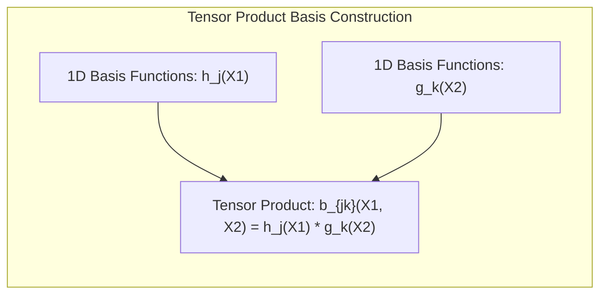
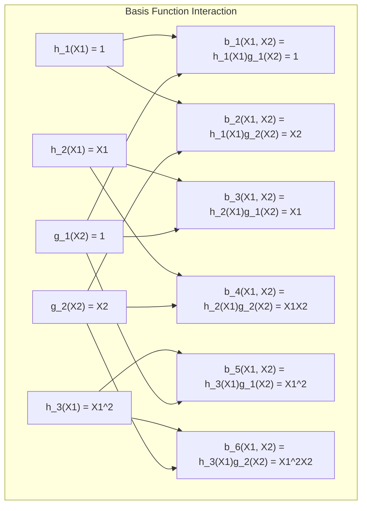
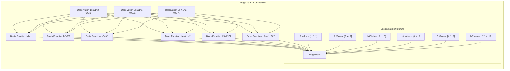

## Tensor Product Basis: Extending Basis Expansions to Multiple Dimensions



### Defining Tensor Product Basis

A **tensor product basis** is a mathematical technique used to extend the concept of basis expansions to multiple dimensions. While basis expansions are generally formulated for a single variable, the tensor product provides a structured way to create basis functions for modeling functions of several variables. In essence, a tensor product basis is created by taking all possible products of basis functions defined for each individual feature. For example, if we have two features, $X_1$ and $X_2$, and a set of basis functions $h_j(X_1)$ for the first feature, and a set of basis functions $g_k(X_2)$ for the second feature, a tensor product basis would be formed by considering all products of the type $h_j(X_1)g_k(X_2)$. This process generates a set of basis functions that spans the multidimensional space formed by the features $X_1$ and $X_2$. The tensor product provides a formal way to construct basis functions that are applicable to multiple dimensions, rather than a single one [^5.35]. This construction allows models that can capture interactions between the different features.

[^5.35]: "Suppose X \in IR^2, and we have a basis of functions $h_{1k}(X_1)$, k = 1,..., $M_1$ for representing functions of coordinate $X_1$, and likewise a set of $M_2$ functions $h_{2k}(X_2)$ for coordinate $X_2$. Then the $M_1 \times M_2$ dimensional tensor product basis defined by $g_{jk}(X) = h_{1j}(X_1)h_{2k}(X_2)$, j = 1, . . ., $M_1$, k = 1, ..., $M_2$ " *(Trecho de <Basis Expansions and Regularization>)*

> 💡 **Exemplo Numérico:**
>
> Let's consider a scenario with two features, $X_1$ and $X_2$. Suppose we have the following basis functions for each feature:
>
> For $X_1$:
>  - $h_1(X_1) = 1$ (a constant term)
>  - $h_2(X_1) = X_1$ (a linear term)
>  - $h_3(X_1) = X_1^2$ (a quadratic term)
>
> For $X_2$:
>  - $g_1(X_2) = 1$ (a constant term)
>  - $g_2(X_2) = X_2$ (a linear term)
>
> The tensor product basis is formed by taking all possible products of these basis functions:
>
>  - $b_1(X_1, X_2) = h_1(X_1)g_1(X_2) = 1 * 1 = 1$
>  - $b_2(X_1, X_2) = h_1(X_1)g_2(X_2) = 1 * X_2 = X_2$
>  - $b_3(X_1, X_2) = h_2(X_1)g_1(X_2) = X_1 * 1 = X_1$
>  - $b_4(X_1, X_2) = h_2(X_1)g_2(X_2) = X_1 * X_2 = X_1X_2$
>  - $b_5(X_1, X_2) = h_3(X_1)g_1(X_2) = X_1^2 * 1 = X_1^2$
>  - $b_6(X_1, X_2) = h_3(X_1)g_2(X_2) = X_1^2 * X_2 = X_1^2X_2$
>
> This tensor product basis is a set of six basis functions: $\{1, X_2, X_1, X_1X_2, X_1^2, X_1^2X_2\}$. These functions can now be used to fit a model that considers not just the individual effects of $X_1$ and $X_2$, but also their interactions (e.g., $X_1X_2$).



> Suppose we have a dataset with the following values for $X_1$ and $X_2$:
>
> | Observation | $X_1$ | $X_2$ |
> |-------------|-------|-------|
> | 1           | 2     | 3     |
> | 2           | 1     | 4     |
> | 3           | 3     | 2     |
>
> We can now evaluate the tensor product basis functions for each observation:
>
> | Observation | $b_1$ | $b_2$ | $b_3$ | $b_4$ | $b_5$ | $b_6$ |
> |-------------|-------|-------|-------|-------|-------|-------|
> | 1           | 1     | 3     | 2     | 6     | 4     | 12    |
> | 2           | 1     | 4     | 1     | 4     | 1     | 4     |
> | 3           | 1     | 2     | 3     | 6     | 9     | 18    |
>
> These values form the columns of our design matrix, which can be used in a linear regression model or other machine learning models.


>
>  ```python
> import numpy as np
>
> # Dataset
> X1 = np.array([2, 1, 3])
> X2 = np.array([3, 4, 2])
>
> # Basis functions
> def h1(x):
>   return 1
> def h2(x):
>   return x
> def h3(x):
>   return x**2
>
> def g1(x):
>   return 1
> def g2(x):
>   return x
>
> # Tensor product basis
> b1 = h1(X1) * g1(X2)
> b2 = h1(X1) * g2(X2)
> b3 = h2(X1) * g1(X2)
> b4 = h2(X1) * g2(X2)
> b5 = h3(X1) * g1(X2)
> b6 = h3(X1) * g2(X2)
>
> # Print results
> print("Basis function b1:", b1)
> print("Basis function b2:", b2)
> print("Basis function b3:", b3)
> print("Basis function b4:", b4)
> print("Basis function b5:", b5)
> print("Basis function b6:", b6)
>
> # Constructing the design matrix
> design_matrix = np.vstack((b1, b2, b3, b4, b5, b6)).T
> print("\nDesign Matrix:")
> print(design_matrix)
> ```
>
> The Python code above demonstrates the calculation of the tensor product basis and the construction of a design matrix. This matrix can be used to train a linear model.
>
> This example shows how, starting from simple basis functions for each feature, we build a more complex basis that can capture multi-dimensional effects and interactions.
