## Tradeoffs in Higher Dimensions: The Curse of Dimensionality and Beyond

### The Curse of Dimensionality

The **curse of dimensionality** is a term used to describe the challenges and issues that arise when working with data in high-dimensional spaces. As the number of features or dimensions increases, the volume of the space grows exponentially. This leads to a number of challenges:

1.  **Sparsity of Data:** In higher dimensions, data points become increasingly sparse, with large volumes of empty space between the observed points. This sparsity makes it difficult to estimate the function accurately, and, particularly, to perform extrapolation or interpolation, as there are fewer data points to support the model.

> 💡 **Exemplo Numérico:**
> Imagine you have 100 data points. In a 1-dimensional space, these points might be relatively close together, covering a significant portion of the line. However, if you spread these same 100 points into a 10-dimensional space, they become extremely sparse. The average distance between any two points increases significantly, and there will be vast regions of the space where no data points exist. This sparsity makes it difficult to generalize from the available data. For instance, if you try to use a linear model with polynomial basis expansion in this high dimensional space, the model will likely overfit the training data and perform poorly with new, unseen data.

2.  **Increased Computational Cost:**  With increased dimensionality, the computational cost of modeling algorithms, including methods using basis expansions, increases significantly. The cost of evaluating and optimizing models becomes more expensive, making it harder to scale models to high-dimensional data.

> 💡 **Exemplo Numérico:**
> Consider a simple linear regression model where we use polynomial basis expansion. With one feature (d=1),  $x$, we might create a basis expansion like $[1, x, x^2]$. Now, imagine we have 10 features ($x_1, x_2, \ldots, x_{10}$) and want to include all second-order interactions and squared terms. The number of terms in the basis would grow from 3 in the single feature case to $1 + 10 + \binom{10}{2} + 10 = 1 + 10 + 45 + 10 = 66$. If we wanted to include third-order interactions, the number of terms grows even further, and the computational cost of fitting the model goes up, as we need to calculate and store many more terms. In general, the number of polynomial basis terms grows polynomially with the degree and exponentially with the number of features. This increase in computations includes calculating the matrix inverse $(X^TX)^{-1}$ for ordinary least squares, which becomes very expensive for high dimensional $X$.

3. **Increased Overfitting:**  The higher number of parameters, when using high-dimensional models, means that it is easier to overfit the model to training data, particularly if the number of samples is limited. High dimensional models often need to be regularized, which can lead to further computational costs.

> 💡 **Exemplo Numérico:**
> Let's consider a dataset with 50 samples and 2 features ($x_1$ and $x_2$). If we fit a linear model, we have 3 parameters (including the intercept). If we add polynomial features up to the third degree, we have $1 + 2 + 3 + 4 = 10$ parameters. If we were to have 10 features and use polynomial features up to the third degree, the number of parameters would grow rapidly, and we could easily end up with more parameters than samples, which makes the model prone to overfitting the training data. For instance, if the model is trying to minimize the sum of squared errors, it can easily fit the noise in the data, leading to poor generalization on unseen data. This is why regularization techniques are crucial in high dimensional settings. For example, ridge regression adds a penalty term to the loss function that is proportional to the square of the model coefficients. This penalizes large coefficients and prevents the model from overfitting the data.

```mermaid
graph LR
    subgraph "Overfitting in High Dimensions"
    direction TB
        A["Increase in Model Parameters"]
        B["Limited Number of Samples"]
        C["Model Overfits Training Data"]
        D["Poor Generalization"]
        E["Need for Regularization"]
        A --> C
        B --> C
        C --> D
        C --> E

        subgraph "Regularization techniques"
        direction LR
          F["Example: Ridge Regression"] --> G["Penalty Term 'λ||β||²'"]
        end
        E --> F

    end
```

Therefore, the curse of dimensionality is a fundamental challenge in the context of *basis expansions*, as it implies that the benefits of increased flexibility in high dimensional data may be offset by the practical limitations that arise from it.

[^5.7]: "This can be generalized to d dimensions, but note that the dimension of the basis grows exponentially fast — yet another manifestation of the curse of dimensionality." *(Trecho de <Basis Expansions and Regularization>)*
