```
## Generalizing Regularization: A Broader Framework

```mermaid
graph LR
    subgraph "Regularization Problem"
        direction TB
        A["Loss Function: L(yᵢ, f(xᵢ))"]
        B["Penalty Functional: J(f)"]
        C["Regularization Parameter: λ"]
        D["Minimize: ∑ L(yᵢ, f(xᵢ)) + λJ(f)"]
        A --> D
        B --> D
        C --> D
    end
```



### General Regularization Framework

A general class of **regularization problems** seeks to balance the fit of a model to the data and the complexity of the model using a combination of a loss function and a penalty term. The general form of a regularization problem can be expressed as:

$$
\min_{f \in \mathcal{H}} \sum_{i=1}^N L(y_i, f(x_i)) + \lambda J(f)
$$

where:

*   $L(y_i, f(x_i))$ is the **loss function**, which quantifies the discrepancy between the observed response $y_i$ and the model's prediction $f(x_i)$ at data point $x_i$.
*   $J(f)$ is the **penalty functional**, which measures the complexity or "roughness" of the function $f$.
*   $\lambda$ is the **regularization parameter**, which controls the tradeoff between the fit to the data and the complexity of the model.
*   $\mathcal{H}$ denotes the functional space where the solution $f$ is searched for.

The choice of the loss function, penalty term, and regularization parameter influences the type of model obtained and its properties. This framework is very general and encompasses many different types of models used in machine learning and statistics.

> 💡 **Exemplo Numérico:**
>
> Let's consider a simple linear regression problem with a dataset consisting of 5 data points:
>
> $X = \begin{bmatrix} 1 \\ 2 \\ 3 \\ 4 \\ 5 \end{bmatrix}$, $y = \begin{bmatrix} 2 \\ 4 \\ 5 \\ 4 \\ 5 \end{bmatrix}$
>
> We want to fit a linear model $f(x) = \beta_0 + \beta_1 x$.  We'll use the squared error loss function $L(y_i, f(x_i)) = (y_i - f(x_i))^2$ and the L2 penalty functional $J(f) = \beta_1^2$. The regularization problem becomes:
>
> $$
> \min_{\beta_0, \beta_1} \sum_{i=1}^5 (y_i - (\beta_0 + \beta_1 x_i))^2 + \lambda \beta_1^2
> $$
>
> **Scenario 1: No Regularization ($\lambda = 0$)**
>
> When $\lambda = 0$, we are simply minimizing the sum of squared errors (ordinary least squares).
>
>  $	ext{Step 1: Construct the design matrix } X$:
>
>  $X = \begin{bmatrix} 1 & 1 \\ 1 & 2 \\ 1 & 3 \\ 1 & 4 \\ 1 & 5 \end{bmatrix}$
>
>  $	ext{Step 2: Calculate } (X^TX)^{-1}$:
>
>  $X^TX = \begin{bmatrix} 5 & 15 \\ 15 & 55 \end{bmatrix}$
>
>  $(X^TX)^{-1} = \begin{bmatrix} 1.1 & -0.3 \\ -0.3 & 0.1 \end{bmatrix}$
>
>  $	ext{Step 3: Calculate } X^Ty$:
>
>  $X^Ty = \begin{bmatrix} 20 \\ 72 \end{bmatrix}$
>
>  $	ext{Step 4: Calculate } \hat{\beta} = (X^TX)^{-1}X^Ty$:
>
>  $\hat{\beta} = \begin{bmatrix} 1.7 \\ 0.7 \end{bmatrix}$
>
>  So, the model is $f(x) = 1.7 + 0.7x$.

```mermaid
graph LR
    subgraph "OLS Calculation Steps"
        direction TB
        A["Step 1: Design Matrix X"] --> B["Step 2: Calculate (XᵀX)⁻¹"]
        B --> C["Step 3: Calculate Xᵀy"]
        C --> D["Step 4: Calculate β̂ = (XᵀX)⁻¹Xᵀy"]
    end
```



> **Scenario 2: With Regularization ($\lambda = 0.5$)**
>
> Now, let's introduce L2 regularization with $\lambda = 0.5$. The minimization problem becomes:
>
> $$
> \min_{\beta_0, \beta_1} \sum_{i=1}^5 (y_i - (\beta_0 + \beta_1 x_i))^2 + 0.5 \beta_1^2
> $$
>
>  Solving this analytically is more complex, but we can use numerical optimization or a closed-form solution for ridge regression.  Using a ridge regression solver we get:
>
>  $\hat{\beta}_{ridge} = \begin{bmatrix} 2.01 \\ 0.57 \end{bmatrix}$
>
>  So, the regularized model is $f(x) = 2.01 + 0.57x$.
>
> **Comparison:**
>
> | Method          | $\beta_0$ | $\beta_1$ | $\sum (y_i - f(x_i))^2$ | $\lambda \beta_1^2$ | Total Cost |
> |-----------------|-----------|-----------|--------------------------|----------------------|------------|
> | OLS ($\lambda=0$) | 1.7       | 0.7       | 2.3                   | 0                   | 2.3        |
> | Ridge ($\lambda=0.5$)| 2.01      | 0.57      | 3.46                   | 0.16                | 3.62       |
>
>
> Notice that the regularized model has a slightly worse fit to the data (higher sum of squared errors), but the magnitude of $\beta_1$ is smaller, which is the effect of the penalty.  The regularized model is less sensitive to changes in x and therefore less likely to overfit.


> **Python Implementation:**
>
> ```python
> import numpy as np
> from sklearn.linear_model import LinearRegression, Ridge
>
> X = np.array([[1], [2], [3], [4], [5]])
> y = np.array([2, 4, 5, 4, 5])
>
> # OLS
> model_ols = LinearRegression()
> model_ols.fit(X, y)
> beta_0_ols = model_ols.intercept_
> beta_1_ols = model_ols.coef_[0]
> y_pred_ols = model_ols.predict(X)
> mse_ols = np.sum((y - y_pred_ols)**2)
>
> # Ridge
> model_ridge = Ridge(alpha=0.5)
> model_ridge.fit(X, y)
> beta_0_ridge = model_ridge.intercept_
> beta_1_ridge = model_ridge.coef_[0]
> y_pred_ridge = model_ridge.predict(X)
> mse_ridge = np.sum((y - y_pred_ridge)**2)
> penalty_ridge = 0.5 * beta_1_ridge**2
>
> print(f"OLS: beta_0 = {beta_0_ols:.2f}, beta_1 = {beta_1_ols:.2f}, MSE = {mse_ols:.2f}")
> print(f"Ridge: beta_0 = {beta_0_ridge:.2f}, beta_1 = {beta_1_ridge:.2f}, MSE = {mse_ridge:.2f}, Penalty = {penalty_ridge:.2f}, Total Cost = {mse_ridge + penalty_ridge:.2f}")
> ```
>
> This simple example illustrates the basic idea of regularization: by adding a penalty term, we can control the complexity of the model and potentially improve its generalization performance on unseen data. The choice of $\lambda$ is crucial and is often determined via cross-validation.

[^5.42]: "A general class of regularization problems has the form min f∈H ∑Ni=1 L(yi, f(xi)) + λJ(f), " *(Trecho de <Basis Expansions and Regularization>)*
```
