## Penalty Functionals and the Fourier Transform: Controlling Function Complexity

```mermaid
graph LR
    subgraph "Function Transformation and Penalization"
        direction LR
        A["Spatial Domain: f(x)"] --> B["Fourier Transform"]
        B --> C["Frequency Domain: F(s)"]
        C --> D["Penalty Functional: J(f) = ∫|F(s)|² ds"]
        D --> E["Penalizing High Frequencies"]
        E --> F["Favoring Smooth Functions"]
    end
```



### Defining Penalty Functionals

In the context of the general regularization framework, the **penalty functional** $J(f)$ plays a crucial role by measuring the complexity, or "roughness", of the function $f$. It's a functional, meaning that its input is a function and its output is a scalar value that quantifies the degree of smoothness (or its lack thereof). The goal is to minimize this penalty term, in order to obtain simpler functions, that are not excessively complex, and do not overfit the data used for fitting the model. Therefore, we seek to minimize:

$$
\min_{f \in \mathcal{H}} \sum_{i=1}^N L(y_i, f(x_i)) + \lambda J(f)
$$
where the first term represents the error when modeling data, and the second term, weighted by the regularization parameter $\lambda$, penalizes the complexity of the function, as measured by the penalty functional $J(f)$. The choice of $J(f)$ dictates what features of the function are penalized. For example, it can penalize changes in derivatives or, as we will see, the presence of high frequencies, which are related to abrupt changes in the function.

```mermaid
graph LR
    subgraph "Regularization Framework"
        direction TB
        A["Objective Function: min"] --> B["Error Term: ∑ L(yᵢ, f(xᵢ))"]
        A --> C["Regularization Term: λJ(f)"]
        B --> D["Data Fit"]
        C --> E["Complexity Control"]
        D & E --> F["Trade-off with λ"]
    end
```



> 💡 **Exemplo Numérico:**
>
> Let's consider a simple function $f(x) = \sin(2\pi x) + 0.5\sin(10\pi x)$, defined over the interval $x \in [0, 1]$. This function has two frequency components: a low frequency ($2\pi$) and a high frequency ($10\pi$). Now, let's define a penalty functional $J(f)$ that penalizes the squared magnitude of the Fourier transform $F(s)$, specifically $J(f) = \int |F(s)|^2 ds$. We'll examine how different penalty strategies affect the function.
>
> First, let's compute the Fourier transform of $f(x)$. While the analytical form is complex, we can use a numerical approximation using the Fast Fourier Transform (FFT). We'll represent the function using a discrete set of points, and then compute the FFT.
>
> ```python
> import numpy as np
> import matplotlib.pyplot as plt
>
> # Define the function
> def f(x):
>     return np.sin(2 * np.pi * x) + 0.5 * np.sin(10 * np.pi * x)
>
> # Generate x values
> x = np.linspace(0, 1, 500)
> y = f(x)
>
> # Compute FFT
> F = np.fft.fft(y)
> frequencies = np.fft.fftfreq(len(y), 1/(x[1]-x[0]))
>
> # Plot the original function and its Frequency Spectrum
> fig, axes = plt.subplots(2, 1, figsize=(8, 6))
>
> axes[0].plot(x, y)
> axes[0].set_title('Original Function f(x)')
> axes[0].set_xlabel('x')
> axes[0].set_ylabel('f(x)')
>
> axes[1].plot(frequencies, np.abs(F))
> axes[1].set_title('Frequency Spectrum |F(s)|')
> axes[1].set_xlabel('Frequency (s)')
> axes[1].set_ylabel('|F(s)|')
> plt.tight_layout()
> plt.show()
> ```
>
> The plot shows peaks at frequencies corresponding to $2\pi$ and $10\pi$ in the frequency domain.
>
> Now, consider two scenarios:
>
> 1. **No Penalty:** If $\lambda = 0$, the penalty term disappears, and we don't penalize the high-frequency component of $f(x)$.
> 2. **Penalizing High Frequencies:** If we use a penalty term $J(f) = \int |F(s)|^2 ds$ with a significant $\lambda$, we will penalize the presence of high frequencies. For example, if we set $\lambda = 0.5$, the minimization process will try to reduce the high-frequency component to minimize the total cost function.
>
> To illustrate this, we can assume that the minimization process has an effect on the Fourier transform. For example, if we penalize high frequencies more than the low frequencies, we can think of the minimization process as attenuating the high-frequency component of the Fourier transform. For example, we might assume a simple filtering of the Fourier transform, such as multiplying the amplitude at each frequency by a factor that decreases with frequency. If we were to do this, we would be effectively smoothing the function. Let's see an example of this, by attenuating the high frequency component by 50%:
> ```python
> # Attenuate the high frequency component
> F_filtered = F.copy()
> high_freq_index = np.argmax(np.abs(frequencies) > 8)
> F_filtered[high_freq_index] = F_filtered[high_freq_index] * 0.5
> F_filtered[-high_freq_index] = F_filtered[-high_freq_index] * 0.5
>
> # Compute Inverse FFT
> y_filtered = np.fft.ifft(F_filtered)
>
> # Plot the filtered function
> plt.plot(x, y, label='Original f(x)')
> plt.plot(x, np.real(y_filtered), label='Filtered f(x)')
> plt.title('Original vs Filtered Function')
> plt.xlabel('x')
> plt.ylabel('f(x)')
> plt.legend()
> plt.show()
> ```
>
> As can be seen, the filtered version of the function is smoother, as the high-frequency component has been attenuated.
>
> This example shows how a penalty functional based on the Fourier transform can control the complexity of a function by penalizing high-frequency components. By tuning the regularization parameter $\lambda$, we can control the trade-off between fitting the data and promoting smoothness. This idea is fundamental in many areas of machine learning, where we need to find models that are both accurate and avoid overfitting.

```mermaid
graph LR
    subgraph "Penalty Functional Impact"
        direction TB
        A["Original Function: f(x) = sin(2πx) + 0.5sin(10πx)"]
        B["Fourier Transform: F(s)"]
        C["Penalty J(f) = ∫|F(s)|² ds"]
        D["λ = 0: No Penalty"]
        E["λ > 0: High Frequency Penalty"]
        F["Filtered Function: f_filtered(x)"]
        A --> B
        B --> C
        C --> D
        C --> E
        E --> F
        D --> G["Original f(x) retained"]
        F --> H["Smoother f(x)"]
    end
```



[^5.43]: "Girosi et al. (1995) describe quite general penalty functionals of the form $J(f) = \int |f(s)|^2 / G(s) \, ds$, where $f$ denotes the Fourier transform of $f$, and $G$ is some positive function that falls off to zero as $||s|| \rightarrow \infty$" *(Trecho de <Basis Expansions and Regularization>)*
