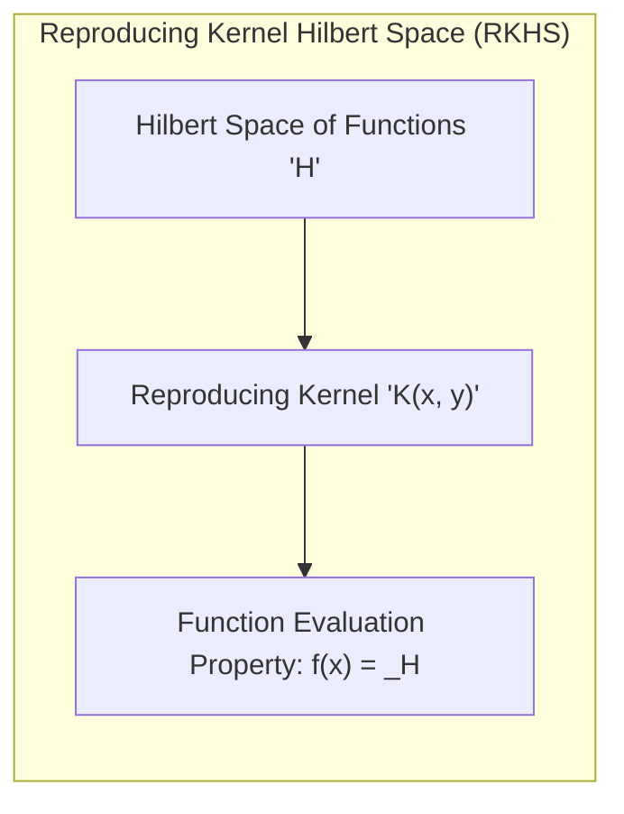
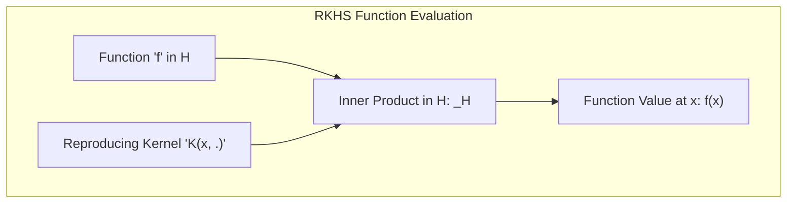
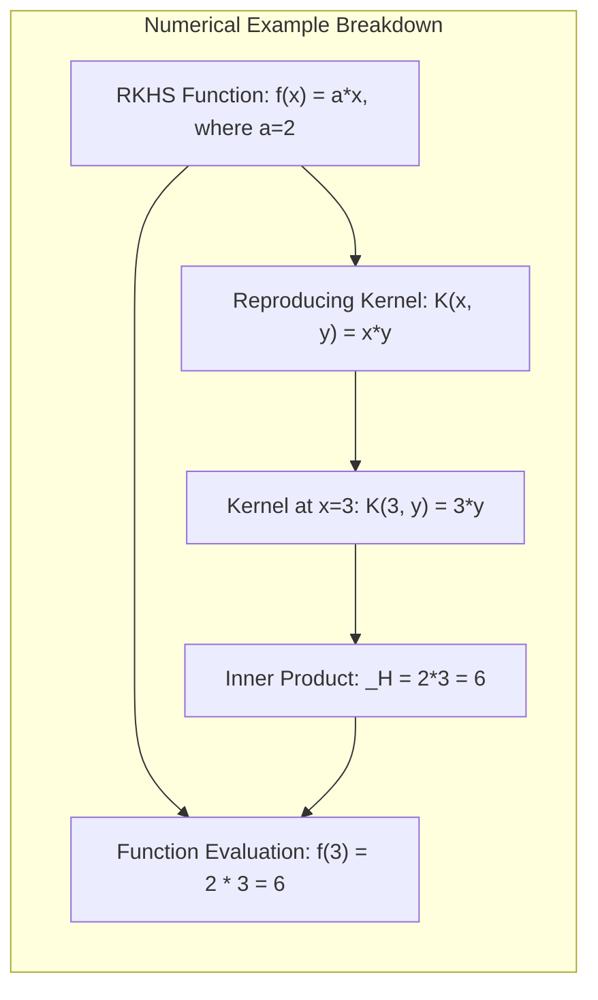

## Reproducing Kernel Hilbert Spaces: A Framework for Flexible Modeling

### Defining Reproducing Kernel Hilbert Spaces

A **Reproducing Kernel Hilbert Space (RKHS)** is a specialized type of function space that plays a fundamental role in many statistical and machine learning algorithms. It combines the concept of a **Hilbert space**, which is a generalization of Euclidean space to infinite dimensions, with the crucial property of having a **reproducing kernel**. The reproducing kernel allows us to evaluate the function directly in the space by performing an inner product with the kernel itself, which makes it particularly useful in the application of kernel methods. Therefore, a RKHS is a Hilbert space of functions $\mathcal{H}$ with a reproducing kernel $K(x, y)$, which is a function that for each $x$ and $y$ produces a scalar, $K(x,y)$. The reproducing kernel has the property:

$$f(x) = \langle f, K(x, \cdot) \rangle_\mathcal{H}$$

for any function $f$ in $\mathcal{H}$. This means that the value of the function $f$ at a point $x$, $f(x)$, is given by the inner product of the function with the reproducing kernel, evaluated at $x$ ($K(x,\cdot)$). RKHS spaces provide a robust framework for handling non-linear relationships in the data, through the use of the reproducing kernel. The inner product, which can be a non-linear operation on the space of the inputs, allows for great flexibility, while maintaining the benefits of a linear model (linearity in the space of functions).

> 💡 **Exemplo Numérico:**
>
> Let's consider a simple example to illustrate the concept of a RKHS. Suppose our RKHS $\mathcal{H}$ consists of functions of the form $f(x) = a \cdot x$, where $a$ is a real number.  A possible reproducing kernel for this space is $K(x, y) = x \cdot y$.  Let's verify if this kernel satisfies the reproducing property.
>
> Assume we have a function $f(x) = 2x$ in our RKHS, so $a=2$.  According to the RKHS property, we should have:
>
> $$f(x) = \langle f, K(x, \cdot) \rangle_\mathcal{H}$$
>
> In our case, $K(x, \cdot)$ represents the function $K(x, y) = xy$ as a function of $y$.  Let's say that the inner product in this space is defined as the integral over a certain domain, but for simplicity, we can think of it as a sum over some discrete values. If we have $f(y) = 2y$, and $K(x,y) = xy$, the inner product can be defined as $\langle f, K(x, \cdot) \rangle_\mathcal{H} = \sum_i f(y_i) K(x, y_i) = \sum_i (2y_i) (xy_i)$.
>
> Let's consider a simplified version, where we assume that the inner product is simply a multiplication of the coefficients in the function space. So, for our function $f(x) = 2x$, we can think of it as a vector $[2]$. The kernel $K(x,y) = xy$ can be interpreted, when we fix $x$, as the function $g(y) = xy$. So when we fix $x=3$, we have the function $g(y) = 3y$, which we can represent as a vector $[3]$. So, for $x=3$, we have $K(3, y) = 3y$, and the inner product of $f(y) = 2y$ and $K(3,y) = 3y$ would be $\langle f, K(3, \cdot) \rangle_\mathcal{H} = 2 \cdot 3 = 6$. This should be equal to the value of our function $f(x)$ when $x=3$, $f(3) = 2 \cdot 3 = 6$.
>
>  Although simplified, this shows how the reproducing property holds in this particular example. The kernel $K(x,y) = xy$ allows us to evaluate the function $f(x) = 2x$ by performing an inner product with the kernel $K(x, \cdot)$, which gives us $f(3) = 6$.
>
> The key is that the kernel allows us to evaluate the function without explicitly knowing the function in terms of its coefficients, but rather through the inner product of the function and the kernel. This is the core concept of the reproducing property.

[^5.8.1]: "An important subclass of problems of the form (5.42) are generated by a positive definite kernel K(x,y), and the corresponding space of functions HK is called a reproducing kernel Hilbert space (RKHS)." *(Trecho de <Basis Expansions and Regularization>)*
