```mermaid
graph LR
    subgraph "Function Evaluation with Kernel"
    direction LR
        A["Data points: x_1, x_2"]
        B["Kernel Function: K(x,y)"]
        C["Coefficients: α_1, α_2"]
        D["Function f(x) = α_1 K(x, x_1) + α_2 K(x, x_2)"]
        E["Evaluation at x=3: f(3)"]
        A --> B
        B --> D
        C --> D
        D --> E
        style D fill:#ccf,stroke:#333,stroke-width:2px
    end
```

```mermaid
graph TB
    subgraph "Kernel Function Breakdown"
        direction TB
        A["Gaussian Kernel: K(x, y) = exp(-(x-y)²/(2σ²))"]
        B["Input points: x, y"]
        C["Distance Calculation: (x-y)"]
        D["Squared Distance: (x-y)²"]
        E["Scaling Factor: 2σ²"]
        F["Normalized Distance: (x-y)²/(2σ²)"]
        G["Exponential Calculation: exp(-(x-y)²/(2σ²))"]
        B --> C
        C --> D
        D --> F
        E --> F
        F --> G
        G --> A
    end
```

## The Kernel Property: Enabling Efficient Computation in Infinite Dimensions

```mermaid
graph LR
    subgraph "Kernel Property Visualization"
    direction LR
        A["Data Input: x, y"] --> B["Feature Mapping: Φ(x), Φ(y)"]
        B --> C{"Inner Product in Feature Space: <Φ(x), Φ(y)>"}
        C -->| "Kernel Trick" | D["Kernel Function: K(x, y)"]
        D --> E["Result of Inner Product"]
        style B fill:#f9f,stroke:#333,stroke-width:2px
        style C fill:#ccf,stroke:#333,stroke-width:2px
    end
```

### Defining the Kernel Property

The **kernel property** is a defining feature of Reproducing Kernel Hilbert Spaces (RKHS), and it is what makes them so computationally efficient. The kernel property states that the evaluation of a function $f$ at a point $x$, which is $f(x)$, can be computed by taking the inner product of the function $f$ with the reproducing kernel $K(x, \cdot)$ in the Hilbert space. This can be expressed as:

$$
f(x) = \langle f, K(x, \cdot) \rangle_{\mathcal{H}}
$$
where $\mathcal{H}$ denotes the RKHS. The power of the kernel property resides in the fact that the inner product between two functions in the RKHS, and therefore any calculation involving the functions, can be done implicitly by just considering the reproducing kernel, without having to explicitly evaluate the transformations of the data, or the functions. This allows us to work with functions in high (or infinite) dimensional spaces using the computationally tractable kernel function, which can be evaluated efficiently, even if the underlying space is infinite dimensional. This property is exploited in kernel methods.


> 💡 **Exemplo Numérico:**
>
> Let's consider a simple example using a Gaussian (RBF) kernel. Suppose we have two data points $x_1 = 1$ and $x_2 = 2$ and a Gaussian kernel defined as:
>
> $$K(x, y) = \exp\left(-\frac{(x-y)^2}{2\sigma^2}\right)$$
>
> with $\sigma = 1$.  Let's also assume that our function $f$ in the RKHS is defined as a linear combination of kernel functions centered at data points $x_1$ and $x_2$ with coefficients $\alpha_1 = 0.5$ and $\alpha_2 = -0.3$:
>
> $$f(x) = \alpha_1 K(x, x_1) + \alpha_2 K(x, x_2)$$
>
> We want to evaluate $f(3)$ using the kernel property. First, let's calculate the kernel values:
>
> $$K(3, 1) = \exp\left(-\frac{(3-1)^2}{2(1)^2}\right) = \exp(-2) \approx 0.135$$
>
> $$K(3, 2) = \exp\left(-\frac{(3-2)^2}{2(1)^2}\right) = \exp(-0.5) \approx 0.607$$
>
> Now, we can compute $f(3)$:
>
> $$f(3) = 0.5 \cdot K(3, 1) - 0.3 \cdot K(3, 2) = 0.5 \cdot 0.135 - 0.3 \cdot 0.607 = 0.0675 - 0.1821 \approx -0.1146$$
>
>  The kernel property allowed us to evaluate $f(3)$ by computing inner products (through the kernel function) in the feature space implicitly. We did not have to explicitly compute the mapping of $x$ to a feature vector in a high-dimensional space. The kernel $K(x, \cdot)$ is acting as a basis function in the RKHS, and the calculation is equivalent to the inner product between $f$ and $K(3, \cdot)$.
>
>  Let us now express the function $f$ as an inner product in the RKHS:
>
> $$f(x) = \langle f, K(x, \cdot) \rangle_{\mathcal{H}} = \langle \sum_{i=1}^2 \alpha_i K(x_i, \cdot), K(x, \cdot) \rangle_{\mathcal{H}}$$
>
>  Due to the reproducing property of the kernel, we have $\langle K(x_i, \cdot), K(x, \cdot) \rangle_{\mathcal{H}} = K(x, x_i)$. Therefore:
>
> $$ f(x) = \sum_{i=1}^2 \alpha_i K(x, x_i)$$
>
>  This shows how the kernel property lets us compute the function value $f(x)$ by evaluating kernel functions, without explicitly using the high-dimensional feature space.
>





[^5.8.1]: "The basis function h₁(x) = K(x, x₁) (as a function of the first argument) is known as the representer of evaluation at xi in HK, since for f ∈ HK, it is easily seen that (K(·, xi), f)HK = f(xi)." *(Trecho de <Basis Expansions and Regularization>)*
