## Kernel Functions: Implicitly Defining High-Dimensional Feature Spaces


### Defining Kernel Functions

A **kernel function**, often denoted as $K(x, y)$, is a function that takes two inputs $x$ and $y$, which are often vectors, and returns a scalar value representing a measure of similarity between them. The core idea is that the kernel function computes an inner product between the two inputs *implicitly* in a higher-dimensional space, without explicitly performing the transformation of the input into that high-dimensional space. This is what is known as the *kernel trick*. For this reason, kernel functions are fundamental to the operation of RKHS, as they define the inner product in the feature space, and therefore determine the properties of the RKHS. Therefore, a kernel function serves as a measure of similarity, but also implicitly as a way to transform the data into an alternative space. Kernels must satisfy Mercer's Theorem, which dictates that a valid kernel must be symmetric and positive semi-definite.

[^5.8.1]: "An important subclass of problems of the form (5.42) are generated by a positive definite kernel $K(x,y)$, and the corresponding space of functions $H_K$ is called a reproducing kernel Hilbert space (RKHS)." *(Trecho de <Basis Expansions and Regularization>)*

> 💡 **Exemplo Numérico:**
>
> Let's consider two simple 2-dimensional data points: $x = [1, 2]$ and $y = [2, 1]$. We will explore how a simple polynomial kernel can implicitly compute the inner product in a higher-dimensional space.
>
> **Polynomial Kernel:**
> A common kernel function is the polynomial kernel, defined as:
>
> $K(x, y) = (x^T y + c)^d$
>
> where $c$ is a constant and $d$ is the degree of the polynomial. Let's use $c = 1$ and $d = 2$.

```mermaid
graph LR
    subgraph "Polynomial Kernel Decomposition"
        direction TB
        A["Polynomial Kernel: K(x, y) = (xᵀy + c)ᵈ"]
        B["Inner Product: xᵀy"]
        C["Constant Term: c"]
        D["Degree: d"]
        A --> B
        A --> C
        A --> D
    end
```



> **Step 1: Calculate the inner product of x and y:**
>
> $x^T y = [1, 2] \cdot [2, 1] = (1 * 2) + (2 * 1) = 2 + 2 = 4$
>
> **Step 2: Apply the polynomial kernel:**
>
> $K(x, y) = (4 + 1)^2 = 5^2 = 25$
>
> Now, let's examine what a direct transformation to a higher dimension and then a dot product would look like. For a polynomial kernel of degree 2 (with $c=1$), the explicit feature map $\phi(x)$ for a 2-dimensional vector $x = [x_1, x_2]$ would be:
>
> $\phi(x) = [1, \sqrt{2}x_1, \sqrt{2}x_2, x_1^2, \sqrt{2}x_1x_2, x_2^2]$
>
> Applying this to $x=[1, 2]$ and $y=[2, 1]$:
>
> $\phi(x) = [1, \sqrt{2}, 2\sqrt{2}, 1, 2\sqrt{2}, 4]$
> $\phi(y) = [1, 2\sqrt{2}, \sqrt{2}, 4, 2\sqrt{2}, 1]$
>
> **Step 3: Calculate the dot product in the transformed space:**
>
> $\phi(x)^T\phi(y) = (1*1) + (\sqrt{2} * 2\sqrt{2}) + (2\sqrt{2} * \sqrt{2}) + (1*4) + (2\sqrt{2} * 2\sqrt{2}) + (4*1) = 1 + 4 + 4 + 4 + 8 + 4 = 25$
>
> Note that this matches the result of our kernel function calculation. This illustrates how the kernel function computes the dot product in a higher-dimensional space *implicitly*, without having to explicitly calculate $\phi(x)$ and $\phi(y)$.

```mermaid
graph LR
    subgraph "Explicit Feature Map"
        direction TB
        A["Feature Map: ϕ(x) = [1, √2x₁, √2x₂, x₁², √2x₁x₂, x₂²]"]
        B["Input x = [x₁, x₂]"]
        B --> A
    end
```



>
> This example demonstrates the "kernel trick" in action, allowing us to work with high-dimensional data without the computational burden of explicitly transforming into that space. In essence, the kernel function $K(x, y)$ measures the similarity between $x$ and $y$ in the transformed space.
>
> ```mermaid
> graph LR
>     A[Input Space] --> B(Kernel Function K(x,y));
>     C[High Dimensional Space]
>     B --> D{Output: Similarity};
>     A --> E[Feature Map ϕ(x), ϕ(y)]
>     E --> F[Inner Product <ϕ(x), ϕ(y)>]
>     F --> D
>     style B fill:#f9f,stroke:#333,stroke-width:2px
>     style D fill:#ccf,stroke:#333,stroke-width:2px
> ```
