```markdown
## The Gaussian Kernel: Implicit Feature Mapping for Non-Linearity

```mermaid
graph LR
    subgraph "Gaussian Kernel"
        direction TB
        A["Input Data Points: x, y"]
        B["Euclidean Distance: ||x - y||"]
        C["Squared Distance: ||x - y||²"]
        D["Parameter: ν"]
        E["Exponentiation: exp(-ν * ||x - y||²)"]
        F["Kernel Value: K(x, y)"]
        A --> B
        B --> C
        C --> D
        C & D --> E
        E --> F
    end
```



### Defining the Gaussian Kernel

The **Gaussian kernel**, also known as the Radial Basis Function (RBF) kernel, is a widely used kernel function that measures the similarity between two data points, typically vectors $x$ and $y$. It is defined as:

$$
K(x, y) = \exp\left( - \nu ||x - y||^2 \right)
$$
where $||x - y||$ is the Euclidean distance between the two vectors and $\nu$ is a parameter that controls the width of the kernel. The Gaussian kernel assigns higher values when two points $x$ and $y$ are closer to each other, and lower values when they are further apart. The Gaussian kernel has a bell-shaped form around $x$, which means that it gives higher weights to data points closer to $x$, therefore being also known as a radial basis function, because the function is defined based on the radius or distance from a central point. In the context of RKHS, the Gaussian kernel defines the inner product of a high, potentially infinite, dimensional space, without explicitly calculating transformations to that space.

```mermaid
graph LR
    subgraph "Gaussian Kernel and RKHS"
        direction TB
        A["Input Space: 'x', 'y'"]
        B["Gaussian Kernel: K(x, y) = exp(-ν||x - y||²)"]
        C["Implicit Mapping to High-Dimensional Space"]
        D["Inner Product in RKHS"]
        A --> B
        B --> C
        C --> D
    end
```



> 💡 **Exemplo Numérico:**
>
> Let's consider two data points in a 2-dimensional space:
>
> $x = \begin{bmatrix} 1 \\ 2 \end{bmatrix}$ and $y = \begin{bmatrix} 3 \\ 4 \end{bmatrix}$
>
> We will calculate the Gaussian kernel value for these two points using different values of $\nu$.
>
> **Step 1: Calculate the Euclidean distance.**
>
> $||x - y|| = \sqrt{(1-3)^2 + (2-4)^2} = \sqrt{(-2)^2 + (-2)^2} = \sqrt{4 + 4} = \sqrt{8} \approx 2.83$
>
> **Step 2: Calculate $||x - y||^2$.**
>
> $||x - y||^2 = (\sqrt{8})^2 = 8$
>
> **Step 3: Calculate the kernel value for $\nu = 0.1$.**
>
> $K(x, y) = \exp(-0.1 \times 8) = \exp(-0.8) \approx 0.449$
>
> **Step 4: Calculate the kernel value for $\nu = 0.5$.**
>
> $K(x, y) = \exp(-0.5 \times 8) = \exp(-4) \approx 0.018$
>
> **Step 5: Calculate the kernel value for $\nu = 1$.**
>
> $K(x, y) = \exp(-1 \times 8) = \exp(-8) \approx 0.0003$
>
> **Interpretation:**
>
> *   When $\nu = 0.1$, the kernel value is relatively high (0.449), indicating that the points $x$ and $y$ are considered somewhat similar.
> *   As $\nu$ increases to 0.5, the kernel value decreases significantly to 0.018, meaning the points are considered less similar.
> *   With $\nu = 1$, the kernel value is very close to zero (0.0003), indicating almost no similarity.
>
> This example shows how the parameter $\nu$ controls the "width" of the Gaussian kernel. A larger $\nu$ makes the kernel more sensitive to differences in distance, resulting in lower similarity scores for the same data points. A smaller $\nu$ makes the kernel less sensitive, leading to higher similarity scores. This is because a smaller $\nu$ makes the bell-shaped curve wider, thus points further apart will still have a considerable similarity value.


[^5.8.2]: "The Gaussian kernel K(x, y) = e−ν||x−y||2 along with squared-error loss, for example, leads to a regression model that is an expansion in Gaussian radial basis functions" *(Trecho de <Basis Expansions and Regularization>)*
[^5.8.1]: "An important subclass of problems of the form (5.42) are generated by a positive definite kernel K(x,y), and the corresponding space of functions HK is called a reproducing kernel Hilbert space (RKHS)." *(Trecho de <Basis Expansions and Regularization>)*
```
