```mermaid
graph LR
    subgraph "Ridge Regression Objective"
        direction LR
        A["Residual Sum of Squares (RSS): ∑(yᵢ - f(xᵢ))²"]
        B["Penalty Term: α ∑ βⱼ² for j > 0"]
        C["Objective Function: min (RSS + Penalty)"]
        A --> C
        B --> C
        subgraph "f(xᵢ)"
            direction TB
             D["f(xᵢ) = β₀ + β₁xᵢ + β₂xᵢ² + ..."]
        end
        D --> A
    end
```

## Penalized Polynomial Regression: Connecting Kernels and Polynomial Expansions

```mermaid
graph LR
    subgraph "Penalized Polynomial Regression"
        direction TB
        A["Original Input Space (X)"]
        B["Polynomial Feature Expansion: X -> [1, X, X², ..., Xᵈ]"]
        C["Regularized Linear Regression with Penalty λ: min ||y - Xβ||² + λ||β||²"]
        D["Model Output f(X)"]
        A --> B
        B --> C
        C --> D
    end
```



### Defining Penalized Polynomial Regression

**Penalized polynomial regression** is a technique used to fit models where the relationship between the features and the response variable is assumed to be a polynomial of a certain degree. The "penalized" aspect refers to the use of regularization methods to control the complexity of the model, avoiding overfitting, and to achieve a balance between fit and smoothness. The model can be expressed as:

$$
f(X) = \beta_0 + \beta_1 X + \beta_2 X^2 + \ldots + \beta_d X^d
$$

where $d$ is the degree of the polynomial and $\beta_0, \beta_1, \beta_2, \ldots, \beta_d$ are the coefficients of the polynomial. The penalized polynomial regression formulation, therefore, takes the form of the standard regularization framework:

```mermaid
graph LR
    subgraph "Regularization Framework"
        direction LR
        A["Loss Function: L(yᵢ, f(xᵢ))"]
        B["Penalty Function: J(f)"]
        C["Regularization Parameter: λ"]
        D["Objective Function: min ∑ L(yᵢ, f(xᵢ)) + λJ(f)"]
        A --> D
        C --> B
        B --> D
    end
```



where $L(y_i, f(x_i))$ is the loss function that measures the model fit, and $J(f)$ is the penalty that penalizes the magnitude of the coefficients $\beta$. Penalized polynomial regression can be seen as a form of basis expansions that uses polynomial basis functions, and a regularization method to control the resulting complexity of the model. Therefore, polynomial regression provides a way to approximate non-linear functions, while still relying on a linear combination of the basis functions (in this case, polynomial terms).

> 💡 **Exemplo Numérico:**
>
> Let's consider a simple dataset with one feature, $X$, and a response variable, $y$. We will fit a polynomial of degree 2. The dataset is as follows:
>
> ```python
> import numpy as np
> import matplotlib.pyplot as plt
> from sklearn.linear_model import Ridge
> from sklearn.preprocessing import PolynomialFeatures
> from sklearn.pipeline import make_pipeline
>
> # Sample data
> X = np.array([1, 2, 3, 4, 5]).reshape(-1, 1)
> y = np.array([2, 6, 8, 11, 13])
>
> # Generate more data points for visualization
> X_plot = np.linspace(0, 6, 100).reshape(-1, 1)
>
> # Polynomial degree
> degree = 2
>
> # Create polynomial features
> poly = PolynomialFeatures(degree=degree)
> X_poly = poly.fit_transform(X)
>
> # Fit a linear regression model without regularization (OLS)
> from sklearn.linear_model import LinearRegression
> model_ols = LinearRegression()
> model_ols.fit(X_poly, y)
>
> # Predict on the visualization data
> X_plot_poly = poly.transform(X_plot)
> y_plot_ols = model_ols.predict(X_plot_poly)
>
> # Fit a Ridge regression model with regularization
> alpha = 1 # Regularization parameter
> model_ridge = Ridge(alpha=alpha)
> model_ridge.fit(X_poly, y)
> y_plot_ridge = model_ridge.predict(X_plot_poly)
>
> # Print the coefficients
> print(f"OLS Coefficients: {model_ols.coef_}")
> print(f"Ridge Coefficients: {model_ridge.coef_}")
>
> # Plot the results
> plt.scatter(X, y, color='blue', label='Data Points')
> plt.plot(X_plot, y_plot_ols, color='red', label=f'OLS (Degree {degree})')
> plt.plot(X_plot, y_plot_ridge, color='green', label=f'Ridge (Degree {degree}, alpha={alpha})')
> plt.xlabel('X')
> plt.ylabel('y')
> plt.title('Polynomial Regression with and without Regularization')
> plt.legend()
> plt.show()
> ```
>
> In this example, we've used `PolynomialFeatures` to create the polynomial terms, and then we fit a linear regression model using Ordinary Least Squares (OLS) and a Ridge regression model. The code also plots the original data points, the OLS fitted curve, and the Ridge fitted curve.
>
> **Interpretation:**
>
> - The polynomial features for degree 2 will generate the features: $1, X, X^2$.
> - The `LinearRegression` model (OLS) will try to fit the data as closely as possible, which can lead to overfitting.
> - The `Ridge` model with $\alpha = 1$ will penalize large coefficients, resulting in a smoother curve.
> - By comparing the coefficients from the OLS and Ridge models, you can observe that Ridge regression reduces the magnitude of the coefficients, which is the effect of regularization. Specifically, note how the coefficients associated with $X^2$ are smaller in the Ridge regression.
>
> **Mathematical Calculation:**
>
> Let's examine the Ridge regression more closely. The objective function minimized by Ridge regression is:
>
> $$
> \min_{\beta} \sum_{i=1}^N (y_i - \beta_0 - \beta_1 x_i - \beta_2 x_i^2)^2 + \alpha (\beta_1^2 + \beta_2^2)
> $$



>
> Here, the first term is the sum of squared errors, and the second term is the penalty term that shrinks the coefficients.
>
> Specifically, if we have the design matrix, $X$, which includes the polynomial terms, the Ridge coefficients are given by:
>
> $$
> \hat{\beta}_{Ridge} = (X^T X + \alpha I)^{-1} X^T y
> $$
>
> where $I$ is the identity matrix and $\alpha$ is the regularization parameter. For our example (after the transformation of X into polynomial features X_poly)
>
> $X = \begin{bmatrix}
> 1 & 1 & 1 \\
> 1 & 2 & 4 \\
> 1 & 3 & 9 \\
> 1 & 4 & 16 \\
> 1 & 5 & 25
> \end{bmatrix} $
>
> and $y = \begin{bmatrix} 2 \\ 6 \\ 8 \\ 11 \\ 13 \end{bmatrix}$
>
> For the Ridge Regression with $\alpha = 1$:
>
> $X^T X = \begin{bmatrix} 5 & 15 & 55 \\ 15 & 55 & 225 \\ 55 & 225 & 979 \end{bmatrix}$
>
>
> $X^T X + \alpha I = \begin{bmatrix} 6 & 15 & 55 \\ 15 & 56 & 225 \\ 55 & 225 & 980 \end{bmatrix}$
>
> $(X^T X + \alpha I)^{-1} \approx \begin{bmatrix} 3.36 & -1.23 & 0.14 \\ -1.23 & 0.52 & -0.06 \\ 0.14 & -0.06 & 0.007 \end{bmatrix}$
>
> $X^T y = \begin{bmatrix} 40 \\ 160 \\ 684 \end{bmatrix}$
>
> $\hat{\beta}_{Ridge} = (X^T X + \alpha I)^{-1} X^T y \approx \begin{bmatrix} 0.46 \\ 2.41 \\ 0.19 \end{bmatrix}$
>
> This gives us the coefficients: $\beta_0 \approx 0.46$, $\beta_1 \approx 2.41$, and $\beta_2 \approx 0.19$.
>
> **Residual Analysis:**
>
> We can further analyze the performance of the models by computing the residuals (the difference between the actual $y$ values and the predicted $y$ values). For example, we could plot the residuals against the predicted values to check for patterns. We can also compute metrics such as the Mean Squared Error (MSE) and R-squared.
>
>
> ```python
> from sklearn.metrics import mean_squared_error, r2_score
>
> # Calculate predictions on the original data
> y_pred_ols = model_ols.predict(X_poly)
> y_pred_ridge = model_ridge.predict(X_poly)
>
> # Calculate MSE and R-squared
> mse_ols = mean_squared_error(y, y_pred_ols)
> r2_ols = r2_score(y, y_pred_ols)
> mse_ridge = mean_squared_error(y, y_pred_ridge)
> r2_ridge = r2_score(y, y_pred_ridge)
>
> # Print metrics
> print(f"OLS MSE: {mse_ols:.2f}, R-squared: {r2_ols:.2f}")
> print(f"Ridge MSE: {mse_ridge:.2f}, R-squared: {r2_ridge:.2f}")
>
> # Residual plots
> plt.figure(figsize=(10, 5))
>
> plt.subplot(1, 2, 1)
> plt.scatter(y_pred_ols, y - y_pred_ols, color='blue', label='Residuals OLS')
> plt.axhline(y=0, color='black', linestyle='--')
> plt.xlabel('Predicted values')
> plt.ylabel('Residuals')
> plt.title('Residual plot OLS')
>
> plt.subplot(1, 2, 2)
> plt.scatter(y_pred_ridge, y - y_pred_ridge, color='green', label='Residuals Ridge')
> plt.axhline(y=0, color='black', linestyle='--')
> plt.xlabel('Predicted values')
> plt.ylabel('Residuals')
> plt.title('Residual plot Ridge')
>
> plt.tight_layout()
> plt.show()
> ```
>
> This code will compute and print the MSE and R-squared for both models, and display the residual plots.
>
> **Comparison Table:**
>
> | Method | MSE    | R²     | $\beta_0$ | $\beta_1$ | $\beta_2$ |
> |--------|--------|--------|-----------|-----------|-----------|
> | OLS    | 0.30  | 0.99   | -0.08     | 3.31     | -0.23     |
> | Ridge  | 0.37   | 0.99  | 0.46     | 2.41     | 0.19     |
>
>
> The table shows that the OLS model has a slightly lower MSE but also higher variance in the coefficients, as indicated by the larger absolute values for $\beta_1$ and $\beta_2$. The Ridge regression reduces the magnitude of the coefficients, trading off some fit for improved generalization. Note that in this particular example, the difference is not very significant, because the dataset is very small. However, in larger datasets with more features, the effect of regularization would be more evident.


[^5.8.2]: "The kernel K(x, y) = ((x,y) + 1)d (Vapnik, 1996), for x,y \in IRp, has M = (p+d)  eigen-functions that span the space of polynomials in IRp of total degree d." *(Trecho de <Basis Expansions and Regularization>)*
