Okay, I understand. You want to focus on **wavelet bases and the wavelet transform**, which provide an alternative approach to basis expansions that are particularly useful in signal and image processing.

## Wavelet Bases and the Wavelet Transform: Capturing Time and Frequency Information

```mermaid
graph LR
    subgraph "Wavelet Transform Concept"
    direction TB
    A["Input Signal: f(t)"]
    B["Wavelet Basis Functions: ψ(t)"]
    C["Wavelet Transform: W(a,b) = ∫ f(t) ψ_{a,b}(t) dt"]
    D["Scale (a)"]
    E["Translation (b)"]
    A --> C
    B --> C
    C --> D
    C --> E
    style C fill:#f9f,stroke:#333,stroke-width:2px
    end
```



### Introduction to Wavelets

**Wavelets** are a class of basis functions that have become popular in signal processing, image analysis, and other fields due to their unique ability to capture information in both time and frequency domains. Unlike traditional Fourier analysis, which decomposes signals into sines and cosines, wavelets can represent both smooth components and sharp, localized features in the data. They are characterized by their finite duration (they are localized in time) and by their ability to be dilated and translated to represent different frequencies and positions. This flexibility allows wavelets to represent a range of signals, from smooth to highly variable, very efficiently. Wavelet analysis, therefore, is an alternative approach to basis expansions that is particularly useful in contexts where the information has a time or spatial component.

> 💡 **Exemplo Numérico:**
>
> Imagine we have a simple signal that combines a low-frequency cosine wave with a high-frequency spike. A Fourier transform would represent this signal using many sine and cosine waves, some to capture the main cosine and others to approximate the spike, making it harder to isolate the different features. A wavelet transform, in contrast, can use a low-frequency wavelet to capture the cosine and a higher-frequency, localized wavelet to capture the spike.
>
> Let's consider a discrete signal with 8 data points:
>
> $y = [1, 2, 5, 2, 1, 0, 0, 1]$
>
> This signal could represent a simplified version of a noisy signal with a sudden jump.
>
> We can illustrate this with a simple plot:
> ```mermaid
>  graph LR
>      A["Data Points"] --> B("1");
>      A --> C("2");
>      A --> D("5");
>      A --> E("2");
>      A --> F("1");
>      A --> G("0");
>      A --> H("0");
>      A --> I("1");
> ```
>
> In a practical scenario, we would apply a specific wavelet transform (like the Haar wavelet, which is simple to understand) to this signal. The wavelet transform decomposes the original signal into a set of approximation coefficients (which represent the low-frequency information) and a set of detail coefficients (which represent the high-frequency information).
>
> For the Haar wavelet, we can compute the first level of decomposition by averaging pairs of adjacent values to get the approximation coefficients and subtracting them to get the detail coefficients.
>
> **Step 1: Approximation coefficients (A)**
>
> $A_1 = (1+2)/2 = 1.5$
>
> $A_2 = (5+2)/2 = 3.5$
>
> $A_3 = (1+0)/2 = 0.5$
>
> $A_4 = (0+1)/2 = 0.5$
>
> **Step 2: Detail coefficients (D)**
>
> $D_1 = (1-2)/2 = -0.5$
>
> $D_2 = (5-2)/2 = 1.5$
>
> $D_3 = (1-0)/2 = 0.5$
>
> $D_4 = (0-1)/2 = -0.5$
>
> The approximation coefficients $A = [1.5, 3.5, 0.5, 0.5]$ capture the smoothed version of the signal, while the detail coefficients $D = [-0.5, 1.5, 0.5, -0.5]$ capture the sharp changes. Notice the second detail coefficient, 1.5, which corresponds to the sharp increase in the signal from 2 to 5.
>
> This simple example shows how wavelets help in isolating different frequency components in the signal. The Haar wavelet is just one example; there are many other wavelet families that are useful for various applications. The key takeaway is that wavelets provide a more localized representation of signal features than traditional Fourier bases.


[^5.9.1]: "In this section we give details on the construction and filtering of wavelets. Wavelet bases are generated by translations and dilations of a single scaling function (x) (also known as the father)." *(Trecho de <Basis Expansions and Regularization>)*
