## Adaptive Wavelet Filtering: Denoising Signals with SURE Shrinkage

**Adaptive wavelet filtering** is a signal processing technique that uses the wavelet transform to decompose a signal into different frequency components, and then adaptively shrinks or removes the coefficients that are likely to correspond to noise, thereby enhancing the signal while suppressing unwanted noise. The core idea is to identify and preserve the important features of the signal, typically represented by larger coefficients in the wavelet domain, while removing the less important features which are often associated with noise, by setting their corresponding coefficients to zero or near zero. The adaptive nature of this approach allows for filtering that is tailored to the specific characteristics of the signal, adapting to its local variations in both time and frequency. The use of the wavelet transform as a first step allows for efficient processing, while the adaptive method adds a powerful way to select and filter the components of the data.

> 💡 **Exemplo Numérico:**
>
> Let's consider a simple 1D signal with 8 data points representing a noisy sine wave.  We'll use the Haar wavelet for demonstration. Our noisy signal is:
>
> $y = [0.1, 0.8, 0.3, 0.6, 0.9, 0.2, 0.7, 0.4]$
>
> **Step 1: Apply the Haar Wavelet Transform**
> The Haar wavelet transform decomposes the signal into detail coefficients ($d_j$) and approximation coefficients ($a_j$).
>
> *   **Level 1 Decomposition:**
>   *   Averages: $a_1 = [(0.1+0.8)/2, (0.3+0.6)/2, (0.9+0.2)/2, (0.7+0.4)/2] = [0.45, 0.45, 0.55, 0.55]$
>   *   Differences: $d_1 = [(0.8-0.1)/2, (0.6-0.3)/2, (0.2-0.9)/2, (0.4-0.7)/2] = [0.35, 0.15, -0.35, -0.15]$
>
> *   **Level 2 Decomposition:**
>    *   Averages: $a_2 = [(0.45+0.45)/2, (0.55+0.55)/2] = [0.45, 0.55]$
>    *   Differences: $d_2 = [(0.45-0.45)/2, (0.55-0.55)/2] = [0, 0]$
>
> *   **Level 3 Decomposition:**
>   *   Averages: $a_3 = [(0.45+0.55)/2] = [0.5]$
>   *   Differences: $d_3 = [(0.55-0.45)/2] = [0.05]$
>
> Now we have our wavelet coefficients: $[0.5, 0.05, 0, 0, 0.35, 0.15, -0.35, -0.15]$. The approximation coefficient $0.5$ represents the overall average, and the detail coefficients capture the variations at different scales.

> **Step 2: Apply Adaptive Shrinkage (SURE Shrinkage)**
>
>  For this example, let's assume we've calculated the SURE threshold for the detail coefficients to be $\lambda = 0.2$.  The SURE shrinkage rule is applied to the detail coefficients. We'll use soft thresholding for this example, which is defined as:
>
>  $$ \eta_\lambda(x) = \begin{cases}
>   x - \lambda, & \text{if } x > \lambda \\
>  0, & \text{if } -\lambda \le x \le \lambda \\
>  x + \lambda, & \text{if } x < -\lambda
>  \end{cases} $$

```mermaid
graph LR
    subgraph "Soft Thresholding"
        direction TB
        A["Input Coefficient 'x'"] --> B{{"|x| > λ"}}
        B -- "Yes" --> C["Output: x - λ (if x > λ) or x + λ (if x < -λ)"]
        B -- "No" --> D["Output: 0"]
        C --> E["Shrunk Coefficient 'η_λ(x)'"]
        D --> E
    end
```

>
> Applying this to our detail coefficients $d = [0.05, 0, 0, 0.35, 0.15, -0.35, -0.15]$:
>
>  * $d_1 = 0.05 \rightarrow 0$ (since $|0.05| < 0.2$)
>  * $d_2 = 0 \rightarrow 0$
>  * $d_3 = 0 \rightarrow 0$
>  * $d_4 = 0.35 \rightarrow 0.35 - 0.2 = 0.15$
>  * $d_5 = 0.15 \rightarrow 0$ (since $|0.15| < 0.2$)
>  * $d_6 = -0.35 \rightarrow -0.35 + 0.2 = -0.15$
>  * $d_7 = -0.15 \rightarrow 0$ (since $|-0.15| < 0.2$)
>
>  Our shrunk coefficients are: $[0.5, 0.0, 0, 0, 0.15, 0, -0.15, 0]$.  We have effectively removed some of the smaller coefficients, which are assumed to be noise.
>
>  **Step 3: Inverse Wavelet Transform**
>
> Now, we perform the inverse transform to obtain the denoised signal.
>
> * **Level 3 Reconstruction**
>    *   $a_2 = [0.45, 0.55]$ (using $a_3$ and $d_3$) - We are effectively reversing the steps, using shrunk $d$ values.
> * **Level 2 Reconstruction**
>    *   $a_1 = [0.45, 0.45, 0.55, 0.55]$ (using $a_2$ and $d_2$)
> * **Level 1 Reconstruction**
>   *  $y_{denoised} = [0.3, 0.6, 0.7, 0.7, 0.7, 0.5, 0.5, 0.3]$
>
> The resulting denoised signal, $y_{denoised}$, is smoother than the original signal $y$.  The SURE shrinkage threshold $\lambda$ is chosen to minimize the Stein's Unbiased Risk Estimate, which aims to provide the optimal balance between noise reduction and signal preservation. In this simple example, we've demonstrated the basic idea of adaptive wavelet filtering.  In practice, the choice of wavelet, the depth of decomposition, and the threshold selection method are critical and depend on the specific characteristics of the signal.

[^5.9.2]: "Wavelets are particularly useful when the data are measured on a uniform lattice, such as a discretized signal, image, or a time series. We will focus on the one-dimensional case, and having N = 2J lattice-points is convenient." *(Trecho de <Basis Expansions and Regularization>)*
