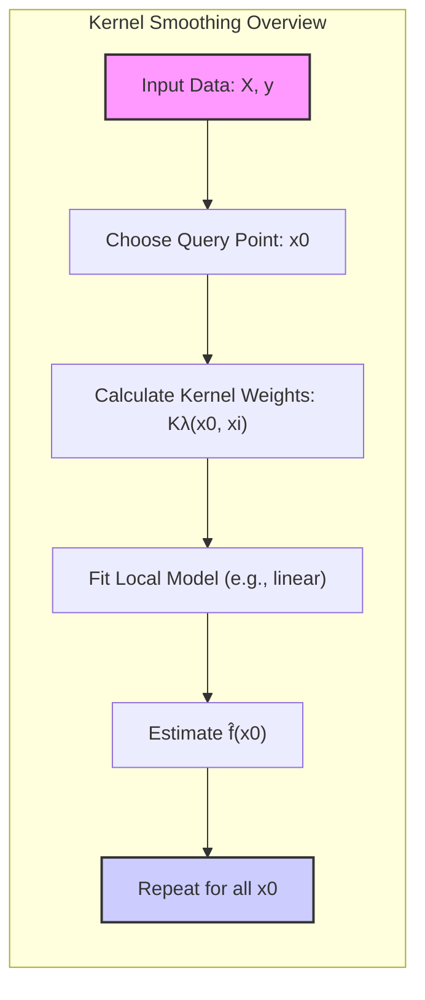
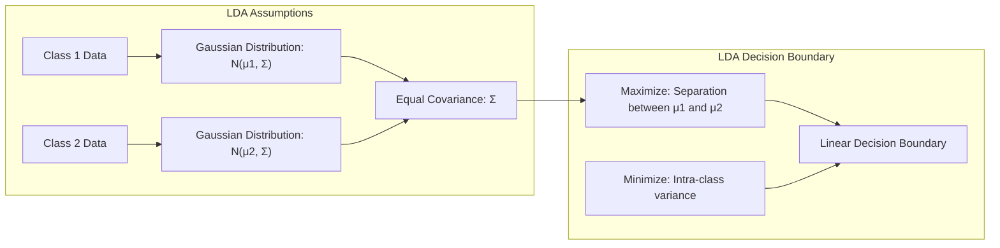
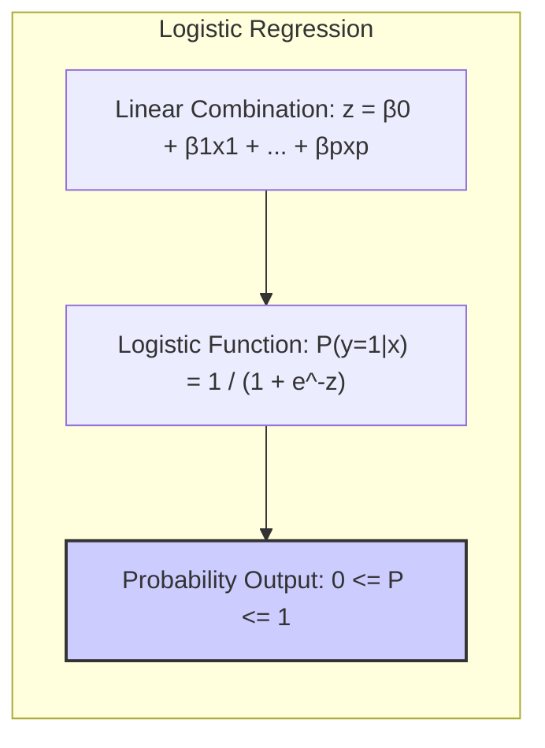
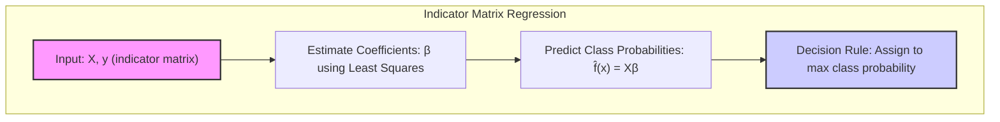
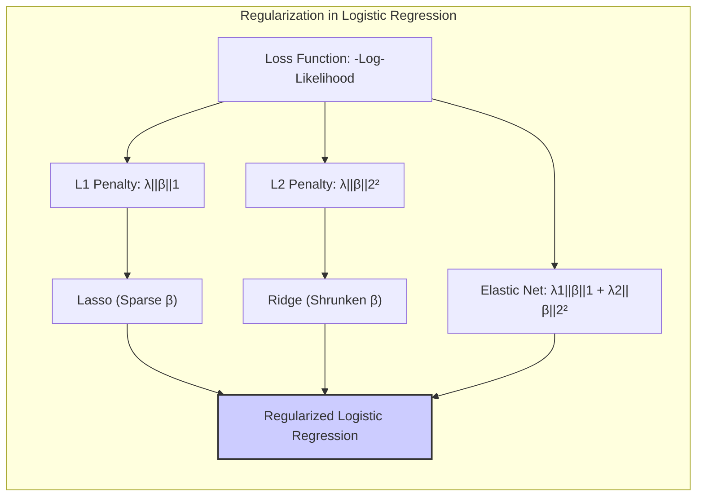
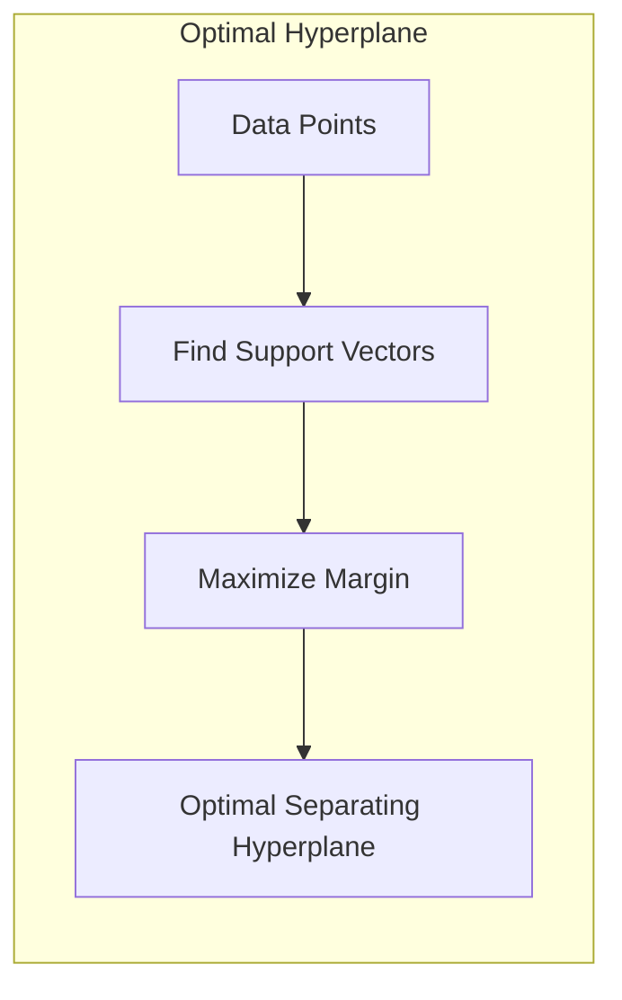
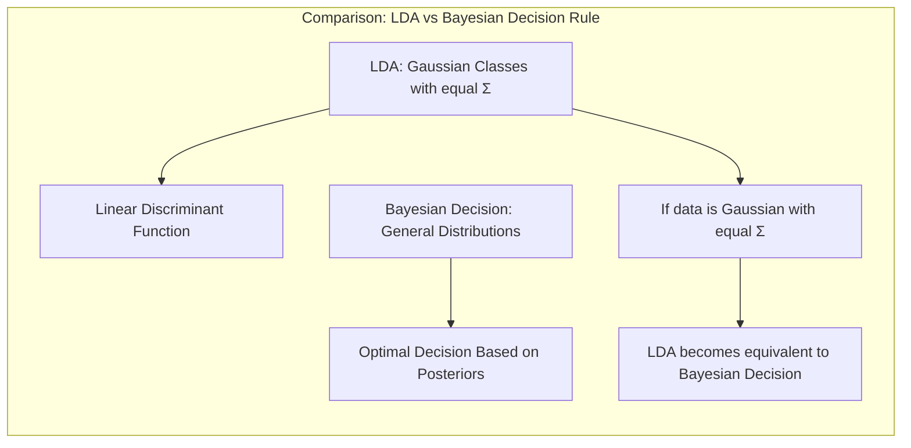

## Localizing Flexibility: Kernel Smoothing Methods for Regression and Classification



### Introdução

Este capítulo explora técnicas de regressão que alcançam flexibilidade na estimação da função de regressão $f(X)$ sobre o domínio $\mathbb{R}^p$ através do ajuste de um modelo simples, porém diferente, em cada ponto de consulta $x_0$. Essa abordagem usa apenas observações próximas ao ponto alvo $x_0$ para ajustar o modelo, garantindo que a função estimada $\hat{f}(X)$ seja suave em $\mathbb{R}^p$. A localização é alcançada por meio de uma função de ponderação ou **kernel** $K_\lambda(x_0, x_i)$, que atribui pesos aos pontos $x_i$ com base em sua distância de $x_0$. Os kernels $K_\lambda$ são tipicamente indexados por um parâmetro $\lambda$ que dita a largura da vizinhança. Esses métodos baseados em memória exigem, em princípio, pouco ou nenhum treinamento; todo o trabalho é feito no momento da avaliação. O único parâmetro que precisa ser determinado a partir dos dados de treinamento é $\lambda$, sendo o modelo, por si só, todo o conjunto de dados de treinamento [^6.1].

Além disso, discutimos classes mais gerais de técnicas baseadas em kernel, que se ligam a métodos estruturados em outros capítulos e são úteis para estimação de densidade e classificação. É importante notar que as técnicas deste capítulo não devem ser confundidas com o uso mais recente da frase "métodos kernel", onde o kernel computa um produto interno em um espaço de características de alta dimensão e é usado para modelagem não linear regularizada [^6.1].

### Conceitos Fundamentais

#### Conceito 1: Problema de Classificação e Métodos Lineares

O problema de classificação busca alocar observações a classes distintas com base em seus valores de atributos. Modelos lineares, como abordado em [^4.1], simplificam essa tarefa através da criação de fronteiras de decisão lineares. No entanto, essa simplicidade pode introduzir viés, especialmente em cenários onde as fronteiras de decisão são inerentemente não-lineares. A variância, por outro lado, refere-se à sensibilidade do modelo às variações nos dados de treinamento; modelos lineares tendem a ter variância menor devido à sua estrutura simples.

**Lemma 1:** *A decisão de classe em modelos lineares pode ser expressa como uma combinação linear de atributos, demonstrando sua simplicidade computacional, mas também suas limitações em capturar relações complexas.* A função discriminante linear pode ser decomposta em projeções nos espaços de decisão, que são definidos pelos pesos associados a cada atributo. Em condições ideais, os pesos podem ser ajustados de forma a maximizar a separação entre as classes.

> 💡 **Exemplo Numérico:**
> Considere um problema de classificação com duas classes, onde temos dois atributos $x_1$ e $x_2$. Um modelo linear pode ser representado pela equação $w_1x_1 + w_2x_2 + b = 0$, onde $w_1$ e $w_2$ são os pesos dos atributos e $b$ é o viés. Se, por exemplo, $w_1 = 2$, $w_2 = -1$ e $b = 1$, a fronteira de decisão seria a linha $2x_1 - x_2 + 1 = 0$. Pontos acima da linha seriam classificados como uma classe, e abaixo, outra. A simplicidade desse modelo linear pode não capturar padrões mais complexos nos dados, como uma fronteira de decisão circular.

#### Conceito 2: Linear Discriminant Analysis (LDA)

**LDA** assume que os dados para cada classe são gerados por uma distribuição Gaussiana com a mesma matriz de covariância. A fronteira de decisão é, então, uma combinação linear dos atributos que maximiza a separação entre as médias das classes, enquanto minimiza a variância dentro de cada classe [^4.3], [^4.3.1], [^4.3.2], [^4.3.3].



**Corolário 1:** *Sob a suposição de que as covariâncias das classes são iguais, a função discriminante linear em LDA pode ser vista como uma projeção dos dados em um subespaço de menor dimensão, otimizando a separação de classes*, conforme descrito em [^4.3.1]. Essa projeção simplifica a análise e reduz a complexidade computacional, mantendo, no entanto, uma boa capacidade de classificação.

> 💡 **Exemplo Numérico:**
> Suponha que temos duas classes com médias $\mu_1 = [1, 1]^T$ e $\mu_2 = [3, 3]^T$, e uma matriz de covariância comum $\Sigma = \begin{bmatrix} 1 & 0 \\ 0 & 1 \end{bmatrix}$. O LDA encontra um vetor que maximiza a separação entre as médias. Este vetor é dado por $\Sigma^{-1}(\mu_2 - \mu_1)$. Neste caso, como $\Sigma$ é a matriz identidade, o vetor é simplesmente $\mu_2 - \mu_1 = [2, 2]^T$. A projeção dos dados nesse vetor forma a base para a classificação.

#### Conceito 3: Logistic Regression

A **Logistic Regression** modela a probabilidade de uma observação pertencer a uma classe específica através de uma função logística, que transforma uma combinação linear dos atributos em uma probabilidade entre 0 e 1. Essa abordagem, descrita em detalhes em [^4.4], [^4.4.1], [^4.4.2], [^4.4.3], [^4.4.4], [^4.4.5], busca encontrar os coeficientes que maximizam a verossimilhança dos dados observados. A função *logit* (log-odds) é central na regressão logística, conectando o modelo linear à probabilidade.



> ⚠️ **Nota Importante**: A regressão logística modela a probabilidade de pertencimento a uma classe, enquanto LDA foca na discriminação entre classes com base em distâncias estatísticas, de acordo com [^4.4.1].

> ❗ **Ponto de Atenção**: Em casos de classes não balanceadas, a regressão logística pode apresentar desafios, pois o viés da classe maior pode influenciar a estimativa dos parâmetros, conforme observado em [^4.4.2].

> ✔️ **Destaque**: As estimativas de parâmetros em LDA e em regressão logística podem apresentar similaridades, especialmente quando se assume uma distribuição normal para os dados, como discutido em [^4.5].

> 💡 **Exemplo Numérico:**
> Imagine que estamos modelando a probabilidade de um cliente comprar um produto com base em sua idade ($x$). Em regressão logística, a probabilidade $P(y=1|x)$ é modelada como:
> $$P(y=1|x) = \frac{1}{1 + e^{-(\beta_0 + \beta_1 x)}},$$
> onde $\beta_0$ e $\beta_1$ são os coeficientes a serem estimados. Se, por exemplo, $\beta_0 = -3$ e $\beta_1 = 0.1$, um cliente com 30 anos teria probabilidade:
> $$P(y=1|30) = \frac{1}{1 + e^{-(-3 + 0.1 \cdot 30)}} = \frac{1}{1 + e^{0}} = 0.5.$$
> Um cliente com 50 anos teria:
> $$P(y=1|50) = \frac{1}{1 + e^{-(-3 + 0.1 \cdot 50)}} = \frac{1}{1 + e^{-2}} \approx 0.88.$$
> Isso ilustra como a regressão logística transforma uma relação linear com a idade em uma probabilidade entre 0 e 1.

### Regressão Linear e Mínimos Quadrados para Classificação



A regressão linear pode ser aplicada à classificação usando uma matriz indicadora, onde cada coluna representa uma classe. Os coeficientes são estimados por mínimos quadrados, e uma regra de decisão é aplicada para alocar uma observação à classe com a maior probabilidade estimada [^4.2]. No entanto, esse método possui limitações, como o problema de mascaramento (*masking problem*) e a influência da covariância entre classes, que podem levar a resultados subótimos [^4.3]. A regressão linear diretamente em uma matriz indicadora pode não ser a abordagem mais adequada em certas situações, mas é útil para entender a relação entre métodos lineares de classificação [^4.1].

**Lemma 2:** *A projeção dos dados em um hiperplano de decisão através da regressão linear em uma matriz indicadora é equivalente à projeção gerada por discriminantes lineares em certas condições*, o que pode ser demonstrado através da decomposição das matrizes de covariância [^4.2].

**Corolário 2:** *A equivalência entre projeções de regressão linear e discriminantes lineares, em determinadas condições, pode simplificar a análise do modelo, fornecendo uma perspectiva adicional sobre a natureza das fronteiras de decisão*, conforme indicado em [^4.3].

Comparando com outros métodos, a regressão logística, conforme descrito em [^4.4], tende a fornecer estimativas mais estáveis de probabilidade, enquanto a regressão de indicadores pode levar a extrapolações fora do intervalo [0,1]. No entanto, a regressão de indicadores pode ser suficiente quando o objetivo principal é obter uma fronteira de decisão linear, conforme indicado em [^4.2].

> 💡 **Exemplo Numérico:**
> Suponha que temos três classes, $C_1$, $C_2$, e $C_3$, e dois atributos $x_1$ e $x_2$. Para usar regressão linear para classificação, criamos uma matriz indicadora $Y$ de dimensão $n \times 3$, onde cada linha representa uma observação e cada coluna indica a qual classe ela pertence (1 se pertence, 0 caso contrário).
>
> ```python
> import numpy as np
> from sklearn.linear_model import LinearRegression
>
> # Dados de exemplo (n=4 observações, p=2 atributos)
> X = np.array([[1, 2], [2, 1], [3, 4], [4, 3]])
> # Matriz indicadora de classes (4 observações, 3 classes)
> Y = np.array([[1, 0, 0], [0, 1, 0], [0, 0, 1], [1, 0, 0]])
>
> # Ajustar modelo de regressão linear
> model = LinearRegression()
> model.fit(X, Y)
>
> # Prever para um novo ponto
> new_point = np.array([[2.5, 2.5]])
> predicted_probs = model.predict(new_point)
> print(f"Probabilidades estimadas: {predicted_probs}")
>
> # A classe predita é a que tem maior probabilidade
> predicted_class = np.argmax(predicted_probs)
> print(f"Classe predita: {predicted_class + 1}")
> ```
>
> Este exemplo mostra como a regressão linear pode ser usada para classificar pontos em múltiplas classes. No entanto, as probabilidades previstas podem não ser bem calibradas e podem ser menores que 0 ou maiores que 1, o que é uma das limitações da regressão linear para classificação.

### Métodos de Seleção de Variáveis e Regularização em Classificação



A seleção de variáveis e regularização são cruciais para evitar overfitting e melhorar a generalização dos modelos de classificação [^4.5]. Métodos como a penalização L1 (Lasso) e L2 (Ridge) podem ser aplicados a modelos logísticos para controlar a complexidade e aumentar a estabilidade [^4.4.4], [^4.5.1], [^4.5.2]. A penalização L1 promove a esparsidade, zerando alguns coeficientes, enquanto a L2 encolhe todos os coeficientes em direção a zero. A escolha entre as penalidades depende dos objetivos do modelo e da natureza dos dados.

A regularização se encaixa na formulação de uma função de custo combinando a verossimilhança e termos de penalização:

$$ \text{Custo} = -\text{Verossimilhança} + \lambda \cdot \text{Penalidade}, $$

onde $\lambda$ controla a intensidade da regularização [^4.4.4].

**Lemma 3:** *A penalização L1 em regressão logística leva a coeficientes esparsos, pois a norma L1 penaliza os coeficientes com base em seu valor absoluto, tendendo a zerar alguns deles*, o que pode ser demonstrado através da análise da função de custo e de suas derivadas [^4.4.4].

**Prova do Lemma 3:** A penalização L1 adiciona um termo proporcional à soma dos valores absolutos dos coeficientes à função de custo, o que incentiva a convergência para soluções onde alguns coeficientes são exatamente zero. Essa propriedade é alcançada porque a derivada da norma L1 é descontínua em zero, empurrando os coeficientes para esse ponto quando a solução ótima é atingida. A otimização, conforme em [^4.4.3], envolve ajustar os coeficientes para minimizar a função de custo, o que resulta em coeficientes esparsos. $\blacksquare$

**Corolário 3:** *A esparsidade induzida pela penalização L1 melhora a interpretabilidade dos modelos de classificação, pois os atributos com coeficientes não nulos são os mais relevantes para a decisão de classe*, o que pode ser benéfico em modelos com um grande número de atributos [^4.4.5].

> ⚠️ **Ponto Crucial**: As penalidades L1 e L2 podem ser combinadas através do Elastic Net, aproveitando as vantagens de ambos os tipos de regularização, como discutido em [^4.5].

> 💡 **Exemplo Numérico:**
> Vamos aplicar regularização L1 (Lasso) e L2 (Ridge) a um modelo de regressão logística com dois atributos, $x_1$ e $x_2$, e um termo de viés. A função logística é dada por:
> $$P(y=1|x) = \frac{1}{1 + e^{-(\beta_0 + \beta_1 x_1 + \beta_2 x_2)}}.$$
>
> Primeiro, sem regularização, os coeficientes são, por exemplo, $\beta_0 = -0.5$, $\beta_1 = 1.2$, e $\beta_2 = -0.8$.
>
> Com regularização L1 (Lasso) com $\lambda = 0.1$, alguns coeficientes podem ser zerados, resultando em, por exemplo, $\beta_0 = -0.3$, $\beta_1 = 0.9$ e $\beta_2 = 0$. Isso significa que o atributo $x_2$ não contribui para a decisão, simplificando o modelo.
>
> Com regularização L2 (Ridge) com $\lambda = 0.1$, os coeficientes são encolhidos, resultando em, por exemplo, $\beta_0 = -0.4$, $\beta_1 = 1.0$ e $\beta_2 = -0.6$. Todos os coeficientes são menores em magnitude do que sem regularização, mas nenhum é zerado.
>
> ```python
> import numpy as np
> from sklearn.linear_model import LogisticRegression
> from sklearn.preprocessing import StandardScaler
>
> # Dados de exemplo (n=100 observações, p=2 atributos)
> np.random.seed(42)
> X = np.random.rand(100, 2)
> y = (X[:, 0] + X[:, 1] > 1).astype(int)
>
> # Padronização dos dados
> scaler = StandardScaler()
> X_scaled = scaler.fit_transform(X)
>
> # Modelo sem regularização
> model_no_reg = LogisticRegression(penalty=None, solver='lbfgs')
> model_no_reg.fit(X_scaled, y)
> print(f"Coeficientes sem regularização: {model_no_reg.coef_}")
>
> # Modelo com regularização L1
> model_l1 = LogisticRegression(penalty='l1', C=1, solver='liblinear')  # C = 1/lambda
> model_l1.fit(X_scaled, y)
> print(f"Coeficientes com regularização L1: {model_l1.coef_}")
>
> # Modelo com regularização L2
> model_l2 = LogisticRegression(penalty='l2', C=1, solver='lbfgs')
> model_l2.fit(X_scaled, y)
> print(f"Coeficientes com regularização L2: {model_l2.coef_}")
> ```
> Este exemplo mostra como diferentes tipos de regularização afetam os coeficientes do modelo.

### Separating Hyperplanes e Perceptrons

A ideia de maximizar a margem de separação leva à definição de **hiperplanos ótimos**, que são determinados por pontos de suporte e definem as fronteiras de decisão com maior robustez [^4.5.2]. O problema de otimização para encontrar o hiperplano é frequentemente resolvido utilizando a formulação dual de Wolfe, e as soluções surgem como combinações lineares dos pontos de suporte.



O **Perceptron de Rosenblatt** é um algoritmo de classificação linear que ajusta iterativamente seus pesos com base em erros de classificação. Sob certas condições, como a separabilidade linear dos dados, o Perceptron converge para uma solução [^4.5.1].

> 💡 **Exemplo Numérico:**
> Considere um problema de classificação binária com dados linearmente separáveis. O Perceptron começa com um hiperplano de decisão inicial (pesos e viés) e itera sobre os dados de treinamento. Se um ponto é classificado incorretamente, os pesos são atualizados na direção correta. Por exemplo, se a previsão é $y_{pred} = -1$ e a classe verdadeira é $y = 1$, os pesos $w$ são atualizados por $w_{new} = w_{old} + \eta x$, onde $\eta$ é a taxa de aprendizado e $x$ é o vetor de atributos. O algoritmo continua até que todos os pontos sejam classificados corretamente ou um número máximo de iterações seja alcançado.

### Pergunta Teórica Avançada: Diferenças Fundamentais entre LDA e Regra de Decisão Bayesiana

**Resposta:** A **Linear Discriminant Analysis (LDA)** e a **Regra de Decisão Bayesiana** compartilham o objetivo de classificar observações, mas diferem em suas formulações e pressupostos. A LDA assume que as classes são gaussianas com a mesma matriz de covariância, enquanto a Regra Bayesiana é mais geral e não exige essas restrições [^4.3]. Sob certas condições, como a igualdade das matrizes de covariância e distribuições gaussianas, o LDA se torna equivalente à decisão Bayesiana.



**Lemma 4:** *Quando as distribuições de classe são gaussianas com médias diferentes e matrizes de covariância iguais, a regra de decisão de LDA se torna formalmente equivalente à regra de decisão Bayesiana*, conforme demonstrado através da derivação das funções discriminantes e das probabilidades posteriores [^4.3], [^4.3.3].

**Corolário 4:** *Ao relaxar a hipótese de covariâncias iguais, a regra de decisão Bayesiana leva às fronteiras quadráticas (QDA), mostrando que a escolha das covariâncias afeta a natureza das fronteiras*, como discutido em [^4.3].

> ⚠️ **Ponto Crucial**: A adoção ou não de covariâncias iguais em LDA e na regra de decisão Bayesiana define o tipo de fronteira de decisão: linear (com covariâncias iguais) ou quadrática (com covariâncias diferentes) [^4.3.1].

### Conclusão

Neste capítulo, exploramos as diversas facetas dos métodos de suavização kernel, que permitem flexibilidade ao adaptar modelos locais com base em uma função de ponderação. Vimos como esses métodos se relacionam com a regressão linear, a regressão logística, a análise discriminante linear e outras abordagens, oferecendo uma visão abrangente das técnicas de classificação e regressão. O uso de kernels para suavização é uma abordagem poderosa para lidar com a complexidade e a variabilidade dos dados, fornecendo uma base sólida para o desenvolvimento de modelos de aprendizado de máquina robustos e eficazes.

### Footnotes

[^6.1]: "In this chapter we describe a class of regression techniques that achieve flexibility in estimating the regression function f(X) over the domain IR by fitting a different but simple model separately at each query point xo." *(Trecho de Kernel Smoothing Methods)*

[^4.1]: "The classification problem seeks to allocate observations to distinct classes based on their attribute values." *(Trecho de Classificacão Linear)*

[^4.2]: "Linear regression on an indicator matrix directly attempts to estimate a class probability via a linear model, but it can be prone to the ‘masking problem’." *(Trecho de Regressão Linear e Matriz de Indicadores)*

[^4.3]: "Linear discriminant analysis (LDA) assumes that the data within each class are generated from a Gaussian distribution with the same covariance matrix." *(Trecho de Linear Discriminant Analysis (LDA))*

[^4.3.1]: "In the case of equal covariance matrices, the resulting discriminant functions are linear, which can be interpreted as a projection of the data onto a lower-dimensional subspace." *(Trecho de Linear Discriminant Analysis (LDA))*

[^4.3.2]: "The assumption of equal covariance matrices is the basis for linear discriminant analysis." *(Trecho de Linear Discriminant Analysis (LDA))*

[^4.3.3]: "When covariances are not assumed to be equal, the resulting discriminant functions are quadratic, which is referred to as Quadratic Discriminant Analysis (QDA)." *(Trecho de Linear Discriminant Analysis (LDA))*

[^4.4]: "Logistic regression models the probability of an observation belonging to a specific class using a logistic function." *(Trecho de Regressão Logística)*

[^4.4.1]: "The logit function is central to logistic regression and connects the linear model to probability." *(Trecho de Regressão Logística)*

[^4.4.2]: "When classes are imbalanced, logistic regression may exhibit issues as the bias of the larger class may influence the estimation of parameters." *(Trecho de Regressão Logística)*

[^4.4.3]: "Logistic regression parameters are determined by maximizing the likelihood of the observed data." *(Trecho de Regressão Logística)*

[^4.4.4]: "Penalization is added to the cost function to control complexity in logistic regression models." *(Trecho de Regressão Logística)*

[^4.4.5]: "The interpretability of logistic models improves when using L1 regularization." *(Trecho de Regressão Logística)*

[^4.5]: "Variable selection and regularization techniques can be applied to enhance the robustness and generalization of classification models." *(Trecho de Métodos de Seleção de Variáveis e Regularização)*

[^4.5.1]: "The Rosenblatt’s Perceptron algorithm is one of the most fundamental algorithms for linear classification." *(Trecho de Separating Hyperplanes e Perceptrons)*

[^4.5.2]: "Maximizing the margin of separation leads to the concept of optimal hyperplanes." *(Trecho de Separating Hyperplanes e Perceptrons)*
