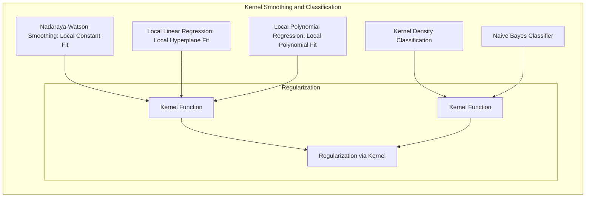
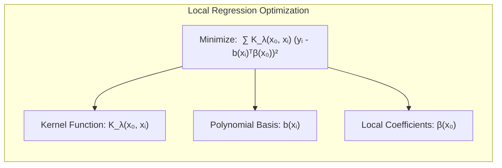
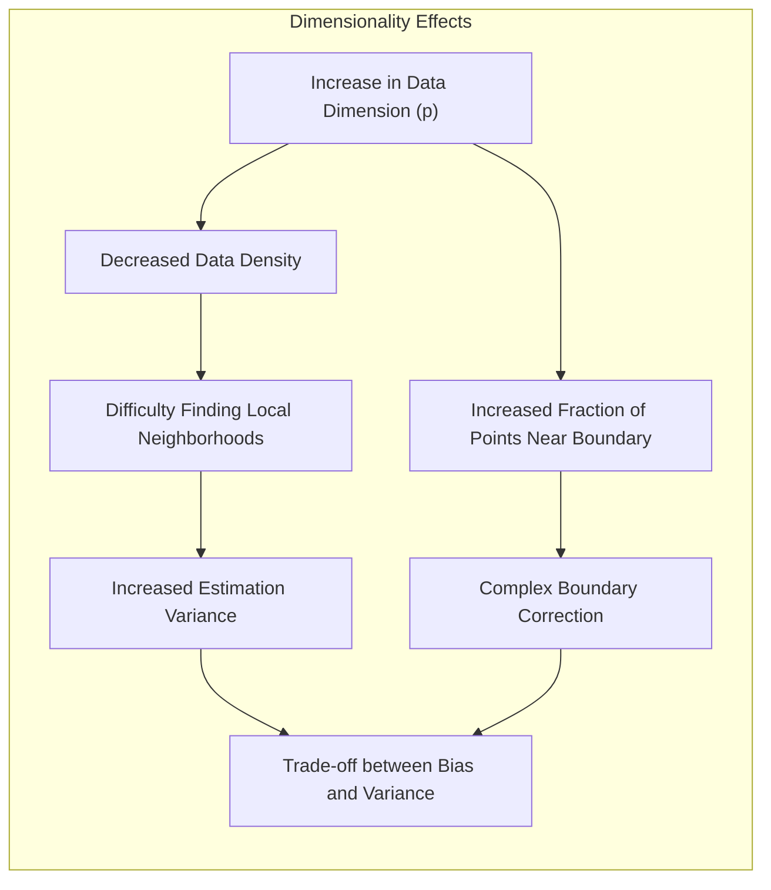
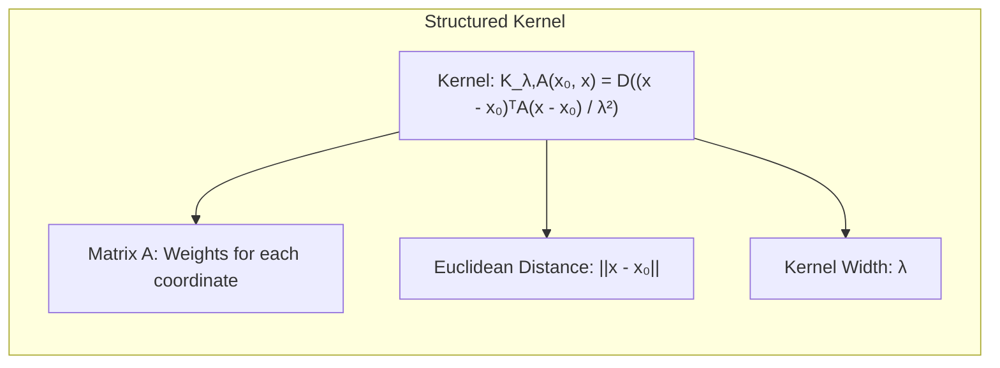
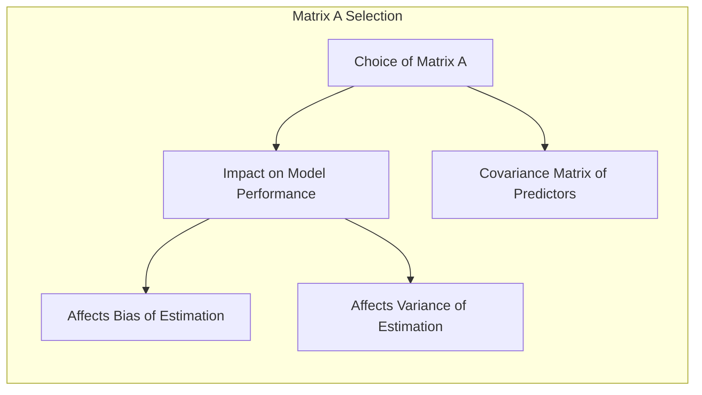
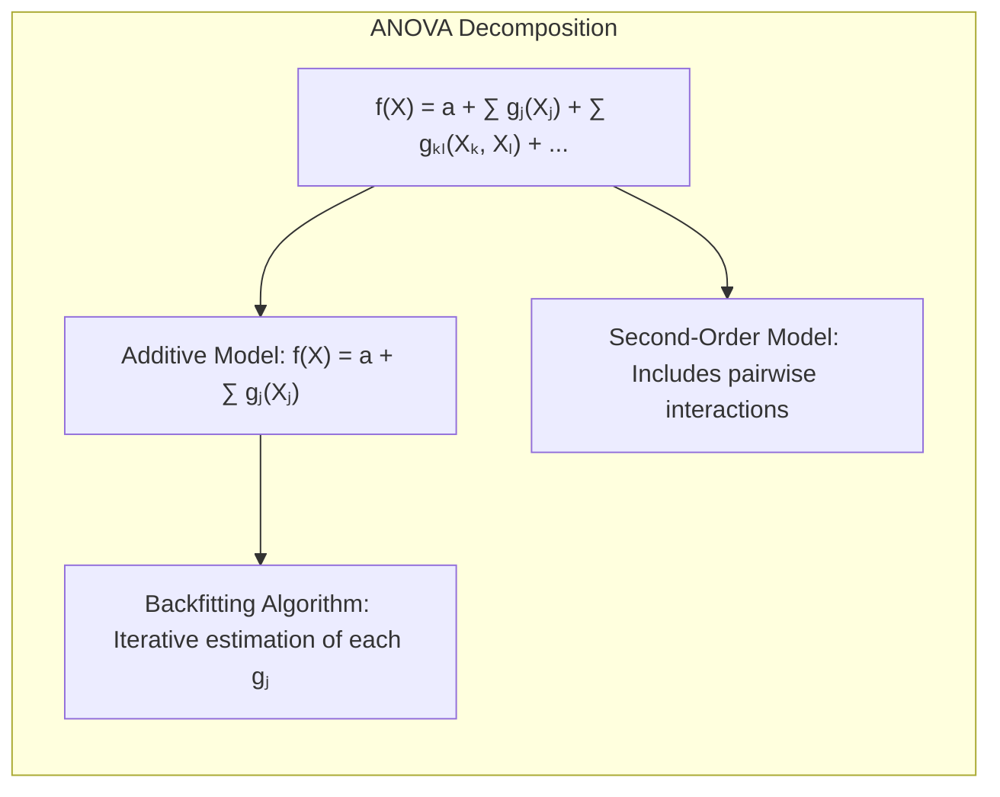
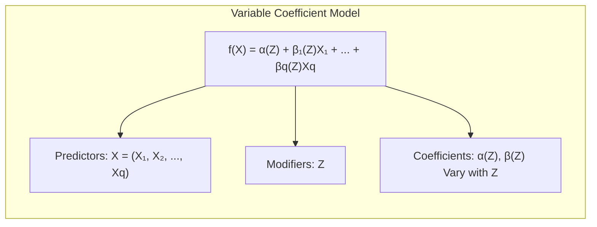
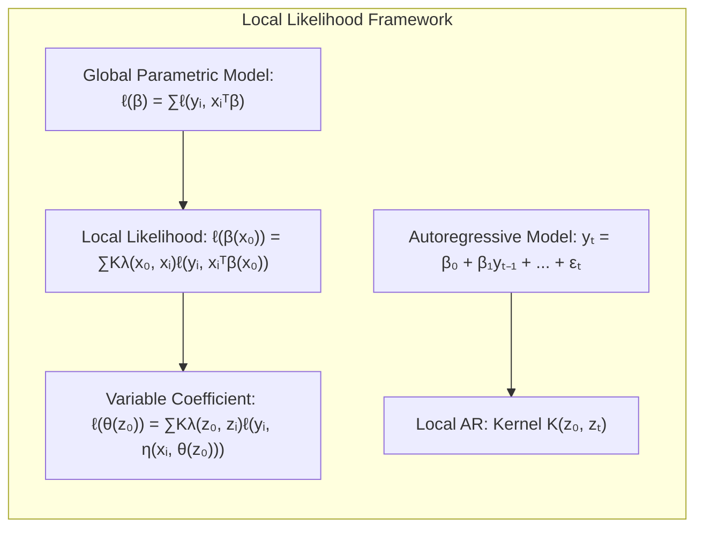

## Título Conciso: Localizing Flexibility



### Regressão Local em $\mathbb{R}^p$

<!-- START Regressão Local em  $\mathbb{R}^p$ -->

A generalização da suavização kernel e da regressão local para duas ou mais dimensões ocorre de maneira natural [^6.3]. O suavizador kernel Nadaraya-Watson ajusta uma constante localmente com pesos fornecidos por um kernel $p$-dimensional. A regressão linear local ajusta um hiperplano localmente em $X$ por mínimos quadrados ponderados, utilizando um kernel $p$-dimensional [^6.3]. É simples de implementar e geralmente preferido ao ajuste local constante, devido ao seu melhor desempenho nas fronteiras.

Seja $b(X)$ um vetor de termos polinomiais em $X$ de grau máximo $d$. Por exemplo, com $d = 1$ e $p = 2$, temos $b(X) = (1, X_1, X_2)$; com $d=2$, temos $b(X) = (1, X_1, X_2, X_1^2, X_2^2, X_1X_2)$; e trivialmente com $d=0$ temos $b(X) = 1$ [^6.3]. Em cada $x_0 \in \mathbb{R}^p$, resolvemos o problema:

$$ \min_{\beta(x_0)} \sum_{i=1}^N K_\lambda(x_0, x_i) (y_i - b(x_i)^T \beta(x_0))^2, $$

para produzir o ajuste $\hat{f}(x_0) = b(x_0)^T\beta(x_0)$ [^6.3]. Tipicamente, o kernel é uma função radial, como o Epanechnikov radial ou o kernel tri-cúbico:

$$ K_\lambda(x_0, x) = D\left(\frac{||x - x_0||}{\lambda}\right), $$

onde $|| \cdot ||$ é a norma euclidiana [^6.3]. A norma euclidiana depende das unidades em cada coordenada, sendo essencial padronizar cada preditor, por exemplo, para um desvio padrão unitário antes da suavização.



> 💡 **Exemplo Numérico:**
>
> Suponha que temos um conjunto de dados bidimensional com duas variáveis preditoras, $X_1$ e $X_2$, e uma variável resposta $Y$.  Vamos usar regressão linear local com um kernel gaussiano para estimar $Y$ em um ponto $x_0 = (1, 2)$.
>
> **Passo 1: Definir o kernel gaussiano**
>
>  O kernel gaussiano é definido como:
>  $$K_\lambda(x_0, x_i) = e^{-\frac{||x_i - x_0||^2}{2\lambda^2}}$$
>
>  Vamos escolher $\lambda = 1$ para este exemplo.
>
> **Passo 2: Dados de exemplo**
>
>  Suponha que temos os seguintes dados:
>
>  | i | $X_{i1}$ | $X_{i2}$ | $Y_i$ |
>  |---|---|---|---|
>  | 1 | 0  | 1  | 3  |
>  | 2 | 1.5| 2.5| 5  |
>  | 3 | 2  | 1  | 4  |
>  | 4 | 0.5| 3  | 6  |
>
>  **Passo 3: Calcular os pesos do kernel**
>  Para cada ponto de dados $x_i$, calculamos o peso $K_\lambda(x_0, x_i)$:
>
>  $||x_1 - x_0||^2 = (0-1)^2 + (1-2)^2 = 2$, $K_\lambda(x_0, x_1) = e^{-2/2} = e^{-1} \approx 0.368$
>
>  $||x_2 - x_0||^2 = (1.5-1)^2 + (2.5-2)^2 = 0.5$, $K_\lambda(x_0, x_2) = e^{-0.5/2} = e^{-0.25} \approx 0.779$
>
>  $||x_3 - x_0||^2 = (2-1)^2 + (1-2)^2 = 2$, $K_\lambda(x_0, x_3) = e^{-2/2} = e^{-1} \approx 0.368$
>
>  $||x_4 - x_0||^2 = (0.5-1)^2 + (3-2)^2 = 1.25$, $K_\lambda(x_0, x_4) = e^{-1.25/2} = e^{-0.625} \approx 0.535$
>
> **Passo 4: Montar a matriz X e o vetor Y ponderados**
> Para regressão linear local com d=1, $b(X) = (1, X_1, X_2)$. A matriz X ponderada e o vetor Y ponderado são:
> $X_w = \begin{bmatrix} \sqrt{0.368} & 0 & \sqrt{0.368} \\ \sqrt{0.779} & 1.5\sqrt{0.779} & 2.5\sqrt{0.779} \\ \sqrt{0.368} & 2\sqrt{0.368} & \sqrt{0.368} \\ \sqrt{0.535} & 0.5\sqrt{0.535} & 3\sqrt{0.535}  \end{bmatrix} = \begin{bmatrix} 0.607 & 0 & 0.607 \\ 0.883 & 1.324 & 2.208 \\ 0.607 & 1.214 & 0.607 \\ 0.731 & 0.365 & 2.193 \end{bmatrix}$
>
> $Y_w = \begin{bmatrix} 3\sqrt{0.368} \\ 5\sqrt{0.779} \\ 4\sqrt{0.368} \\ 6\sqrt{0.535} \end{bmatrix} = \begin{bmatrix} 1.822 \\ 4.395 \\ 2.428 \\ 4.387 \end{bmatrix}$
>
> **Passo 5: Calcular os coeficientes $\beta(x_0)$**
>
> $\beta(x_0) = (X_w^T X_w)^{-1} X_w^T Y_w $
>
>  Usando numpy para calcular isso:
>
> ```python
> import numpy as np
>
> X_w = np.array([[0.607, 0, 0.607],
>                 [0.883, 1.324, 2.208],
>                 [0.607, 1.214, 0.607],
>                 [0.731, 0.365, 2.193]])
> Y_w = np.array([1.822, 4.395, 2.428, 4.387])
>
> beta_x0 = np.linalg.solve(X_w.T @ X_w, X_w.T @ Y_w)
> print(beta_x0)
> # Output: [2.998, 0.794, 0.719]
> ```
>
> $\beta(x_0) \approx (2.998, 0.794, 0.719)$
>
> **Passo 6: Estimar $\hat{f}(x_0)$**
>
> $\hat{f}(x_0) = b(x_0)^T \beta(x_0) = (1, 1, 2) \cdot (2.998, 0.794, 0.719) = 2.998 + 0.794 + 2 * 0.719 = 5.23$
>
> Portanto, a estimativa da regressão local em $x_0 = (1, 2)$ é aproximadamente 5.23.

As fronteiras são um problema significativo em suavização unidimensional, mas tornam-se um problema muito maior em duas ou mais dimensões, pois a fração de pontos na fronteira é maior. Uma das manifestações da maldição da dimensionalidade é que a fração de pontos próximos à fronteira cresce para um conforme a dimensão aumenta. Modificar o kernel diretamente para acomodar fronteiras bidimensionais torna-se muito complexo, especialmente para fronteiras irregulares. A regressão polinomial local realiza a correção de fronteira na ordem desejada, sem problemas em qualquer dimensão [^6.3]. No entanto, a regressão local torna-se menos útil em dimensões muito maiores do que dois ou três. É impossível manter simultaneamente a localidade (baixo viés) e uma amostra considerável na vizinhança (baixa variância) à medida que a dimensão aumenta, sem que o tamanho total da amostra cresça exponencialmente em $p$. A visualização de $\hat{f}(X)$ também se torna difícil em dimensões superiores, que é frequentemente um dos objetivos principais da suavização.

**Exemplo:** Uma aplicação da regressão local é demonstrada usando medições astronômicas com um design incomum do preditor (em forma de estrela), onde a fronteira é extremamente irregular e a superfície ajustada deve interpolar sobre regiões de crescente esparsidade de dados, conforme descrito em [^6.3].

#### Pergunta Teórica Avançada: Efeitos da Dimensão em Regressão Local



**Resposta:**  A maldição da dimensionalidade impõe severas limitações à regressão local em altas dimensões. A densidade dos dados diminui exponencialmente com o aumento da dimensão, tornando mais difícil encontrar vizinhanças locais com amostras suficientes para uma estimativa precisa [^6.3].

**Lemma 5:** *À medida que a dimensão dos dados aumenta, a fração de pontos próximos à fronteira cresce para um, tornando a correção de fronteira mais difícil e a estimativa mais imprecisa*, conforme demonstrado pela análise da distribuição de pontos em espaços de alta dimensão.

**Corolário 5:** *Em altas dimensões, o parâmetro $\lambda$ precisa ser muito maior para manter a variância sob controle, mas isso aumenta o viés da estimativa, sacrificando a localidade do ajuste*, o que pode ser observado através da análise do trade-off entre viés e variância em diferentes dimensões.

> ⚠️ **Ponto Crucial:** O trade-off entre viés e variância torna-se mais agudo em altas dimensões. Métodos de regularização, seleção de variáveis e modelos estruturados tornam-se cruciais para lidar com essa complexidade [^6.3].

<!-- END Regressão Local em  $\mathbb{R}^p$ -->

### Kernels Estruturados

<!-- START Kernels Estruturados -->

Uma abordagem para lidar com a complexidade em altas dimensões é modificar o kernel, conforme descrito em [^6.4.1]. O kernel esférico padrão (6.13) dá peso igual a cada coordenada, e uma estratégia padrão é padronizar cada variável para um desvio padrão unitário. Uma abordagem mais geral usa uma matriz semidefinida positiva $A$ para ponderar as diferentes coordenadas:

$$ K_{\lambda,A}(x_0, x) = D\left(\frac{(x - x_0)^T A (x - x_0)}{\lambda^2}\right). $$

Coordenadas inteiras ou direções podem ser rebaixadas ou omitidas impondo restrições apropriadas em $A$ [^6.4.1]. Por exemplo, se $A$ for diagonal, podemos aumentar ou diminuir a influência dos preditores individuais $X_j$ aumentando ou diminuindo $A_{jj}$. Muitas vezes os preditores são muitos e altamente correlacionados, como aqueles que surgem de sinais analógicos ou imagens digitalizadas. A função de covariância dos preditores pode ser usada para ajustar uma métrica $A$ que se concentre menos em contrastes de alta frequência, por exemplo. Propôs-se aprender os parâmetros para kernels multidimensionais. Por exemplo, o modelo de regressão de projeção discutido no Capítulo 11 é dessa natureza, onde versões de baixo posto de $A$ implicam funções de crista para $f(X)$. Modelos mais gerais para $A$ são complexos e favorecemos formas estruturadas para a função de regressão.



> 💡 **Exemplo Numérico:**
>
> Suponha que temos dois preditores, $X_1$ e $X_2$, e queremos usar um kernel estruturado. Vamos considerar um caso onde $X_1$ tem mais importância que $X_2$.
>
> **Passo 1: Definir a Matriz A**
>
>  Vamos definir $A$ como uma matriz diagonal:
>  $$A = \begin{bmatrix} a_{11} & 0 \\ 0 & a_{22} \end{bmatrix}$$
>
>  Para dar mais importância a $X_1$, vamos escolher $a_{11} = 2$ e $a_{22} = 1$.
>
>  $$A = \begin{bmatrix} 2 & 0 \\ 0 & 1 \end{bmatrix}$$
>
> **Passo 2: Kernel estruturado**
>
>  O kernel estruturado é dado por:
>  $$K_{\lambda, A}(x_0, x) = e^{-\frac{(x - x_0)^T A (x - x_0)}{2\lambda^2}}$$
>
>  Vamos escolher $\lambda = 1$.
>
> **Passo 3: Dados de exemplo**
>
> Suponha que $x_0 = (1, 1)$ e temos um ponto $x = (2, 2)$.
>
> **Passo 4: Calcular $(x - x_0)^T A (x - x_0)$**
>
> $$x - x_0 = \begin{bmatrix} 2 - 1 \\ 2 - 1 \end{bmatrix} = \begin{bmatrix} 1 \\ 1 \end{bmatrix}$$
>
> $$(x - x_0)^T A (x - x_0) = \begin{bmatrix} 1 & 1 \end{bmatrix} \begin{bmatrix} 2 & 0 \\ 0 & 1 \end{bmatrix} \begin{bmatrix} 1 \\ 1 \end{bmatrix} = \begin{bmatrix} 1 & 1 \end{bmatrix} \begin{bmatrix} 2 \\ 1 \end{bmatrix} = 2 + 1 = 3$$
>
> **Passo 5: Calcular o peso do kernel**
>
> $$K_{\lambda, A}(x_0, x) = e^{-\frac{3}{2(1)^2}} = e^{-1.5} \approx 0.223$$
>
> Se usássemos um kernel esférico padrão com $\lambda = 1$, teríamos:
>
> $$(x - x_0)^T(x - x_0) = (2-1)^2 + (2-1)^2 = 2$$
>
> $$K_{\lambda}(x_0, x) = e^{-\frac{2}{2(1)^2}} = e^{-1} \approx 0.368$$
>
>  O kernel estruturado com a matriz $A$ dá um peso menor (0.223) em comparação com o kernel esférico padrão (0.368) para o mesmo ponto, porque enfatiza a diferença em $X_1$ mais do que em $X_2$.

**Pergunta Teórica Avançada:  Seleção da Matriz A para kernels estruturados.**

**Resposta:** A escolha apropriada da matriz A no kernel estruturado tem um impacto direto no desempenho do modelo de regressão local. Diferentes escolhas de A podem levar a diferentes comportamentos do modelo, afetando o viés e a variância da estimativa.



**Lemma 6:** *A matriz de covariância dos preditores pode ser usada para ajustar a matriz A no kernel estruturado, o que pode reduzir o impacto de preditores altamente correlacionados*, conforme discutido em [^6.4.1].

**Prova do Lemma 6:** Se os preditores são altamente correlacionados, suas variâncias individuais podem ser menos informativas do que suas covariâncias. Usar a matriz de covariância como base para A pode capturar essa informação, permitindo que o modelo ignore as componentes de alta frequência e concentre-se nos padrões de baixa frequência. $\blacksquare$

**Corolário 6:** *Ao construir A com base na matriz de covariância dos preditores, é possível criar uma métrica que se concentra em componentes relevantes dos dados*, como discutido em [^6.4.1], melhorando a eficiência do modelo em espaços de alta dimensão.

> ⚠️ **Ponto Crucial:** Em muitos casos, simplificar a matriz A, como torná-la diagonal, pode trazer benefícios computacionais sem perda significativa de desempenho. Além disso, modelos de aprendizado podem ser usados para aprender os parâmetros da matriz A, adicionando uma camada de adaptabilidade ao método [^6.4.1].

<!-- END Kernels Estruturados -->

### Funções de Regressão Estruturadas

<!-- START Funções de Regressão Estruturadas -->

Estamos tentando ajustar uma função de regressão $E(Y|X) = f(X_1, X_2, \ldots, X_p)$ em $\mathbb{R}^p$, na qual todos os níveis de interação estão potencialmente presentes [^6.4.2]. É natural considerar decomposições de análise de variância (ANOVA) da forma:

$$f(X_1, X_2, \ldots, X_p) = a + \sum_j g_j(X_j) + \sum_{k<l} g_{kl}(X_k, X_l) + \ldots$$

e, em seguida, introduzir estrutura eliminando alguns dos termos de ordem superior [^6.4.2]. Os modelos aditivos assumem apenas termos de efeito principal:

$$ f(X) = a + \sum_{j=1}^p g_j(X_j); $$

modelos de segunda ordem terão termos com interações de ordem no máximo dois, e assim por diante. No Capítulo 9, descrevemos algoritmos iterativos de *backfitting* para ajustar tais modelos de interação de baixa ordem. No modelo aditivo, por exemplo, se todos os termos, exceto o k-ésimo, forem considerados conhecidos, podemos estimar $g_k$ por regressão local de $Y - \sum_{j \neq k} g_j(X_j)$ em $X_k$. Isso é feito para cada função, por sua vez, repetidamente, até a convergência [^6.4.2]. O detalhe importante é que, em qualquer estágio, tudo o que é necessário é uma regressão local unidimensional. As mesmas ideias podem ser usadas para ajustar decomposições ANOVA de baixa dimensão.



Um caso especial importante desses modelos estruturados é a classe de modelos de coeficientes variáveis. Suponha, por exemplo, que dividamos os preditores $p$ em $X$ em um conjunto $(X_1, X_2, \ldots, X_q)$ com $q < p$, e o restante das variáveis coletamos no vetor $Z$ [^6.4.2]. Então, assumimos o modelo condicionalmente linear:

$$f(X) = \alpha(Z) + \beta_1(Z)X_1 + \ldots + \beta_q(Z)X_q.$$

Para um dado $Z$, este é um modelo linear, mas cada um dos coeficientes pode variar com $Z$. É natural ajustar tal modelo por mínimos quadrados ponderados localmente:

$$ \min_{\alpha(z_0), \beta(z_0)} \sum_{i=1}^N K_\lambda(z_0, z_i) (y_i - \alpha(z_0) - x_{i1}\beta_1(z_0) - \ldots - x_{iq}\beta_q(z_0))^2. $$

> 💡 **Exemplo Numérico:**
>
> Vamos considerar um modelo com um preditor $X$ e um modificador $Z$. Suponha que temos o seguinte modelo:
>
> $$f(X) = \alpha(Z) + \beta(Z)X$$
>
> Onde $\alpha(Z)$ e $\beta(Z)$ variam com $Z$.
>
> **Passo 1: Dados de Exemplo**
>
>  Suponha que temos os seguintes dados:
>
> | i | $X_i$ | $Z_i$ | $Y_i$ |
>  |---|---|---|---|
>  | 1 | 1 | 1 | 3  |
>  | 2 | 2 | 1.2 | 5 |
>  | 3 | 1.5 | 0.8 | 4  |
>  | 4 | 3 | 1.5 | 7  |
>
> **Passo 2: Kernel e ponto local**
>
> Vamos usar um kernel gaussiano com $\lambda = 0.5$ e queremos estimar em $z_0 = 1$.
>
> **Passo 3: Calcular os pesos do kernel**
>
> $K_\lambda(z_0, z_1) = e^{-\frac{(1-1)^2}{2(0.5)^2}} = e^0 = 1$
>
> $K_\lambda(z_0, z_2) = e^{-\frac{(1-1.2)^2}{2(0.5)^2}} = e^{-0.08} \approx 0.923$
>
> $K_\lambda(z_0, z_3) = e^{-\frac{(1-0.8)^2}{2(0.5)^2}} = e^{-0.08} \approx 0.923$
>
> $K_\lambda(z_0, z_4) = e^{-\frac{(1-1.5)^2}{2(0.5)^2}} = e^{-0.5} \approx 0.607$
>
> **Passo 4: Montar a matriz e vetor ponderados**
>
> Para regressão linear local, precisamos ajustar $\alpha(z_0)$ e $\beta(z_0)$. A matriz X ponderada e o vetor Y ponderado são:
>
> $X_w = \begin{bmatrix} \sqrt{1} & 1\sqrt{1} \\ \sqrt{0.923} & 2\sqrt{0.923} \\ \sqrt{0.923} & 1.5\sqrt{0.923} \\ \sqrt{0.607} & 3\sqrt{0.607} \end{bmatrix} = \begin{bmatrix} 1 & 1 \\ 0.961 & 1.923 \\ 0.961 & 1.442 \\ 0.779 & 2.338 \end{bmatrix}$
>
> $Y_w = \begin{bmatrix} 3\sqrt{1} \\ 5\sqrt{0.923} \\ 4\sqrt{0.923} \\ 7\sqrt{0.607} \end{bmatrix} = \begin{bmatrix} 3 \\ 4.615 \\ 3.692 \\ 5.499 \end{bmatrix}$
>
> **Passo 5: Calcular $\alpha(z_0)$ e $\beta(z_0)$**
>
> Usando numpy:
>
> ```python
> import numpy as np
>
> X_w = np.array([[1, 1],
>                 [0.961, 1.923],
>                 [0.961, 1.442],
>                 [0.779, 2.338]])
> Y_w = np.array([3, 4.615, 3.692, 5.499])
>
> beta_z0 = np.linalg.solve(X_w.T @ X_w, X_w.T @ Y_w)
> print(beta_z0)
> # Output: [2.127, 1.088]
> ```
>
> $\alpha(z_0) \approx 2.127$ e $\beta(z_0) \approx 1.088$.
>
> **Passo 6: Estimar $f(X)$ em $z_0 = 1$**
>
> $f(X) = 2.127 + 1.088 X$.
>
> Para um valor de $X$, por exemplo $X=2$, a estimativa seria $f(2) = 2.127 + 1.088 * 2 = 4.303$



**Exemplo:** Um exemplo prático para essa metodologia é a modelagem do diâmetro da aorta em relação à idade, com coeficientes que variam com gênero e profundidade na aorta, demonstrando como o modelo condicionalmente linear pode capturar relações complexas em dados biológicos [^6.4.2].

#### Pergunta Teórica Avançada: Vantagens da Decomposição ANOVA em Regressão Local.

**Resposta:** A decomposição ANOVA, quando utilizada com modelos de regressão local, oferece várias vantagens, incluindo uma forma de lidar com a maldição da dimensionalidade e uma maior interpretabilidade do modelo.

**Lemma 7:** *Ao assumir uma estrutura aditiva, a decomposição ANOVA reduz a complexidade do problema de ajuste em espaços de alta dimensão, pois cada componente do modelo é estimado separadamente, usando apenas regressões locais unidimensionais*, conforme descrito em [^6.4.2].

**Corolário 7:** *A decomposição ANOVA permite identificar quais variáveis ou interações entre variáveis têm maior impacto sobre a variável resposta, melhorando a interpretabilidade do modelo*, o que pode ser útil na análise e compreensão dos dados, de acordo com [^6.4.2].

> ⚠️ **Ponto Crucial:** É importante notar que a escolha da decomposição ANOVA deve ser baseada no conhecimento prévio do domínio do problema, para garantir que a estrutura assumida seja razoável e capture os padrões relevantes nos dados [^6.4.2].

<!-- END Funções de Regressão Estruturadas -->

### Local Likelihood e Outros Modelos

<!-- START Local Likelihood e Outros Modelos -->

O conceito de regressão local e modelos de coeficientes variáveis é extremamente amplo: qualquer modelo paramétrico pode se tornar local se o método de ajuste acomodar pesos de observação [^6.5]. Aqui estão alguns exemplos:

*   Associado a cada observação $y_i$ existe um parâmetro $\theta_i = \theta(x_i) = x_i^T\beta$ linear na covariável $x_i$, e a inferência para $\beta$ é baseada na verossimilhança $\ell(\beta) = \sum_{i=1}^N \ell(y_i, x_i^T\beta)$. Podemos modelar $\theta(X)$ de forma mais flexível usando a verossimilhança local para $x_0$ para inferência de $\theta(x_0) = x_0^T\beta(x_0)$:

    $$ \ell(\beta(x_0)) = \sum_{i=1}^N K_\lambda(x_0, x_i) \ell(y_i, x_i^T\beta(x_0)).$$

*   Como acima, exceto que diferentes variáveis estão associadas a $\theta$ daquelas usadas para definir a verossimilhança local:

    $$ \ell(\theta(z_0)) = \sum_{i=1}^N K_\lambda(z_0, z_i) \ell(y_i, \eta(x_i, \theta(z_0))). $$
    
    Por exemplo, $\eta(x, \theta) = x^T\theta$ poderia ser um modelo linear em $x$. Isso ajustará um modelo de coeficiente variável $\theta(z)$ maximizando a verossimilhança local.

*   Modelos de séries temporais autoregressivas de ordem $k$ têm a forma $y_t = \beta_0 + \beta_1 y_{t-1} + \beta_2 y_{t-2} + \ldots + \beta_k y_{t-k} + \epsilon_t$. Denotando o conjunto de defasagens por $Z_t = (y_{t-1}, y_{t-2}, \ldots, y_{t-k})$, o modelo se parece com um modelo linear padrão $y_t = z_t^T\beta + \epsilon_t$, e é tipicamente ajustado por mínimos quadrados. Ajustar por mínimos quadrados locais com um kernel $K(z_0, z_t)$ permite que o modelo varie de acordo com o histórico de curto prazo da série [^6.5]. Isso deve ser distinguido dos modelos lineares dinâmicos mais tradicionais que variam por tempo de janelamento.



Como ilustração da verossimilhança local, consideramos a versão local do modelo de regressão logística linear multiclasse (4.36) do Capítulo 4. Os dados consistem em recursos $x_i$ e uma resposta categórica associada $g_i \in \{1, 2, \ldots, J\}$, e o modelo linear tem a forma

$$ P(G = j | X = x) = \frac{e^{\beta_{j0} + \beta_j^Tx}}{1 + \sum_{k=1}^{J-1} e^{\beta_{k0} + \beta_k^Tx}} $$

A verossimilhança logarítmica local para este modelo de classe $J$ pode ser escrita como

$$ \sum_{i=1}^N K_\lambda(x_0, x_i) \left[  \log(e^{\beta_{g_i0}(x_0) + \beta_{g_i}^T(x_i - x_0)}) - \log\left(1 + \sum_{k=1}^{J-1} e^{\beta_{k0}(x_0) + \beta_k^T(x_i - x_0)}\right)\right] $$

Note que:
* usamos $g_i$ como um subscrito na primeira linha para escolher o numerador apropriado;
* $\beta_{j0} = 0$ e $\beta_j = 0$ pela definição do modelo;
* centramos as regressões locais em $x_0$, de