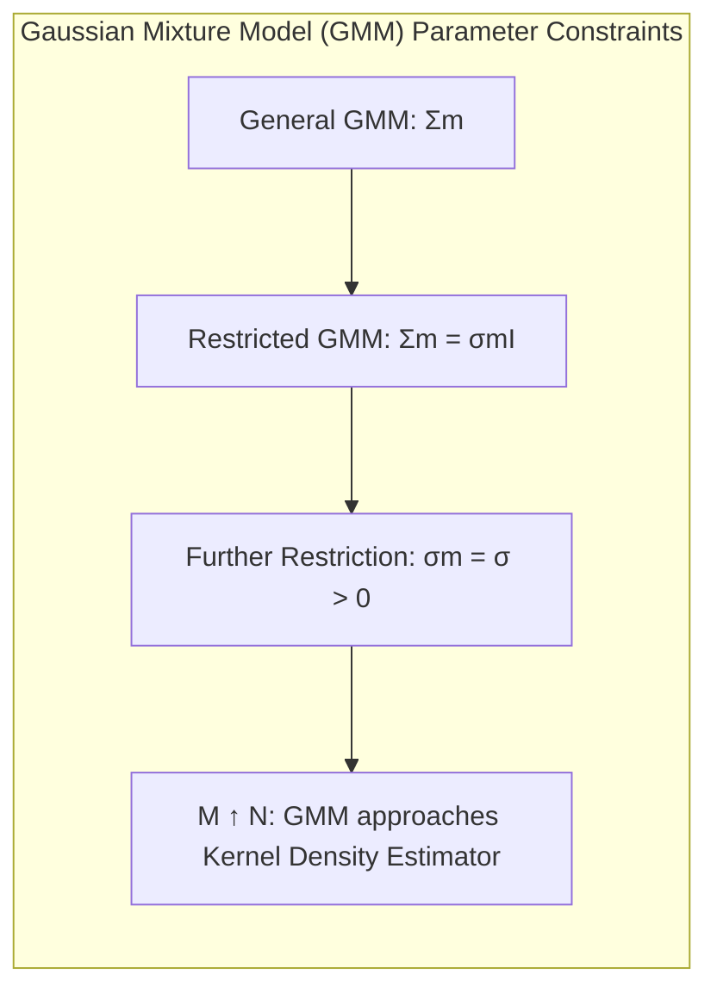
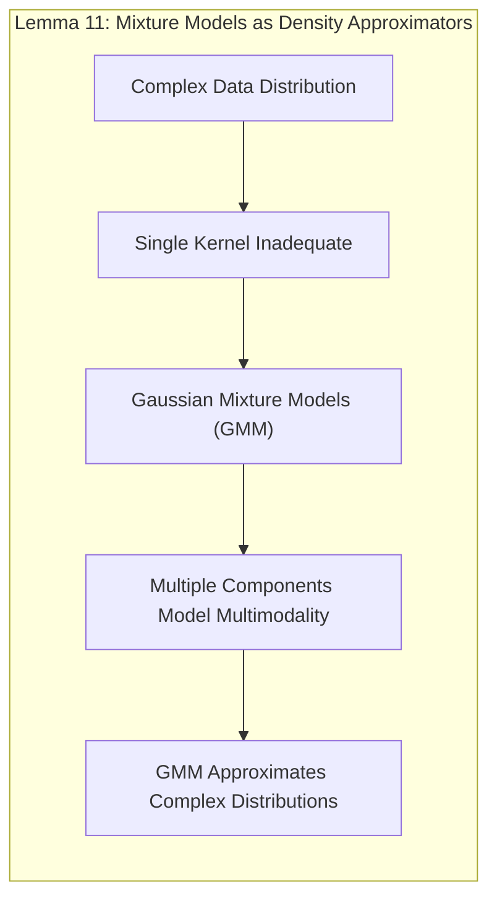
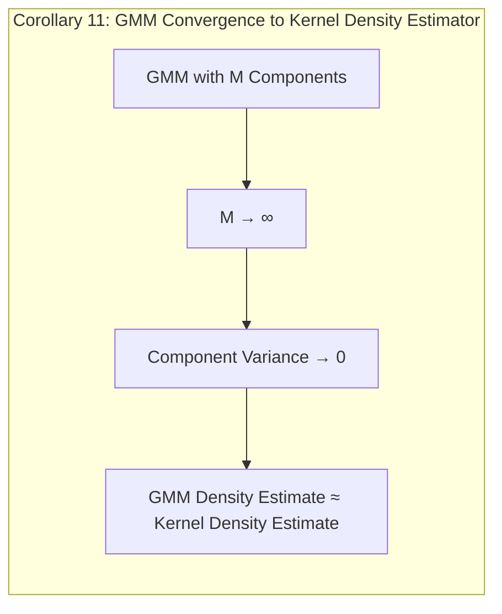
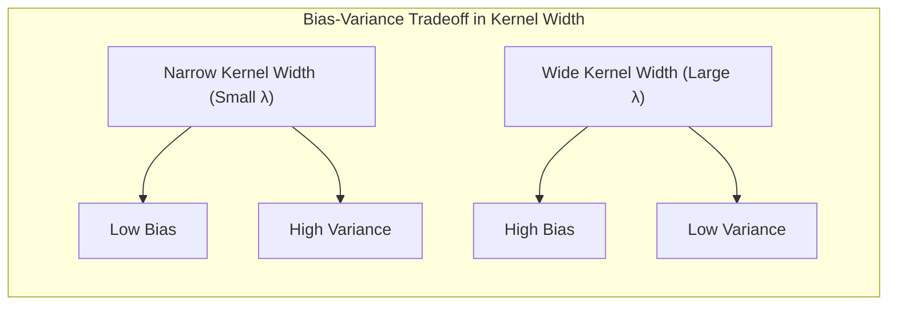
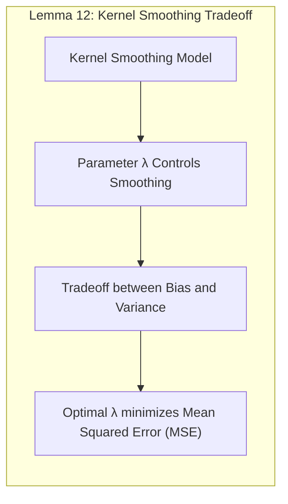
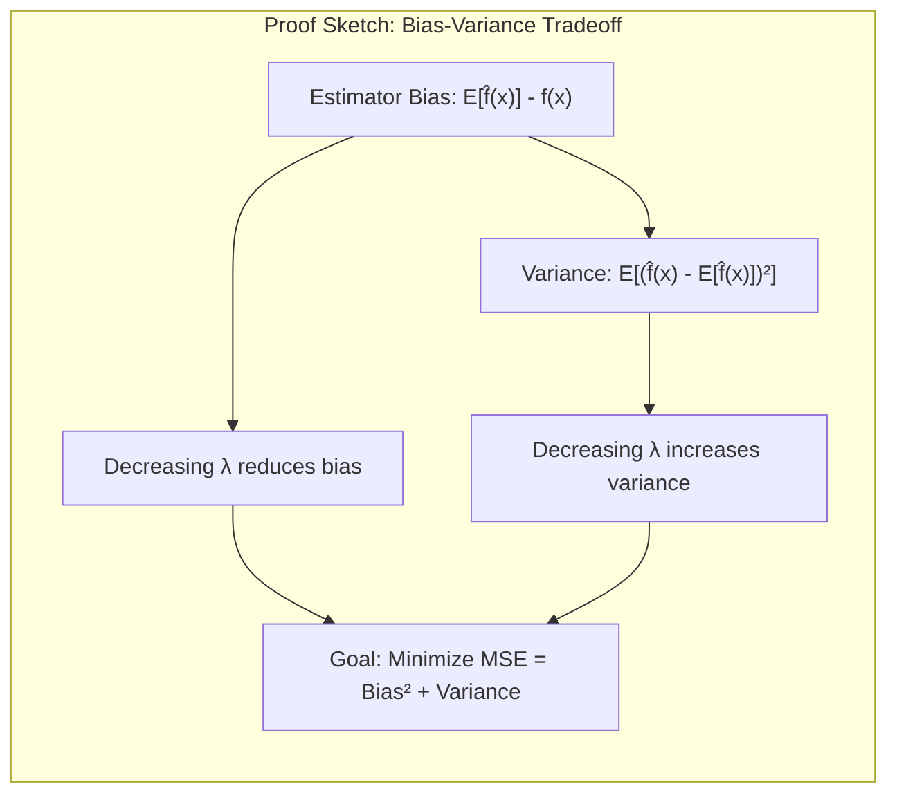
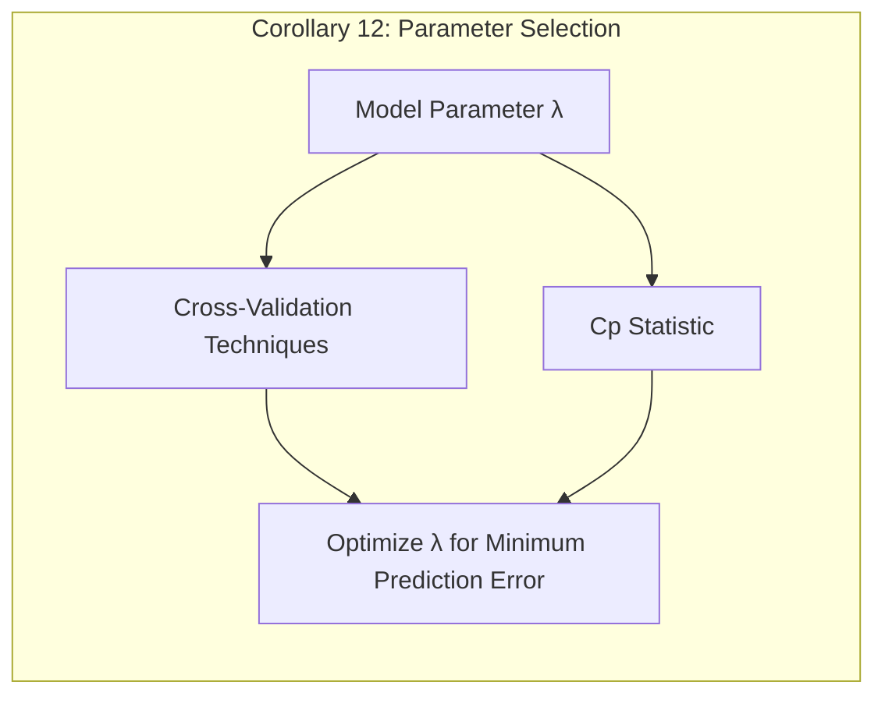
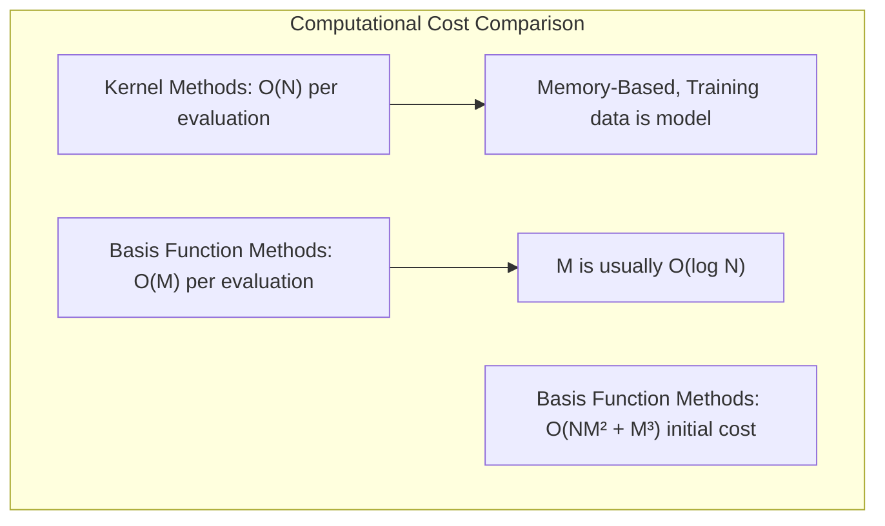
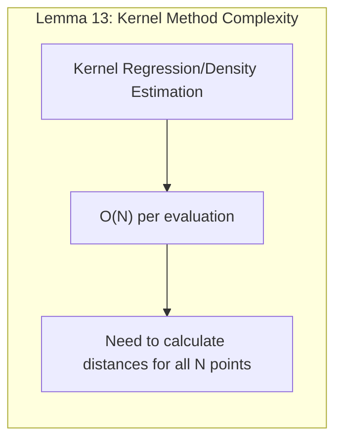
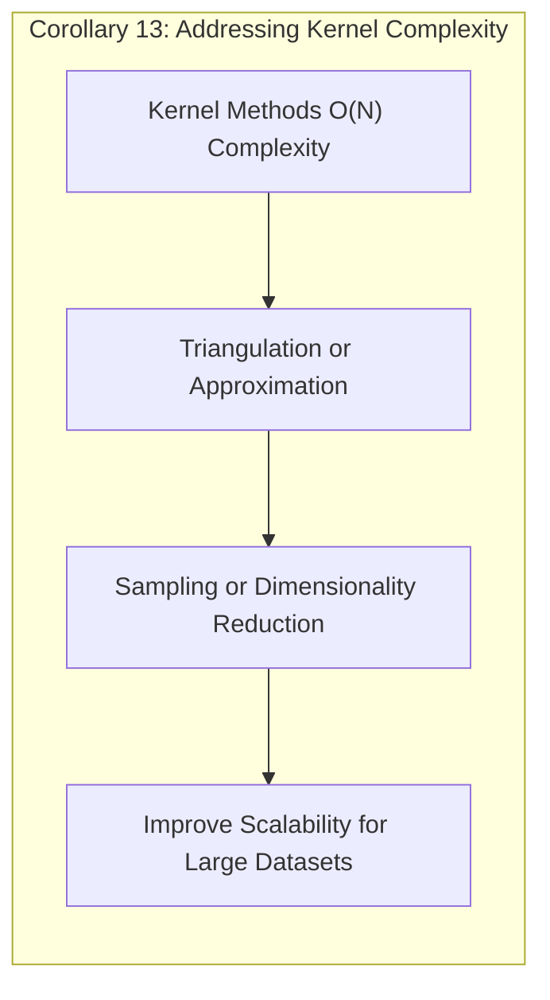

### Modelos de Mistura para Estimação de Densidade e Classificação (continuação)

* Se as matrizes de covariância forem restritas a serem escalares: $\Sigma_m = \sigma_m I$, então (6.32) tem a forma de uma expansão de base radial [^6.8].
* Se, adicionalmente, $\sigma_m = \sigma > 0$ for fixo, e $M \uparrow N$, então a estimativa de máxima verossimilhança para (6.32) se aproxima da estimativa de densidade kernel (6.22) onde $\hat{\alpha}_m = 1/N$ e $\mu_m = x_m$ [^6.8].



Usando o teorema de Bayes, densidades de mistura separadas em cada classe levam a modelos flexíveis para $P(G|X)$; isso é abordado em detalhes no Capítulo 12 [^6.8].

**Exemplo:** A aplicação de modelos de mistura aos dados de fatores de risco de doenças cardíacas ilustra como modelos de mistura Gaussianos podem ser usados para identificar subpopulações de pacientes com características distintas. A figura no contexto [^6.8] mostra histogramas de idade separados por grupo de doença e como um modelo de mistura de duas componentes ajustado a esses dados captura as duas subpopulações. É importante notar que o procedimento não usa conhecimento das etiquetas de CHD [^6.8].

O modelo de mistura também fornece uma estimativa da probabilidade de que a observação $i$ pertença ao componente $m$,

$$ \hat{r}_{im} = \frac{\alpha_m \phi(x_i; \mu_m, \Sigma_m)}{\sum_{k=1}^M \alpha_k \phi(x_i; \mu_k, \Sigma_k)}, $$

onde $x_i$ é a idade em nosso exemplo [^6.8]. Suponha que nós limiarizamos cada valor $\hat{r}_{i2}$ e, portanto, definamos $d_i = I(\hat{r}_{i2} > 0.5)$. Então podemos comparar a classificação de cada observação por CHD e o modelo de mistura:

|         |       Modelo de Mistura      |
|---------|-----------------------------|
|   CHD   |  $\delta = 0$  | $\delta = 1$|
|   Não    | 232       |     70      |
|   Sim    |  76       |      84     |

Embora o modelo de mistura não tenha usado os rótulos CHD, ele fez um bom trabalho ao descobrir as duas subpopulações CHD. A regressão logística linear, usando o CHD como resposta, atinge a mesma taxa de erro (32%) quando ajustada a esses dados usando máxima verossimilhança (Seção 4.4).

#### Pergunta Teórica Avançada: Relação entre Modelos de Mistura e Estimadores de Densidade Kernel

**Resposta:** Os modelos de mistura podem ser vistos como uma generalização dos estimadores de densidade kernel, oferecendo maior flexibilidade e interpretabilidade em algumas situações.

**Lemma 11:** *Modelos de mistura, especialmente modelos de mistura Gaussiana, podem ser utilizados para aproximar a distribuição de dados complexos, que podem não ser bem capturados por um único kernel*, conforme demonstrado pela capacidade de modelar distribuições multimodais através da combinação de componentes [^6.8].



**Corolário 11:** *Sob certas condições, como quando o número de componentes tende ao infinito e a variância de cada componente tende a zero, a estimativa de densidade através de modelos de mistura se aproxima da estimativa de densidade kernel*, o que sugere uma conexão fundamental entre as duas abordagens [^6.8].



> ⚠️ **Ponto Crucial:** Ao contrário dos estimadores de densidade kernel que geralmente requerem a escolha de um parâmetro de suavização (bandwidth), modelos de mistura oferecem um conjunto de parâmetros (médias, covariâncias, e proporções) que podem ser estimados diretamente dos dados, oferecendo maior flexibilidade e adaptabilidade [^6.8].

> 💡 **Exemplo Numérico:**
>
> Suponha que temos um conjunto de dados unidimensional com 100 pontos, onde dois grupos distintos parecem existir. Podemos modelar isso usando um modelo de mistura Gaussiana com duas componentes. Após o ajuste do modelo, obtemos os seguintes parâmetros:
>
> *   Componente 1: $\alpha_1 = 0.4$, $\mu_1 = 2$, $\sigma_1 = 1$
> *   Componente 2: $\alpha_2 = 0.6$, $\mu_2 = 8$, $\sigma_2 = 1.5$
>
> Agora, consideremos um ponto de dados $x_i = 5$. Podemos calcular a probabilidade de que esse ponto pertença a cada componente usando a fórmula de $\hat{r}_{im}$:
>
> Primeiro, calculamos as densidades Gaussianas para cada componente:
>
> $\phi(5; \mu_1=2, \sigma_1=1) = \frac{1}{\sqrt{2\pi}} e^{-\frac{(5-2)^2}{2}} \approx 0.044$
>
> $\phi(5; \mu_2=8, \sigma_2=1.5) = \frac{1}{1.5\sqrt{2\pi}} e^{-\frac{(5-8)^2}{2*1.5^2}} \approx 0.179$
>
> Agora, calculamos $\hat{r}_{i1}$ e $\hat{r}_{i2}$:
>
> $\hat{r}_{i1} = \frac{0.4 * 0.044}{0.4 * 0.044 + 0.6 * 0.179} \approx \frac{0.0176}{0.0176 + 0.1074} \approx 0.14$
>
> $\hat{r}_{i2} = \frac{0.6 * 0.179}{0.4 * 0.044 + 0.6 * 0.179} \approx \frac{0.1074}{0.0176 + 0.1074} \approx 0.86$
>
> Portanto, o ponto $x_i=5$ tem uma probabilidade de 0.14 de pertencer ao componente 1 e 0.86 de pertencer ao componente 2. Isso ilustra como o modelo de mistura atribui probabilidades de pertinência a cada componente.

### Selecionando a Largura do Kernel

Em cada um dos kernels $K_\lambda$, $\lambda$ é um parâmetro que controla sua largura:

*   Para o kernel Epanechnikov ou tri-cúbico com largura métrica, $\lambda$ é o raio da região de suporte [^6.2].
*   Para o kernel gaussiano, $\lambda$ é o desvio padrão [^6.2].
*   $\lambda$ é o número $k$ de vizinhos mais próximos nas vizinhanças k-mais próximas, muitas vezes expresso como uma fração ou extensão $k/N$ da amostra de treinamento total [^6.2].

Existe um trade-off natural entre viés e variância conforme mudamos a largura da janela de média, o que é mais explícito para médias locais [^6.2]:

*   Se a janela for estreita, $\hat{f}(x_0)$ é uma média de um pequeno número de $y_i$ próximos a $x_0$, e sua variância será relativamente grande - próxima à de um $y_i$ individual. O viés tende a ser pequeno, novamente, porque cada um dos $E(y_i) = f(x_i)$ deve estar próximo de $f(x_0)$ [^6.2].

*   Se a janela for larga, a variância de $\hat{f}(x_0)$ será pequena em relação à variância de qualquer $y_i$, por causa dos efeitos da média. O viés será maior, porque agora estamos usando observações $x_i$ mais distantes de $x_0$, e não há garantia de que $f(x_i)$ esteja próximo de $f(x_0)$ [^6.2].



Argumentos semelhantes se aplicam às estimativas de regressão local, digamos, linear local: à medida que a largura vai para zero, as estimativas se aproximam de uma função linear por partes que interpola os dados de treinamento; à medida que a largura se torna infinitamente grande, o ajuste se aproxima do ajuste global linear de mínimos quadrados aos dados [^6.2].

A discussão no Capítulo 5 sobre a seleção do parâmetro de regularização para suavização de splines se aplica aqui e não será repetida [^6.2]. Os suavizadores de regressão local são estimadores lineares; a matriz suavizadora em $\hat{f} = S_\lambda y$ é construída a partir dos kernels equivalentes (6.8) e tem a $ij$-ésima entrada $\{S_\lambda\}_{ij} = l_i(x_j)$. A validação cruzada *leave-one-out* é particularmente simples, assim como a validação cruzada generalizada, a estatística $C_p$ e a validação cruzada *k-fold*. Os graus de liberdade efetivos são novamente definidos como $trace(S_\lambda)$, e podem ser usados para calibrar a quantidade de suavização [^6.2].

**Exemplo:** A comparação de kernels equivalentes para uma spline de suavização e regressão linear local ilustra como o parâmetro de suavização afeta a forma das funções de ponderação. Ajustar o parâmetro de suavização para obter graus de liberdade efetivos semelhantes demonstra a relação entre os dois métodos, como descrito em [^6.2].

#### Pergunta Teórica Avançada: O Trade-Off Viés-Variância na Escolha da Largura do Kernel

**Resposta:** A seleção apropriada do parâmetro de largura do kernel ($\lambda$) é fundamental para equilibrar o viés e a variância do modelo, conforme descrito no contexto [^6.2]. A escolha de um valor muito pequeno para $\lambda$ resulta em um modelo com baixa variância, mas um alto viés, enquanto um valor muito alto resulta em um modelo com alto viés, mas baixa variância.

**Lemma 12:** *O trade-off entre viés e variância é uma característica fundamental dos modelos de suavização de kernel, e a escolha apropriada do parâmetro $\lambda$ é essencial para minimizar o erro quadrático médio do modelo*, conforme discutido em [^6.2].



**Prova do Lemma 12:** O viés de um estimador é definido como a diferença entre o valor esperado do estimador e o valor verdadeiro do parâmetro, enquanto a variância quantifica a sensibilidade do estimador a variações nos dados. Diminuir o $\lambda$ reduz o viés por meio do uso de apenas dados próximos à localização $x_0$ mas aumenta a variância, devido ao pequeno número de dados utilizados. Por outro lado, aumentar o $\lambda$ aumenta o viés por incluir dados distantes, mas reduz a variância devido à média de mais pontos. A escolha ideal de $\lambda$ é aquela que minimiza o erro quadrático médio, que é a soma do viés ao quadrado e da variância. $\blacksquare$



**Corolário 12:** *Métodos como validação cruzada e estatística $C_p$ podem ser utilizados para estimar o valor ótimo do parâmetro $\lambda$ minimizando o erro preditivo do modelo*, como discutido em [^6.2].



> ⚠️ **Ponto Crucial:** A escolha do parâmetro de suavização $\lambda$ não é trivial e depende do problema específico em questão e das características dos dados. A validação cruzada é uma ferramenta importante para otimizar este parâmetro e garantir uma boa generalização do modelo. [^6.2]

> 💡 **Exemplo Numérico:**
>
> Consideremos um problema de regressão com um único preditor $x$ e uma resposta $y$. Temos 100 pontos de dados e desejamos ajustar uma regressão local usando um kernel gaussiano. Vamos demonstrar o efeito da escolha de $\lambda$.
>
> 1.  **Pequeno $\lambda$ (e.g., $\lambda = 0.5$):**
>     *   O kernel gaussiano terá um pico estreito, atribuindo pesos altos apenas aos pontos muito próximos de $x_0$.
>     *   A estimativa $\hat{f}(x_0)$ será muito influenciada por pontos locais, resultando em alta variância (o modelo é sensível a pequenas mudanças nos dados) e baixo viés (o modelo se ajusta bem aos dados locais).
>
> 2.  **Grande $\lambda$ (e.g., $\lambda = 5$):**
>     *   O kernel gaussiano terá um pico largo, dando peso a muitos pontos, mesmo os mais distantes de $x_0$.
>     *   A estimativa $\hat{f}(x_0)$ será uma média de muitos pontos, resultando em baixa variância (o modelo é menos sensível a mudanças nos dados) e alto viés (o modelo pode não capturar detalhes importantes nos dados locais).
>
> Vamos simular alguns dados e calcular o MSE para diferentes $\lambda$:
>
> ```python
> import numpy as np
> import matplotlib.pyplot as plt
> from sklearn.neighbors import KernelDensity
> from sklearn.model_selection import train_test_split
> from sklearn.metrics import mean_squared_error
>
> # Simulate data
> np.random.seed(42)
> X = np.sort(5 * np.random.rand(100, 1), axis=0)
> y = np.sin(X).ravel() + np.random.randn(100) * 0.2
> X_train, X_test, y_train, y_test = train_test_split(X, y, test_size=0.2, random_state=42)
>
> lambdas = [0.1, 0.5, 1, 2, 5]
>
> fig, axes = plt.subplots(1, len(lambdas), figsize=(20, 5), sharey=True)
>
> for i, lam in enumerate(lambdas):
>   kde = KernelDensity(kernel='gaussian', bandwidth=lam).fit(X_train)
>   X_plot = np.linspace(0, 5, 200).reshape(-1, 1)
>   log_dens = kde.score_samples(X_plot)
>   y_pred = np.exp(log_dens)
>   mse = mean_squared_error(y_test, np.interp(X_test.flatten(), X_plot.flatten(), y_pred))
>
>   axes[i].plot(X_train, y_train, 'o', label='Training data')
>   axes[i].plot(X_plot, y_pred, '-', label=f'Kernel Density ($\lambda$={lam:.1f})')
>   axes[i].set_title(f'MSE: {mse:.3f}')
>   axes[i].legend()
>   axes[i].set_xlabel('x')
>   if i==0:
>     axes[i].set_ylabel('y')
>
> plt.show()
> ```
>
> O código acima gera um gráfico mostrando o efeito de diferentes valores de $\lambda$ na estimativa da densidade e calcula o MSE. Um pequeno $\lambda$ leva a um modelo com alta variância e um grande $\lambda$ leva a um modelo com maior viés. O valor ideal de $\lambda$ é aquele que minimiza o erro quadrático médio no conjunto de teste.

### Considerações Computacionais

A regressão kernel, local e a estimativa de densidade são métodos baseados em memória: o modelo é todo o conjunto de dados de treinamento, e o ajuste é feito no momento da avaliação ou predição [^6.9]. Para muitas aplicações em tempo real, isso pode tornar essa classe de métodos inviável.

O custo computacional para ajustar em uma única observação $x_0$ é $O(N)$ flops, exceto em casos simplificados (como kernels quadrados) [^6.9]. Em comparação, uma expansão em $M$ funções de base custa $O(M)$ para uma avaliação e, normalmente, $M \sim O(\log N)$. Métodos de função de base têm um custo inicial de pelo menos $O(NM^2 + M^3)$.



Os parâmetros de suavização $\lambda$ para métodos kernel são tipicamente determinados offline, por exemplo, usando validação cruzada, a um custo de $O(N^2)$ flops [^6.9]. Implementações populares de regressão local, como a função `loess` em S-PLUS e R e o procedimento `locfit` (Loader, 1999), usam esquemas de triangulação para reduzir os cálculos [^6.9]. Eles computam o ajuste exatamente em $M$ locais cuidadosamente escolhidos ($O(NM)$), e então usam técnicas de *blending* para interpolar o ajuste em outros lugares ($O(M)$ por avaliação).

**Pergunta Teórica Avançada:  Complexidade Computacional de Métodos Kernel**

**Resposta:** A complexidade computacional dos métodos kernel pode ser um fator limitante em algumas aplicações, especialmente com conjuntos de dados muito grandes.

**Lemma 13:** *A regressão local e a estimativa de densidade kernel exigem um custo computacional de O(N) para cada avaliação, devido à necessidade de calcular distâncias e pesos para todas as observações no conjunto de treinamento*, conforme discutido em [^6.9].



**Corolário 13:** *Embora métodos de triangulação e aproximação possam reduzir o custo computacional, a complexidade computacional dos métodos kernel ainda pode ser limitante em conjuntos de dados muito grandes, e métodos de amostragem ou outras técnicas de redução de dimensionalidade podem ser necessárias para lidar com a questão da escalabilidade*, como indicado em [^6.9].



> ⚠️ **Ponto Crucial:** É importante equilibrar a acurácia e a flexibilidade dos métodos kernel com suas limitações computacionais. Em muitos casos, o uso de aproximações e métodos de redução de dimensionalidade pode ser uma solução viável. [^6.9]

> 💡 **Exemplo Numérico:**
>
> Vamos ilustrar a complexidade computacional com um exemplo. Suponha que temos um conjunto de dados com $N = 1000$ amostras e queremos fazer uma predição em um novo ponto $x_0$ usando regressão kernel.
>
> 1.  **Regressão Kernel Padrão:**
>     *   Para cada predição em $x_0$, precisamos calcular a distância entre $x_0$ e todos os $N = 1000$ pontos de treinamento.
>     *   Em seguida, calculamos os pesos do kernel para cada um desses pontos.
>     *   Finalmente, calculamos a média ponderada das respostas correspondentes.
>     *   Isso resulta em uma complexidade de $O(N)$, que é $O(1000)$ neste caso.
>
> 2.  **Regressão com Expansão de Base:**
>     *   Suponha que usamos $M = 10$ funções de base.
>     *   O custo de avaliação de uma observação é $O(M)$, que é $O(10)$.
>     *   O custo inicial de ajuste é pelo menos $O(NM^2 + M^3)$.
>
>
>  | Método                     | Custo por Predição | Custo de Treinamento (Aproximado) |
>  | :------------------------- | :----------------- | :-------------------------------- |
>  | Regressão Kernel           | O(N) = O(1000)     | -                                |
>  | Expansão de Base           | O(M) = O(10)      | O(NM² + M³) = O(1000 * 10² + 10³) = O(101000) |
>
> Como podemos ver, o custo por predição para o método kernel é muito maior do que para um modelo de expansão de base, mas o custo de treinamento do último é muito maior. Para conjuntos de dados muito grandes, com $N$ na ordem de milhões, a complexidade de $O(N)$ para cada predição com regressão kernel pode se tornar computacionalmente proibitiva. Nesse caso, a triangulação ou métodos de aproximação se tornam necessários.

### Notas Bibliográficas

Existe uma vasta literatura sobre métodos kernel que não tentaremos resumir [^6.9]. Em vez disso, vamos apontar para algumas boas referências que, por si só, têm bibliografias extensas. Loader (1999) oferece excelente cobertura da regressão local e verossimilhança, e também descreve o software de última geração para ajustar esses modelos [^6.9]. Fan e Gijbels (1996) abordam esses modelos de um aspecto mais teórico. Hastie e Tibshirani (1990) discutem a regressão local no contexto da modelagem aditiva. Silverman (1986) oferece uma boa visão geral da estimativa de densidade, assim como Scott (1992) [^6.9].

### Exercícios

**Ex. 6.1** Mostre que a suavização kernel de Nadaraya-Watson com largura de banda métrica fixa $\lambda$ e um kernel Gaussiano é diferenciável. O que pode ser dito para o kernel Epanechnikov? O que pode ser dito para o kernel Epanechnikov com largura de banda adaptativa do vizinho mais próximo $\lambda(x_0)$?

**Ex. 6.2** Mostre que $\sum_{i=1}^N (x_i - x_0) l_i(x_0) = 0$ para regressão linear local. Defina $b_j(x_0) = \sum_{i=1}^N (x_i - x_0)^j l_i(x_0)$. Mostre que $b_0(x_0) = 1$ para regressão polinomial local de qualquer grau (incluindo constantes locais). Mostre que $b_j(x_0) = 0$ para todo $j \in \{1, 2, ..., k\}$ para regressão polinomial local de grau $k$. Quais são as implicações disso no viés?

**Ex. 6.3** Mostre que $||l(x)||$ (Seção 6.1.2) aumenta com o grau do polinômio local.

**Ex. 6.4** Suponha que os $p$ preditores $X$ surjam da amostragem de curvas analógicas relativamente suaves em valores de abscissa uniformemente espaçados. Denote por $Cov(X|Y) = \Sigma$ a matriz de covariância condicional dos preditores e assuma que isso não muda muito com $Y$. Discuta a natureza da escolha de Mahalanobis $A = \Sigma^{-1}$ para a métrica em (6.14). Como isso se compara com $A = I$? Como você construiria um kernel $A$ que (a) reduz os componentes de alta frequência na métrica de distância; (b) os ignora completamente?

**Ex. 6.5** Mostre que ajustar um modelo logit multinomial localmente constante da forma (6.19) equivale a suavizar os indicadores de resposta binária para cada classe separadamente usando um suavizador de kernel Nadaraya-Watson com pesos de kernel $K_\lambda(x_0, x_i)$.

**Ex. 6.6** Suponha que tudo o que você tem é o software para ajustar a regressão local, mas você pode especificar exatamente quais monômios estão incluídos no ajuste. Como você poderia usar esse software para ajustar um modelo de coeficiente variável em algumas das variáveis?

**Ex. 6.7** Derive uma expressão para a soma dos quadrados residuais da validação cruzada *leave-one-out* para regressão polinomial local.

**Ex. 6.8** Suponha que, para a resposta contínua $Y$ e o preditor $X$, modelamos a densidade conjunta de $X, Y$ usando um estimador de kernel gaussiano multivariado. Observe que o kernel neste caso seria o produto do kernel $\phi_\lambda(X)\phi_\lambda(Y)$. Mostre que a média condicional $E(Y|X)$ derivada desta estimativa é um estimador de Nadaraya-Watson. Estenda este resultado para classificação fornecendo um kernel adequado para a estimativa da distribuição conjunta de um $X$ contínuo e um $Y$ discreto.

**Ex. 6.9** Explore as diferenças entre o modelo Naive Bayes (6.27) e um modelo de regressão logística aditivo generalizado, em termos de (a) suposições do modelo e (b) estimativa. Se todas as variáveis $X_k$ são discretas, o que você pode dizer sobre o GAM correspondente?

**Ex. 6.10** Suponha que temos $N$ amostras geradas a partir do modelo $y_i = f(x_i) + \epsilon_i$, com $\epsilon_i$ independentes e identicamente distribuídas com média zero e variância $\sigma^2$, o $x_i$ assumido fixo (não aleatório). Estimamos $f$ usando um suavizador linear (regressão local, spline de suavização, etc.) com parâmetro de suavização $\lambda$. Assim, o vetor de valores ajustados é dado por $\hat{f} = S_\lambda y$. Considere o erro de previsão na amostra

$$ PE(\lambda) = \frac{1}{N} E \sum_{i=1}^N (y_i - \hat{f}(x_i))^2 $$

para prever novas respostas nos $N$ valores de entrada. Mostre que o resíduo médio ao quadrado nos dados de treinamento, ASR($\lambda$), é uma estimativa tendenciosa (otimista) para $PE(\lambda)$, enquanto

$$ C_\lambda = ASR(\lambda) + \frac{2\sigma^2}{N} trace(S_\lambda) $$

é não tendencioso.

**Ex. 6.11** Mostre que para o modelo de mistura gaussiano (6.32) a verossimilhança é maximizada em $+\infty$, e descreva como.

**Ex. 6.12** Escreva um programa de computador para realizar uma análise discriminante linear local. Em cada ponto de consulta $x_0$, os dados de treinamento recebem pesos $K_\lambda(x_0, x_i)$ de um kernel de ponderação e os ingredientes para as fronteiras de decisão linear (ver Seção 4.3) são calculados por médias ponderadas. Teste seu programa nos dados de CEP e mostre os erros de treinamento e teste para uma série de cinco valores pré-selecionados de $\lambda$. Os dados do CEP estão disponíveis no site do livro www-stat.stanford.edu/ElemStatLearn.

### Footnotes

[^6.1]: "In this chapter we describe a class of regression techniques that achieve flexibility in estimating the regression function f(X) over the domain IR by fitting a different but simple model separately at each query point xo."

[^6.2]: "In each of the kernels Κλ, λ is a parameter that controls its width"

[^6.3]: "Kernel smoothing and local regression generalize very naturally to two or more dimensions."

[^6.4.1]: "One line of approach is to modify the kernel."

[^6.4.2]: "We are trying to fit a regression function E(Y|X) = f(X1, X2, ..., Xp) in IR", in which every level of interaction is potentially present."

[^6.5]: "The concept of local regression and varying coefficient models is extremely broad: any parametric model can be made local if the fitting method accommodates observation weights."

[^6.6]: "Kernel density estimation is an unsupervised learning procedure, which historically precedes kernel regression."

[^6.6.1]: "Suppose we have a random sample x1,...,xN drawn from a probability density fx(x), and we wish to estimate fx at a point x0."

[^6.6.2]: "One can use nonparametric density estimates for classification in a straightforward fashion using Bayes’ theorem."

[^6.6.3]: "This is a technique that has remained popular over the years, despite its name (also known as “Idiot's Bayes"!)"

[^6.7]: "In Chapter 5, functions are represented as expansions in basis functions: f(x) = ∑j=1M βjhj(x)"

[^6.8]: "The mixture model is a useful tool for density estimation, and can be viewed as a kind of kernel method."

[^6.9]: "Kernel and local regression and density estimation are memory-based methods: the model is the entire training data set, and the fitting is done at evaluation or prediction time."
