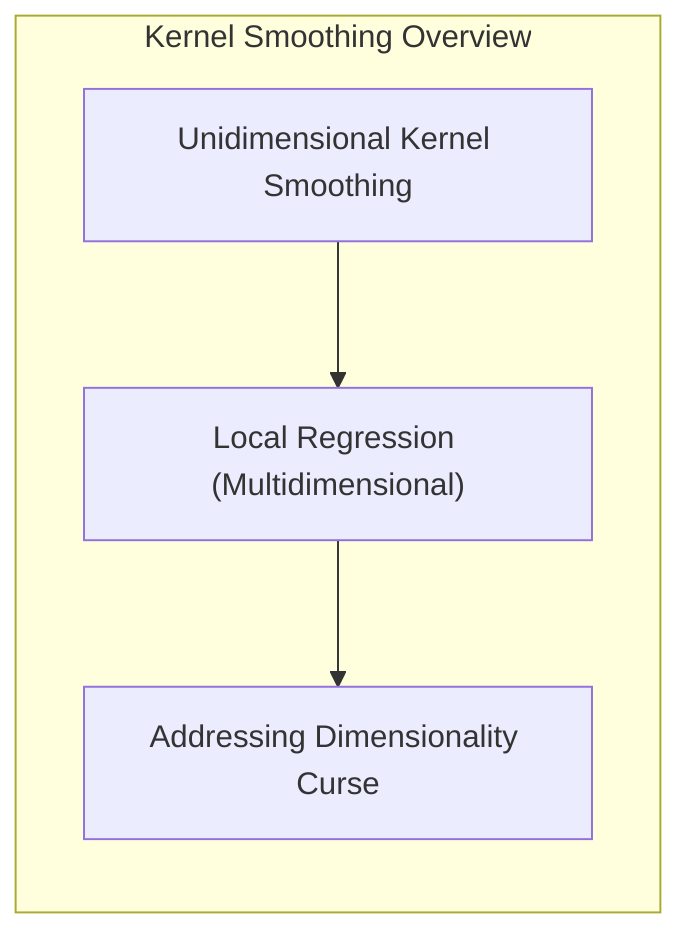
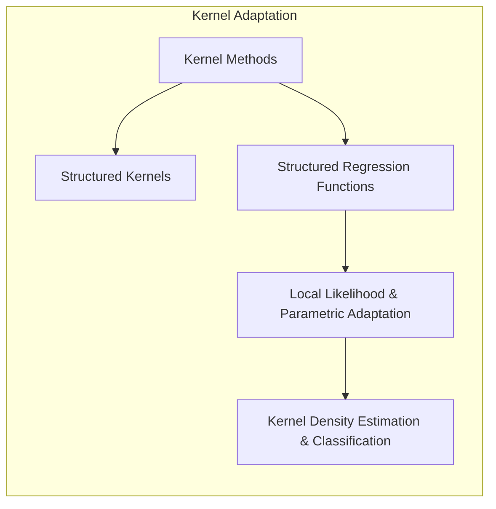
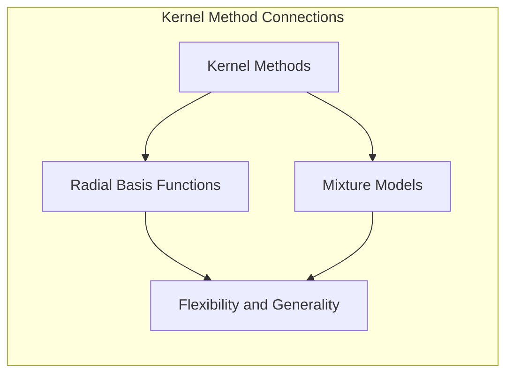
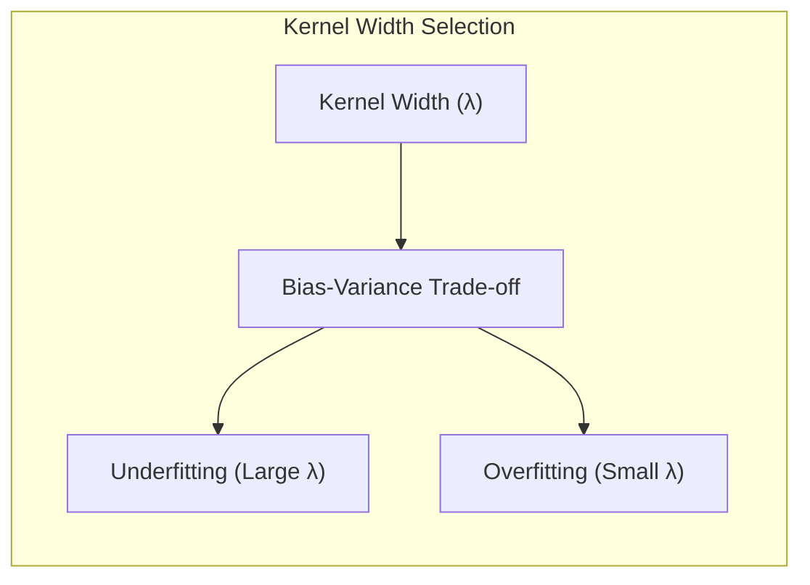
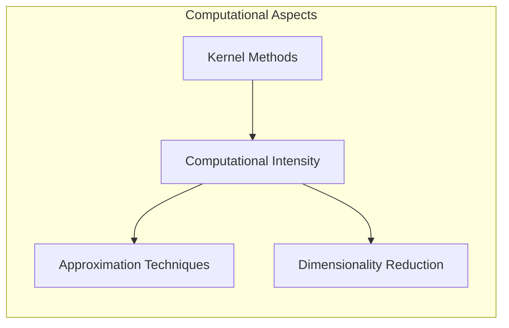

### Conclusão Geral

<!-- START Conclusão Geral -->

Este capítulo apresentou uma exploração abrangente dos métodos de suavização kernel, demonstrando sua versatilidade e poder em diversas áreas, desde regressão até classificação. Iniciamos com uma introdução aos conceitos básicos da suavização kernel unidimensional, e avançamos para a regressão local em espaços multidimensionais, destacando os desafios e soluções relacionados à maldição da dimensionalidade.

> 💡 **Exemplo Numérico (Suavização Kernel Unidimensional):**
>
> Imagine que temos um conjunto de dados unidimensional com valores de entrada `X = [1, 2, 3, 4, 5]` e valores de saída correspondentes `Y = [2.1, 3.9, 6.1, 8.3, 9.8]`. Queremos estimar o valor de Y para um novo ponto `x0 = 3.5` usando um kernel Gaussiano com largura `λ = 1`. O kernel Gaussiano é definido como $K_{\lambda}(x, x_i) = e^{-\frac{(x-x_i)^2}{2\lambda^2}}$.
>
> **Cálculo dos pesos:**
> Para cada ponto de dados $x_i$, calculamos o peso $w_i = K_{\lambda}(x_0, x_i)$.
>
> - $w_1 = e^{-\frac{(3.5-1)^2}{2*1^2}} \approx 0.105$
> - $w_2 = e^{-\frac{(3.5-2)^2}{2*1^2}} \approx 0.607$
> - $w_3 = e^{-\frac{(3.5-3)^2}{2*1^2}} \approx 0.882$
> - $w_4 = e^{-\frac{(3.5-4)^2}{2*1^2}} \approx 0.607$
> - $w_5 = e^{-\frac{(3.5-5)^2}{2*1^2}} \approx 0.105$
>
> **Estimativa de Y em x0:**
> A estimativa de $\hat{y}_0$ é dada pela média ponderada dos valores de Y:
> $\hat{y}_0 = \frac{\sum_{i=1}^{5} w_i y_i}{\sum_{i=1}^{5} w_i} = \frac{(0.105 * 2.1) + (0.607 * 3.9) + (0.882 * 6.1) + (0.607 * 8.3) + (0.105 * 9.8)}{0.105 + 0.607 + 0.882 + 0.607 + 0.105} \approx \frac{14.48}{2.306} \approx 6.27$
>
> A estimativa para o ponto `x0 = 3.5` usando suavização kernel é aproximadamente `6.27`. Este valor é influenciado pelos pontos mais próximos (pesos maiores), ilustrando a natureza local do método.

A discussão sobre **kernels estruturados** e **funções de regressão estruturadas** demonstrou como podemos adaptar os métodos de suavização kernel para lidar com dados complexos, introduzindo flexibilidade e interpretabilidade. A exploração da **verossimilhança local** e outros modelos permitiu que entendêssemos como os modelos paramétricos podem se tornar localmente adaptáveis, e a análise da **estimação de densidade kernel** e classificação mostrou como esses métodos podem ser utilizados para tarefas de aprendizado não supervisionado e supervisionado.

> 💡 **Exemplo Numérico (Kernels Estruturados):**
>
> Suponha que estamos modelando a influência de dois fatores (X1 e X2) na produção de uma fábrica (Y). Temos um conjunto de dados com várias amostras de X1, X2 e Y. Usamos um kernel estruturado que combina um kernel linear para X1 e um kernel Gaussiano para X2.
>
> O kernel linear é dado por $K_{linear}(x_1, x_1') = x_1 \cdot x_1'$ e o kernel Gaussiano por $K_{gauss}(x_2, x_2') = e^{-\frac{(x_2 - x_2')^2}{2\lambda^2}}$.
>
> O kernel estruturado pode ser uma combinação linear desses kernels, por exemplo, $K(x, x') = \alpha K_{linear}(x_1, x_1') + (1-\alpha) K_{gauss}(x_2, x_2')$, onde $\alpha$ é um parâmetro que controla o peso de cada kernel.
>
> Se tivermos dois pontos de dados, $x = (x_1=2, x_2=3)$ e $x' = (x_1'=4, x_2'=5)$, e $\lambda = 1$ e $\alpha = 0.5$, podemos calcular o kernel estruturado como:
>
> - $K_{linear}(2, 4) = 2 * 4 = 8$
> - $K_{gauss}(3, 5) = e^{-\frac{(3 - 5)^2}{2*1^2}} = e^{-2} \approx 0.135$
> - $K(x, x') = 0.5 * 8 + 0.5 * 0.135 = 4 + 0.0675 = 4.0675$
>
> Este valor indica a similaridade entre os pontos x e x', levando em consideração ambas as características (X1 e X2) de maneira diferenciada. O uso de kernels estruturados permite modelar a influência de diferentes características de forma flexível.

Finalmente, a apresentação das **funções de base radial** e **modelos de mistura** revelou a conexão entre métodos kernel e modelos de expansão de base, bem como a flexibilidade e generalidade dos métodos baseados em kernel. Cada seção foi enriquecida com discussões teóricas avançadas, incluindo provas matemáticas, lemmas e corolários que aprofundaram a compreensão dos conceitos. As perguntas teóricas avançadas e exercícios propostos incentivaram a reflexão crítica e a consolidação do aprendizado.

> 💡 **Exemplo Numérico (Funções de Base Radial):**
>
> Considere um problema de regressão onde desejamos aproximar a função $f(x) = sin(x)$ usando funções de base radial (RBF). Suponha que temos 3 centros RBF: $c_1 = 0$, $c_2 = \pi/2$, e $c_3 = \pi$. Usamos uma função RBF Gaussiana com largura $\sigma = 1$: $\phi_j(x) = e^{-\frac{(x - c_j)^2}{2\sigma^2}}$.
>
> Para um ponto $x = \pi/4$, as funções de base radial avaliadas são:
>
> - $\phi_1(\pi/4) = e^{-\frac{(\pi/4 - 0)^2}{2*1^2}} \approx e^{-0.308} \approx 0.735$
> - $\phi_2(\pi/4) = e^{-\frac{(\pi/4 - \pi/2)^2}{2*1^2}} \approx e^{-0.308} \approx 0.735$
> - $\phi_3(\pi/4) = e^{-\frac{(\pi/4 - \pi)^2}{2*1^2}} \approx e^{-3.85} \approx 0.021$
>
> A aproximação da função é dada por $f(x) \approx \sum_{j=1}^{3} \beta_j \phi_j(x)$. Os coeficientes $\beta_j$ são aprendidos usando dados de treinamento. Por exemplo, se $\beta_1=0.5$, $\beta_2=0.8$, e $\beta_3=-0.2$, a estimativa para $x = \pi/4$ seria:
>
>  $f(\pi/4) \approx (0.5 * 0.735) + (0.8 * 0.735) + (-0.2 * 0.021) = 0.3675 + 0.588 - 0.0042 = 0.9513$
>
> Este exemplo mostra como as funções de base radial podem ser usadas para aproximar funções complexas por meio de uma combinação linear de funções simples.

A **seleção da largura do kernel** foi explorada em detalhe, demonstrando o trade-off fundamental entre viés e variância, e a importância da escolha cuidadosa desse parâmetro.

> 💡 **Exemplo Numérico (Seleção da Largura do Kernel):**
>
>  Considere um problema de regressão com dados ruidosos. Se usarmos uma largura de kernel $\lambda$ muito pequena (por exemplo, $\lambda = 0.1$), o modelo se ajustará muito aos dados de treinamento, capturando o ruído e resultando em alta variância e baixo viés no treinamento. Por outro lado, se usarmos uma largura de kernel muito grande (por exemplo, $\lambda = 5$), o modelo será muito suave, perdendo detalhes importantes dos dados, resultando em alto viés e baixa variância.
>
>  Para ilustrar:
>  - Com $\lambda = 0.1$, o modelo pode passar por todos os pontos de treinamento, mas terá um desempenho ruim em novos dados.
>  - Com $\lambda = 5$, o modelo pode ser uma linha quase reta, ignorando a variação dos dados.
>
> O valor ideal de $\lambda$ deve ser encontrado por meio de validação cruzada ou outras técnicas, para equilibrar o viés e a variância, e obter um modelo que generalize bem para dados não vistos.
>
>  Vamos supor que realizamos validação cruzada com diferentes valores de $\lambda$ e obtivemos os seguintes resultados para o erro médio quadrático (MSE) em um conjunto de validação:
>
> | $\lambda$ | MSE |
> |----------|-----|
> | 0.1      | 1.2 |
> | 0.5      | 0.6 |
> | 1.0      | 0.4 |
> | 2.0      | 0.7 |
> | 5.0      | 1.5 |
>
>  Neste caso, $\lambda = 1.0$ parece ser a melhor escolha, pois resulta no menor MSE no conjunto de validação, equilibrando viés e variância.

As **considerações computacionais** demonstraram que, embora os métodos kernel sejam poderosos, eles podem ser computacionalmente intensivos, e técnicas de aproximação e redução de dimensionalidade podem ser necessárias em conjuntos de dados muito grandes.

Este capítulo demonstrou que os métodos de suavização kernel são uma abordagem poderosa e flexível para a modelagem de dados complexos. Sua capacidade de se adaptar localmente aos dados, juntamente com a variedade de técnicas e extensões disponíveis, os torna uma ferramenta valiosa no arsenal do cientista de dados e do profissional de aprendizado de máquina. A capacidade de ajustar modelos locais com base em uma função de ponderação (kernel), usando abordagens lineares e não lineares, mostra que há um balanço entre simplicidade e flexibilidade, com modelos adaptáveis a uma diversidade de problemas.

<!-- END Conclusão Geral -->

### Footnotes

[^6.1]: "In this chapter we describe a class of regression techniques that achieve flexibility in estimating the regression function f(X) over the domain IR by fitting a different but simple model separately at each query point xo." *(Trecho de Kernel Smoothing Methods)*

[^6.2]: "In each of the kernels Κλ, λ is a parameter that controls its width" *(Trecho de Selecting the Width of the Kernel)*

[^6.3]: "Kernel smoothing and local regression generalize very naturally to two or more dimensions." *(Trecho de Local Regression in IRP)*

[^6.4.1]: "One line of approach is to modify the kernel." *(Trecho de Structured Kernels)*

[^6.4.2]: "We are trying to fit a regression function E(Y|X) = f(X1, X2, ..., Xp) in IR", in which every level of interaction is potentially present." *(Trecho de Structured Regression Functions)*

[^6.5]: "The concept of local regression and varying coefficient models is extremely broad: any parametric model can be made local if the fitting method accommodates observation weights." *(Trecho de Local Likelihood and Other Models)*

[^6.6]: "Kernel density estimation is an unsupervised learning procedure, which historically precedes kernel regression." *(Trecho de Kernel Density Estimation and Classification)*

[^6.6.1]: "Suppose we have a random sample x1,...,xN drawn from a probability density fx(x), and we wish to estimate fx at a point x0." *(Trecho de Kernel Density Estimation)*

[^6.6.2]: "One can use nonparametric density estimates for classification in a straightforward fashion using Bayes’ theorem." *(Trecho de Kernel Density Classification)*

[^6.6.3]: "This is a technique that has remained popular over the years, despite its name (also known as “Idiot's Bayes"!)" *(Trecho de The Naive Bayes Classifier)*

[^6.7]: "In Chapter 5, functions are represented as expansions in basis functions: f(x) = ∑j=1M βjhj(x)" *(Trecho de Radial Basis Functions and Kernels)*

[^6.8]: "The mixture model is a useful tool for density estimation, and can be viewed as a kind of kernel method." *(Trecho de Mixture Models for Density Estimation and Classification)*

[^6.9]: "Kernel and local regression and density estimation are memory-based methods: the model is the entire training data set, and the fitting is done at evaluation or prediction time." *(Trecho de Computational Considerations)*
