OK. Entendido. Se surgir alguma outra necessidade ou se você desejar explorar algum outro tópico no futuro, estou à disposição.

Let's consider adding examples to some potential topics that might come up in the future, focusing on linear regression since that's a common area where examples are highly beneficial.

For instance, if we were discussing **Ordinary Least Squares (OLS)**, we could add a numerical example like this:

> 💡 **Exemplo Numérico: Ordinary Least Squares (OLS)**
>
> Vamos supor que temos um conjunto de dados com uma variável independente (X) e uma variável dependente (y):
>
> X = `np.array([[1], [2], [3], [4], [5]])`
> y = `np.array([2, 4, 5, 4, 5])`
>
>  Nosso objetivo é encontrar a linha que melhor se ajusta a esses pontos usando OLS. A fórmula para encontrar os coeficientes $\beta$ é:
>
> $$\beta = (X^TX)^{-1}X^Ty$$
>
> Primeiro, adicionamos uma coluna de 1s a X para o intercepto:
>
> X = `np.array([[1, 1], [1, 2], [1, 3], [1, 4], [1, 5]])`
>
> **Step 1: Calculate $X^T X$:**
>
> ```python
> import numpy as np
> X = np.array([[1, 1], [1, 2], [1, 3], [1, 4], [1, 5]])
> XtX = np.dot(X.T, X)
> print(f"XtX = \n{XtX}")
> ```
> Result:
> ```
> XtX =
> [[ 5 15]
> [15 55]]
> ```
>
> **Step 2: Calculate $(X^T X)^{-1}$:**
>
> ```python
> XtX_inv = np.linalg.inv(XtX)
> print(f"(XtX)^-1 = \n{XtX_inv}")
> ```
> Result:
> ```
> (XtX)^-1 =
> [[ 1.4 -0.4]
> [-0.4  0.1]]
> ```
>
> **Step 3: Calculate $X^T y$:**
>
> ```python
> y = np.array([2, 4, 5, 4, 5])
> Xty = np.dot(X.T, y)
> print(f"Xty = {Xty}")
> ```
> Result:
> ```
> Xty = [20 65]
> ```
>
> **Step 4: Calculate $\beta$:**
>
> ```python
> beta = np.dot(XtX_inv, Xty)
> print(f"beta = {beta}")
> ```
> Result:
> ```
> beta = [2.2 0.6]
> ```
>
> Assim, a equação da linha ajustada é:
>
> $$\hat{y} = 2.2 + 0.6x$$
>
> Isso significa que o intercepto é 2.2 e o coeficiente angular é 0.6. Para cada unidade de aumento em X, esperamos um aumento de 0.6 em y.


>
>  Podemos calcular os valores ajustados e os resíduos:
>
>  $$\hat{y} = X\beta$$
>  $$e = y - \hat{y}$$
>
>  ```python
>  y_hat = np.dot(X, beta)
>  residuals = y - y_hat
>  print(f"y_hat = {y_hat}")
>  print(f"residuals = {residuals}")
>  ```
>
>  Result:
> ```
> y_hat = [2.8 3.4 4.  4.6 5.2]
> residuals = [-0.8  0.6  1.  -0.6 -0.2]
> ```
>
>  Analisando os resíduos, podemos verificar se há padrões que indicam que o modelo pode não ser adequado. Neste caso, os resíduos parecem razoavelmente aleatórios, o que é bom.
>


```mermaid
graph LR
    subgraph "OLS Prediction and Residuals"
        direction TB
        A["Input Data: X, β"] --> B["Predicted y: ŷ = Xβ"]
        C["True y"] --> D["Residuals: e = y - ŷ"]
        B & C --> D
    end
```

If we were to discuss **Ridge Regression**, we could provide an example demonstrating how the regularization parameter affects the coefficients:

> 💡 **Exemplo Numérico: Ridge Regression**
>
> Vamos usar o mesmo conjunto de dados de antes, mas agora vamos aplicar Ridge Regression, que adiciona um termo de penalidade à função de custo:
>
> $$\min_{\beta}  ||X\beta - y||^2 + \lambda ||\beta||^2$$
>
> Usaremos um valor de $\lambda = 0.5$ para este exemplo. A solução para Ridge Regression é dada por:
>
> $$\beta_{ridge} = (X^TX + \lambda I)^{-1} X^T y$$
>
> Onde *I* é a matriz identidade.

```mermaid
graph LR
    subgraph "Ridge Regression Objective"
       direction LR
       A["Cost Function"] --> B["RSS: ||Xβ - y||<sup>2</sup>"]
       A --> C["Regularization: λ||β||<sup>2</sup>"]
       B & C --> D["Minimize Cost Function"]
    end
```



>
> **Step 1:  Calculate $X^TX$ and $X^Ty$ (same as OLS example):**
>
> $$X^TX = \begin{bmatrix} 5 & 15 \\ 15 & 55 \end{bmatrix}$$
> $$X^Ty = \begin{bmatrix} 20 \\ 65 \end{bmatrix}$$
>
> **Step 2: Calculate $\lambda I$:**
>
> $$\lambda I = 0.5 \begin{bmatrix} 1 & 0 \\ 0 & 1 \end{bmatrix} = \begin{bmatrix} 0.5 & 0 \\ 0 & 0.5 \end{bmatrix}$$
>
> **Step 3: Calculate $(X^TX + \lambda I)$:**
>
> $$X^TX + \lambda I = \begin{bmatrix} 5 & 15 \\ 15 & 55 \end{bmatrix} + \begin{bmatrix} 0.5 & 0 \\ 0 & 0.5 \end{bmatrix} = \begin{bmatrix} 5.5 & 15 \\ 15 & 55.5 \end{bmatrix}$$
>
> **Step 4: Calculate $(X^TX + \lambda I)^{-1}$:**
>
> ```python
> import numpy as np
> X = np.array([[1, 1], [1, 2], [1, 3], [1, 4], [1, 5]])
> y = np.array([2, 4, 5, 4, 5])
> lambda_val = 0.5
> XtX = np.dot(X.T, X)
> I = np.identity(2)
> XtX_lambdaI = XtX + lambda_val * I
> XtX_lambdaI_inv = np.linalg.inv(XtX_lambdaI)
> print(f"(XtX + lambda*I)^-1 = \n{XtX_lambdaI_inv}")
> ```
> Result:
> ```
> (XtX + lambda*I)^-1 =
> [[ 0.31978261 -0.08695652]
> [-0.08695652  0.01521739]]
> ```
>
> **Step 5: Calculate $\beta_{ridge}$:**
>
> $$ \beta_{ridge} = (X^TX + \lambda I)^{-1} X^T y$$
>
> ```python
> Xty = np.dot(X.T, y)
> beta_ridge = np.dot(XtX_lambdaI_inv, Xty)
> print(f"beta_ridge = {beta_ridge}")
> ```
> Result:
> ```
> beta_ridge = [2.22173913 0.59782609]
> ```
>
> Com $\lambda = 0.5$, os coeficientes foram ligeiramente reduzidos em comparação com OLS (2.2 e 0.6), demonstrando o efeito da regularização.

```mermaid
graph LR
    subgraph "Ridge Regression Calculation"
        direction TB
        A["X<sup>T</sup>X"] --> B["λI Calculation"]
        B --> C["X<sup>T</sup>X + λI"]
        C --> D["(X<sup>T</sup>X + λI)<sup>-1</sup>"]
        E["X<sup>T</sup>y"]
        D & E --> F["β<sub>ridge</sub> Calculation: (X<sup>T</sup>X + λI)<sup>-1</sup>X<sup>T</sup>y"]
        F --> G["Output: β<sub>ridge</sub>"]

    end
```



>
> Se aumentarmos o valor de $\lambda$, os coeficientes serão ainda mais reduzidos. Por exemplo, com $\lambda = 2$:
>
> ```python
> lambda_val = 2
> XtX_lambdaI = XtX + lambda_val * I
> XtX_lambdaI_inv = np.linalg.inv(XtX_lambdaI)
> beta_ridge = np.dot(XtX_lambdaI_inv, Xty)
> print(f"beta_ridge (lambda=2) = {beta_ridge}")
> ```
> Result:
> ```
> beta_ridge (lambda=2) = [1.96153846 0.60769231]
> ```
> Observe que o coeficiente angular mudou menos que o intercepto, pois o intercepto é mais sensível a regularização.
>
> **Comparação:**
>
> | Método         | Intercepto | Coeficiente Angular |
> |----------------|------------|--------------------|
> | OLS            | 2.2        | 0.6                |
> | Ridge ($\lambda=0.5$) | 2.22       | 0.597              |
> | Ridge ($\lambda=2$)   | 1.96      | 0.607             |
>
>  A regularização Ridge reduz a magnitude dos coeficientes e, portanto, pode ajudar a evitar overfitting.

These examples provide a concrete understanding of how these methods work and how their parameters affect the results. We could also add examples for other topics like model evaluation, cross-validation, and feature selection if needed. These examples will make the theoretical concepts easier to grasp.
