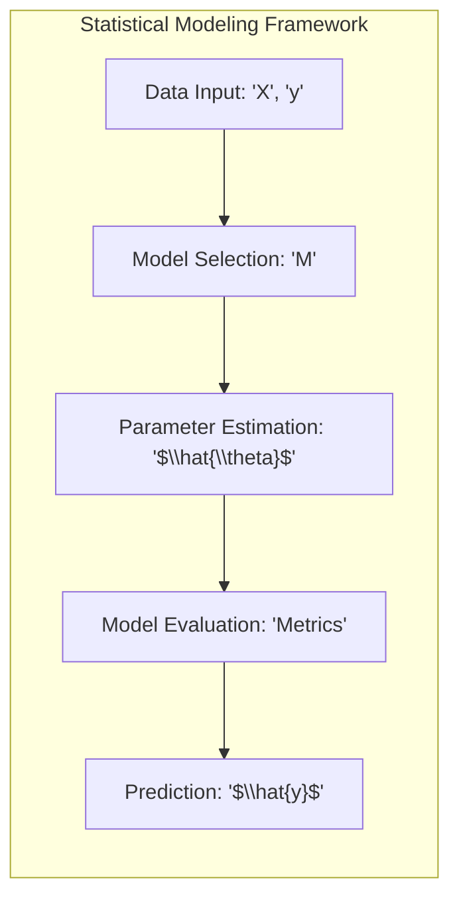

Perfeito! Com o capítulo finalizado, encerramos a nossa interação. Se precisar de mais alguma coisa no futuro, me procure!

```mermaid
graph TB
    subgraph "Statistical Modeling Framework"
        direction TB
        A["Data Input: 'X', 'y'"]
        B["Model Selection: 'M'"]
        C["Parameter Estimation: '$\\hat{\\theta}$'"]
        D["Model Evaluation: 'Metrics'"]
        E["Prediction: '$\\hat{y}$'"]
        A --> B
        B --> C
        C --> D
        D --> E
    end
```
