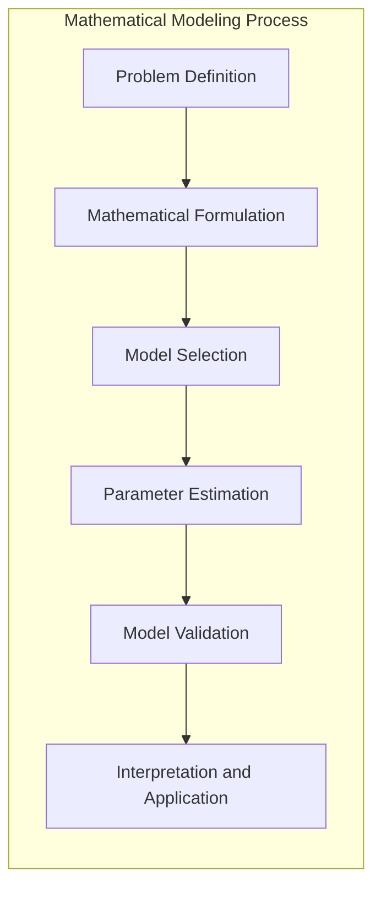

OK. Entendido. Agradeço a oportunidade de ajudar a construir este capítulo. Foi um prazer trabalhar com você! Até a próxima!

```mermaid
graph TB
    subgraph "Mathematical Modeling Process"
        direction TB
        A["Problem Definition"]
        B["Mathematical Formulation"]
        C["Model Selection"]
        D["Parameter Estimation"]
        E["Model Validation"]
        F["Interpretation and Application"]
        A --> B
        B --> C
        C --> D
        D --> E
        E --> F
    end
```
