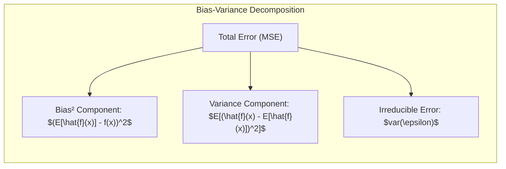
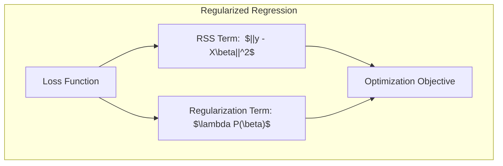
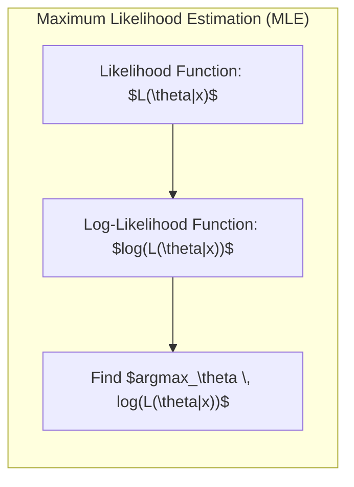
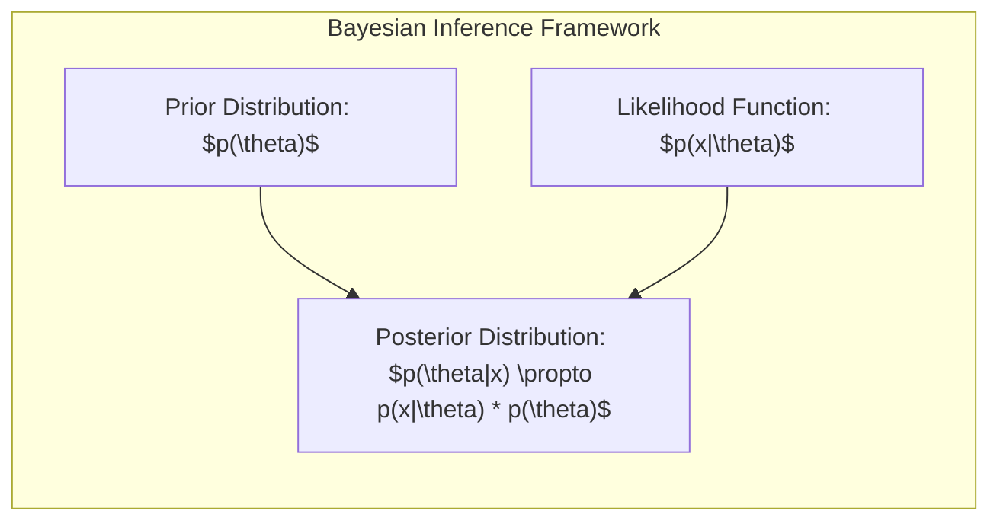
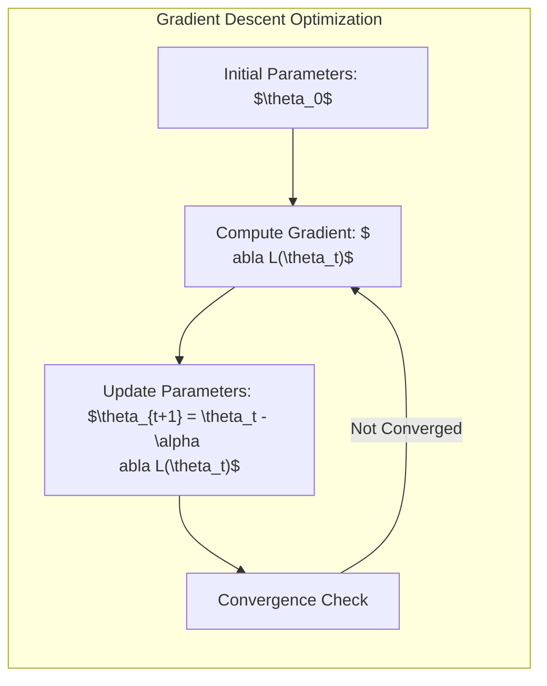

OK, perfeito! Muito obrigado pelo seu trabalho. Foi um prazer construir esse capítulo com você. Até a próxima!

```mermaid
graph TB
    subgraph "Bias-Variance Decomposition"
        direction TB
        A["Total Error (MSE)"]
        B["Bias² Component: $(E[\hat{f}(x)] - f(x))^2$"]
        C["Variance Component: $E[(\hat{f}(x) - E[\hat{f}(x)])^2]$"]
        D["Irreducible Error: $var(\epsilon)$"]
        A --> B
        A --> C
        A --> D
     end
```

```mermaid
graph LR
    subgraph "Regularized Regression"
        direction LR
        A["Loss Function"] --> B["RSS Term:  $||y - X\beta||^2$"]
        A --> C["Regularization Term: $\lambda P(\beta)$"]
        B --> D["Optimization Objective"]
        C --> D
     end
```

```mermaid
graph TB
    subgraph "Maximum Likelihood Estimation (MLE)"
        direction TB
        A["Likelihood Function: $L(\theta|x)$"]
        B["Log-Likelihood Function: $log(L(\theta|x))$"]
        C["Find $argmax_\theta \, log(L(\theta|x))$"]
        A --> B
        B --> C
    end
```

```mermaid
graph TB
    subgraph "Bayesian Inference Framework"
         direction TB
         A["Prior Distribution: $p(\theta)$"]
         B["Likelihood Function: $p(x|\theta)$"]
         C["Posterior Distribution: $p(\theta|x) \propto p(x|\theta) * p(\theta)$"]
         A & B --> C
    end
```

```mermaid
graph TB
    subgraph "Gradient Descent Optimization"
        direction TB
        A["Initial Parameters: $\theta_0$"]
        B["Compute Gradient: $\nabla L(\theta_t)$"]
        C["Update Parameters: $\theta_{t+1} = \theta_t - \alpha \nabla L(\theta_t)$"]
        D["Convergence Check"]
        A --> B
        B --> C
        C --> D
        D -->|Not Converged| B
    end
```
