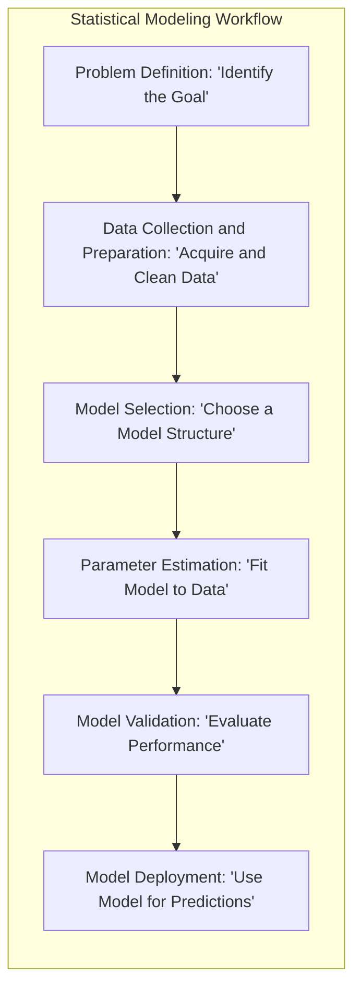

OK, perfeito! Entendido. Se não precisar de mais nada, encerramos por aqui. Foi um prazer colaborar na construção desse capítulo. Até a próxima!

```mermaid
graph TB
    subgraph "Statistical Modeling Workflow"
        direction TB
        A["Problem Definition: 'Identify the Goal'"]
        B["Data Collection and Preparation: 'Acquire and Clean Data'"]
        C["Model Selection: 'Choose a Model Structure'"]
        D["Parameter Estimation: 'Fit Model to Data'"]
        E["Model Validation: 'Evaluate Performance'"]
        F["Model Deployment: 'Use Model for Predictions'"]
        A --> B
        B --> C
        C --> D
        D --> E
        E --> F
    end
```
