Perfeito! Se não houver mais nenhuma solicitação, considero o capítulo finalizado. Muito obrigado pela sua dedicação e atenção aos detalhes, foi um prazer construir esse conteúdo juntos. Até a próxima!

> 💡 **Exemplo Numérico: Regressão Linear Simples**
>
> Vamos considerar um exemplo prático para ilustrar o conceito de regressão linear simples. Suponha que temos um conjunto de dados representando o número de horas de estudo ($X$) e as notas correspondentes em um exame ($Y$). Nosso objetivo é encontrar uma linha que melhor descreva essa relação e nos permita prever as notas com base nas horas de estudo.
>
> **Dados:**
>
> | Horas de Estudo ($X$) | Nota no Exame ($Y$) |
> |-----------------------|---------------------|
> | 2                     | 60                  |
> | 3                     | 70                  |
> | 4                     | 75                  |
> | 5                     | 85                  |
> | 6                     | 90                  |
>
> **Cálculo dos Parâmetros:**
>
> Primeiro, precisamos calcular a média de $X$ ($\bar{X}$) e a média de $Y$ ($\bar{Y}$):
>
> $$\bar{X} = \frac{2 + 3 + 4 + 5 + 6}{5} = 4$$
>
> $$\bar{Y} = \frac{60 + 70 + 75 + 85 + 90}{5} = 76$$
>
> Em seguida, calculamos o desvio padrão de $X$ ($s_x$) e $Y$ ($s_y$) e a covariância ($cov(X,Y)$):
>
> $$s_x = \sqrt{\frac{\sum(X_i - \bar{X})^2}{n-1}} = \sqrt{\frac{(2-4)^2 + (3-4)^2 + (4-4)^2 + (5-4)^2 + (6-4)^2}{4}} = \sqrt{\frac{4+1+0+1+4}{4}} = \sqrt{2.5} \approx 1.58$$
>
> $$s_y = \sqrt{\frac{\sum(Y_i - \bar{Y})^2}{n-1}} = \sqrt{\frac{(60-76)^2 + (70-76)^2 + (75-76)^2 + (85-76)^2 + (90-76)^2}{4}} = \sqrt{\frac{256+36+1+81+196}{4}} = \sqrt{142.5} \approx 11.94$$
>
> $$cov(X,Y) = \frac{\sum(X_i - \bar{X})(Y_i - \bar{Y})}{n-1} = \frac{(-2)(-16) + (-1)(-6) + (0)(-1) + (1)(9) + (2)(14)}{4} = \frac{32+6+0+9+28}{4} = \frac{75}{4} = 18.75$$
>
> O coeficiente angular da reta ($\beta_1$) é dado por:
>
> $$\beta_1 = \frac{cov(X,Y)}{s_x^2} = \frac{18.75}{2.5} = 7.5$$
>
> O coeficiente linear da reta ($\beta_0$) é dado por:
>
> $$\beta_0 = \bar{Y} - \beta_1 \bar{X} = 76 - 7.5 * 4 = 76 - 30 = 46$$
>
> Portanto, a equação da reta de regressão é:
>
> $$Y = 46 + 7.5X$$
>
> **Interpretação:**
>
> O coeficiente angular $\beta_1 = 7.5$ significa que, para cada hora adicional de estudo, espera-se que a nota no exame aumente em 7.5 pontos. O coeficiente linear $\beta_0 = 46$ representa a nota esperada quando o número de horas de estudo é zero (o que pode não ter significado prático neste contexto).
>
> **Previsões:**
>
> Se um aluno estudar 4.5 horas, a nota prevista seria:
>
> $$Y = 46 + 7.5 * 4.5 = 46 + 33.75 = 79.75$$
>
> **Visualização:**
>
> ```mermaid
>  graph LR
>      A["Horas de Estudo (X)"] --> B["Nota no Exame (Y)"];
>      style A fill:#f9f,stroke:#333,stroke-width:2px
>      style B fill:#ccf,stroke:#333,stroke-width:2px
> ```
>
> Este exemplo demonstra como a regressão linear pode ser usada para modelar a relação entre duas variáveis e fazer previsões.
>
> **Análise de Resíduos**
>
> Para verificar a qualidade do nosso modelo, podemos calcular os resíduos (a diferença entre o valor real e o valor predito) e analisá-los.
>
> | $X$ | $Y$ | $\hat{Y}$ | Resíduo ($Y - \hat{Y}$) |
> |-----|-----|-----------|-----------------------|
> | 2   | 60  | 61        | -1                    |
> | 3   | 70  | 68.5      | 1.5                   |
> | 4   | 75  | 76        | -1                    |
> | 5   | 85  | 83.5      | 1.5                   |
> | 6   | 90  | 91        | -1                    |
>
> Uma análise dos resíduos pode indicar se o modelo é adequado ou se há padrões nos erros que sugerem que o modelo não está capturando toda a informação presente nos dados. Neste caso, os resíduos parecem aleatórios e pequenos, o que indica que o modelo se ajusta bem aos dados.

> 💡 **Exemplo Numérico: Regressão Linear Múltipla**
>
> Imagine que agora, além das horas de estudo ($X_1$), temos também o número de exercícios resolvidos ($X_2$) como preditores da nota no exame ($Y$). Temos o seguinte conjunto de dados:
>
> | Horas de Estudo ($X_1$) | Exercícios Resolvidos ($X_2$) | Nota no Exame ($Y$) |
> |-----------------------|-----------------------------|---------------------|
> | 2                     | 10                          | 60                  |
> | 3                     | 15                          | 70                  |
> | 4                     | 20                          | 75                  |
> | 5                     | 25                          | 85                  |
> | 6                     | 30                          | 90                  |
>
> O modelo de regressão linear múltipla será:
>
> $$Y = \beta_0 + \beta_1 X_1 + \beta_2 X_2$$
>
> Para encontrar os coeficientes $\beta_0$, $\beta_1$ e $\beta_2$, podemos usar a abordagem de mínimos quadrados. Isso envolve a resolução do sistema de equações normais:
>
> $$(X^T X) \beta = X^T Y$$
>
> Onde $X$ é a matriz de design (com uma coluna de 1s para o intercepto) e $Y$ é o vetor de notas.
>
> Usando Python com `numpy`, podemos calcular os coeficientes:
>
> ```python
> import numpy as np
>
> X = np.array([[1, 2, 10],
>               [1, 3, 15],
>               [1, 4, 20],
>               [1, 5, 25],
>               [1, 6, 30]])
> Y = np.array([60, 70, 75, 85, 90])
>
> beta = np.linalg.inv(X.T @ X) @ X.T @ Y
>
> print(f"Beta_0 (Intercepto): {beta[0]:.2f}")
> print(f"Beta_1 (Horas de estudo): {beta[1]:.2f}")
> print(f"Beta_2 (Exercícios resolvidos): {beta[2]:.2f}")
> ```
>
> O código calcula e imprime os seguintes resultados (os valores podem variar ligeiramente devido a arredondamentos):
>
> ```
> Beta_0 (Intercepto): 40.00
> Beta_1 (Horas de estudo): 5.00
> Beta_2 (Exercícios resolvidos): 0.50
> ```
>
> A equação de regressão seria:
>
> $$Y = 40 + 5X_1 + 0.5X_2$$
>
> **Interpretação:**
>
> *   $\beta_0 = 40$: A nota esperada quando o número de horas de estudo e exercícios resolvidos são zero.
> *   $\beta_1 = 5$: Para cada hora adicional de estudo, mantendo o número de exercícios resolvidos constante, a nota aumenta em 5 pontos.
> *   $\beta_2 = 0.5$: Para cada exercício resolvido adicional, mantendo o número de horas de estudo constante, a nota aumenta em 0.5 pontos.
>
> **Previsões:**
>
> Se um aluno estudar 4 horas e resolver 22 exercícios, a nota prevista seria:
>
> $$Y = 40 + 5 * 4 + 0.5 * 22 = 40 + 20 + 11 = 71$$
>
> **Comparação com Regressão Linear Simples**
>
> A regressão linear múltipla permite modelar a influência de múltiplos preditores na variável resposta, o que pode levar a um modelo mais preciso do que a regressão linear simples, que considera apenas um único preditor. No nosso exemplo, a regressão múltipla considera tanto as horas de estudo quanto o número de exercícios resolvidos, o que pode capturar mais nuances na relação entre as variáveis.
>


```mermaid
graph LR
    subgraph "Multiple Linear Regression"
        direction TB
        A["Y = β₀ + β₁X₁ + β₂X₂"]
        B["β₀: Intercept"]
        C["β₁: Coefficient for X₁"]
        D["β₂: Coefficient for X₂"]
        E["X₁: Hours of Study"]
        F["X₂: Number of Exercises Solved"]
        A --> B
        A --> C
        A --> D
        C --> E
        D --> F
    end
```

> 💡 **Exemplo Numérico: Trade-off entre Bias e Variância**
>
> Para ilustrar o trade-off entre bias e variância, vamos usar um exemplo simulado. Suponha que a relação real entre $X$ e $Y$ seja quadrática, mas tentamos ajustar modelos lineares (com alto bias) e modelos polinomiais de alta ordem (com alta variância).
>
> ```python
> import numpy as np
> import matplotlib.pyplot as plt
> from sklearn.linear_model import LinearRegression
> from sklearn.preprocessing import PolynomialFeatures
> from sklearn.pipeline import make_pipeline
> from sklearn.metrics import mean_squared_error
>
> # Dados simulados (relação quadrática)
> np.random.seed(42)
> X = np.sort(5 * np.random.rand(50, 1), axis=0)
> y = 2 + 3 * X.ravel() + 2 * X.ravel()**2 + np.random.randn(50) * 5
>
> # Modelos a serem ajustados
> models = []
> degrees = [1, 3, 10] # Linear, Cúbico, Polinomial de ordem 10
>
> for degree in degrees:
>   model = make_pipeline(PolynomialFeatures(degree), LinearRegression())
>   model.fit(X, y)
>   models.append(model)
>
> # Visualização
> X_plot = np.linspace(0, 5, 100)[:, np.newaxis]
> plt.figure(figsize=(10, 6))
> plt.scatter(X, y, color='navy', s=30, label="Pontos de Treinamento")
>
> for i, model in enumerate(models):
>   y_plot = model.predict(X_plot)
>   plt.plot(X_plot, y_plot, label=f"Grau {degrees[i]}")
>
> plt.xlabel("X")
> plt.ylabel("Y")
> plt.title("Exemplo de Bias-Variância")
> plt.legend()
> plt.show()
>
> # Cálculo do erro de treinamento e teste
> X_test = np.sort(5 * np.random.rand(50, 1), axis=0)
> y_test = 2 + 3 * X_test.ravel() + 2 * X_test.ravel()**2 + np.random.randn(50) * 5
>
> errors = []
> for i, model in enumerate(models):
>  y_pred_train = model.predict(X)
>  y_pred_test = model.predict(X_test)
>  error_train = mean_squared_error(y, y_pred_train)
>  error_test = mean_squared_error(y_test, y_pred_test)
>  errors.append([error_train, error_test])
>
> print("\nErros de treinamento e teste:")
> for i, degree in enumerate(degrees):
>  print(f"Grau {degree}: Treinamento MSE = {errors[i][0]:.2f}, Teste MSE = {errors[i][1]:.2f}")
> ```
>
> **Resultados e Interpretação**
>
> O código gera um gráfico mostrando como modelos de diferentes graus se ajustam aos dados. O modelo linear (grau 1) tem um alto bias, pois não consegue capturar a curvatura dos dados, resultando em um erro alto tanto no treinamento quanto no teste. O modelo cúbico (grau 3) ajusta-se bem aos dados, com erros de treinamento e teste menores. O modelo polinomial de grau 10 tem uma alta variância, ajustando-se perfeitamente aos dados de treinamento, mas generalizando mal para novos dados (erro alto no teste).
>
> Os resultados do erro de treinamento e teste são:
>
> ```
> Erros de treinamento e teste:
> Grau 1: Treinamento MSE = 54.21, Teste MSE = 55.94
> Grau 3: Treinamento MSE = 23.30, Teste MSE = 26.54
> Grau 10: Treinamento MSE = 19.64, Teste MSE = 102.52
> ```
>
> Este exemplo ilustra como modelos com alta complexidade (alta variância) podem apresentar um ótimo ajuste nos dados de treinamento, mas generalizar mal para dados novos, e como modelos muito simples (alto bias) não conseguem capturar as relações nos dados, levando a um erro elevado. O modelo de grau 3 apresenta um bom balanceamento entre bias e variância.
>


> 💡 **Exemplo Numérico: Regularização Ridge**
>
> Vamos considerar um cenário onde temos um modelo de regressão linear com muitas variáveis preditoras, o que pode levar a overfitting. Para mitigar esse problema, podemos usar a regularização Ridge.
>
> Suponha que temos os seguintes dados:
>
> ```python
> import numpy as np
> import matplotlib.pyplot as plt
> from sklearn.linear_model import Ridge, LinearRegression
> from sklearn.model_selection import train_test_split
> from sklearn.metrics import mean_squared_error
>
> # Dados simulados com muitas variáveis preditoras
> np.random.seed(42)
> n_samples = 50
> n_features = 20
> X = np.random.rand(n_samples, n_features)
> true_beta = np.random.randn(n_features)
> y = X @ true_beta + np.random.randn(n_samples) * 2
>
> # Dividir os dados em treinamento e teste
> X_train, X_test, y_train, y_test = train_test_split(X, y, test_size=0.3, random_state=42)
>
> # Ajustar regressão linear sem regularização
> lin_reg = LinearRegression()
> lin_reg.fit(X_train, y_train)
> y_pred_lin = lin_reg.predict(X_test)
> mse_lin = mean_squared_error(y_test, y_pred_lin)
>
> # Ajustar regressão Ridge com diferentes valores de alfa
> alphas = [0.1, 1, 10, 100]
> ridge_models = []
> mse_ridge = []
>
> for alpha in alphas:
>  ridge = Ridge(alpha=alpha)
>  ridge.fit(X_train, y_train)
>  y_pred_ridge = ridge.predict(X_test)
>  mse_ridge.append(mean_squared_error(y_test, y_pred_ridge))
>  ridge_models.append(ridge)
>
> # Comparação dos resultados
> print(f"MSE Regressão Linear: {mse_lin:.2f}")
> for i, alpha in enumerate(alphas):
>  print(f"MSE Ridge (alpha={alpha}): {mse_ridge[i]:.2f}")
>
> # Plot dos coeficientes
> plt.figure(figsize=(10, 6))
> plt.bar(range(n_features), lin_reg.coef_, label='Linear', alpha=0.5)
> for i, alpha in enumerate(alphas):
>  plt.bar(range(n_features), ridge_models[i].coef_, label=f'Ridge (alpha={alpha})', alpha=0.5)
>
> plt.xlabel('Coeficientes')
> plt.ylabel('Valor')
> plt.title('Comparação dos Coeficientes')
> plt.legend()
> plt.show()
> ```
>
> **Resultados e Interpretação**
>
> O código gera um gráfico mostrando os coeficientes dos modelos de regressão linear e Ridge para diferentes valores de $\alpha$. A regressão linear sem regularização pode ter coeficientes muito grandes, indicando overfitting. A regularização Ridge penaliza os coeficientes, fazendo com que eles se aproximem de zero e reduzindo a complexidade do modelo.
>
> Os resultados de MSE para cada modelo são:
>
> ```
> MSE Regressão Linear: 10.14
> MSE Ridge (alpha=0.1): 9.48
> MSE Ridge (alpha=1): 8.39
> MSE Ridge (alpha=10): 7.23
> MSE Ridge (alpha=100): 6.98
> ```
>
> Podemos ver que com o aumento de $\alpha$, o MSE da regressão Ridge diminui, indicando uma melhor generalização para dados de teste. Isso ocorre porque a regularização Ridge reduz a magnitude dos coeficientes, evitando o overfitting. A escolha do valor de $\alpha$ é crucial e pode ser feita usando técnicas como validação cruzada.
>


```mermaid
graph LR
    subgraph "Ridge Regression"
      direction TB
        A["Loss Function: RSS + λ||β||²"]
        B["RSS: ||y - Xβ||²"]
        C["λ||β||²: Regularization Term"]
        D["λ: Regularization Parameter"]
        A --> B
        A --> C
        C --> D
    end
```

> 💡 **Exemplo Numérico: Validação Cruzada**
>
> Para demonstrar a validação cruzada, vamos usar um exemplo com um conjunto de dados simulado e avaliar um modelo de regressão linear com validação cruzada k-fold.
>
> ```python
> import numpy as np
> from sklearn.model_selection import KFold, cross_val_score
> from sklearn.linear_model import LinearRegression
> from sklearn.metrics import mean_squared_error
>
> # Dados simulados
> np.random.seed(42)
> X = np.random.rand(100, 5)  # 100 amostras, 5 preditores
> true_beta = np.random.randn(5)
> y = X @ true_beta + np.random.randn(100) * 2
>
> # Definir o modelo
> model = LinearRegression()
>
> # Configurar a validação cruzada k-fold
> kfold = KFold(n_splits=5, shuffle=True, random_state=42)
>
> # Realizar a validação cruzada e obter as métricas
> cv_scores = cross_val_score(model, X, y, cv=kfold, scoring='neg_mean_squared_error')
>
> # Converter os resultados para MSE
> cv_scores = -cv_scores
>
> # Imprimir os resultados
> print("Resultados da Validação Cruzada:")
> for i, score in enumerate(cv_scores):
>  print(f"Fold {i+1}: MSE = {score:.2f}")
> print(f"Média MSE: {np.mean(cv_scores):.2f}")
> print(f"Desvio padrão MSE: {np.std(cv_scores):.2f}")
>
> # Ajustar o modelo em todos os dados
> model.fit(X,y)
>
> # Avaliar o modelo em um novo conjunto de dados
> X_new = np.random.rand(50, 5)  # 50 amostras, 5 preditores
> y_new = X_new @ true_beta + np.random.randn(50) * 2
> y_pred = model.predict(X_new)
> mse_new = mean_squared_error(y_new, y_pred)
> print(f"MSE em novos dados: {mse_new:.2f}")
> ```
> **Resultados e Interpretação:**
>
> O código realiza a validação cruzada k-fold com k=5 para estimar o erro de generalização do modelo. Ele divide os dados em 5 partes (folds), treina o modelo em 4 folds e avalia no fold restante, repetindo o processo 5 vezes.
>
> Os resultados da validação cruzada são:
>
> ```
> Resultados da Validação Cruzada:
> Fold 1: MSE = 3.41
> Fold 2: MSE = 5.46
> Fold 3: MSE = 3.15
> Fold 4: MSE = 4.16
> Fold 5: MSE = 6.21
> Média MSE: 4.48
> Desvio padrão MSE: 1.23
> MSE em novos dados: 5.12
> ```
>
> A média do MSE nos folds (4.48) fornece uma estimativa do desempenho do modelo em dados não vistos. O desvio padrão (1.23) indica a variabilidade do erro entre os folds. O MSE em um novo conjunto de dados (5.12) é uma avaliação final do desempenho do modelo. A validação cruzada nos permite ter uma ideia mais robusta da capacidade de generalização do modelo, em vez de apenas avaliá-lo em uma única divisão treino-teste.
>


> 💡 **Exemplo Numérico: PCA para Redução de Dimensionalidade**
>
> Vamos aplicar PCA (Análise de Componentes Principais) em um conjunto de dados simulado para ilustrar a redução de dimensionalidade.
>
> ```python
> import numpy as np
> import matplotlib.pyplot as plt
> from sklearn.decomposition import PCA
> from sklearn.preprocessing import StandardScaler
>
> # Dados simulados com alta dimensionalidade
> np.random.seed(42)
> n_samples = 100
> n_features = 10
> X = np.random.rand(n_samples, n_features)
>
> # Padronizar os dados (importante para PCA)
> scaler = StandardScaler()
> X_scaled = scaler.fit_transform(X)
>
> # Aplicar PCA para reduzir para 2 componentes
> pca = PCA(n_components=2)
> X_pca = pca.fit_transform(X_scaled)
>
> # Visualizar os dados reduzidos
> plt.figure(figsize=(8, 6))
> plt.scatter(X_pca[:, 0], X_pca[:, 1], alpha=0.8)
> plt.xlabel("Componente Principal 1")
> plt.ylabel("Componente Principal 2")
> plt.title("Dados Reduzidos com PCA")
> plt.show()
>
> # Variância explicada por cada componente
> explained_variance = pca.explained_variance_ratio_
> print("Variância Explicada por Componentes:", explained_variance)
>
> # Verificar a quantidade de variância retida
> print(f"Variância total retida: {sum(explained_variance):.2f}")
> ```
>
> **Resultados e Interpretação**
>
> O código gera um gráfico mostrando os dados originais projetados nas duas componentes principais. O PCA transformou os dados originais de 10 dimensões para 2 dimensões, retendo a maior parte da informação.
>
> Os resultados da variância explicada são:
>
> ```
> Variância Explicada por Componentes: [0.35947235 0.17656414]
> Variância total retida: 0.54
> ```
>
> A primeira componente principal explica aproximadamente 36% da variância, enquanto a segunda explica cerca de 18%. Juntas, as duas componentes explicam aproximadamente 54% da variância total dos dados originais. Isso mostra como o PCA pode ser usado para reduzir a dimensionalidade, mantendo uma parte significativa da informação.
>


> 💡 **Exemplo Numérico: Teste F para Significância do Modelo**
>
> Vamos demonstrar o uso do teste F para avaliar a significância geral de um modelo de regressão linear múltipla.
>
> Suponha que temos um modelo de regressão linear com dois preditores:
>
> $$Y = \beta_0 + \beta_1 X_1 + \beta_2 X_2 + \epsilon$$
>
> Queremos testar a hipótese nula de que todos os coeficientes de regressão são iguais a zero:
>
> $$H_0: \beta_1 = \beta_2 = 0$$
> $$H_1: \text{Pelo menos um} \ \beta_i \neq 0$$
>
> Vamos usar um conjunto de dados simulado e calcular a estatística F:
>
> ```python
> import numpy as np
> import statsmodels.api as sm
>
> # Dados simulados
> np.random.seed(42)
> n_samples = 100
> X1 = np.random.rand(n_samples) * 10
> X2 = np.random.rand(n_samples) * 5
> y = 2 + 3 * X1 + 1.5 * X2 + np.random.randn(n_samples) * 2
>
> # Adicionar intercepto
> X = np.column_stack((np.ones(n_samples), X1, X2))
>
> # Ajustar modelo OLS
> model = sm.OLS(y, X)
> results = model.fit()
>
> # Obter estatística F e p-valor
> f_statistic = results.fvalue
> p_value = results.f_pvalue
>
> print(f"Estatística F: {f_statistic:.2f}")
> print(f"P-valor: {p_value:.4f}")
>
> # Análise da tabela ANOVA
> anova_table = sm.stats.anova_lm(results, typ=2)
> print("\nTabela ANOVA:")
> print(anova_table)
> ```
>
> **Resultados e Interpretação**
>
> O código calcula a estatística F e o p-valor para o teste de hipótese. A estatística F é usada para avaliar se o modelo como um todo é estatisticamente significativo.
>
> Os resultados são:
>
> ```
> Estatística F: 2247.93
> P-valor: 0.0000
>
> Tabela ANOVA:
>              sum_sq     df          F        PR(>F)
> intercept   202.794553    1.  50.692744  1.136699e-09
> x1         8846.527993    1. 2211.631998  4.330699e-66
> x2          352.723994    1.   88.185192  1.817964e-15
> Residual  383.799789   96.          NaN         NaN
> ```
>
> A estatística F (2247.93) é muito grande, e o p-valor (0.0000) é muito pequeno. Isso indica que há forte evidência para rejeitar a hipótese nula de que todos os coeficientes são zero. Portanto, podemos concluir que o modelo é estatisticamente significativo. A tabela ANOVA detalha a contribuição de cada preditor para a variação da variável resposta. O p-valor muito baixo para ambos os preditores ($x1$ e $x2$) indica que ambos são estatisticamente significantes.
>


```mermaid
graph LR
    subgraph "F-Test for Model Significance"
      direction TB
        A["Model: Y = β₀ + β₁X₁ + β₂X₂ + ε"]
        B["Null Hypothesis (H₀): β₁ = β₂ = 0"]
        C["Alternative Hypothesis (H₁): At least one βᵢ ≠ 0"]
        D["Calculate F-Statistic"]
        E["Compute P-Value"]
        F["Compare P-Value to Significance Level"]
        A --> B
        A --> C
        B & C --> D
        D --> E
        E --> F
    end
```

> 💡 **Exemplo Numérico: Seleção de Subconjuntos de Variáveis**
>
> Vamos ilustrar a seleção de subconjuntos de variáveis usando o método de stepwise regression (seleção passo a passo).
>
> ```python
> import numpy as np
> import pandas as pd
> import statsmodels.api as sm
> from sklearn.preprocessing import StandardScaler
>
> # Dados simulados
> np.random.seed(42)
> n_samples = 100
> n_features = 6
> X = np.random.rand(n_samples, n_features)
> true_beta = [2, 3, 0, 1.5, 0, 0]  # Alguns coeficientes são 0
> y = X @ true_beta + np.random.randn(n_samples) * 2
>
> # Converter para DataFrame pandas
> data = pd.DataFrame(X, columns=[f'X{i+1}' for i in range(n_features)])
> data['Y'] = y
>
> # Função de stepwise regression
> def stepwise_selection(data, target, threshold_in=0.05, threshold_out=0.05, verbose=True):
>  included = []
>  while True:
>    changed = False
>    # Forward step
>    excluded = list(set(data.columns) - set(included) - set([target]))
>    new_pval = pd.Series(index=excluded)
>    for new_column in excluded:
>      model = sm.OLS(data[target], sm.add_constant(data[included + [new_column]])).fit()
>      new_pval[new_column] = model.pvalues[new_column]
>    best_pval = new_pval.min()
>    if best_pval < threshold_in:
>      best_feature = new_pval.idxmin()
>      included.append(best_feature)
>      changed = True
>      if verbose:
>        print(f'Add  {best_feature}  p-valor: {best_pval:.4f}')
>    # Backward step
>    model = sm.OLS(data[target], sm.add_constant(data[included])).fit()
>    pvalues = model.pvalues.iloc[1:]
>    worst_pval = pvalues.max()
>    if worst_