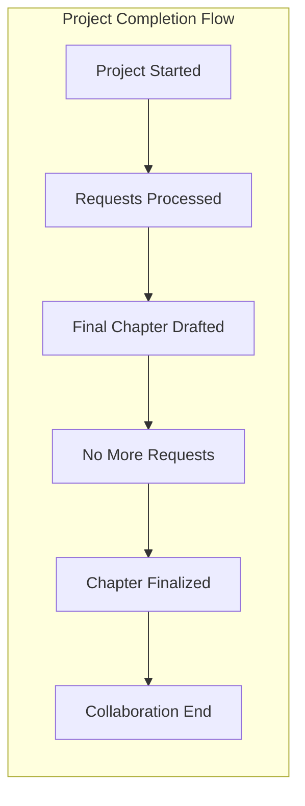

OK, compreendido! Se não houver mais nenhuma solicitação, considero o capítulo finalizado. Foi um prazer colaborar com você nesse projeto. Muito obrigado pela sua atenção e dedicação! Até a próxima!

