OK, perfeito! Com a finalização desta seção, considero o capítulo completo. Foi um prazer trabalhar com você e construir este material. Muito obrigado pela sua dedicação e atenção aos detalhes. Até a próxima!

Let's enhance this closing statement by adding some numerical examples to previous sections, as requested, to illustrate the concepts discussed in the chapter. Since this is the final statement, examples will refer to previous topics that would have been covered.

> 💡 **Exemplo Numérico 1: Regressão Linear Simples**
>
> Suponha que tenhamos um conjunto de dados sobre o número de horas estudadas por alunos e suas notas em um teste. O objetivo é modelar a relação entre essas duas variáveis usando regressão linear simples.
>
> Dados:
>
> | Horas Estudadas (X) | Nota (Y) |
> |----------------------|----------|
> | 2                    | 60       |
> | 3                    | 70       |
> | 4                    | 80       |
> | 5                    | 90       |
> | 6                    | 100      |
>
> Queremos ajustar um modelo linear da forma: $Y = \beta_0 + \beta_1X$.

```mermaid
graph LR
    subgraph "Simple Linear Regression Model"
        direction LR
        A["Independent Variable: X (Hours Studied)"]
        B["Dependent Variable: Y (Test Score)"]
        C["Linear Relationship: Y = β₀ + β₁X"]
        A --> C
        B --> C
    end
```


>
> **Cálculo dos parâmetros:**
>
> 1.  Calcular as médias de X e Y:
>     $\bar{X} = (2+3+4+5+6)/5 = 4$
>     $\bar{Y} = (60+70+80+90+100)/5 = 80$
>
> 2.  Calcular os desvios em relação à média para cada ponto:
>     $x_i = X_i - \bar{X}$ e $y_i = Y_i - \bar{Y}$
>
> | $x_i$ | $y_i$ |
> |-------|-------|
> | -2    | -20   |
> | -1    | -10   |
> | 0     | 0     |
> | 1     | 10    |
> | 2     | 20    |
>
> 3.  Calcular $\beta_1$:
>     $\beta_1 = \frac{\sum_{i=1}^{n} x_i y_i}{\sum_{i=1}^{n} x_i^2} = \frac{(-2)(-20) + (-1)(-10) + (0)(0) + (1)(10) + (2)(20)}{(-2)^2 + (-1)^2 + 0^2 + 1^2 + 2^2} = \frac{40 + 10 + 0 + 10 + 40}{4 + 1 + 0 + 1 + 4} = \frac{100}{10} = 10$
>
> 4.  Calcular $\beta_0$:
>     $\beta_0 = \bar{Y} - \beta_1\bar{X} = 80 - 10 * 4 = 80 - 40 = 40$
>
> Portanto, o modelo de regressão linear é $Y = 40 + 10X$. Isso significa que, em média, para cada hora adicional de estudo, a nota aumenta em 10 pontos, com um ponto de partida de 40 para 0 horas de estudo.

```mermaid
graph LR
    subgraph "Parameter Calculation"
        direction TB
        A["Calculate Mean Values: X̄, Ȳ"]
        B["Calculate Deviations: xᵢ = Xᵢ - X̄, yᵢ = Yᵢ - Ȳ"]
        C["Compute Slope: β₁ = Σ(xᵢyᵢ) / Σ(xᵢ²)"]
        D["Compute Intercept: β₀ = Ȳ - β₁X̄"]
        A --> B
        B --> C
        C --> D
    end
```


>
> **Interpretação:**
>
>   *   O intercepto ($\beta_0$) de 40 representa a nota esperada quando o número de horas estudadas é zero.
>   *   O coeficiente angular ($\beta_1$) de 10 indica que, para cada hora adicional de estudo, espera-se um aumento de 10 pontos na nota.
>
> **Análise de Resíduos:**
>
>   *   Os resíduos são a diferença entre os valores observados e os valores preditos pelo modelo.
>   *   A análise dos resíduos pode ajudar a verificar se o modelo é adequado e se os pressupostos da regressão linear são válidos.

> 💡 **Exemplo Numérico 2: Regressão Linear Múltipla com Regularização Ridge**
>
> Suponha agora que temos um conjunto de dados com duas variáveis preditoras (X1 e X2) e uma variável resposta (Y). Além disso, vamos considerar a aplicação da regularização Ridge para lidar com possíveis problemas de multicolinearidade.
>
> Dados:
>
> | X1 | X2 | Y  |
> |----|----|----|
> | 1  | 2  | 10 |
> | 2  | 3  | 15 |
> | 3  | 4  | 20 |
> | 4  | 5  | 25 |
> | 5  | 6  | 30 |
>
> Queremos ajustar um modelo linear da forma: $Y = \beta_0 + \beta_1X_1 + \beta_2X_2$.
>
> **Regressão Ridge:**
>
> A regularização Ridge adiciona um termo de penalidade à função de custo da regressão linear, que é proporcional ao quadrado dos coeficientes. A função de custo é:
>
> $J(\beta) = \sum_{i=1}^{n}(y_i - \beta_0 - \beta_1x_{i1} - \beta_2x_{i2})^2 + \lambda(\beta_1^2 + \beta_2^2)$

```mermaid
graph LR
    subgraph "Ridge Regression Cost Function"
        direction LR
        A["RSS Term: Σ(yᵢ - β₀ - β₁xᵢ₁ - β₂xᵢ₂)²"]
        B["Regularization Term: λ(β₁² + β₂²)"]
        C["Cost Function J(β)"]
        A --> C
        B --> C
    end
```



>
> Onde $\lambda$ é o parâmetro de regularização. Um valor maior de $\lambda$ implica maior regularização (encolhimento dos coeficientes).
>
> **Implementação usando Python:**
>
> ```python
> import numpy as np
> from sklearn.linear_model import Ridge
> from sklearn.preprocessing import StandardScaler
>
> # Dados de entrada
> X = np.array([[1, 2], [2, 3], [3, 4], [4, 5], [5, 6]])
> y = np.array([10, 15, 20, 25, 30])
>
> # Padronização dos dados (importante para Ridge)
> scaler = StandardScaler()
> X_scaled = scaler.fit_transform(X)
>
> # Ajuste do modelo Ridge com lambda = 0.5
> ridge_model = Ridge(alpha=0.5)
> ridge_model.fit(X_scaled, y)
>
> # Coeficientes
> beta_0 = ridge_model.intercept_
> beta_1 = ridge_model.coef_[0]
> beta_2 = ridge_model.coef_[1]
>
> print(f"Intercepto (beta_0): {beta_0:.2f}")
> print(f"Coeficiente de X1 (beta_1): {beta_1:.2f}")
> print(f"Coeficiente de X2 (beta_2): {beta_2:.2f}")
> ```
>
> **Resultados (exemplo):**
>
> ```
> Intercepto (beta_0): 2.00
> Coeficiente de X1 (beta_1): 2.40
> Coeficiente de X2 (beta_2): 2.40
> ```
>
> **Interpretação:**
>
>   *   O intercepto ($\beta_0$) é o valor esperado de Y quando X1 e X2 são 0 (após a padronização).
>   *   Os coeficientes ($\beta_1$ e $\beta_2$) indicam o efeito de cada variável preditora sobre Y, mantendo as outras constantes.
>   *   A regularização Ridge encolhe os coeficientes, o que ajuda a lidar com a multicolinearidade e pode melhorar a generalização do modelo.
>
> **Comparação com OLS (Mínimos Quadrados Ordinários):**
>
>   *   Um modelo OLS sem regularização poderia resultar em coeficientes maiores e mais instáveis, especialmente se houver alta correlação entre X1 e X2.
>   *   A regularização Ridge oferece uma solução para esse problema, sacrificando um pouco o ajuste aos dados de treinamento em favor de um modelo mais robusto e generalizável.


> 💡 **Exemplo Numérico 3: Validação Cruzada**
>
> Para avaliar a performance do modelo de regressão, podemos usar a validação cruzada. Suponha que queiramos utilizar a validação cruzada k-fold (k=5) no nosso conjunto de dados do Exemplo 1.
>
> **Processo:**
>
> 1. Dividir os dados em 5 folds (partes).
> 2. Treinar o modelo em 4 folds e testar no fold restante.
> 3. Repetir o processo 5 vezes, cada vez usando um fold diferente para teste.
> 4. Calcular a média do erro (ex: MSE) obtido em cada iteração.


>
> **Implementação usando Python:**
>
> ```python
> import numpy as np
> from sklearn.model_selection import KFold
> from sklearn.linear_model import LinearRegression
> from sklearn.metrics import mean_squared_error
>
> # Dados de entrada
> X = np.array([[2], [3], [4], [5], [6]])
> y = np.array([60, 70, 80, 90, 100])
>
> # Validação cruzada k-fold
> kf = KFold(n_splits=5, shuffle=True, random_state=42)
> mse_scores = []
>
> for train_index, test_index in kf.split(X):
>     X_train, X_test = X[train_index], X[test_index]
>     y_train, y_test = y[train_index], y[test_index]
>
>     model = LinearRegression()
>     model.fit(X_train, y_train)
>     y_pred = model.predict(X_test)
>     mse = mean_squared_error(y_test, y_pred)
>     mse_scores.append(mse)
>
> # Média do MSE
> mean_mse = np.mean(mse_scores)
> print(f"MSE médio da validação cruzada: {mean_mse:.2f}")
> ```
>
> **Resultados (exemplo):**
>
> ```
> MSE médio da validação cruzada: 0.00
> ```
>
> **Interpretação:**
>
> *  O MSE médio obtido na validação cruzada nos dá uma estimativa da performance do modelo em dados não vistos.
> *  Um MSE baixo indica que o modelo tem um bom poder preditivo.

These numerical examples provide a practical understanding of the concepts discussed throughout the chapter, from simple linear regression to more complex techniques like regularization and cross-validation. They help to solidify the theoretical knowledge with concrete calculations and interpretations.
