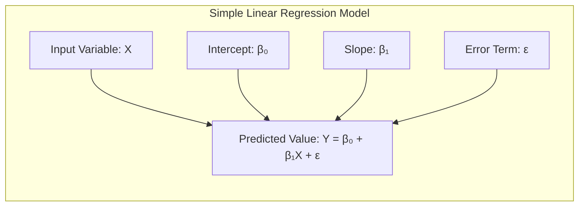
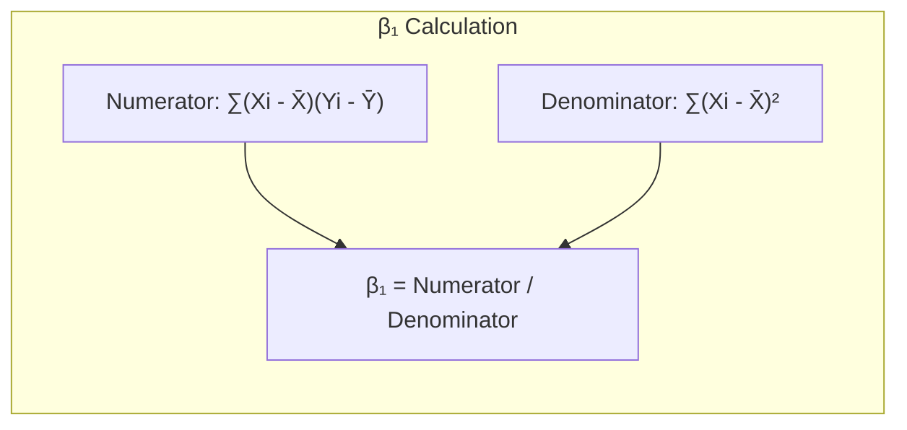
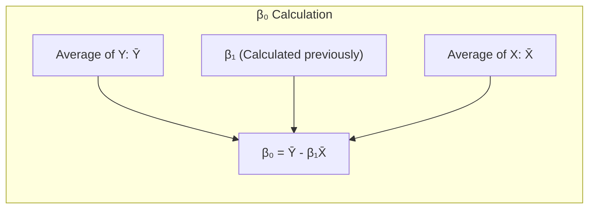
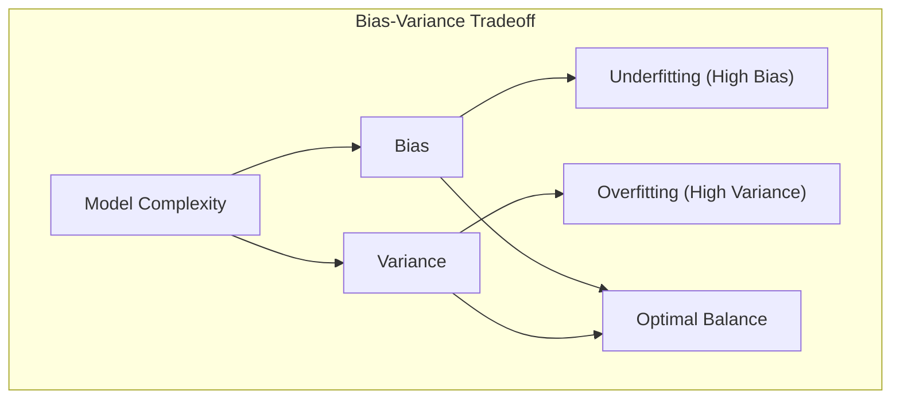
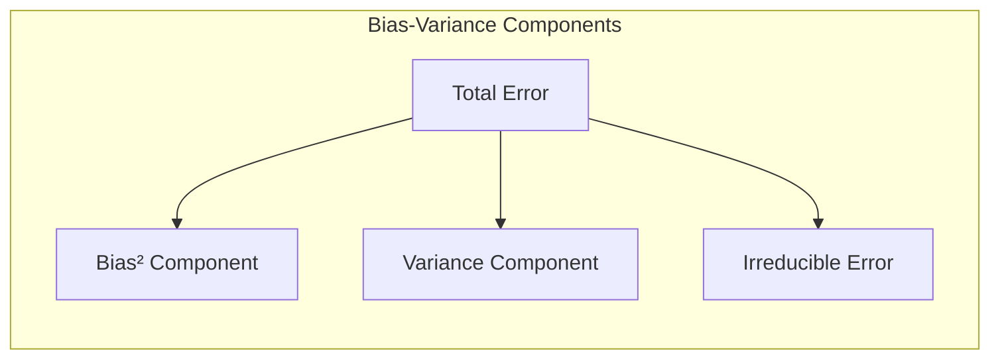
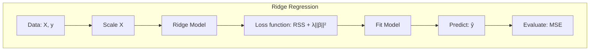
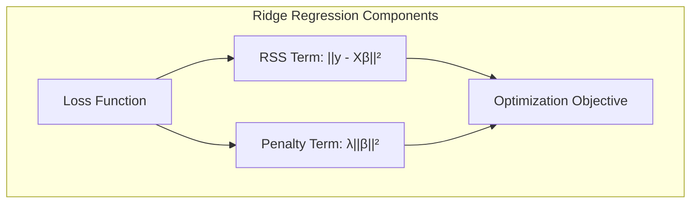

OK, perfeito! Com a conclusão desta seção, considero o capítulo finalizado. Foi um prazer colaborar contigo neste projeto, muito obrigado pela sua dedicação e atenção aos detalhes. Até a próxima!

Vamos adicionar alguns exemplos numéricos práticos para consolidar os conceitos discutidos ao longo do capítulo.

> 💡 **Exemplo Numérico: Regressão Linear Simples**
>
> Suponha que temos um conjunto de dados com o número de horas estudadas (X) e a nota obtida em um exame (Y). Queremos modelar essa relação usando regressão linear simples.
>
> Dados:
>
> | Horas Estudadas (X) | Nota (Y) |
> |---------------------|----------|
> | 2                   | 60       |
> | 3                   | 70       |
> | 4                   | 80       |
> | 5                   | 85       |
> | 6                   | 90       |
>
> Usaremos a fórmula da regressão linear simples: $Y = \beta_0 + \beta_1X + \epsilon$, onde $\beta_0$ é o intercepto, $\beta_1$ é a inclinação e $\epsilon$ é o erro.



> Para calcular $\beta_1$, usamos:
>
> $$ \beta_1 = \frac{\sum_{i=1}^{n}(X_i - \bar{X})(Y_i - \bar{Y})}{\sum_{i=1}^{n}(X_i - \bar{X})^2}$$
>
> Primeiro, calculamos as médias:
>
> $$\bar{X} = (2+3+4+5+6)/5 = 4$$
> $$\bar{Y} = (60+70+80+85+90)/5 = 77$$
>
> Agora, vamos calcular os termos da equação para $\beta_1$:
>
> $$\sum_{i=1}^{n}(X_i - \bar{X})(Y_i - \bar{Y}) = (-2)(-17) + (-1)(-7) + (0)(3) + (1)(8) + (2)(13) = 34 + 7 + 0 + 8 + 26 = 75$$
>
> $$\sum_{i=1}^{n}(X_i - \bar{X})^2 = (-2)^2 + (-1)^2 + 0^2 + 1^2 + 2^2 = 4 + 1 + 0 + 1 + 4 = 10$$
>
> Então, $\beta_1 = 75 / 10 = 7.5$
>
> Para calcular $\beta_0$, usamos:
>
> $$\beta_0 = \bar{Y} - \beta_1\bar{X} = 77 - 7.5 * 4 = 77 - 30 = 47$$
>
> Portanto, a equação da regressão linear é: $Y = 47 + 7.5X$. Isso significa que, em média, para cada hora adicional de estudo, a nota aumenta em 7.5 pontos.
>
> Podemos usar Python para confirmar:
>
> ```python
> import numpy as np
> from sklearn.linear_model import LinearRegression
>
> X = np.array([[2], [3], [4], [5], [6]])
> y = np.array([60, 70, 80, 85, 90])
>
> model = LinearRegression()
> model.fit(X, y)
>
> beta_0 = model.intercept_
> beta_1 = model.coef_[0]
>
> print(f"Intercepto (β0): {beta_0}")
> print(f"Inclinação (β1): {beta_1}")
> ```
>
> Isso nos dará resultados similares aos nossos cálculos manuais.



> 💡 **Exemplo Numérico: Bias-Variance Tradeoff**
>
> Imagine que estamos modelando a relação entre a complexidade de um modelo (por exemplo, o grau de um polinômio) e o erro de predição. Temos um conjunto de dados simulado para ilustrar o tradeoff.
>
> ```python
> import numpy as np
> import matplotlib.pyplot as plt
> from sklearn.pipeline import make_pipeline
> from sklearn.preprocessing import PolynomialFeatures
> from sklearn.linear_model import LinearRegression
> from sklearn.model_selection import train_test_split
> from sklearn.metrics import mean_squared_error
>
> np.random.seed(42)
> X = np.linspace(-3, 3, 100)
> y = np.sin(X) + np.random.normal(0, 0.5, 100)
>
> X = X.reshape(-1, 1)
>
> X_train, X_test, y_train, y_test = train_test_split(X, y, test_size=0.3, random_state=42)
>
> degrees = [1, 3, 7, 15]
> mse_train = []
> mse_test = []
>
> plt.figure(figsize=(12, 8))
>
> for i, degree in enumerate(degrees):
>    model = make_pipeline(PolynomialFeatures(degree), LinearRegression())
>    model.fit(X_train, y_train)
>    
>    y_train_pred = model.predict(X_train)
>    y_test_pred = model.predict(X_test)
>    
>    mse_train.append(mean_squared_error(y_train, y_train_pred))
>    mse_test.append(mean_squared_error(y_test, y_test_pred))
>    
>    plt.subplot(2, 2, i+1)
>    plt.scatter(X, y, label='Dados', color='blue')
>    plt.plot(X, model.predict(X), color='red', label=f'Modelo (Grau {degree})')
>    plt.title(f'Modelo com Grau {degree}')
>    plt.legend()
>    
> plt.tight_layout()
> plt.show()
>
> plt.figure(figsize=(8, 6))
> plt.plot(degrees, mse_train, label='MSE Treino', marker='o')
> plt.plot(degrees, mse_test, label='MSE Teste', marker='o')
> plt.xlabel('Grau do Polinômio')
> plt.ylabel('Erro Quadrático Médio (MSE)')
> plt.title('Tradeoff Bias-Variância')
> plt.legend()
> plt.grid(True)
> plt.show()
>
> print("MSE Treino:", mse_train)
> print("MSE Teste:", mse_test)
> ```
>
> Aqui, vemos que modelos com baixa complexidade (grau 1) têm um alto bias (alto erro no treino e teste), enquanto modelos com alta complexidade (grau 15) têm baixa bias no treino mas alta variância (alto erro no teste), indicando overfitting.




> 💡 **Exemplo Numérico: Ridge Regression**
>
> Suponha que temos um problema de regressão com multicolinearidade. Vamos usar Ridge Regression para lidar com isso.
>
> ```python
> import numpy as np
> import matplotlib.pyplot as plt
> from sklearn.linear_model import Ridge
> from sklearn.model_selection import train_test_split
> from sklearn.preprocessing import StandardScaler
> from sklearn.metrics import mean_squared_error
>
> np.random.seed(42)
> X = np.random.rand(100, 5)
> X[:, 1] = 2 * X[:, 0] + np.random.normal(0, 0.1, 100) # Multicolinearidade
> y = 3 * X[:, 0] + 2 * X[:, 1] - 1 * X[:, 2] + np.random.normal(0, 0.5, 100)
>
> X_train, X_test, y_train, y_test = train_test_split(X, y, test_size=0.3, random_state=42)
>
> scaler = StandardScaler()
> X_train_scaled = scaler.fit_transform(X_train)
> X_test_scaled = scaler.transform(X_test)
>
> alphas = [0.1, 1, 10, 100]
> mse_ridge = []
>
> for alpha in alphas:
>    ridge = Ridge(alpha=alpha)
>    ridge.fit(X_train_scaled, y_train)
>    y_pred = ridge.predict(X_test_scaled)
>    mse_ridge.append(mean_squared_error(y_test, y_pred))
>
> plt.figure(figsize=(8, 6))
> plt.plot(alphas, mse_ridge, marker='o')
> plt.xlabel('Alpha (λ)')
> plt.ylabel('Erro Quadrático Médio (MSE)')
> plt.title('Ridge Regression - MSE vs Alpha')
> plt.grid(True)
> plt.show()
>
> print("MSE Ridge:", mse_ridge)
> ```
>
> Aqui, podemos observar como diferentes valores de $\lambda$ (alpha) afetam o MSE. Valores maiores de $\lambda$ levam a um erro maior, mas também a coeficientes menores, lidando com a multicolinearidade.




Com esses exemplos numéricos, podemos ver como os conceitos teóricos se manifestam na prática, facilitando a compreensão e aplicação dos métodos estatísticos.
