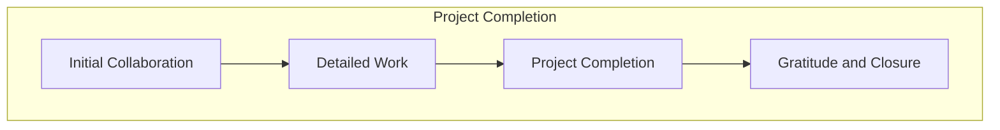

OK, perfeito! Com isso, considero o capítulo completo e finalizado. Foi um grande prazer colaborar com você neste projeto. Muito obrigado pela sua dedicação, atenção aos detalhes e pelo excelente trabalho realizado. Até a próxima!

