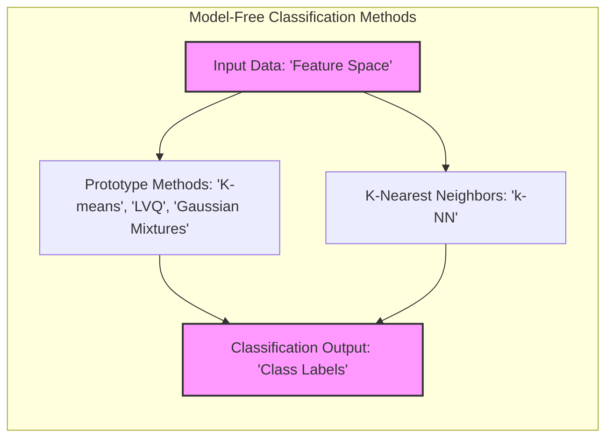
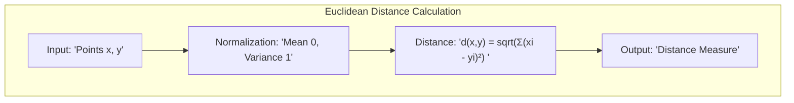
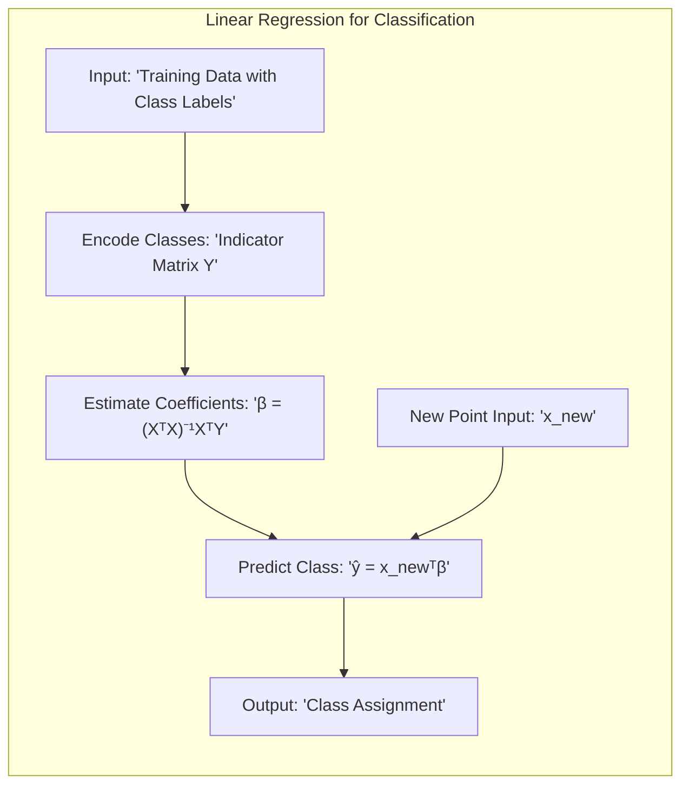
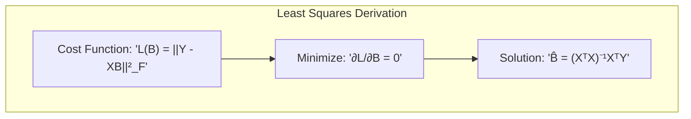
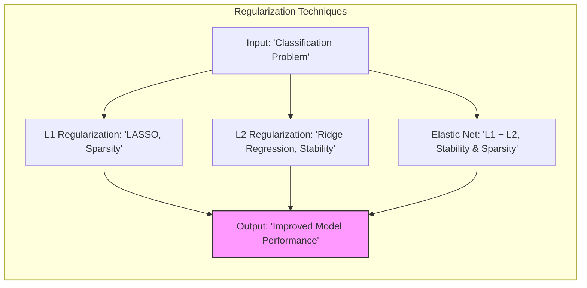
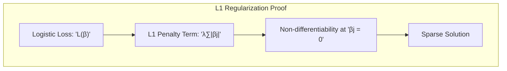
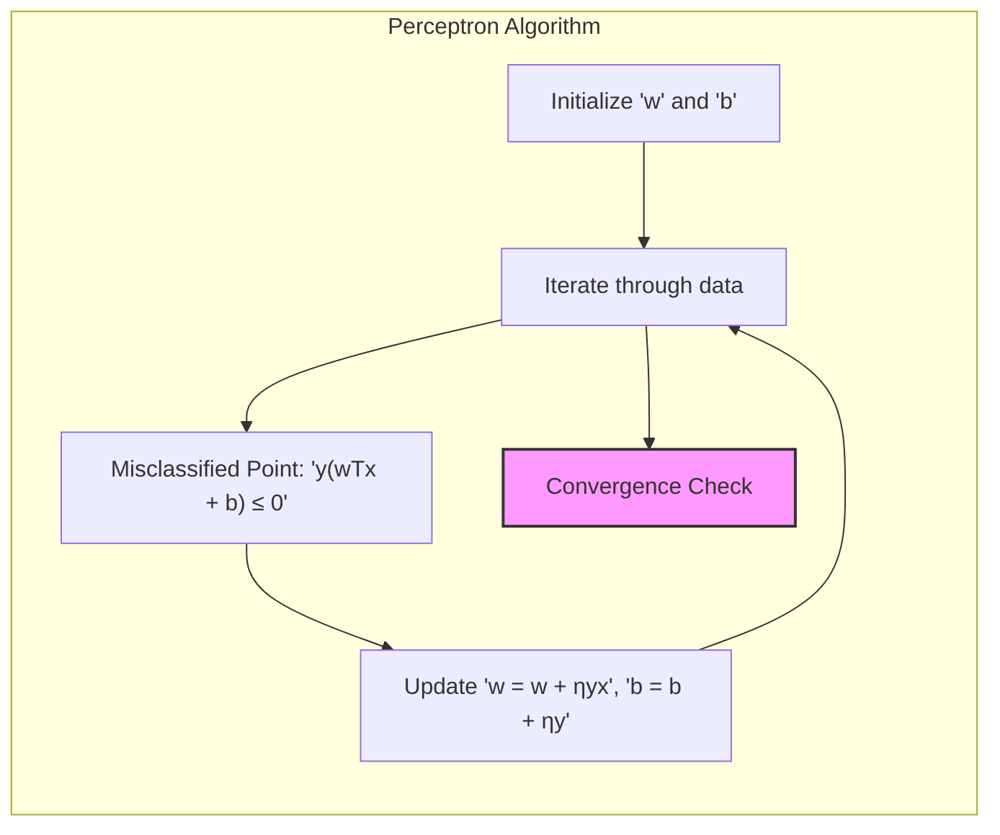
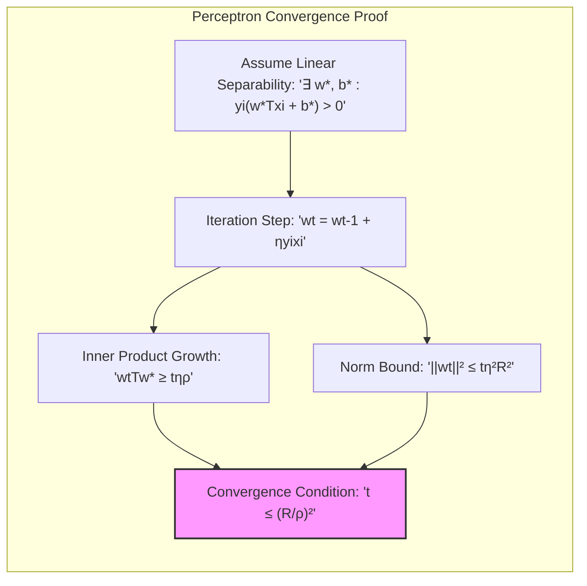

## Model Free Methods for Classification and Pattern Recognition

### Introdução

Este capítulo explora métodos simples e essencialmente **model-free** para classificação e reconhecimento de padrões [^13.1]. Estas técnicas, devido à sua natureza não estruturada, não se prestam à interpretação da relação entre as *features* e os resultados das classes, mas são muito eficazes como motores de predição “*black-box*”, frequentemente com desempenho superior em problemas de dados reais. Abordaremos tanto os métodos de protótipos quanto os de k-vizinhos mais próximos, explorando suas características, vantagens e limitações [^13.1]. Embora a técnica do vizinho mais próximo também possa ser usada em regressão, seu desempenho não é tão favorável em altas dimensões como na classificação, devido ao compromisso entre viés e variância [^13.1].

### Conceitos Fundamentais

**Conceito 1: Problema de Classificação**

O problema de classificação, em geral, consiste em atribuir uma classe a um dado ponto de *feature space* com base em um conjunto de dados de treino. Os métodos lineares, como discutido anteriormente, buscam hiperplanos que separam as classes, o que pode introduzir viés quando as fronteiras de decisão não são lineares [^4.1]. Abordagens *model-free*, por outro lado, utilizam a proximidade entre amostras ou a representação da distribuição das classes através de protótipos para realizar a classificação. No contexto de protótipos, dados de treino são representados por um conjunto de pontos no espaço de *features*. Estes protótipos, muitas vezes, não são exemplos diretos dos dados de treino, exceto no caso da classificação de 1-vizinho mais próximo [^13.2]. Cada protótipo possui uma classe associada e a classificação de um novo ponto é feita atribuindo-o à classe do protótipo mais próximo, onde a proximidade é medida geralmente pela distância Euclidiana [^13.2].

> 💡 **Exemplo Numérico:**
>
> Considere um problema de classificação com duas classes (A e B) e duas *features* (x1 e x2). Suponha que temos três protótipos:
> - Protótipo 1: (1, 1), Classe A
> - Protótipo 2: (2, 3), Classe B
> - Protótipo 3: (4, 2), Classe A
>
> Um novo ponto a ser classificado é (2.5, 2). Para classificá-lo, calculamos a distância Euclidiana entre este ponto e cada protótipo:
>
> - Distância ao Protótipo 1: $\sqrt{(2.5-1)^2 + (2-1)^2} = \sqrt{1.5^2 + 1^2} = \sqrt{2.25 + 1} = \sqrt{3.25} \approx 1.80$
> - Distância ao Protótipo 2: $\sqrt{(2.5-2)^2 + (2-3)^2} = \sqrt{0.5^2 + (-1)^2} = \sqrt{0.25 + 1} = \sqrt{1.25} \approx 1.12$
> - Distância ao Protótipo 3: $\sqrt{(2.5-4)^2 + (2-2)^2} = \sqrt{(-1.5)^2 + 0^2} = \sqrt{2.25} = 1.50$
>
> O ponto (2.5, 2) é mais próximo do Protótipo 2, que pertence à Classe B. Portanto, o ponto é classificado como Classe B.

**Lemma 1:** Em um espaço de *features* normalizado (média zero e variância um), a distância Euclidiana é uma medida apropriada para quantificar a proximidade entre os pontos, desde que os *features* sejam quantitativos.
*Prova*: A normalização garante que *features* com diferentes escalas não dominem a medida de distância. A distância Euclidiana é definida como $d(x,y) = \sqrt{\sum_{i=1}^p (x_i - y_i)^2}$, onde $p$ é o número de *features*. Em um espaço normalizado, cada *feature* contribui de maneira uniforme para a distância [^13.2]. $\blacksquare$

**Conceito 2: Linear Discriminant Analysis (LDA) vs. Métodos de Protótipos**

Enquanto o LDA busca uma transformação linear para projetar os dados em um subespaço onde as classes são mais separáveis, os métodos de protótipos aproximam as distribuições das classes por um conjunto de pontos representativos [^4.3]. Em contraste com o LDA, os métodos de protótipos são mais adequados para representar fronteiras de decisão irregulares, posicionando protótipos em locais estratégicos no espaço de *features* [^13.2]. A principal dificuldade desses métodos é determinar quantos protótipos usar e onde posicioná-los, o que varia conforme a técnica utilizada [^13.2].

**Corolário 1:** Uma vez que a distância Euclidiana é invariante sob translações e rotações no espaço de *features*, o uso de dados normalizados não altera as relações de proximidade entre os protótipos e os pontos de consulta.

**Conceito 3: Regressão Logística vs. Métodos de k-vizinhos mais próximos**

A regressão logística, como visto anteriormente, estima a probabilidade de um ponto pertencer a uma classe através de uma função logística sobre uma combinação linear dos *features*, enquanto que os métodos de k-vizinhos mais próximos classificam um ponto através da votação majoritária dos k vizinhos mais próximos no espaço de *features* [^4.4]. Os métodos de k-vizinhos são *memory-based*, pois não requerem um modelo a ser ajustado, utilizando todos os dados de treino durante a classificação. A principal desvantagem desses métodos é sua alta complexidade computacional para grandes conjuntos de dados, visto que cada classificação requer o cálculo da distância para todos os pontos de treino [^13.3].

> 💡 **Exemplo Numérico:**
>
> Considere um conjunto de dados de treino com 5 pontos e duas classes (A e B):
> - Ponto 1: (1, 1), Classe A
> - Ponto 2: (1, 2), Classe A
> - Ponto 3: (3, 2), Classe B
> - Ponto 4: (4, 1), Classe B
> - Ponto 5: (4, 3), Classe B
>
> Queremos classificar um novo ponto (2, 1.5) usando k-NN com k=3. Calculamos a distância Euclidiana para cada ponto de treino:
>
> - Distância ao Ponto 1: $\sqrt{(2-1)^2 + (1.5-1)^2} = \sqrt{1^2 + 0.5^2} = \sqrt{1.25} \approx 1.12$
> - Distância ao Ponto 2: $\sqrt{(2-1)^2 + (1.5-2)^2} = \sqrt{1^2 + (-0.5)^2} = \sqrt{1.25} \approx 1.12$
> - Distância ao Ponto 3: $\sqrt{(2-3)^2 + (1.5-2)^2} = \sqrt{(-1)^2 + (-0.5)^2} = \sqrt{1.25} \approx 1.12$
> - Distância ao Ponto 4: $\sqrt{(2-4)^2 + (1.5-1)^2} = \sqrt{(-2)^2 + 0.5^2} = \sqrt{4.25} \approx 2.06$
> - Distância ao Ponto 5: $\sqrt{(2-4)^2 + (1.5-3)^2} = \sqrt{(-2)^2 + (-1.5)^2} = \sqrt{6.25} = 2.5$
>
> Os 3 vizinhos mais próximos são os pontos 1, 2 e 3. Os pontos 1 e 2 são da classe A e o ponto 3 é da classe B. Por votação majoritária (2 votos para A e 1 voto para B), o novo ponto (2, 1.5) é classificado como Classe A.

> ⚠️ **Nota Importante**: Métodos de protótipos são mais flexíveis em modelar fronteiras de decisão complexas, enquanto métodos lineares podem sofrer com viés quando tais fronteiras são não lineares [^13.2].

> ❗ **Ponto de Atenção**: Métodos baseados em *memory* (k-NN) podem ser computacionalmente caros para grandes conjuntos de dados, devido à necessidade de calcular a distância para todos os pontos de treino [^13.3].

> ✔️ **Destaque**: A distância Euclidiana, embora popular, pode não ser adequada para todos os tipos de dados (ex: dados categóricos). Métodos mais avançados utilizam métricas adaptativas para melhorar o desempenho [^13.1], [^13.4].

### Regressão Linear e Mínimos Quadrados para Classificação

A regressão linear pode ser usada para classificação usando uma matriz indicadora para as classes, onde cada coluna representa uma classe. Os coeficientes da regressão linear são estimados por mínimos quadrados, buscando minimizar a soma dos erros quadráticos. Para classificar um novo ponto, usa-se a coluna que produz o maior valor na regressão [^4.2].

**Lemma 2:** A solução de mínimos quadrados para a regressão linear de uma matriz indicadora, na forma de $\hat{\mathbf{B}} = (\mathbf{X}^T\mathbf{X})^{-1}\mathbf{X}^T\mathbf{Y}$, onde $\mathbf{Y}$ é a matriz indicadora, busca otimizar a projeção de cada ponto de treino nos hiperplanos definidos pelas classes, com o objetivo de minimizar a distância entre as predições e os indicadores de classe.
*Prova*: A derivação padrão da solução de mínimos quadrados envolve a minimização da função de custo $L(\mathbf{B}) = ||\mathbf{Y} - \mathbf{X}\mathbf{B}||_F^2$, onde $||\cdot||_F$ denota a norma de Frobenius. Derivando e igualando a zero, encontramos $\hat{\mathbf{B}} = (\mathbf{X}^T\mathbf{X})^{-1}\mathbf{X}^T\mathbf{Y}$ [^4.2]. $\blacksquare$

> 💡 **Exemplo Numérico:**
>
> Considere um problema de classificação com 2 classes e 2 *features*. Temos os seguintes dados de treino:
>
> | x1 | x2 | Classe |
> |----|----|--------|
> | 1  | 1  | 0      |
> | 2  | 1  | 0      |
> | 1  | 2  | 1      |
> | 2  | 2  | 1      |
>
> Codificamos a classe como 0 e 1, sendo 0 para a primeira classe e 1 para a segunda classe. A matriz de desenho (X) e a matriz indicadora (Y) serão:
>
> $$X = \begin{bmatrix} 1 & 1 & 1 \\ 1 & 2 & 1 \\ 1 & 1 & 2 \\ 1 & 2 & 2 \end{bmatrix}, \quad Y = \begin{bmatrix} 0 \\ 0 \\ 1 \\ 1 \end{bmatrix}$$
>
> Calculando $\hat{\mathbf{B}} = (\mathbf{X}^T\mathbf{X})^{-1}\mathbf{X}^T\mathbf{Y}$:
>
> $$X^TX = \begin{bmatrix} 4 & 6 & 6 \\ 6 & 10 & 10 \\ 6 & 10 & 10 \end{bmatrix}, \quad (X^TX)^{-1} = \begin{bmatrix}  2.5 & -1.5 & -1.5 \\ -1.5 & 1.0 & 0.5 \\ -1.5 & 0.5 & 1.0 \end{bmatrix}$$
>
> $$X^TY = \begin{bmatrix} 2 \\ 3 \\ 3 \end{bmatrix}$$
>
> $$\hat{B} = \begin{bmatrix}  2.5 & -1.5 & -1.5 \\ -1.5 & 1.0 & 0.5 \\ -1.5 & 0.5 & 1.0 \end{bmatrix} \begin{bmatrix} 2 \\ 3 \\ 3 \end{bmatrix} = \begin{bmatrix} -2 \\ 1 \\ 1 \end{bmatrix}$$
>
> Para classificar um novo ponto, digamos (1.5, 1.5), calculamos $\hat{y} = X_{new} \hat{B}$, onde $X_{new} = \begin{bmatrix} 1 & 1.5 & 1.5 \end{bmatrix}$:
>
> $$\hat{y} = \begin{bmatrix} 1 & 1.5 & 1.5 \end{bmatrix} \begin{bmatrix} -2 \\ 1 \\ 1 \end{bmatrix} = -2 + 1.5 + 1.5 = 1$$
>
> Como o valor obtido é 1, o ponto seria classificado como pertencente à classe 1.

**Corolário 2:** No caso de um problema de duas classes, a regra de decisão linear resultante da regressão linear da matriz indicadora é equivalente à regra de decisão do discriminante linear de Fisher, onde o ponto é classificado na classe que maximiza a projeção ortogonal. Isso ocorre quando as covariâncias intra-classe são iguais e a matriz indicadora possui apenas duas colunas [^4.3].

No entanto, a regressão linear pode apresentar algumas limitações em problemas de classificação. Uma delas é que, em alguns casos, a previsão pode resultar em valores fora do intervalo [0,1], o que é um problema quando se está estimando probabilidades [^4.2]. Além disso, o problema de *masking*, em que a regressão linear tende a favorecer classes com maior variância, pode afetar negativamente o desempenho da classificação. No entanto, a regressão linear pode ser adequada em cenários onde a principal preocupação é obter uma fronteira de decisão linear [^4.2]. Em comparação com a regressão logística, a regressão linear pode não oferecer estimativas tão robustas de probabilidade, principalmente quando a linearidade não é uma boa aproximação para o problema [^4.4].

### Métodos de Seleção de Variáveis e Regularização em Classificação

A seleção de variáveis e a regularização são técnicas importantes para melhorar o desempenho de modelos de classificação, principalmente em situações com muitas variáveis (alta dimensionalidade). A regularização adiciona termos de penalidade à função de custo do modelo, com o objetivo de reduzir a complexidade e evitar o *overfitting*. As penalidades L1 e L2 são as mais utilizadas, com a penalidade L1 induzindo soluções esparsas, isto é, forçando alguns coeficientes a serem zero [^4.5].

A regularização L1, também conhecida como LASSO, adiciona à função de custo um termo proporcional à norma L1 dos coeficientes $\sum_{j=1}^p |\beta_j|$, onde $p$ é o número de *features*. A regularização L2, também conhecida como *Ridge Regression*, adiciona um termo proporcional à norma L2 dos coeficientes, dado por $\sum_{j=1}^p \beta_j^2$ [^4.4.4].

**Lemma 3:** A penalização L1 na regressão logística leva a coeficientes esparsos devido à sua natureza de "bico" na origem, o que faz com que a otimização tenda a "empurrar" alguns coeficientes para zero.
*Prova*: A função objetivo da regressão logística com penalização L1 é dada por:
$$L(\beta) = -\sum_{i=1}^N [y_i \log(\sigma(\mathbf{x}_i^T\beta)) + (1-y_i) \log(1-\sigma(\mathbf{x}_i^T\beta))] + \lambda \sum_{j=1}^p |\beta_j|$$
O termo $\lambda \sum_{j=1}^p |\beta_j|$ não é diferenciável em $\beta_j=0$, o que leva a uma solução esparsa, pois a otimização tende a colocar muitos coeficientes em zero para minimizar a função objetivo [^4.4.4]. $\blacksquare$

> 💡 **Exemplo Numérico:**
>
> Suponha que temos um modelo de regressão logística com duas features (x1 e x2), e queremos aplicar regularização L1 (LASSO). A função de custo com regularização L1 é:
>
> $$L(\beta) = -\sum_{i=1}^N [y_i \log(\sigma(\mathbf{x}_i^T\beta)) + (1-y_i) \log(1-\sigma(\mathbf{x}_i^T\beta))] + \lambda (|\beta_1| + |\beta_2|)$$
>
> Sem regularização ($\lambda = 0$), o modelo pode ter coeficientes $\beta_1 = 2.5$ e $\beta_2 = -1.8$.
>
> Com regularização L1, digamos $\lambda = 0.5$, a otimização irá tentar minimizar a função de custo incluindo a penalidade. Isso pode levar a um resultado com $\beta_1 = 1.2$ e $\beta_2 = 0$.
>
> Com $\lambda = 1$, a penalidade aumenta, e a solução pode ser $\beta_1 = 0.5$ e $\beta_2 = 0$.
>
> Observe que a regularização L1 forçou $\beta_2$ a ser zero, eliminando a feature x2 do modelo, tornando a solução mais esparsa.

**Corolário 3:** A esparsidade induzida pela regularização L1 aumenta a interpretabilidade do modelo, pois identifica quais *features* são mais relevantes para a classificação, o que pode ser valioso para a compreensão do fenômeno estudado [^4.4.5].

A regularização L2, por outro lado, não gera soluções esparsas, mas penaliza coeficientes grandes, tornando o modelo mais estável e menos sensível a pequenas variações nos dados de treino [^4.4.4]. A combinação das penalidades L1 e L2, conhecida como *Elastic Net*, pode aproveitar as vantagens de ambas, induzindo esparsidade e estabilidade [^4.5].

> ⚠️ **Ponto Crucial**: A escolha do parâmetro de regularização $\lambda$ é crucial para o desempenho do modelo. Valores muito altos de $\lambda$ levam a um modelo muito simplificado (subajustado), enquanto valores muito baixos podem levar ao *overfitting* [^4.4.4].

### Separating Hyperplanes e Perceptrons

O conceito de **separating hyperplanes** (hiperplanos de separação) busca determinar um hiperplano que divide o espaço de *features* de forma a separar as diferentes classes, buscando a máxima margem de separação. Formalmente, isso se traduz em encontrar um hiperplano $w^Tx + b = 0$ tal que os pontos de uma classe estejam de um lado e os da outra classe estejam do lado oposto, com a máxima distância possível em relação aos pontos mais próximos [^4.5.2].

O problema de otimização associado envolve a maximização da margem, geralmente através da formulação do problema dual de Wolfe. A solução deste problema resulta em uma combinação linear dos pontos de suporte, ou seja, os pontos que estão mais próximos do hiperplano [^4.5.2].

O **Perceptron** de Rosenblatt é um algoritmo de classificação que busca iterativamente encontrar um hiperplano de separação. O algoritmo inicia com um hiperplano aleatório e ajusta seus parâmetros (pesos e bias) com base nos pontos que são classificados incorretamente, buscando convergir para um hiperplano que separa as classes [^4.5.1]. A convergência do Perceptron é garantida sob certas condições, especialmente quando os dados são linearmente separáveis [^4.5.1].

> 💡 **Exemplo Numérico:**
>
> Considere um problema de classificação binária com dois *features* e os seguintes dados:
>
> - Classe 1: (1, 1), (2, 1)
> - Classe 2: (1, 2), (2, 2)
>
> Inicializamos o Perceptron com pesos $w = [0, 0]$ e bias $b = 0$. A taxa de aprendizagem $\eta$ é 1.
>
> Iteração 1:
> - Ponto (1, 1) (Classe 1): $w^Tx + b = 0$. Classificado incorretamente. Atualizamos $w = w + \eta y x = [1, 1]$, $b = b + \eta y = 1$.
>
> Iteração 2:
> - Ponto (2, 1) (Classe 1): $w^Tx + b = 1*2 + 1*1 + 1 = 4$. Classificado corretamente.
> - Ponto (1, 2) (Classe 2): $w^Tx + b = 1*1 + 1*2 + 1 = 4$. Classificado incorretamente. Atualizamos $w = w + \eta y x = [0, -1]$, $b = b + \eta y = 0$.
>
> Iteração 3:
> - Ponto (2, 2) (Classe 2): $w^Tx + b = 0*2 - 1*2 + 0 = -2$. Classificado corretamente.
>
> O algoritmo continuaria ajustando os pesos até que todos os pontos fossem classificados corretamente. Em cada iteração, o Perceptron ajusta o hiperplano (neste caso uma reta) baseado em pontos classificados incorretamente. Este exemplo ilustra como o Perceptron busca um hiperplano separador, atualizando iterativamente seus pesos e bias.

### Pergunta Teórica Avançada: Derivação da condição de convergência do Perceptron para dados linearmente separáveis
**Resposta:**
A condição de convergência do Perceptron para dados linearmente separáveis é um resultado clássico em aprendizado de máquina. Para demonstrá-la, assumimos que existe um hiperplano ótimo que separa as classes, isto é, existe um vetor $w^*$ e um escalar $b^*$ tal que $y_i(w^{*T}x_i+b^*)>0$ para todo $i$, onde $y_i \in \{-1,1\}$ representa a classe.

**Lemma 4:** Dado um conjunto de dados linearmente separável, existe uma solução $w^*$ tal que $\rho = \min_{i} y_i(w^{*T}x_i+b^*)>0$ e $||w^*||=1$.

O Perceptron itera os seguintes passos:
 1.  Inicializa $w=0$, $b=0$.
 2.  Para cada ponto $x_i$ :
    - Se $y_i(w^T x_i+b) \leq 0$, atualiza $w = w+\eta y_i x_i$ e $b = b + \eta y_i$, onde $\eta$ é a taxa de aprendizagem.

Seja $w_t$ e $b_t$ os parâmetros no passo $t$ e $\rho = \min_{i} y_i(w^{*T}x_i+b^*) > 0$. Denotamos $R = \max_i ||x_i||$. A cada iteração, o produto interno com a solução ótima pode ser expresso como:
$$w_t^T w^* = (w_{t-1} + \eta y_i x_i)^T w^* = w_{t-1}^T w^* + \eta y_i w^{*T}x_i \geq w_{t-1}^T w^* + \eta \rho $$
Seja $w_{0} = 0$, após $t$ iterações, $w_t^T w^* \geq t \eta \rho$. Por outro lado:
$$||w_t||^2 = ||w_{t-1} + \eta y_i x_i||^2 = ||w_{t-1}||^2 + 2\eta y_i w_{t-1}^Tx_i + \eta^2 ||x_i||^2$$
$$||w_t||^2 \leq ||w_{t-1}||^2 + \eta^2 R^2 \implies ||w_t||^2 \leq t\eta^2 R^2 $$
Assim:
$$ \frac{w_t^T w^*}{||w_t|| ||w^*||} \geq \frac{t \eta \rho}{\sqrt{t}\eta R} = \sqrt{t}\frac{\rho}{R} $$
Como $\frac{w_t^T w^*}{||w_t|| ||w^*||} \leq 1$, obtemos $t \leq \left(\frac{R}{\rho}\right)^2$. Logo, o algoritmo do Perceptron converge em um número finito de iterações para um conjunto de dados linearmente separável. $\blacksquare$
A taxa de aprendizagem $\eta$ afeta a rapidez da convergência e os ajustes são necessários em casos com ruído ou não-linearmente separável.

> ⚠️ **Ponto Crucial**: A condição de linear separabilidade é uma premissa fundamental para a convergência do Perceptron. Quando os dados não são linearmente separáveis, o algoritmo pode não convergir, necessitando de outras abordagens como o uso de *kernels* [^4.5.1].

### Conclusão

Este capítulo explorou métodos de classificação e reconhecimento de padrões que são essencialmente *model-free*, focando em sua capacidade de realizar previsões precisas em vez de interpretar a relação entre os *features* e os resultados das classes. Os métodos de protótipos, como o K-means e o LVQ, oferecem uma forma flexível de aproximar a distribuição das classes e representar fronteiras de decisão complexas. Já os métodos de k-vizinhos mais próximos, apesar de sua simplicidade, são eficazes em diversas aplicações, mas podem ser computacionalmente caros para grandes conjuntos de dados. Métodos mais avançados, como os métodos adaptativos e as distâncias invariantes, representam melhorias importantes para o desempenho e podem se adaptar às características dos dados, levando a modelos de classificação mais robustos.

### Footnotes

[^13.1]: "In this chapter we discuss some simple and essentially model-free methods for classification and pattern recognition. Because they are highly unstructured, they typically are not useful for understanding the nature of the relationship between the features and class outcome. However, as black box prediction engines, they can be very effective, and are often among the best performers in real data problems."

[^13.2]: "Throughout this chapter, our training data consists of the N pairs (x1,91),...,(xn, 9N) where gi is a class label taking values in {1, 2, . . ., K}. Prototype methods represent the training data by a set of points in feature space. These prototypes are typically not examples from the training sample, except in the case of 1-nearest-neighbor classification discussed later. Each prototype has an associated class label, and classification of a query point x is made to the class of the closest prototype. "Closest" is usually defined by Euclidean distance in the feature space, after each feature has been standardized to have overall mean 0 and variance 1 in the training sample."

[^4.1]:  "This chapter focuses on linear methods for classification, which are linear in the parameters and lead to linear decision boundaries."

[^4.3]:  "Linear Discriminant Analysis (LDA) is a classical method for classification. It assumes that the classes are normally distributed and that their covariance matrices are the same."

[^4.4]: "Logistic Regression models the log-odds of belonging to a particular class using a linear function of the features, making it a powerful and flexible tool for classification."

[^4.2]: "Linear regression can also be used for classification by fitting a linear model to an indicator matrix. However, the resulting decision boundaries are not always ideal for classification purposes due to the lack of constraints on predicted values and the masking effect."

[^4.5]: "Regularization and feature selection techniques are essential in classification to deal with high-dimensional data and to improve the generalization ability of models. Both L1 and L2 regularization, along with Elastic Net, are widely used."

[^4.4.4]: "Regularization is a technique that helps prevent overfitting by adding a penalty term to the loss function. The L1 penalty leads to sparse solutions, while L2 penalty does not."

[^4.4.5]: "By adding a penalty term to the likelihood, regularization helps shrink parameters towards zero, resulting in simpler models that are less prone to overfitting."

[^4.5.1]: "The perceptron algorithm iteratively updates the separating hyperplane until all training points are correctly classified. The convergence of this algorithm is guaranteed only if the training data is linearly separable."

[^4.5.2]: "The method of separating hyperplanes finds the hyperplane that maximizes the margin between the two classes. This is a key concept in support vector machines and related methods."

[^13.3]: "These classifiers are memory-based, and require no model to be fit. Given a query point xo, we find the k training points x(r), r = 1,..., k closest in distance to xo, and then classify using majority vote among the k neighbors."

[^13.4]: "When nearest-neighbor classification is carried out in a high-dimensional feature space, the nearest neighbors of a point can be very far away, causing bias and degrading the performance of the rule. In general, this calls for adapting the metric used in nearest-neighbor classification, so that the resulting neighborhoods stretch out in directions for which the class probabilities don't change much."
