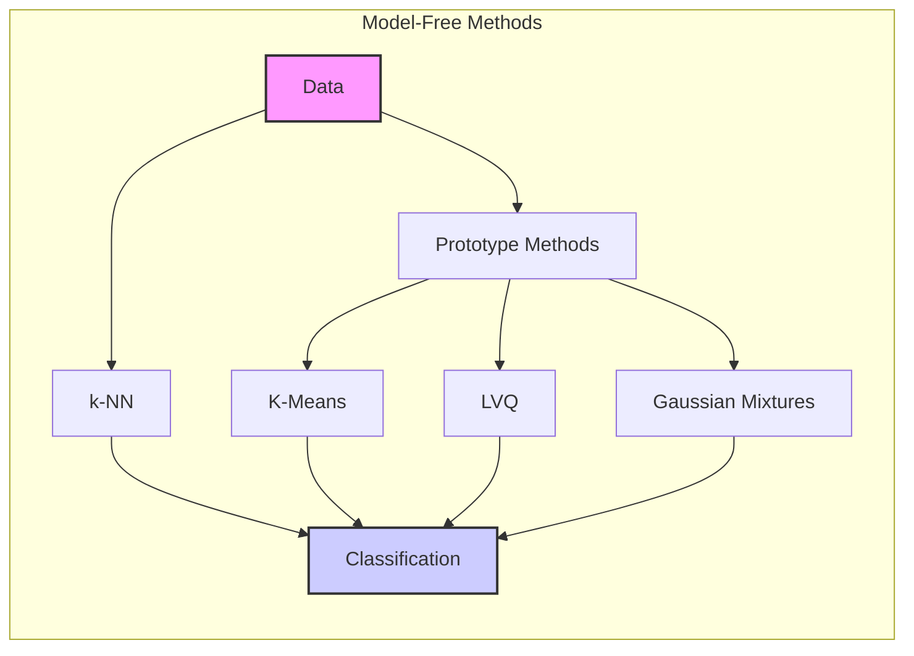
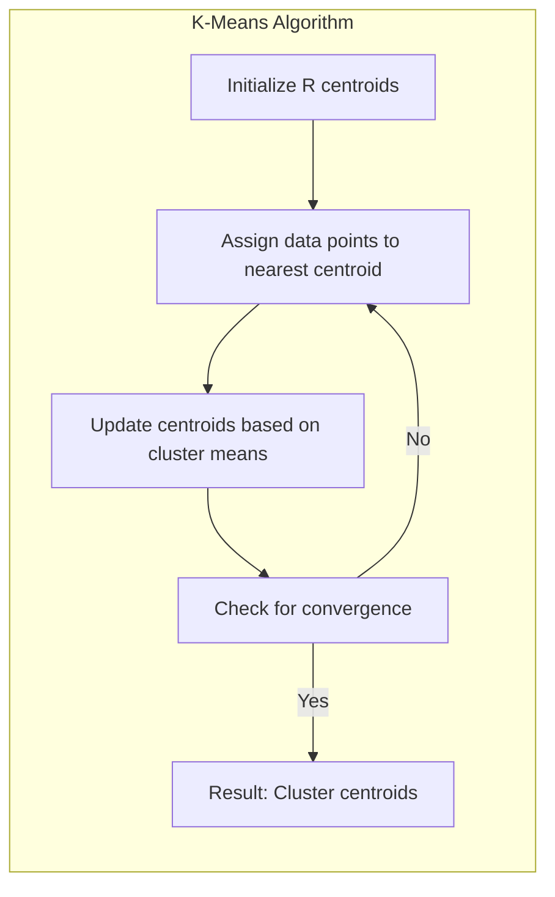
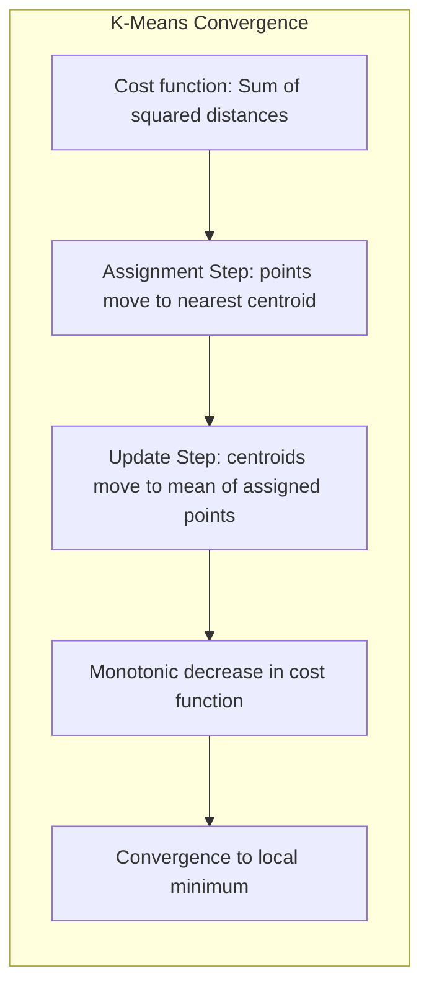
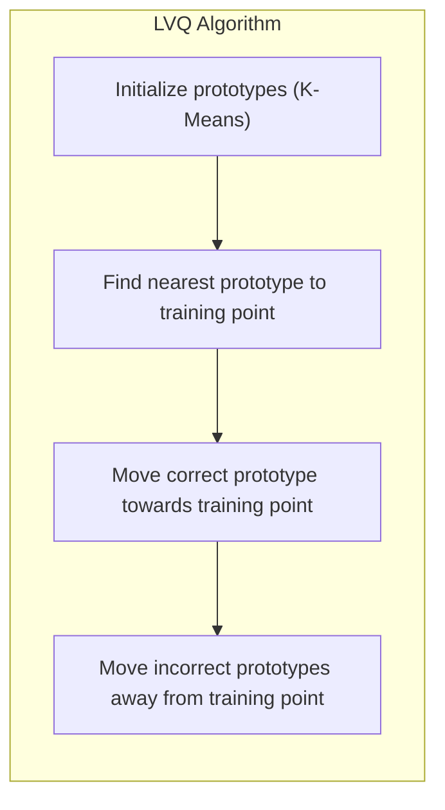
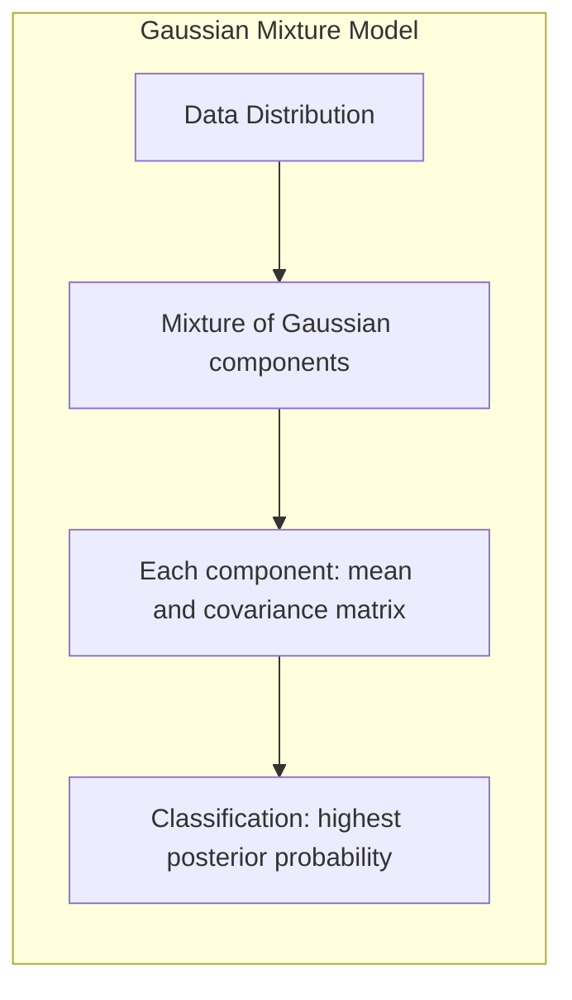
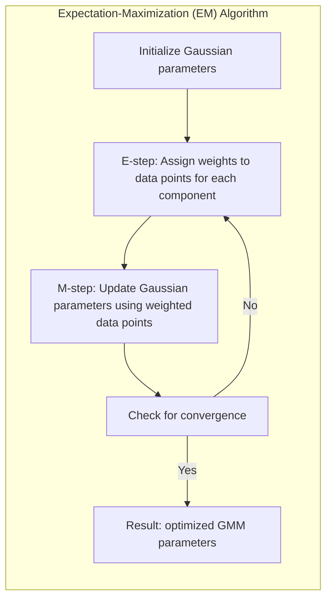
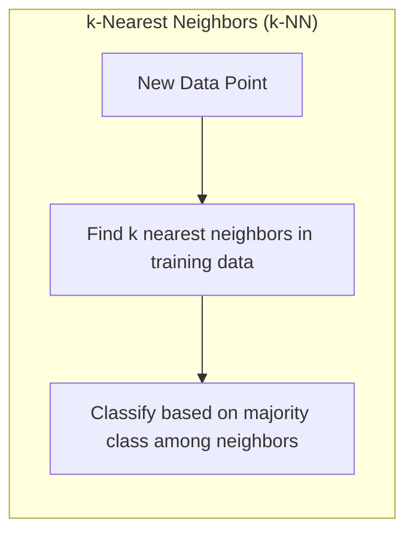
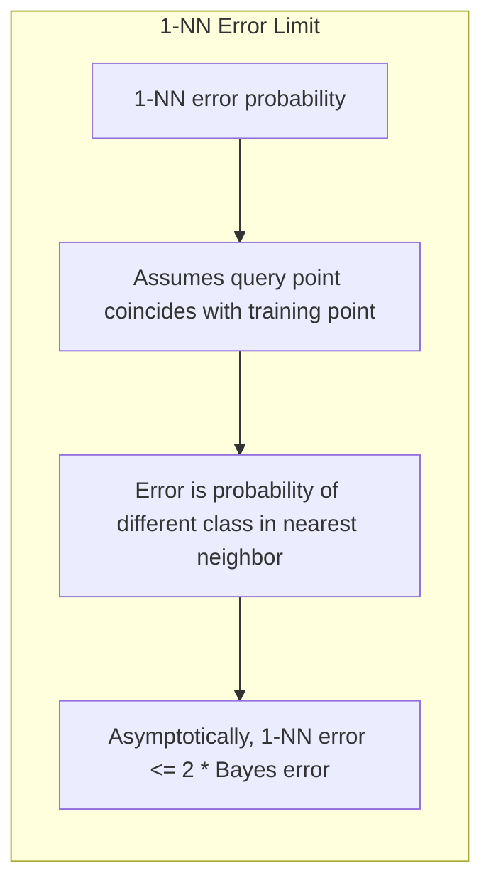
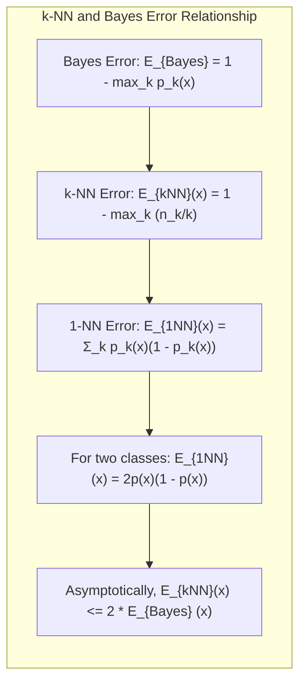

## Métodos *Model-Free*: Eficácia e Aplicações como Caixas-Pretas

### Introdução

Este capítulo aprofunda a discussão sobre métodos de classificação e reconhecimento de padrões que são, em essência, *model-free*, com um foco específico em sua eficácia em cenários do mundo real [^13.1]. Ao contrário de modelos lineares que buscam relações interpretáveis, as técnicas *model-free* são frequentemente utilizadas como "caixas-pretas" (*black boxes*), priorizando a precisão preditiva em detrimento da interpretação da relação entre as *features* e os resultados [^13.1]. Esta seção analisa porque estas técnicas, apesar de sua simplicidade conceitual, frequentemente se destacam em problemas complexos, incluindo aqueles com alta dimensionalidade e não linearidade. Exploraremos tanto as abordagens de protótipos (K-means, LVQ, Misturas Gaussianas) quanto as de k-vizinhos mais próximos (k-NN) para entender suas capacidades e limitações [^13.1].

### Métodos de Protótipos: K-Means, LVQ e Misturas Gaussianas

Os métodos de protótipos, que incluem **K-Means**, **Learning Vector Quantization (LVQ)** e **Misturas Gaussianas**, são técnicas poderosas para classificação e reconhecimento de padrões devido à sua capacidade de representar a distribuição dos dados por um conjunto de pontos representativos, os protótipos.

**K-Means Clustering:** O K-Means é um algoritmo de *clustering* que visa particionar os dados em $R$ grupos (clusters), onde $R$ é um hiperparâmetro a ser definido. O algoritmo busca encontrar os centros de cada cluster, de forma a minimizar a variância intra-cluster [^13.2]. A cada iteração, o K-means alterna entre a atribuição de pontos ao cluster mais próximo e a atualização do centroide de cada cluster [^13.2]. Embora o K-means seja tradicionalmente usado para *clustering* não supervisionado, ele pode ser aplicado à classificação de dados rotulados ao aplicar o algoritmo separadamente a cada classe, e usando os centros encontrados como protótipos [^13.2].

> 💡 **Exemplo Numérico:**
> Suponha que temos um conjunto de dados bidimensional com 6 pontos, representados pelas coordenadas: (1, 1), (1, 2), (2, 1), (5, 5), (6, 6), e (5, 6). Queremos usar o K-Means para criar 2 clusters (R=2).
>
> **Passo 1: Inicialização:** Escolhemos aleatoriamente dois pontos como centroides iniciais, por exemplo, (1, 1) e (6, 6).
>
> **Passo 2: Atribuição:** Calculamos a distância Euclidiana de cada ponto aos centroides e atribuímos cada ponto ao cluster do centroide mais próximo.
>
>   - Ponto (1,1): Distância para (1,1) = 0, Distância para (6,6) = 7.07. Atribuído ao Cluster 1.
>   - Ponto (1,2): Distância para (1,1) = 1, Distância para (6,6) = 6.71. Atribuído ao Cluster 1.
>   - Ponto (2,1): Distância para (1,1) = 1, Distância para (6,6) = 6.40. Atribuído ao Cluster 1.
>   - Ponto (5,5): Distância para (1,1) = 5.66, Distância para (6,6) = 1.41. Atribuído ao Cluster 2.
>   - Ponto (6,6): Distância para (1,1) = 7.07, Distância para (6,6) = 0. Atribuído ao Cluster 2.
>   - Ponto (5,6): Distância para (1,1) = 6.40, Distância para (6,6) = 1. Atribuído ao Cluster 2.
>
> **Passo 3: Atualização:** Calculamos os novos centroides como a média dos pontos em cada cluster.
>
>   - Novo centroide do Cluster 1: ((1+1+2)/3, (1+2+1)/3) = (1.33, 1.33)
>   - Novo centroide do Cluster 2: ((5+6+5)/3, (5+6+6)/3) = (5.33, 5.67)
>
> **Passo 4: Repetição:** Repetimos os passos 2 e 3 até que os centroides não mudem significativamente ou um número máximo de iterações seja atingido. Após algumas iterações, os centroides convergem para aproximadamente (1.33, 1.33) e (5.33, 5.67), com os pontos (1,1), (1,2), e (2,1) no primeiro cluster e (5,5), (6,6), e (5,6) no segundo.

**Lemma 5:** O algoritmo K-means converge para um mínimo local da função de custo, que é definida como a soma das distâncias quadráticas de cada ponto ao centroide de seu cluster.
*Prova*: A cada iteração, o K-means garante que a função de custo diminua: na fase de atribuição, cada ponto é movido para o centroide mais próximo, e na fase de atualização, os centroides são movidos para a média dos pontos a eles atribuídos, o que também diminui a variância intra-cluster. Como a função de custo é limitada e decrescente a cada iteração, o algoritmo converge para um mínimo local [^13.2]. $\blacksquare$

**Learning Vector Quantization (LVQ):** O LVQ, inspirado no K-Means, é um método de aprendizado supervisionado que ajusta protótipos de acordo com a classe de cada ponto de treino. O LVQ inicializa um conjunto de protótipos (geralmente usando uma solução K-means) para cada classe e, a cada iteração, move os protótipos da classe correta na direção de cada ponto de treino, e move os protótipos das classes erradas na direção oposta [^13.2]. O LVQ tende a afastar os protótipos das fronteiras de decisão, o que melhora o desempenho da classificação [^13.2].

> 💡 **Exemplo Numérico:**
> Imagine que temos duas classes (A e B) e dois protótipos por classe, inicializados em (1,1) e (2,2) para a classe A e (5,5) e (6,6) para a classe B. Temos um ponto de treino (1.5, 1.5) da classe A. A taxa de aprendizagem inicial é $\epsilon = 0.1$.
>
> **Passo 1: Encontrar o protótipo mais próximo:** O protótipo mais próximo a (1.5, 1.5) é (1,1) da classe A.
>
> **Passo 2: Atualizar o protótipo correto:** O protótipo (1,1) é movido na direção do ponto de treino (1.5, 1.5):
>
>   - Novo protótipo: (1,1) + $\epsilon$ * ((1.5, 1.5) - (1,1)) = (1,1) + 0.1 * (0.5, 0.5) = (1.05, 1.05).
>
> **Passo 3: Atualizar protótipos incorretos:** Os protótipos da classe B (5,5) e (6,6) são movidos na direção oposta ao ponto de treino:
>
>  - Novo protótipo (5,5): (5,5) - $\epsilon$ * ((1.5, 1.5) - (5,5)) = (5,5) - 0.1 * (-3.5, -3.5) = (5.35, 5.35)
>  - Novo protótipo (6,6): (6,6) - $\epsilon$ * ((1.5, 1.5) - (6,6)) = (6,6) - 0.1 * (-4.5, -4.5) = (6.45, 6.45)
>
> A cada iteração, a taxa de aprendizagem $\epsilon$ decresce, e os protótipos convergem para posições que melhor separam as classes.

**Corolário 5:** A taxa de aprendizagem (learning rate) do LVQ, $\epsilon$, deve ser decrescente com o tempo para garantir a convergência do algoritmo. O valor inicial e a velocidade de decaimento da taxa de aprendizagem são importantes para o desempenho do modelo [^13.2].

**Misturas Gaussianas:** As Misturas Gaussianas (Gaussian Mixture Models - GMMs) modelam a distribuição dos dados como uma combinação linear de densidades Gaussianas. Cada componente Gaussiana representa um cluster, e cada cluster é caracterizado por um centroide e uma matriz de covariância [^13.2.3]. A classificação de um novo ponto é feita atribuindo-o à componente Gaussiana que produz a maior probabilidade *a posteriori* [^13.2.3]. O ajuste dos parâmetros de uma GMM é feito usando o algoritmo Expectation-Maximization (EM), que alterna entre a atribuição de pesos a cada ponto para cada cluster (E-step) e a atualização dos parâmetros dos clusters (M-step) [^13.2.3].

> 💡 **Exemplo Numérico:**
> Suponha que temos um conjunto de dados com duas classes, e modelamos cada classe com uma Gaussiana. Inicializamos duas Gaussianas com médias $\mu_1 = [1, 1]$ e $\mu_2 = [5, 5]$ e matrizes de covariância $\Sigma_1 = \begin{bmatrix} 1 & 0 \\ 0 & 1 \end{bmatrix}$ e $\Sigma_2 = \begin{bmatrix} 1 & 0 \\ 0 & 1 \end{bmatrix}$.
>
> **Passo 1: Expectation (E-step):** Para cada ponto de dado $x$, calculamos a probabilidade de que ele pertença a cada Gaussiana (usando as densidades gaussianas). Por exemplo, para um ponto $x = [2,2]$, calculamos:
>
>   - $p(x|\mu_1, \Sigma_1) = \frac{1}{2\pi \sqrt{|\Sigma_1|}} \exp(-\frac{1}{2}(x-\mu_1)^T \Sigma_1^{-1}(x-\mu_1)) \approx 0.15$
>   - $p(x|\mu_2, \Sigma_2) = \frac{1}{2\pi \sqrt{|\Sigma_2|}} \exp(-\frac{1}{2}(x-\mu_2)^T \Sigma_2^{-1}(x-\mu_2)) \approx 0.00002$
>
>   Normalizamos as probabilidades para obter as probabilidades a posteriori, por exemplo, $P(cluster=1|x) = \frac{0.15}{0.15+0.00002} \approx 1$.
>
> **Passo 2: Maximization (M-step):** Atualizamos as médias e covariâncias de cada Gaussiana, usando os pesos calculados no passo E.
>
>   - Nova média $\mu_1$: A média dos pontos ponderada pela sua probabilidade de pertencer ao cluster 1.
>   - Nova covariância $\Sigma_1$: A covariância dos pontos ponderada pela sua probabilidade de pertencer ao cluster 1.
>
> Repetimos os passos E e M até que os parâmetros das Gaussianas convirjam.

> ⚠️ **Nota Importante**: A escolha do número de protótipos (K no K-Means, R no LVQ, número de componentes em GMMs) influencia significativamente a capacidade do modelo de aproximar a distribuição dos dados. A validação cruzada é uma técnica importante para escolher o valor adequado [^13.3.1].

> ❗ **Ponto de Atenção**: As Misturas Gaussianas podem fornecer fronteiras de decisão mais suaves do que o K-means, mas a escolha do número de componentes (protótipos) também é crítica para o bom desempenho do modelo [^13.2.3].

> ✔️ **Destaque**: O LVQ tende a posicionar os protótipos de forma mais estratégica em relação às fronteiras de decisão, o que frequentemente resulta em maior acurácia do que o K-means [^13.2.2].

### k-Nearest Neighbors (k-NN): Eficácia e Limitações

O método de **k-Nearest Neighbors (k-NN)** é um classificador *memory-based*, isto é, não requer um modelo a ser ajustado [^13.3]. Em vez disso, para classificar um novo ponto, o algoritmo busca os $k$ pontos de treino mais próximos a ele (usando alguma métrica de distância, geralmente a distância Euclidiana) e classifica o novo ponto de acordo com a classe majoritária entre esses vizinhos [^13.3].

O k-NN é eficaz porque se baseia na premissa de que pontos próximos no espaço de *features* tendem a pertencer à mesma classe. A escolha do valor de $k$ influencia o comportamento do classificador: valores pequenos de $k$ tornam o modelo mais sensível ao ruído, enquanto valores grandes tendem a suavizar as fronteiras de decisão [^13.3].

> 💡 **Exemplo Numérico:**
> Considere um conjunto de dados com 10 pontos, onde 5 pertencem à classe A e 5 à classe B. As coordenadas dos pontos são:
>
> Classe A: (1,1), (1,2), (2,1), (2,2), (1.5, 1.5)
> Classe B: (5,5), (5,6), (6,5), (6,6), (5.5, 5.5)
>
> Queremos classificar um novo ponto (3,3) usando k-NN com k=3.
>
> **Passo 1: Calcular as distâncias:** Calculamos a distância Euclidiana entre o ponto (3,3) e todos os pontos de treino.
>
>   - Distâncias para os pontos da Classe A: 2.83, 2.24, 2.24, 1.41, 2.12
>   - Distâncias para os pontos da Classe B: 2.83, 3.16, 3.16, 4.24, 3.54
>
> **Passo 2: Encontrar os k vizinhos mais próximos:** Os 3 vizinhos mais próximos são (2,2), (1.5, 1.5), e (2,1), todos da classe A.
>
> **Passo 3: Classificar:** Como os 3 vizinhos mais próximos são da classe A, classificamos o ponto (3,3) como da classe A.
>
> Se usássemos k=5, os 5 vizinhos mais próximos seriam (2,2), (1.5, 1.5), (2,1), (1,2) e (1,1), todos da classe A, e o resultado seria o mesmo.

**Lemma 6:** O erro do classificador de 1-vizinho mais próximo é assintoticamente limitado a duas vezes o erro de Bayes, isto é, o erro mínimo possível.
*Prova*: A prova deste resultado, inicialmente apresentado por Cover e Hart (1967), assume que o ponto de consulta coincide com um ponto de treino (condição assintótica). Nesse caso, o erro do 1-NN é a probabilidade de que o vizinho mais próximo tenha uma classe diferente, que é, em média, duas vezes a probabilidade de erro de Bayes [^13.3]. $\blacksquare$

Embora o k-NN seja eficaz em muitos problemas, ele tem algumas limitações. Primeiro, a computação das distâncias entre um novo ponto e todos os pontos de treino pode ser custosa em conjuntos de dados grandes e de alta dimensionalidade. Segundo, o k-NN é suscetível à maldição da dimensionalidade, onde a densidade dos dados diminui com o aumento da dimensão, fazendo com que os vizinhos mais próximos sejam menos representativos da distribuição local [^13.4].

**Corolário 6:** Métodos de redução de dimensionalidade podem ser combinados com o k-NN para mitigar os efeitos da maldição da dimensionalidade. A seleção de *features* ou a projeção dos dados em um subespaço de baixa dimensão podem melhorar o desempenho do k-NN em problemas de alta dimensionalidade.

> ⚠️ **Ponto Crucial**:  O valor de k (número de vizinhos) tem um impacto significativo no desempenho do k-NN. A escolha de k deve ser feita via validação cruzada, de forma a minimizar o erro de classificação [^13.3].

> ❗ **Ponto de Atenção**:  Em problemas com alta dimensionalidade, a distância Euclidiana pode se tornar menos informativa devido à maldição da dimensionalidade. Métricas de distância adaptativas ou redução de dimensionalidade podem ser necessárias [^13.4].

> ✔️ **Destaque**:  Em problemas onde as fronteiras de decisão são complexas e não lineares, o k-NN pode superar modelos lineares tradicionais, pois ele não assume uma forma específica para a fronteira de decisão [^13.3].

### Casos de Sucesso: Aplicações em Dados Reais

As técnicas *model-free* têm sido aplicadas com sucesso em uma ampla variedade de problemas do mundo real. Um exemplo notável é a classificação de dígitos manuscritos, onde o k-NN, junto com o uso de distâncias invariantes e tangentes, têm demonstrado alto desempenho, conforme reportado em experimentos do projeto STATLOG [^13.3.3], [^13.3.2]. Em outro estudo de caso, o k-NN alcançou resultados superiores na classificação de cenas de imagens de satélite, sendo capaz de identificar diferentes tipos de uso do solo a partir de imagens multiespectrais [^13.3.2].

Esses exemplos ilustram a capacidade das técnicas *model-free* de lidar com dados complexos, onde a modelagem explícita pode ser difícil. Como "caixas pretas", esses métodos se adaptam à estrutura dos dados sem impor suposições fortes, o que os torna particularmente úteis em situações com grande incerteza e complexidade.

### Pergunta Teórica Avançada: Demonstração formal da relação entre o erro do k-NN e o erro de Bayes
**Resposta:**
A relação entre o erro do k-NN e o erro de Bayes é um resultado fundamental em aprendizado estatístico. Considere um problema de classificação com $K$ classes, onde $p_k(x)$ é a probabilidade condicional de que um ponto $x$ pertença à classe $k$. O erro de Bayes é o erro mínimo possível, dado por $E_{Bayes} = 1 - \max_k p_k(x)$.

Para o k-NN, seja $C_k(x)$ o conjunto dos $k$ vizinhos mais próximos de $x$ e seja $n_k$ o número de vizinhos em $C_k(x)$ que pertencem à classe $k$. O erro do k-NN é dado por $E_{kNN}(x) = 1 - \frac{\max_k n_k}{k}$.

Se $k=1$, então $E_{1NN}(x)$ é o erro do classificador 1-NN, que é dado por $E_{1NN}(x) = \sum_{k=1}^K p_k(x)(1-p_k(x))$.
Para um problema de duas classes (K=2), seja $p(x) = p_1(x)$. O erro do 1-NN é $E_{1NN}(x) = p(x)(1-p(x)) + (1-p(x))p(x) = 2p(x)(1-p(x))$. Enquanto o erro de Bayes é $E_{Bayes} = 1 - \max\{p(x), 1-p(x)\}$.

Quando $p(x) = 0.5$, então $E_{Bayes} = 0.5$ e $E_{1NN}(x) = 0.5$. Quando $p(x) = 0$ ou $p(x)=1$, então $E_{Bayes} = 0$ e $E_{1NN}(x)=0$. Pode ser demonstrado que $E_{1NN}(x) \leq 2E_{Bayes}(x)$.
Quando k>1, o erro do k-NN também converge para um erro limitado pelo dobro do erro de Bayes, com uma taxa de convergência que depende de $k$ e da estrutura dos dados [^13.3]. O resultado assintótico assume que a distribuição dos dados em torno de $x$ é suave, e $k$ tende ao infinito enquanto $k/n \to 0$.

### Conclusão

Os métodos *model-free* oferecem uma abordagem alternativa para classificação e reconhecimento de padrões, especialmente eficazes como *black boxes* em problemas do mundo real. A flexibilidade dos métodos de protótipos e a simplicidade do k-NN permitem que eles se adaptem a complexidades que os modelos lineares tradicionais podem ter dificuldades em capturar. Embora a interpretabilidade seja sacrificada, o desempenho preditivo dessas técnicas frequentemente justifica seu uso, especialmente quando se prioriza a precisão em detrimento da compreensão detalhada da relação entre *features* e resultados. A escolha do método mais adequado depende das características do problema, incluindo o tamanho do conjunto de dados, a dimensionalidade, a complexidade das fronteiras de decisão e a necessidade de interpretabilidade.

### Footnotes

[^13.1]: "In this chapter we discuss some simple and essentially model-free methods for classification and pattern recognition. Because they are highly unstructured, they typically are not useful for understanding the nature of the relationship between the features and class outcome. However, as black box prediction engines, they can be very effective, and are often among the best performers in real data problems." *(Trecho de  "13. Prototype Methods and Nearest-Neighbors")*

[^13.2]: "Throughout this chapter, our training data consists of the N pairs (x1,91),...,(xn, 9N) where gi is a class label taking values in {1, 2, . . ., K}. Prototype methods represent the training data by a set of points in feature space. These prototypes are typically not examples from the training sample, except in the case of 1-nearest-neighbor classification discussed later. Each prototype has an associated class label, and classification of a query point x is made to the class of the closest prototype. "Closest" is usually defined by Euclidean distance in the feature space, after each feature has been standardized to have overall mean 0 and variance 1 in the training sample." *(Trecho de "13. Prototype Methods and Nearest-Neighbors")*

[^13.2.1]: "K-means clustering is a method for finding clusters and cluster centers in a set of unlabeled data. One chooses the desired number of cluster centers, say R, and the K-means procedure iteratively moves the centers to minimize the total within cluster variance. Given an initial set of centers, the K-means algorithm alternates the two steps: for each center we identify the subset of training points (its cluster) that is closer to it than any other center; the means of each feature for the data points in each cluster are computed, and this mean vector becomes the new center for that cluster." *(Trecho de "13. Prototype Methods and Nearest-Neighbors")*

[^13.2.2]: "In this technique due to Kohonen (1989), prototypes are placed strategically with respect to the decision boundaries in an ad-hoc way. LVQ is an online algorithm-observations are processed one at a time. The idea is that the training points attract prototypes of the correct class, and repel other prototypes. When the iterations settle down, prototypes should be close to the training points in their class. The learning rate e is decreased to zero with each iteration, following the guidelines for stochastic approximation learning rates." *(Trecho de "13. Prototype Methods and Nearest-Neighbors")*

[^13.2.3]: "The Gaussian mixture model can also be thought of as a prototype method, similar in spirit to K-means and LVQ. We discuss Gaussian mixtures in some detail in Sections 6.8, 8.5 and 12.7. Each cluster is described in terms of a Gaussian density, which has a centroid (as in K-means), and a covariance matrix. The comparison becomes crisper if we restrict the component Gaussians to have a scalar covariance matrix" * (Trecho de "13. Prototype Methods and Nearest-Neighbors")*

[^13.3]: "These classifiers are memory-based, and require no model to be fit. Given a query point xo, we find the k training points x(r), r = 1,..., k closest in distance to xo, and then classify using majority vote among the k neighbors." *(Trecho de "13. Prototype Methods and Nearest-Neighbors")*

[^13.3.1]: "We tested the nearest-neighbors, K-means and LVQ classifiers on two simulated problems. There are 10 independent features Xj, each uniformly distributed on [0, 1]. The two-class 0-1 target variable is defined as follows: Y = I{X1 > 1/2}; problem 1: "easy", Y = I{sign [Π(Xj − 1/2) > 0]}; problem 2: "difficult." Figure 13.5 shows the mean and standard error of the misclassification error for nearest-neighbors, K-means and LVQ over ten realizations, as the tuning parameters are varied. We see that K-means and LVQ give nearly identical results. For the best choices of their tuning parameters, K-means and LVQ outperform nearest-neighbors for the first problem, and they perform similarly for the second problem. Notice that the best value of each tuning parameter is clearly situation dependent." *(Trecho de "13. Prototype Methods and Nearest-Neighbors")*

[^13.3.2]: "The STATLOG project (Michie et al., 1994) used part of a LANDSAT image as a benchmark for classification (82 × 100 pixels). Figure 13.6 shows four heat-map images...Five-nearest-neighbors produced the predicted map shown in the bottom right panel...For each pixel we extracted an 8-neighbor feature map-the pixel itself and its 8 immediate neighbors..." *(Trecho de "13. Prototype Methods and Nearest-Neighbors")*

[^13.3.3]: "In some problems, the training features are invariant under certain natural transformations. The nearest-neighbor classifier can exploit such invariances by incorporating them into the metric used to measure the distances between objects. Here we give an example where this idea was used with great success...The problem is handwritten digit recognition" * (Trecho de "13. Prototype Methods and Nearest-Neighbors")*

[^13.4]: "When nearest-neighbor classification is carried out in a high-dimensional feature space, the nearest neighbors of a point can be very far away, causing bias and degrading the performance of the rule...In general, this calls for adapting the metric used in nearest-neighbor classification..." *(Trecho de "13. Prototype Methods and Nearest-Neighbors")*

[^13.3]: "These classifiers are memory-based, and require no model to be fit. Given a query point xo, we find the k training points x(r), r = 1,..., k closest in distance to xo, and then classify using majority vote among the k neighbors." *(Trecho de "13. Prototype Methods and Nearest-Neighbors")*
