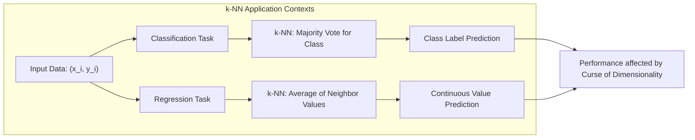
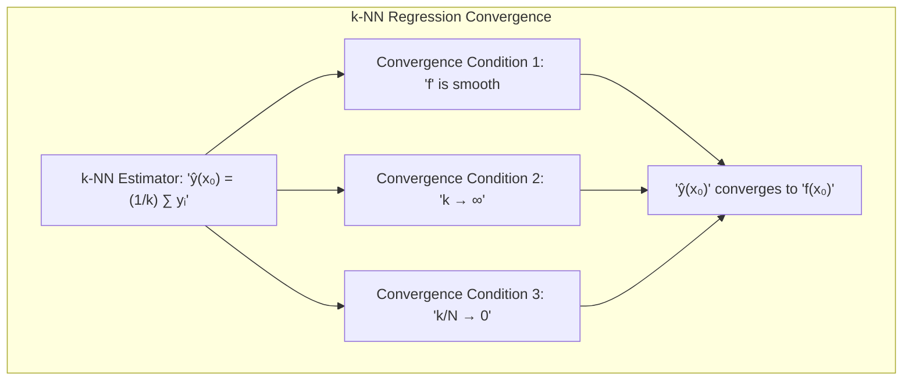
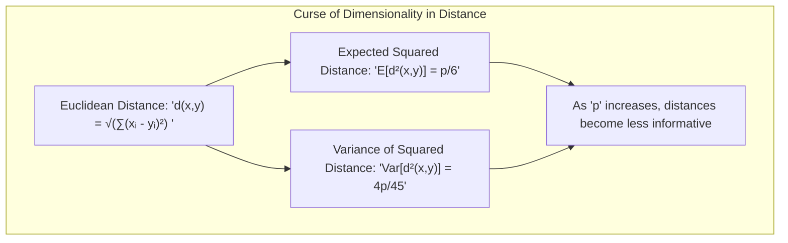
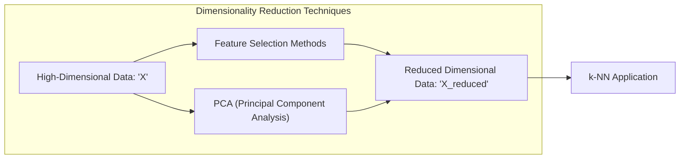
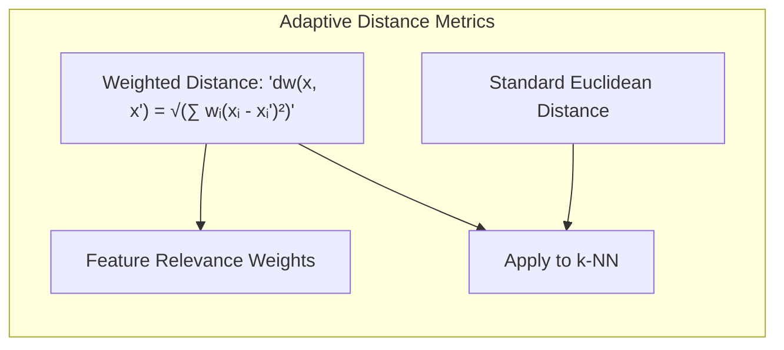
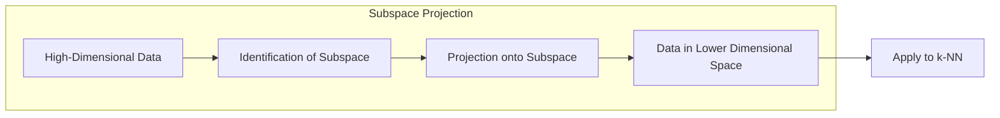
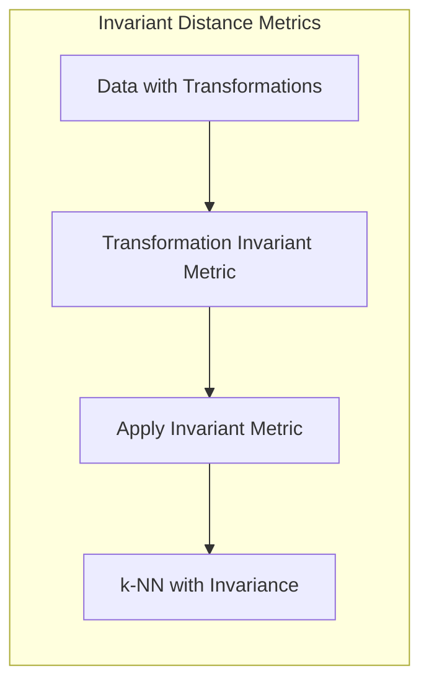

## Vizinhos Mais Próximos: Relevância em Regressão e Classificação, e Limitações da Dimensionalidade



### Introdução

Este capítulo aprofunda a análise do método dos **vizinhos mais próximos (Nearest Neighbors - NN)**, explorando sua relevância tanto em problemas de regressão quanto de classificação [^13.1]. Embora o foco principal deste capítulo tenha sido na classificação, a técnica dos vizinhos mais próximos também pode ser utilizada para regressão, onde o objetivo é prever um valor contínuo em vez de uma classe discreta. Abordaremos as diferenças na aplicação do método em cada contexto, bem como as limitações que surgem em problemas de alta dimensionalidade, particularmente na regressão, devido à maldição da dimensionalidade [^13.1]. A análise incluirá também as adaptações necessárias para mitigar os efeitos da alta dimensionalidade, permitindo que o método continue a ser uma ferramenta eficaz mesmo em espaços de *features* complexos.

### Vizinhos Mais Próximos em Regressão

Em problemas de regressão, o objetivo é estimar uma variável dependente contínua $Y$ com base em um conjunto de variáveis independentes (features) $X$. O método dos **k-vizinhos mais próximos (k-NN)** para regressão adapta a lógica de proximidade utilizada na classificação para prever valores contínuos [^13.1]. A diferença principal reside na forma como as informações dos vizinhos são agregadas. Enquanto na classificação utiliza-se a votação majoritária para determinar a classe, na regressão, a média dos valores de $Y$ dos k vizinhos mais próximos é utilizada como previsão para o ponto de consulta $x_0$.

Formalmente, dado um conjunto de dados de treino $\{(x_i, y_i)\}_{i=1}^N$, onde $x_i$ é um vetor de *features* e $y_i$ é o valor da variável dependente associada, a previsão para um novo ponto $x_0$ usando o k-NN é dada por:

$$\hat{y}(x_0) = \frac{1}{k} \sum_{x_i \in \mathcal{N}_k(x_0)} y_i$$

Onde $\mathcal{N}_k(x_0)$ denota o conjunto dos $k$ vizinhos mais próximos de $x_0$ no espaço de *features*. A escolha do valor de $k$ em regressão tem um efeito semelhante ao observado na classificação: valores pequenos de $k$ levam a previsões mais sensíveis ao ruído local, enquanto valores grandes tendem a suavizar as previsões e reduzir a variância, mas podem aumentar o viés [^13.1].

> 💡 **Exemplo Numérico:**
>
> Suponha que temos um conjunto de dados de treinamento com os seguintes pontos $(x_i, y_i)$:
>
>  - (1, 2)
>  - (2, 3)
>  - (3, 4)
>  - (4, 6)
>  - (5, 5)
>
> Queremos prever o valor de $y$ para um novo ponto $x_0 = 3.5$ usando k-NN com $k=3$.
>
> 1. **Calculando as distâncias:**
>    - Distância entre $x_0 = 3.5$ e $x_1 = 1$: $|3.5 - 1| = 2.5$
>    - Distância entre $x_0 = 3.5$ e $x_2 = 2$: $|3.5 - 2| = 1.5$
>    - Distância entre $x_0 = 3.5$ e $x_3 = 3$: $|3.5 - 3| = 0.5$
>    - Distância entre $x_0 = 3.5$ e $x_4 = 4$: $|3.5 - 4| = 0.5$
>    - Distância entre $x_0 = 3.5$ e $x_5 = 5$: $|3.5 - 5| = 1.5$
>
> 2. **Encontrando os 3 vizinhos mais próximos:**
>    - Os 3 vizinhos mais próximos são os pontos com $x = 3, x = 4$ e $x = 2$ (note que x=3 e x=4 tem a mesma distância, então escolhemos qualquer um dos dois). Os valores de $y$ correspondentes são 4, 6 e 3.
>
> 3. **Calculando a média dos valores de $y$ dos vizinhos:**
>    - $\hat{y}(3.5) = \frac{4 + 6 + 3}{3} = \frac{13}{3} \approx 4.33$
>
> Portanto, a previsão para $x_0 = 3.5$ usando k-NN com $k=3$ é aproximadamente 4.33.
>
> Se tivéssemos escolhido $k=1$, a previsão seria o valor de $y$ do vizinho mais próximo, que é 4 (correspondente a x=3 ou x=4, qualquer um dos dois). Se tivéssemos escolhido $k=5$, a previsão seria a média de todos os valores de $y$, que seria $\frac{2+3+4+6+5}{5}=4$.

**Lemma 7:** O estimador de k-NN para regressão é um estimador não-paramétrico, isto é, não faz suposições sobre a forma da função de regressão. O estimador converge assintoticamente para a verdadeira função de regressão quando $N \to \infty$ e $k/N \to 0$.
*Prova*: A prova deste resultado depende da suavidade da função de regressão. O estimador k-NN aproxima a função de regressão localmente pela média dos valores de $Y$ dos k vizinhos, e sob certas condições de suavidade e convergência de $k$ em relação ao tamanho do conjunto de dados ($N$), o estimador converge para a verdadeira função de regressão. $\blacksquare$


**Corolário 7:** O k-NN em regressão, assim como na classificação, pode sofrer do problema da dimensionalidade. A densidade de dados diminui à medida que a dimensão do espaço de *features* aumenta, tornando as distâncias menos informativas e afetando a precisão das previsões.

> ⚠️ **Nota Importante**:  A escolha do valor de $k$ em regressão é crucial para o desempenho do modelo. A validação cruzada pode ser usada para escolher um valor de $k$ que equilibre o viés e a variância do estimador [^13.1].

> ❗ **Ponto de Atenção**:  A média simples dos vizinhos pode ser sensível a *outliers*, que podem afetar negativamente a previsão. Métodos de agregação mais robustos, como a mediana, podem ser utilizados em vez da média [^13.3].

### Maldição da Dimensionalidade: Limitações em Regressão

A **maldição da dimensionalidade** é um fenômeno que afeta o desempenho do método dos vizinhos mais próximos, tanto em regressão quanto em classificação, especialmente quando o número de *features* é alto [^13.1]. O problema surge devido à natureza esparsa dos dados em espaços de alta dimensão. À medida que o número de *features* aumenta, a densidade dos dados diminui, e a distância entre os pontos se torna mais uniforme e menos informativa [^13.4].

Em outras palavras, em um espaço de alta dimensão, os vizinhos mais próximos de um ponto de consulta podem não ser verdadeiramente "próximos", pois a distância para todos os pontos tende a convergir para o mesmo valor, especialmente quando os dados estão esparsos. Isso prejudica a capacidade do k-NN de capturar a estrutura local dos dados e realizar previsões ou classificações precisas.

Na regressão, a maldição da dimensionalidade se manifesta de forma mais pronunciada, pois a previsão é feita pela média dos valores da variável dependente dos vizinhos. Se os vizinhos mais próximos não são representativos da vizinhança local devido à alta dimensionalidade, a média pode levar a previsões enviesadas e com alta variância [^13.1].

**Lemma 8:** A distância Euclidiana perde informatividade em espaços de alta dimensão devido à concentração das distâncias. Em outras palavras, à medida que a dimensão aumenta, a distância entre quaisquer dois pontos aleatórios tende a convergir para o mesmo valor, o que dificulta a identificação de vizinhos "próximos" [^13.4].
*Prova*: Seja $x$ e $y$ dois pontos aleatórios em um espaço de $p$ dimensões, onde cada coordenada é amostrada de forma independente de uma distribuição uniforme em $[0,1]$. A distância Euclidiana é dada por $d(x,y) = \sqrt{\sum_{i=1}^p (x_i - y_i)^2}$. A esperança da distância ao quadrado é dada por $E[d^2(x,y)] = \sum_{i=1}^p E[(x_i-y_i)^2] = \frac{p}{6}$. A variância da distância ao quadrado é dada por $Var[d^2(x,y)] = \frac{4p}{45}$. À medida que $p$ aumenta, o valor da distância também cresce, mas a variância da distância também aumenta, mostrando a concentração das distâncias. $\blacksquare$


> 💡 **Exemplo Numérico:**
>
> Imagine um espaço de 1 dimensão (uma linha) onde os pontos são distribuídos uniformemente entre 0 e 1. A distância média entre dois pontos aleatórios será aproximadamente 1/3. Agora, imagine um espaço de 2 dimensões (um plano) onde os pontos são distribuídos uniformemente em um quadrado de lado 1. A distância média entre dois pontos aleatórios será aproximadamente 0.52.
>
> Agora, vamos para um espaço de 10 dimensões, com pontos distribuídos uniformemente em um hipercubo de lado 1. A distância média entre dois pontos aleatórios será aproximadamente 1.29. Se aumentarmos para 100 dimensões, a distância média será aproximadamente 5.16.
>
> O que vemos é que a distância média aumenta com a dimensão. Além disso, a *variância* das distâncias também aumenta, o que significa que as distâncias se tornam menos discriminativas. Em altas dimensões, a distância entre um ponto e seus vizinhos mais próximos se torna muito similar à distância entre esse ponto e outros pontos mais distantes, tornando a noção de "vizinho" menos significativa e prejudicando o desempenho do k-NN.

**Corolário 8:** Métodos de redução de dimensionalidade, como análise de componentes principais (PCA) ou seleção de *features*, podem ser usados para mitigar os efeitos da maldição da dimensionalidade, reduzindo o número de *features* e preservando a estrutura dos dados.

> ⚠️ **Nota Importante**: A maldição da dimensionalidade é mais problemática em regressão do que em classificação devido à forma como as informações dos vizinhos são agregadas (média versus votação), e os métodos de redução de dimensionalidade são fundamentais para o bom desempenho do k-NN em problemas de alta dimensão [^13.1].

> ❗ **Ponto de Atenção**:  A escolha de uma métrica de distância apropriada, que leve em consideração a estrutura dos dados, pode ajudar a melhorar o desempenho do k-NN em espaços de alta dimensionalidade [^13.3].

### Adaptações para Alta Dimensionalidade

Para contornar a maldição da dimensionalidade, várias técnicas podem ser aplicadas em conjunto com o método dos vizinhos mais próximos, tanto em regressão quanto em classificação. Algumas das abordagens mais comuns incluem:

1.  **Redução de Dimensionalidade:** A aplicação de técnicas de redução de dimensionalidade, como PCA, seleção de *features* usando métodos de filtro ou *wrappers*, visa reduzir o número de *features* para apenas aquelas que contêm informações relevantes para a previsão ou classificação [^13.4].

    > 💡 **Exemplo Numérico:**
    >
    > Suponha que temos um conjunto de dados com 100 *features*, mas após aplicar PCA, descobrimos que 20 componentes principais explicam 95% da variância dos dados. Podemos então usar apenas esses 20 componentes para aplicar o k-NN, reduzindo drasticamente a dimensionalidade e mitigando a maldição da dimensionalidade.
    >
    >```python
    >import numpy as np
    >from sklearn.decomposition import PCA
    >
    ># Simulação de dados com 100 features
    >X = np.random.rand(1000, 100)
    >
    ># Aplicando PCA para reduzir a dimensionalidade para 20 componentes
    >pca = PCA(n_components=20)
    >X_reduced = pca.fit_transform(X)
    >
    >print(f"Dimensão original: {X.shape[1]}")
    >print(f"Dimensão após PCA: {X_reduced.shape[1]}")
    >```


2. **Métricas de Distância Adaptativas:** Em vez de usar a distância Euclidiana padrão, podem-se utilizar métricas de distância adaptativas, que levam em consideração a estrutura local dos dados. Essas métricas podem ser aprendidas a partir dos próprios dados e dar mais peso às *features* que são relevantes para a previsão ou classificação [^13.4].

    > 💡 **Exemplo Numérico:**
    >
    > Em um problema de regressão onde algumas *features* são mais relevantes do que outras, podemos usar uma distância ponderada. Por exemplo, se $x_1$ é uma *feature* muito importante e $x_2$ é menos importante, podemos definir uma distância ponderada como:
    >
    > $d_w(x, x') = \sqrt{w_1(x_1 - x_1')^2 + w_2(x_2 - x_2')^2}$, onde $w_1 > w_2$
    >
    > Os pesos $w_1$ e $w_2$ podem ser aprendidos usando métodos de otimização ou heurísticas.

3. **Projeção em Subespaços:** Projetar os dados em subespaços de baixa dimensionalidade, onde os dados são mais concentrados e as distâncias mais informativas, também é uma estratégia eficaz para reduzir o impacto da maldição da dimensionalidade [^13.4].

    > 💡 **Exemplo Numérico:**
    >
    > Imagine que os dados estão distribuídos em uma estrutura linear dentro de um espaço de alta dimensão. Em vez de usar todas as dimensões, podemos projetar os dados nessa estrutura linear (subespaço) de baixa dimensão, onde a distância entre os pontos é mais significativa. Isso pode ser feito usando técnicas como PCA ou análise de subespaços.


4.  **Distâncias Invariantes:** Em problemas onde os dados são invariantes sob certas transformações (por exemplo, rotações ou translações), métricas de distância invariantes podem ser usadas para tornar o k-NN mais robusto a essas transformações [^13.3.3].

    > 💡 **Exemplo Numérico:**
    >
    > Em reconhecimento de imagem, as imagens podem ser rotacionadas ou translacionadas. Nesse caso, usar a distância euclidiana diretamente nas imagens pode não ser ideal. Métricas de distância invariantes a rotações ou translações são mais apropriadas. Por exemplo, a distância entre duas imagens pode ser calculada após alinhar as imagens usando técnicas de alinhamento de imagem.


### Pergunta Teórica Avançada: Derivação da condição para o k-NN em regressão convergir para a função de regressão
**Resposta:**
A convergência do k-NN para regressão, para a função de regressão verdadeira, exige que a função de regressão seja suave e que $k$ tenda ao infinito, enquanto $k/N$ tende a zero. Para entender esta condição, assumimos um modelo de regressão $y = f(x) + \epsilon$, onde $\epsilon$ é um erro aleatório com média zero. O estimador k-NN para regressão é dado por:

$$\hat{f}(x_0) = \frac{1}{k} \sum_{i=1}^k y_{(i)}$$

onde $y_{(i)}$ é o valor da variável dependente do i-ésimo vizinho mais próximo de $x_0$. Para mostrar a convergência do estimador k-NN para a verdadeira função de regressão $f(x_0)$, é necessário analisar seu viés e variância.

O viés do estimador é dado por:
$$Bias(\hat{f}(x_0)) = E[\hat{f}(x_0)] - f(x_0) = E[\frac{1}{k} \sum_{i=1}^k f(x_{(i)})] - f(x_0)$$
Onde $x_{(i)}$ são as *features* dos k vizinhos. Se $f$ é uma função suave e os vizinhos estão próximos de $x_0$, então $f(x_{(i)})$ é próximo de $f(x_0)$, e o viés tende a zero.

A variância do estimador é dada por:
$$Var(\hat{f}(x_0)) = Var(\frac{1}{k} \sum_{i=1}^k y_{(i)}) = \frac{1}{k^2} \sum_{i=1}^k Var(y_{(i)})$$
Assumindo que os erros $\epsilon$ são independentes e com variância $\sigma^2$, e que os $y_{(i)}$ são independentes, temos:
$$Var(\hat{f}(x_0)) = \frac{1}{k} \sigma^2$$
Como a variância decresce com o aumento de $k$, é necessário que $k \to \infty$. Para o viés tender a zero, é necessário que os vizinhos mais próximos estejam perto de $x_0$, o que implica que o raio da vizinhança deve diminuir conforme o número de pontos aumenta, portanto $k/N \to 0$.

Em resumo, o estimador k-NN converge para a verdadeira função de regressão $f(x_0)$ se:
 1.  $f$ é suave
 2.  $k \to \infty$
 3.  $k/N \to 0$

### Conclusão

O método dos vizinhos mais próximos é uma ferramenta versátil, aplicável tanto em problemas de classificação quanto de regressão. No entanto, a maldição da dimensionalidade impõe sérias limitações, especialmente em regressão, tornando a escolha de uma métrica de distância apropriada e a aplicação de métodos de redução de dimensionalidade fundamentais para obter um bom desempenho. A compreensão das limitações e das adaptações necessárias permite que o k-NN continue a ser um método útil em diversas situações, mesmo em problemas complexos com alta dimensionalidade.

### Footnotes

[^13.1]: "In this chapter we discuss some simple and essentially model-free methods for classification and pattern recognition...The nearest-neighbor technique can also be used in regression; this was touched on in Chapter 2 and works reasonably well for low-dimensional problems. However, with high-dimensional features, the bias-variance tradeoff does not work as favorably for nearest-neighbor regression as it does for classification." *(Trecho de "13. Prototype Methods and Nearest-Neighbors")*

[^13.3]: "These classifiers are memory-based, and require no model to be fit. Given a query point xo, we find the k training points x(r), r = 1,..., k closest in distance to xo, and then classify using majority vote among the k neighbors." *(Trecho de "13. Prototype Methods and Nearest-Neighbors")*

[^13.3.3]: "In some problems, the training features are invariant under certain natural transformations. The nearest-neighbor classifier can exploit such invariances by incorporating them into the metric used to measure the distances between objects." *(Trecho de "13. Prototype Methods and Nearest-Neighbors")*

[^13.4]: "When nearest-neighbor classification is carried out in a high-dimensional feature space, the nearest neighbors of a point can be very far away, causing bias and degrading the performance of the rule...In general, this calls for adapting the metric used in nearest-neighbor classification..." *(Trecho de "13. Prototype Methods and Nearest-Neighbors")*
