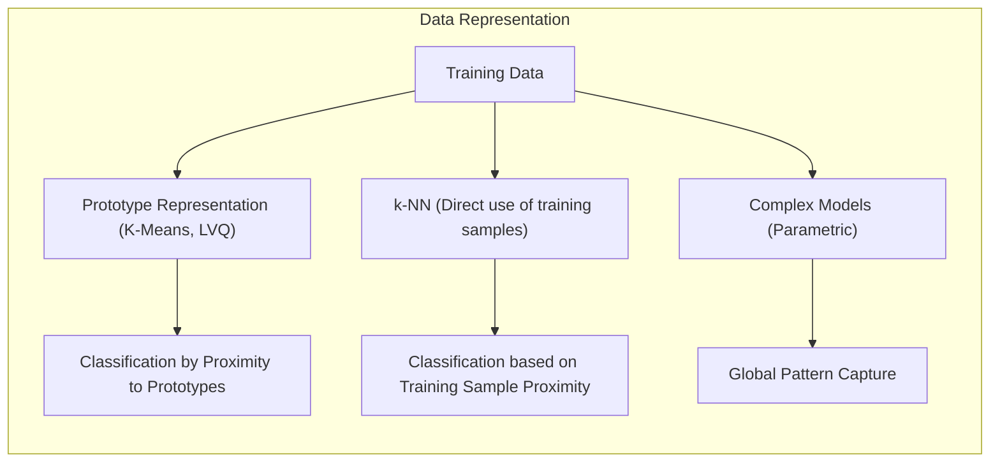
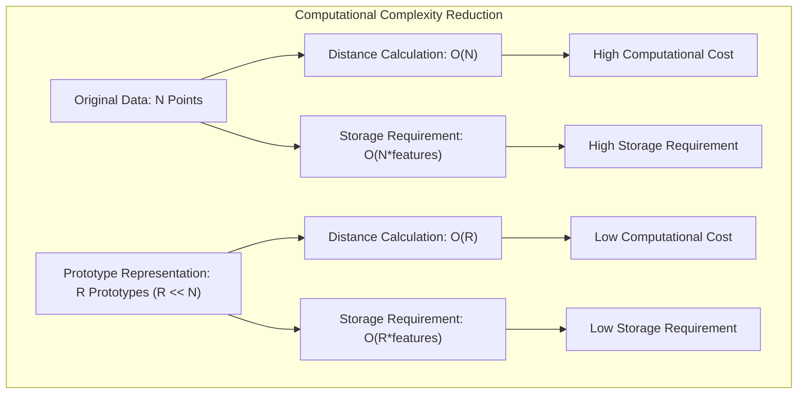
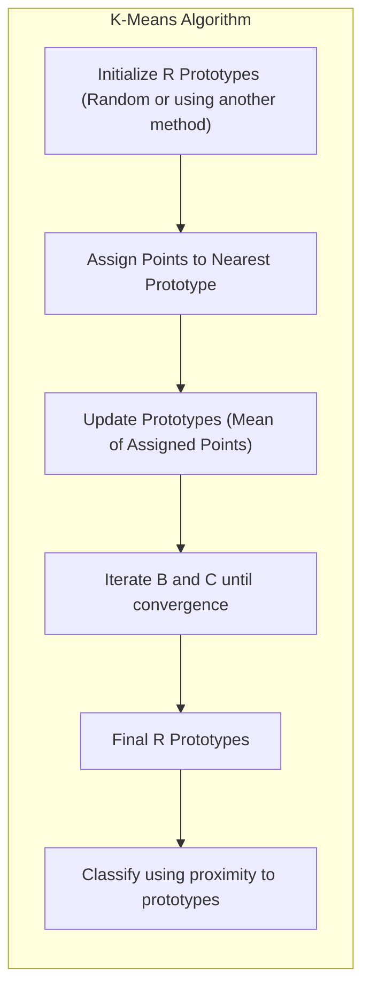
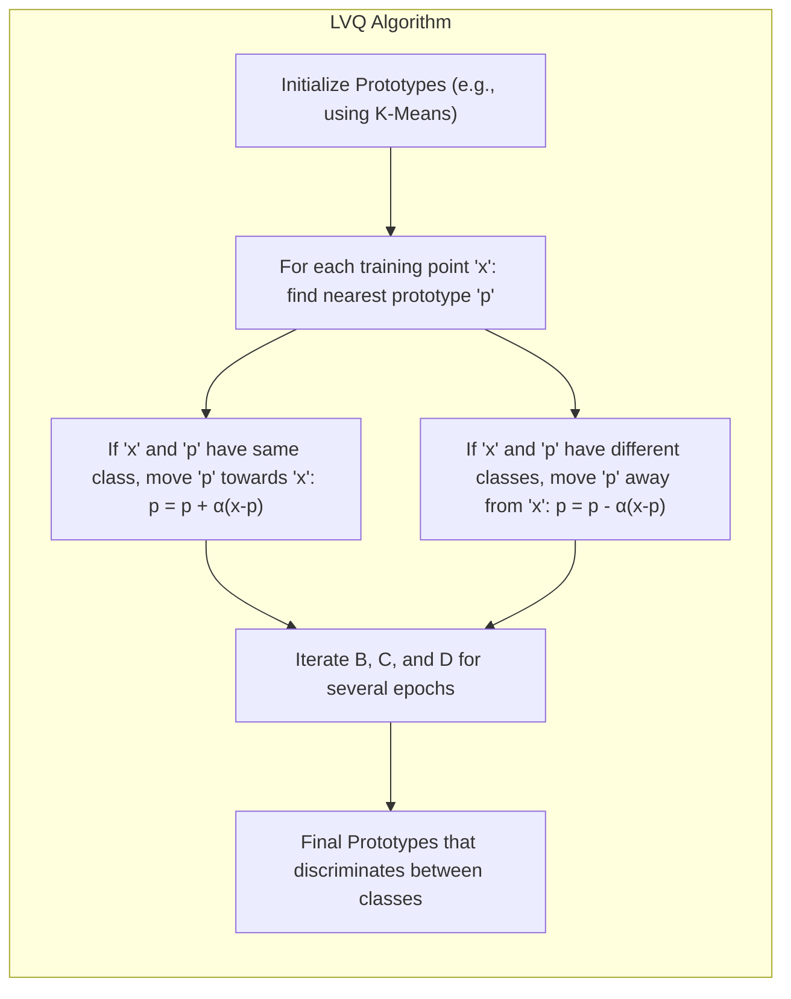
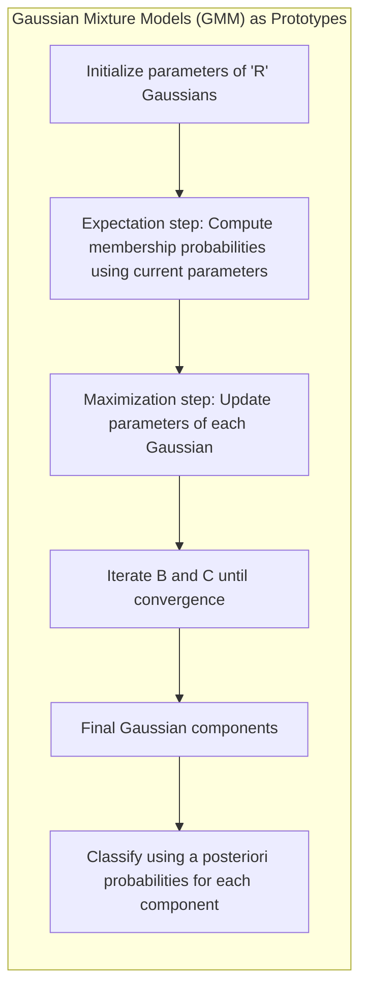
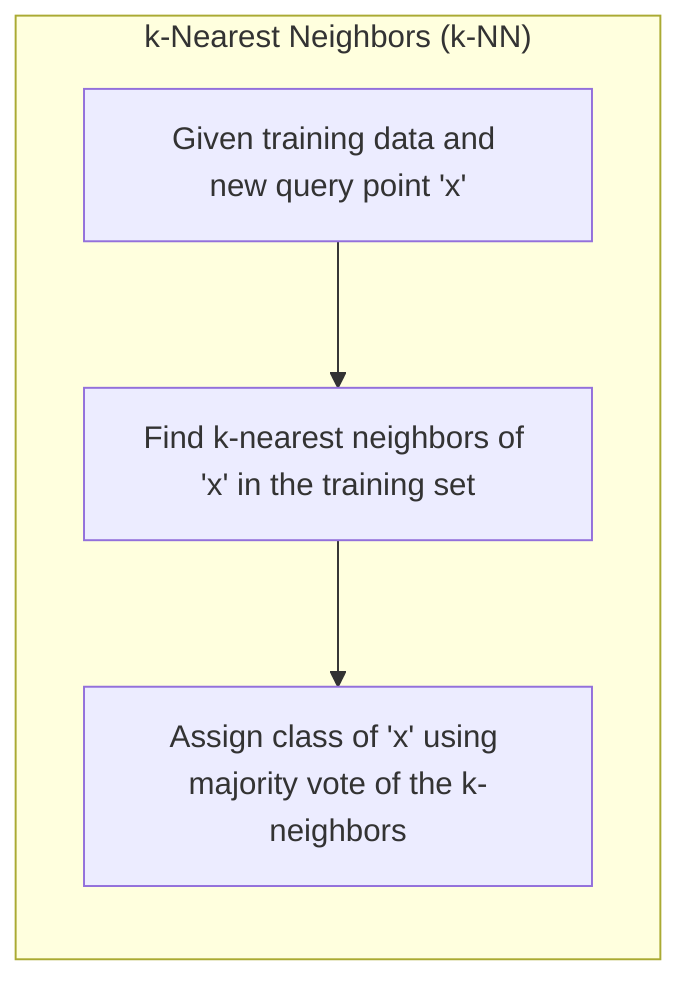
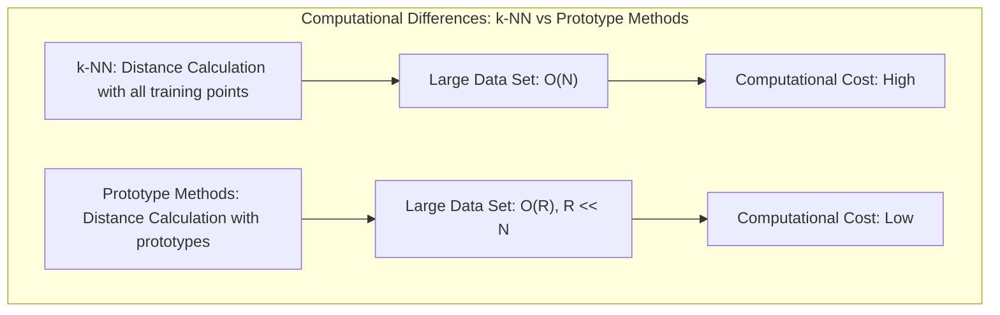

## Representação de Dados de Treinamento via Protótipos: Uma Alternativa a Modelos Complexos

### Introdução

Este capítulo explora o conceito de **representação de dados de treinamento via protótipos**, uma abordagem fundamental em métodos *model-free* de classificação e reconhecimento de padrões [^13.2]. Em vez de construir modelos complexos que tentam capturar padrões globais nos dados, as técnicas baseadas em protótipos representam o conjunto de dados por um conjunto selecionado de pontos no espaço de *features*, que podem ou não ser amostras originais do conjunto de treino. Abordaremos como essa representação simplificada permite classificar novos pontos com base na proximidade a esses protótipos, e como isso contrasta com modelos paramétricos ou outras abordagens de modelagem explícita. Analisaremos as diferentes técnicas que utilizam protótipos, como K-Means, LVQ e Misturas Gaussianas, e como elas se comparam ao método de k-vizinhos mais próximos, onde a representação é feita diretamente pelos dados de treino.

### A Ideia Central: Representação via Protótipos

A ideia central por trás da representação de dados de treinamento via protótipos é substituir a complexidade de um modelo global por um conjunto de pontos representativos no espaço de *features*. Esses protótipos atuam como "âncoras" no espaço de *features*, e a classificação ou previsão de um novo ponto é feita com base em sua proximidade aos protótipos [^13.2].

Ao contrário de modelos paramétricos, que tentam ajustar uma função global aos dados, os métodos baseados em protótipos focam na estrutura local do espaço de *features*, capturando as distribuições das classes por meio da localização estratégica dos protótipos. É importante notar que, em muitos casos, os protótipos não são amostras originais do conjunto de treinamento, mas sim pontos artificiais criados pelo algoritmo para melhor representar as classes [^13.2].

A escolha de onde posicionar os protótipos e como definir a proximidade entre pontos são aspectos cruciais na eficácia desses métodos. Abordagens como K-Means, LVQ e Misturas Gaussianas oferecem diferentes estratégias para determinar a localização dos protótipos e como usá-los para classificação [^13.2].

**Lemma 9:** A representação dos dados por um conjunto de protótipos reduz a complexidade computacional e de armazenamento em comparação com a manutenção do conjunto de dados completo, com o tradeoff potencial de perda de precisão.
*Prova*: A redução de complexidade é óbvia: em vez de armazenar e calcular distâncias com todos os pontos do conjunto de treino, apenas os protótipos são armazenados e comparados com os novos pontos, especialmente em cenários de alta dimensionalidade e grande volume de dados. $\blacksquare$

> 💡 **Exemplo Numérico:**
> Imagine um conjunto de dados com 1000 pontos, cada um com 10 *features*. Em vez de armazenar todos os 1000 pontos, um método de protótipos como o K-Means poderia reduzir essa representação para, digamos, 10 protótipos. Isso significa que, em vez de calcular a distância entre um novo ponto e 1000 pontos, calcularíamos apenas a distância entre o novo ponto e os 10 protótipos. Isso reduz drasticamente a complexidade computacional e a necessidade de armazenamento, especialmente em cenários de alta dimensionalidade. Se cada ponto e protótipo fosse representado por números de ponto flutuante de 64 bits (8 bytes), o armazenamento necessário passaria de 1000 * 10 * 8 = 80.000 bytes para 10 * 10 * 8 = 800 bytes.

**Corolário 9:** A escolha do número de protótipos é um parâmetro crítico que afeta o desempenho do modelo. Um número insuficiente de protótipos pode levar a *underfitting*, enquanto um número excessivo pode levar a *overfitting*, sendo necessário o uso de técnicas de validação cruzada para encontrar o número ideal.

> ⚠️ **Nota Importante**:  O método de protótipos busca representar o conjunto de dados por um número menor de pontos (protótipos) em vez de modelar explicitamente as relações entre *features* e classes. Essa simplificação permite que o modelo se adapte a formas de distribuição complexas que modelos lineares podem ter dificuldade de representar [^13.2].

> ❗ **Ponto de Atenção**: Métodos de protótipos podem ser considerados uma forma de aprendizado supervisionado baseado em representação, onde a localização dos protótipos é ajustada para melhor representar as classes de interesse.

### Métodos de Protótipos em Detalhe: K-Means, LVQ e Misturas Gaussianas

**K-Means:** No K-Means, o objetivo é encontrar um conjunto de $R$ protótipos, ou centros de *clusters*, que minimizem a variância intra-cluster dentro de cada classe [^13.2.1]. O algoritmo K-Means é iterativo e alterna entre a atribuição de pontos a seus protótipos mais próximos e a atualização dos protótipos com base na média dos pontos a eles atribuídos. Embora o K-Means seja inicialmente uma técnica de *clustering* não supervisionado, ele pode ser utilizado para classificação aplicando o algoritmo separadamente a cada classe e utilizando os protótipos resultantes para classificar novos pontos [^13.2.1].

**Lemma 10:** O algoritmo K-Means converge para um mínimo local da função de custo (soma das distâncias quadráticas intra-cluster) e a escolha da inicialização dos protótipos pode influenciar o resultado final da otimização.
*Prova*: Como discutido no capítulo anterior, a cada passo, os pontos são alocados para o centroide mais próximo e os centroides são atualizados, garantindo que a função de custo decresça ou permaneça constante. O algoritmo não garante a convergência para o mínimo global, mas para um mínimo local. $\blacksquare$

> 💡 **Exemplo Numérico:**
> Suponha que temos um conjunto de dados 2D com 10 pontos e queremos usar o K-Means para encontrar 2 protótipos (clusters). Inicializamos os protótipos aleatoriamente:
>
> Protótipo 1: $p_1 = (1, 1)$
> Protótipo 2: $p_2 = (5, 5)$
>
> Os pontos de dados são:
> $x_1 = (1.5, 1.2), x_2 = (1.3, 1.7), x_3 = (1.8, 1.1), x_4 = (2.0, 2.0), x_5 = (4.0, 4.0), x_6 = (4.5, 4.8), x_7 = (5.1, 5.2), x_8 = (5.5, 5.1), x_9 = (3.5, 3.0), x_{10} = (3.0, 3.5)$
>
> **Iteração 1:**
>
> 1.  **Atribuição:** Calculamos a distância euclidiana de cada ponto aos protótipos e atribuímos o ponto ao protótipo mais próximo.
>
>     - Pontos $x_1, x_2, x_3, x_4$ são atribuídos a $p_1$.
>     - Pontos $x_5, x_6, x_7, x_8, x_9, x_{10}$ são atribuídos a $p_2$.
>
> 2.  **Atualização:** Calculamos as médias dos pontos em cada cluster e atualizamos os protótipos.
>
>     - $p_1 = \frac{x_1 + x_2 + x_3 + x_4}{4} = (\frac{1.5+1.3+1.8+2.0}{4}, \frac{1.2+1.7+1.1+2.0}{4}) = (1.65, 1.5)$
>     - $p_2 = \frac{x_5 + x_6 + x_7 + x_8 + x_9 + x_{10}}{6} = (\frac{4.0+4.5+5.1+5.5+3.5+3.0}{6}, \frac{4.0+4.8+5.2+5.1+3.0+3.5}{6}) = (4.27, 4.27)$
>
> **Iteração 2 e seguintes:** Repetimos os passos de atribuição e atualização até que os protótipos parem de se mover significativamente. Os protótipos convergirão para centros dos clusters. Este exemplo ilustra como o K-Means itera até encontrar os protótipos que minimizam a variância intra-cluster.

**Learning Vector Quantization (LVQ):** O LVQ, diferentemente do K-Means, é um algoritmo supervisionado que utiliza informações sobre a classe dos dados para ajustar iterativamente os protótipos [^13.2.2]. O LVQ inicializa os protótipos, muitas vezes usando os resultados do K-Means, e em cada iteração, move os protótipos na direção dos pontos de treino da mesma classe e se afasta dos pontos de treino de classes diferentes. O LVQ busca posicionar os protótipos em locais estratégicos para melhor discriminar as classes [^13.2.2].

**Corolário 10:** A taxa de aprendizagem (learning rate) do LVQ deve decrescer com o tempo, conforme os princípios de otimização estocástica, para garantir que os protótipos não oscilem e possam se estabilizar em uma solução adequada.

> 💡 **Exemplo Numérico:**
> Suponha que temos duas classes (A e B) e dois protótipos, um para cada classe, inicialmente definidos como:
>
> Protótipo A: $p_A = (2, 2)$
> Protótipo B: $p_B = (7, 7)$
>
> Temos um ponto de treinamento $x = (3, 3)$ com classe A. Definimos uma taxa de aprendizagem $\alpha = 0.1$. No LVQ, atualizamos os protótipos da seguinte forma:
>
> 1.  **Encontrar o protótipo mais próximo:** $p_A$ é o protótipo mais próximo de $x$.
>
> 2.  **Atualizar o protótipo:** Como $x$ e $p_A$ são da mesma classe, movemos $p_A$ em direção a $x$:
>    $p_A^{new} = p_A + \alpha(x - p_A) = (2, 2) + 0.1((3, 3) - (2, 2)) = (2, 2) + 0.1(1, 1) = (2.1, 2.1)$
>
> Agora, suponha que o próximo ponto de treinamento seja $y = (6, 6)$ com classe B. O protótipo mais próximo é $p_B$. A atualização seria:
>
>  $p_B^{new} = p_B + \alpha(y - p_B) = (7, 7) + 0.1((6, 6) - (7, 7)) = (7, 7) + 0.1(-1, -1) = (6.9, 6.9)$
>
> Se tivéssemos um ponto de treinamento da classe B próximo de $p_A$, o $p_A$ se afastaria desse ponto, garantindo a discriminação entre as classes. Este exemplo ilustra como o LVQ ajusta os protótipos de acordo com a classe dos dados, refinando as fronteiras de decisão.

**Misturas Gaussianas:** As Misturas Gaussianas (GMMs) também podem ser utilizadas como métodos de protótipos, onde cada componente Gaussiana representa um cluster [^13.2.3]. O algoritmo EM é usado para ajustar os parâmetros das Gaussianas (média e covariância), e a classificação de um novo ponto é feita com base na probabilidade de pertencer a cada componente. As GMMs fornecem uma representação mais suave das distribuições do que o K-Means ou LVQ, mas também requerem a escolha do número de componentes (protótipos).

> ⚠️ **Nota Importante**: Enquanto o K-Means e o LVQ usam distâncias para classificar pontos, as GMMs usam probabilidades *a posteriori* baseadas nas densidades Gaussianas.

> ❗ **Ponto de Atenção**:  O LVQ se destaca por sua capacidade de ajustar os protótipos de forma mais discriminativa em comparação com o K-Means, usando informações sobre as classes dos dados de treinamento.

> ✔️ **Destaque**: O uso de GMMs como protótipos adiciona uma camada de suavidade às decisões de classificação, considerando as incertezas associadas à probabilidade de pertencer a cada componente gaussiana.

### Comparação com k-Vizinhos Mais Próximos

O método de **k-Vizinhos Mais Próximos (k-NN)**, embora não utilize protótipos artificiais, também pode ser considerado um método de representação de dados, onde o conjunto de dados completo atua como uma representação implícita [^13.3]. Em vez de criar protótipos a partir dos dados, o k-NN usa o conjunto de treinamento diretamente para classificar novos pontos, atribuindo a um ponto a classe da maioria de seus $k$ vizinhos mais próximos.

A principal diferença entre k-NN e métodos de protótipos reside na forma como a informação dos dados de treinamento é utilizada. Enquanto os métodos de protótipos criam uma representação compacta dos dados por meio de um conjunto de protótipos, o k-NN depende de todos os dados de treinamento para a classificação, o que pode ser computacionalmente custoso para grandes conjuntos de dados [^13.3].

Em termos de desempenho, o k-NN pode se sair muito bem em muitos problemas, mas a sua dependência direta dos dados de treinamento torna-o sensível ao ruído e menos eficiente em cenários de alta dimensionalidade, comparado ao uso de protótipos que fazem uma aproximação da distribuição de classes. Os métodos de protótipos buscam uma aproximação mais generalizável da distribuição das classes, o que pode resultar em melhor desempenho em alguns casos, especialmente quando o conjunto de dados de treinamento é grande e complexo.

**Lemma 11:** O k-NN é um método não-paramétrico, e como não existe uma representação explícita dos dados, sua capacidade de generalização depende diretamente da disponibilidade de dados relevantes para cada região do espaço de *features*.
*Prova*: Ao classificar um ponto com k-NN, as decisões são tomadas unicamente baseadas na proximidade a outros pontos, não existe um modelo que seja ajustado aos dados e que possa ser extrapolado para outras regiões.  $\blacksquare$

> 💡 **Exemplo Numérico:**
> Considere um conjunto de dados com 100 pontos em um espaço 2D. Para classificar um novo ponto usando k-NN com k=3, precisamos calcular a distância entre o novo ponto e todos os 100 pontos do conjunto de treinamento. Em seguida, selecionamos os 3 pontos mais próximos e atribuímos ao novo ponto a classe majoritária entre esses 3 vizinhos. Se usássemos um método de protótipos, como o K-Means, poderíamos ter apenas 10 protótipos. A classificação de um novo ponto envolveria apenas o cálculo de 10 distâncias, resultando em uma operação computacionalmente mais eficiente. Este exemplo ilustra a diferença na complexidade computacional entre k-NN e métodos baseados em protótipos.

**Corolário 11:** Métodos de edição e condensação de dados podem ser aplicados ao k-NN para remover pontos redundantes ou ruidosos do conjunto de treinamento, buscando melhorar a eficiência e a generalização do classificador.

> ⚠️ **Nota Importante**: O k-NN depende diretamente do conjunto de treinamento para classificação, o que pode levar a um alto custo computacional e sensibilidade ao ruído.

> ❗ **Ponto de Atenção**:  Métodos de protótipos podem ser considerados uma forma de compressão de dados, onde um conjunto menor de pontos (protótipos) substitui um conjunto de dados maior, com o objetivo de reduzir a complexidade computacional.

> ✔️ **Destaque**: A escolha entre k-NN e métodos de protótipos depende da complexidade dos dados, da disponibilidade de recursos computacionais e da necessidade de uma representação compacta dos dados.

### Conclusão

A representação de dados de treinamento via protótipos oferece uma alternativa interessante aos modelos complexos, especialmente em problemas onde os dados são altamente complexos e não lineares. Técnicas como K-Means, LVQ e Misturas Gaussianas oferecem abordagens diferentes para gerar protótipos, cada uma com seus próprios benefícios e limitações. Embora o k-NN não use protótipos explicitamente, ele também é um método de representação, onde o conjunto de treinamento atua como uma representação implícita dos dados. A escolha do método mais adequado depende do problema específico, das características dos dados, dos recursos computacionais disponíveis e da necessidade de uma representação compacta dos dados. A compreensão das vantagens e desvantagens de cada método é fundamental para obter resultados eficazes em diversas aplicações.

### Footnotes

[^13.2]: "Throughout this chapter, our training data consists of the N pairs $(x_1,g_1),\ldots,(x_n, g_N)$ where $g_i$ is a class label taking values in $\{1, 2, \ldots, K\}$. Prototype methods represent the training data by a set of points in feature space. These prototypes are typically not examples from the training sample, except in the case of 1-nearest-neighbor classification discussed later. Each prototype has an associated class label, and classification of a query point $x$ is made to the class of the closest prototype." *(Trecho de "13. Prototype Methods and Nearest-Neighbors")*

[^13.2.1]: "K-means clustering is a method for finding clusters and cluster centers in a set of unlabeled data. One chooses the desired number of cluster centers, say $R$, and the K-means procedure iteratively moves the centers to minimize the total within cluster variance." *(Trecho de "13. Prototype Methods and Nearest-Neighbors")*

[^13.2.2]: "In this technique due to Kohonen (1989), prototypes are placed strategically with respect to the decision boundaries in an ad-hoc way. LVQ is an online algorithm-observations are processed one at a time. The idea is that the training points attract prototypes of the correct class, and repel other prototypes." *(Trecho de "13. Prototype Methods and Nearest-Neighbors")*

[^13.2.3]: "The Gaussian mixture model can also be thought of as a prototype method, similar in spirit to K-means and LVQ. We discuss Gaussian mixtures in some detail in Sections 6.8, 8.5 and 12.7. Each cluster is described in terms of a Gaussian density, which has a centroid (as in K-means), and a covariance matrix." *(Trecho de "13. Prototype Methods and Nearest-Neighbors")*

[^13.3]: "These classifiers are memory-based, and require no model to be fit. Given a query point $x_o$, we find the $k$ training points $x^{(r)}$, $r = 1,\ldots, k$ closest in distance to $x_o$, and then classify using majority vote among the $k$ neighbors." *(Trecho de "13. Prototype Methods and Nearest-Neighbors")*
