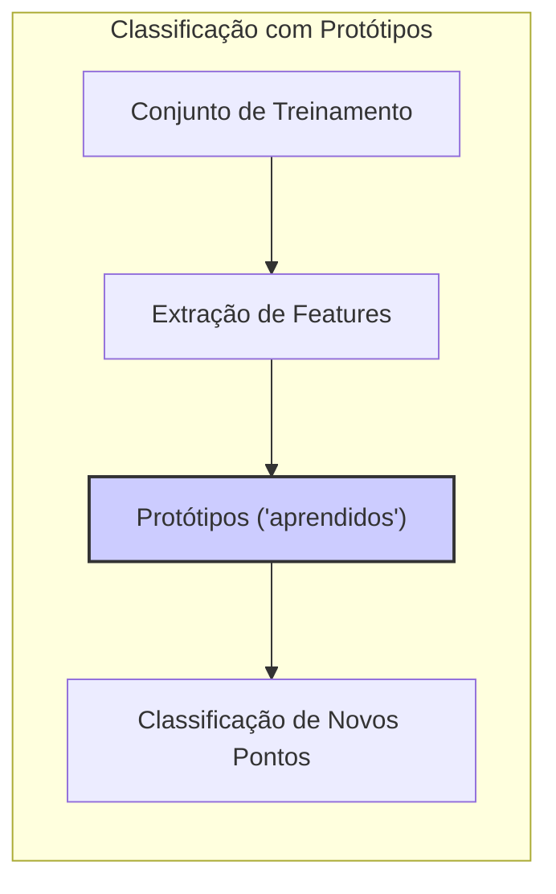
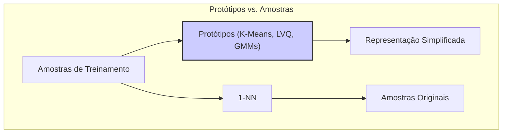
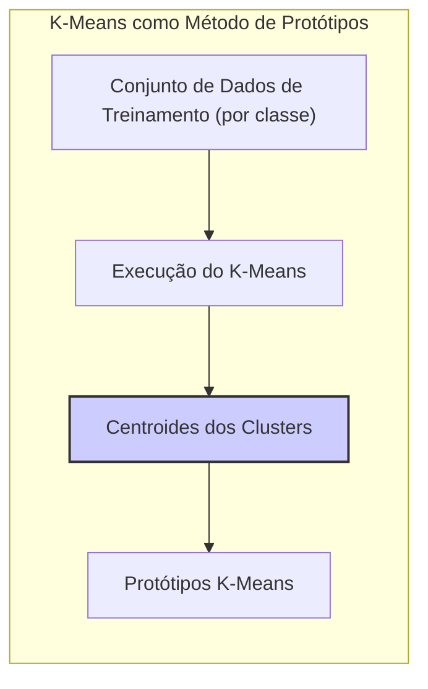
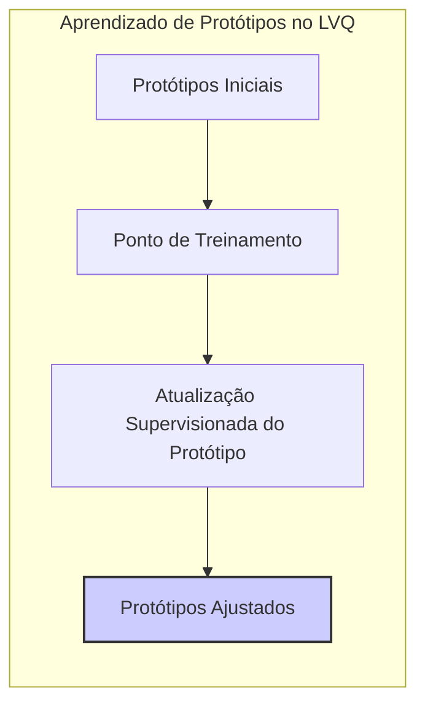
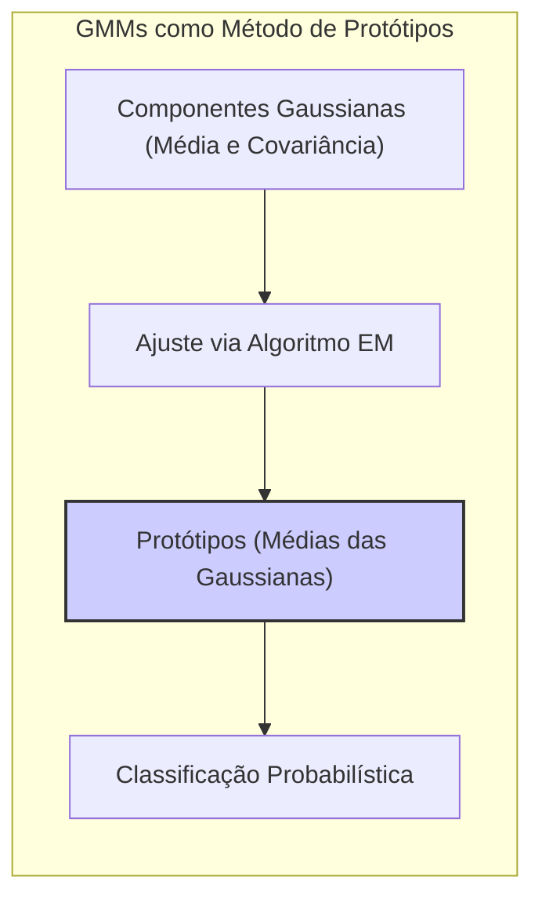
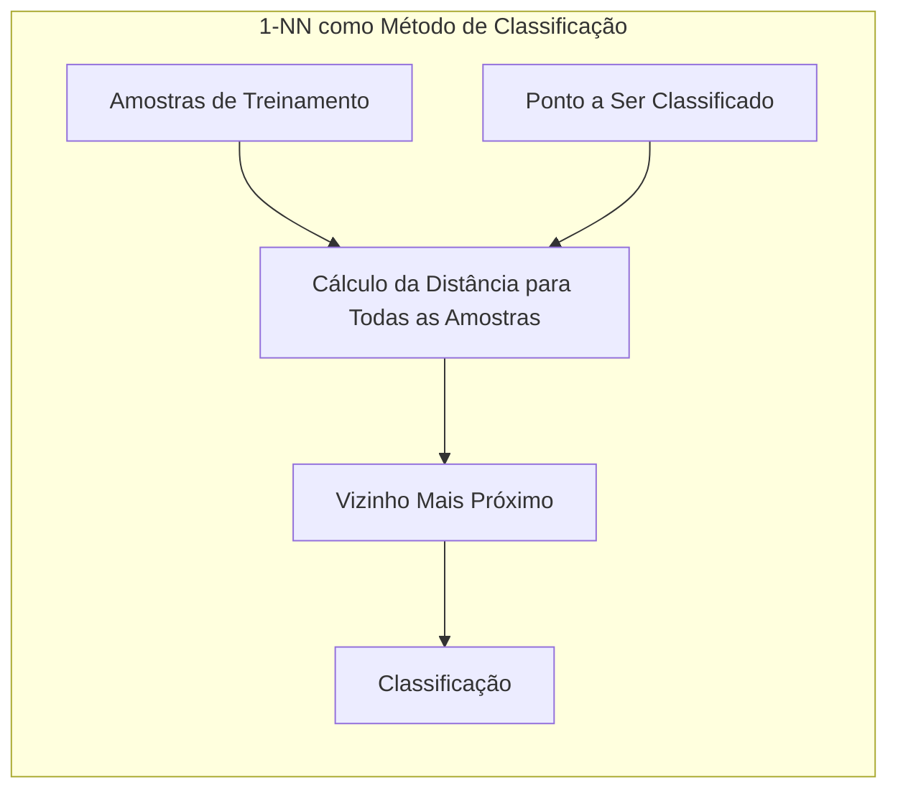
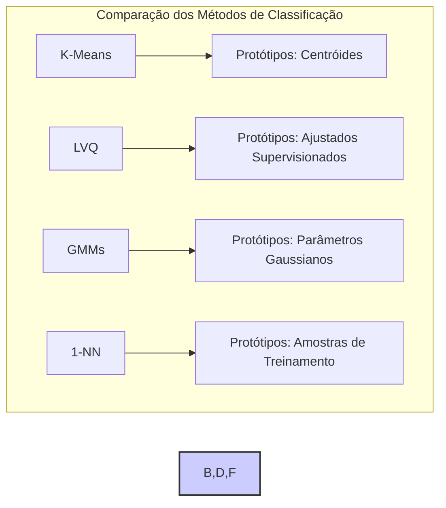

## Protótipos em Classificação: Pontos no Espaço de *Features* com Rótulos de Classe



### Introdução

Este capítulo explora a fundo a natureza dos **protótipos** em métodos de classificação, enfatizando que, diferentemente do método de 1-vizinho mais próximo (1-NN), os protótipos não são, em geral, amostras originais do conjunto de treinamento, mas sim pontos no espaço de *features* com rótulos de classe associados [^13.2]. Abordaremos a diferença fundamental entre protótipos e amostras de treinamento, e como essa distinção afeta a forma como a classificação é realizada. Analisaremos detalhadamente o papel dos protótipos em métodos como K-Means, LVQ (Learning Vector Quantization) e Misturas Gaussianas (GMMs), comparando-os com a abordagem do 1-NN, que usa as próprias amostras de treinamento como referência para classificação. O objetivo é esclarecer o conceito de protótipo e seu impacto na flexibilidade, eficiência computacional e capacidade de generalização dos métodos *model-free*.

### Protótipos vs. Amostras de Treinamento: Uma Distinção Fundamental

A distinção entre protótipos e amostras de treinamento é crucial para compreender a filosofia dos métodos baseados em protótipos. Em geral, um **protótipo** é um ponto no espaço de *features* que representa uma região ou distribuição de uma classe específica [^13.2]. Os protótipos são construídos (ou aprendidos) a partir dos dados de treinamento, mas não são necessariamente amostras originais do conjunto de treinamento. Cada protótipo possui um rótulo de classe associado, e a classificação de um novo ponto é realizada com base em sua proximidade a esses protótipos [^13.2].

Por outro lado, as **amostras de treinamento** são os pontos de dados reais observados que compõem o conjunto de dados original. Essas amostras são usadas para criar ou ajustar os protótipos, ou, como no caso do k-NN, são usadas diretamente para classificar novos pontos.



A principal diferença entre protótipos e amostras de treinamento é que os protótipos são uma representação simplificada dos dados, muitas vezes com um número menor de pontos do que as amostras originais. Essa simplificação tem um impacto significativo na eficiência computacional e na capacidade de generalização do modelo. Além disso, o posicionamento estratégico dos protótipos no espaço de *features* permite que métodos baseados em protótipos capturem as principais características da distribuição das classes, mesmo que os dados originais sejam complexos ou ruidosos.

**Lemma 12:** A representação de dados usando protótipos cria um conjunto menor de pontos que resume a distribuição das classes, reduzindo a complexidade computacional e de armazenamento em comparação com o uso do conjunto de treinamento original.
*Prova*: Ao usar protótipos, somente as coordenadas dos protótipos e seus rótulos de classe precisam ser armazenadas, em vez de todo o conjunto de dados. Os cálculos de distância também são feitos apenas em relação aos protótipos, e não em relação a todas as amostras do conjunto de treinamento. $\blacksquare$

**Corolário 12:** A criação e o uso de protótipos introduzem um nível de abstração e simplificação na representação dos dados, permitindo que modelos *model-free* lidem com conjuntos de dados grandes ou complexos de forma mais eficiente.

> ⚠️ **Nota Importante**: O método de 1-NN é uma exceção, pois usa as próprias amostras de treinamento como protótipos, o que implica que a complexidade computacional e a capacidade de generalização dependem do tamanho e da qualidade do conjunto de dados de treinamento [^13.2].

> ❗ **Ponto de Atenção**: A escolha de onde posicionar os protótipos tem um impacto crucial no desempenho dos métodos de classificação, e diferentes técnicas (K-Means, LVQ, GMMs) oferecem estratégias diferentes para esse posicionamento.

### Protótipos em Métodos Específicos: K-Means, LVQ e GMMs

**K-Means:** No algoritmo **K-Means**, os protótipos são os centroides dos *clusters* formados pela partição dos dados [^13.2.1]. O algoritmo busca encontrar os centros dos *clusters* de forma a minimizar a variância dentro de cada *cluster*. Embora o K-Means seja um método de *clustering* não supervisionado, ele pode ser adaptado para classificação aplicando-o separadamente a cada classe e utilizando os centros dos *clusters* resultantes como protótipos [^13.2.1]. Nesse caso, os protótipos K-means são os centroides dos dados, e não amostras originais de treinamento.



> 💡 **Exemplo Numérico:**
>
> Imagine um conjunto de dados bidimensional com duas classes, cada uma com 10 pontos. Após aplicar o K-Means com dois clusters para cada classe, obtemos dois centroides para cada classe. Digamos que os centroides da Classe 1 sejam (1, 1) e (2, 2), e os da Classe 2 sejam (5, 5) e (6, 6). Estes quatro pontos (1, 1), (2, 2), (5, 5) e (6, 6) são os protótipos. Eles representam as regiões de cada classe, mas não são amostras originais.
>
> ```python
> import numpy as np
> from sklearn.cluster import KMeans
> import matplotlib.pyplot as plt
>
> # Dados de exemplo (2 classes)
> X_class1 = np.array([[1, 1], [1.5, 1.5], [2, 1], [1, 2], [2, 2], [1.3, 1.8], [1.6, 1.2], [1.8, 1.9], [2.2, 1.3], [1.7, 1.7]])
> X_class2 = np.array([[5, 5], [5.5, 5.5], [6, 5], [5, 6], [6, 6], [5.3, 5.8], [5.6, 5.2], [5.8, 5.9], [6.2, 5.3], [5.7, 5.7]])
>
> # K-Means para cada classe
> kmeans_class1 = KMeans(n_clusters=2, random_state=0, n_init = 'auto').fit(X_class1)
> kmeans_class2 = KMeans(n_clusters=2, random_state=0, n_init = 'auto').fit(X_class2)
>
> # Protótipos (centroides)
> prototypes_class1 = kmeans_class1.cluster_centers_
> prototypes_class2 = kmeans_class2.cluster_centers_
>
> # Plot
> plt.scatter(X_class1[:, 0], X_class1[:, 1], c='blue', label='Classe 1')
> plt.scatter(X_class2[:, 0], X_class2[:, 1], c='red', label='Classe 2')
> plt.scatter(prototypes_class1[:, 0], prototypes_class1[:, 1], marker='x', s=200, c='black', label='Protótipos Classe 1')
> plt.scatter(prototypes_class2[:, 0], prototypes_class2[:, 1], marker='x', s=200, c='black', label='Protótipos Classe 2')
> plt.legend()
> plt.title('Protótipos K-Means')
> plt.show()
>
> print("Protótipos da Classe 1:\n", prototypes_class1)
> print("Protótipos da Classe 2:\n", prototypes_class2)
> ```
>
> Neste exemplo, os protótipos (marcados com 'x') são os centroides dos clusters encontrados pelo K-Means para cada classe. Eles não correspondem a nenhum ponto de dado original.

**Lemma 13:** Os protótipos do K-Means são os centros de massa das distribuições de dados, o que significa que eles representam a média dos pontos em cada cluster e não exemplos específicos dos dados de treinamento.
*Prova*: A cada iteração, os protótipos do K-Means são movidos para a média dos pontos a eles atribuídos, convergindo para o centro de cada cluster. $\blacksquare$

**Learning Vector Quantization (LVQ):** No **LVQ**, os protótipos são ajustados de forma supervisionada com base na classe de cada ponto de treino [^13.2.2]. O LVQ inicializa os protótipos, muitas vezes usando os resultados do K-Means, e em cada iteração, move os protótipos da classe correta em direção ao ponto de treino e se afasta dos protótipos de classes incorretas. Os protótipos LVQ tendem a ser posicionados em regiões estratégicas do espaço de *features*, perto das fronteiras de decisão. Também neste caso, os protótipos são representações da distribuição dos dados, e não amostras originais do conjunto de treinamento.



> 💡 **Exemplo Numérico:**
>
> Suponha que temos um protótipo da Classe 1 em (1,1) e um ponto de treino da Classe 1 em (1.5, 1.5). Em uma iteração do LVQ, o protótipo é movido em direção ao ponto de treino. Se a taxa de aprendizagem for 0.1, o novo protótipo será (1 + 0.1*(1.5-1), 1 + 0.1*(1.5-1)) = (1.05, 1.05). Se um protótipo da Classe 2 estivesse em (5,5) e um ponto de treino da Classe 1 estivesse em (1.5, 1.5), o protótipo da Classe 2 se afastaria do ponto de treino: (5 - 0.1*(1.5-5), 5 - 0.1*(1.5-5)) = (5.35, 5.35).
>
> ```python
> import numpy as np
>
> def lvq_update(prototype, train_point, learning_rate, correct_class=True):
>     if correct_class:
>         return prototype + learning_rate * (train_point - prototype)
>     else:
>         return prototype - learning_rate * (train_point - prototype)
>
> # Protótipos iniciais
> prototype_class1 = np.array([1.0, 1.0])
> prototype_class2 = np.array([5.0, 5.0])
>
> # Ponto de treino
> train_point_class1 = np.array([1.5, 1.5])
>
> # Taxa de aprendizagem
> learning_rate = 0.1
>
> # Atualização do protótipo da classe correta (Classe 1)
> updated_prototype_class1 = lvq_update(prototype_class1, train_point_class1, learning_rate)
>
> # Atualização do protótipo da classe incorreta (Classe 2)
> updated_prototype_class2 = lvq_update(prototype_class2, train_point_class1, learning_rate, correct_class=False)
>
> print(f"Protótipo da Classe 1 atualizado: {updated_prototype_class1}")
> print(f"Protótipo da Classe 2 atualizado: {updated_prototype_class2}")
> ```
>
> Aqui, demonstramos uma única iteração do LVQ, mostrando como os protótipos se movem com base na classe do ponto de treino.

**Corolário 13:** O LVQ busca posicionar os protótipos perto das fronteiras de decisão, otimizando assim a capacidade discriminatória do modelo, diferentemente do K-means, que foca na representatividade das regiões de dados.

**Misturas Gaussianas (GMMs):** No caso das **GMMs**, os protótipos são representados pelas médias e covariâncias das componentes gaussianas que modelam a distribuição dos dados [^13.2.3]. Cada componente gaussiana representa um "cluster" ou região no espaço de *features*. Os parâmetros das GMMs são ajustados pelo algoritmo EM, e a classificação de novos pontos é feita com base na probabilidade de pertencer a cada componente gaussiana. Os protótipos, nesse caso, são as médias (centróides) dos componentes gaussianos, que representam regiões de densidade dos dados e não amostras originais.



> 💡 **Exemplo Numérico:**
>
> Suponha que uma classe seja modelada por duas gaussianas. A primeira tem média (2,2) e covariância [[1,0],[0,1]], e a segunda tem média (4,4) e covariância [[0.5,0],[0,0.5]]. Os protótipos seriam as médias (2,2) e (4,4), que são os centros de cada componente gaussiana. A classificação de um novo ponto envolveria calcular a probabilidade de pertencer a cada gaussiana e atribuir a classe com a maior probabilidade.
>
> ```python
> import numpy as np
> from scipy.stats import multivariate_normal
>
> # Parâmetros das Gaussianas (protótipos)
> mean1 = np.array([2, 2])
> cov1 = np.array([[1, 0], [0, 1]])
> mean2 = np.array([4, 4])
> cov2 = np.array([[0.5, 0], [0, 0.5]])
>
> # Ponto a ser classificado
> x = np.array([3, 3])
>
> # Cálculo da probabilidade de cada gaussiana
> prob1 = multivariate_normal.pdf(x, mean=mean1, cov=cov1)
> prob2 = multivariate_normal.pdf(x, mean=mean2, cov=cov2)
>
> # Classificação
> if prob1 > prob2:
>     predicted_class = 1
> else:
>     predicted_class = 2
>
> print(f"Probabilidade da Gaussiana 1: {prob1}")
> print(f"Probabilidade da Gaussiana 2: {prob2}")
> print(f"Classe Predita: {predicted_class}")
> ```
>
> Este exemplo mostra como as médias das gaussianas são usadas como protótipos e como a probabilidade de um ponto pertencer a cada componente é utilizada para classificação.

> ⚠️ **Nota Importante**: Embora o K-Means e o LVQ produzam protótipos como pontos no espaço de *features*, as GMMs usam parâmetros das gaussianas para representar protótipos.

> ❗ **Ponto de Atenção**:  Em todos esses métodos, a localização e o número de protótipos são parâmetros cruciais para o desempenho do modelo, e precisam ser ajustados com base nas características dos dados.

> ✔️ **Destaque**: Os protótipos, tanto no K-Means, LVQ quanto GMMs, são construídos a partir dos dados de treino, mas não são amostras diretas, o que permite que esses métodos sejam mais flexíveis e adaptativos do que métodos que dependem diretamente das amostras de treino, como o 1-NN.

### 1-NN: Uma Exceção na Representação de Dados

O método do **1-Vizinho Mais Próximo (1-NN)** é uma exceção na representação de dados via protótipos [^13.3]. No 1-NN, cada amostra do conjunto de treinamento atua como um protótipo. Isso significa que o modelo não simplifica a representação dos dados; em vez disso, usa todos os pontos originais como referência para classificação. Quando um novo ponto é apresentado para classificação, o 1-NN busca o ponto de treinamento mais próximo e atribui ao novo ponto o rótulo de classe desse vizinho.

Essa abordagem "preguiçosa" (lazy learning) tem a vantagem de não exigir a criação de protótipos artificiais, mas tem o inconveniente de ser computacionalmente custosa e sensível ao ruído no conjunto de treinamento. A complexidade do modelo 1-NN está relacionada diretamente com o tamanho do conjunto de treinamento e a dimensão do espaço de *features* [^13.3].



> 💡 **Exemplo Numérico:**
>
> Imagine um conjunto de treinamento com os seguintes pontos e classes: (1, 1, Classe 1), (2, 2, Classe 1), (5, 5, Classe 2), (6, 6, Classe 2). Se o novo ponto a ser classificado for (3, 3), o 1-NN calculará a distância para cada ponto de treino e identificará (2, 2, Classe 1) como o mais próximo. Portanto, o novo ponto será classificado como Classe 1.
>
> ```python
> import numpy as np
> from sklearn.neighbors import KNeighborsClassifier
>
> # Dados de treinamento
> X_train = np.array([[1, 1], [2, 2], [5, 5], [6, 6]])
> y_train = np.array([0, 0, 1, 1])  # 0 para Classe 1, 1 para Classe 2
>
> # Novo ponto a ser classificado
> x_new = np.array([[3, 3]])
>
> # Classificador 1-NN
> knn = KNeighborsClassifier(n_neighbors=1)
> knn.fit(X_train, y_train)
>
> # Classificação
> predicted_class = knn.predict(x_new)[0]
>
> print(f"Classe Predita: {predicted_class}")
> ```
>
> Este exemplo ilustra como o 1-NN usa os pontos de treino diretamente como protótipos, calculando a distância entre o ponto novo e todos os pontos do conjunto de treino.

**Lemma 14:** A representação de dados do 1-NN é equivalente ao uso de todo o conjunto de treinamento como protótipos, implicando que o modelo não realiza uma simplificação dos dados, e tem sua capacidade de generalização e desempenho diretamente ligados às características do conjunto de treinamento.
*Prova*: Como a classificação de um novo ponto é feita usando diretamente o rótulo do ponto de treino mais próximo, a representação dos dados é, de fato, o conjunto de treino completo. $\blacksquare$

**Corolário 14:** O método 1-NN tem uma complexidade de armazenamento e computacional que cresce linearmente com o tamanho do conjunto de treinamento e é suscetível ao problema da dimensionalidade devido ao uso direto das amostras de treino, necessitando de métodos de pré-processamento dos dados, seleção de *features* ou redução de dimensionalidade.

> ⚠️ **Nota Importante**: O 1-NN utiliza as próprias amostras de treinamento como protótipos, o que o diferencia dos métodos que aprendem protótipos artificiais (K-Means, LVQ e GMMs).

> ❗ **Ponto de Atenção**: O 1-NN é computacionalmente custoso para grandes conjuntos de dados, pois a distância para todas as amostras de treinamento deve ser calculada para cada nova classificação.

> ✔️ **Destaque**: A diferença fundamental entre o 1-NN e os métodos de protótipos está na forma como eles representam o conjunto de dados: o 1-NN usa as próprias amostras, enquanto os outros métodos usam protótipos que são uma representação simplificada dos dados.

### Conclusão

A compreensão da natureza dos protótipos é fundamental para utilizar adequadamente os métodos *model-free* de classificação. Os protótipos, seja como centros de *clusters* em K-Means, como pontos ajustados nas fronteiras de decisão em LVQ, ou como parâmetros de gaussianas em GMMs, oferecem uma forma flexível e eficiente de representar os dados de treinamento. A distinção entre protótipos e amostras de treinamento ressalta a capacidade desses métodos de abstrair e generalizar padrões a partir dos dados, ao contrário do 1-NN, que usa os próprios dados de treinamento como referência. A escolha do método mais adequado depende da complexidade dos dados, dos requisitos computacionais e da necessidade de uma representação compacta e generalizável.



### Footnotes

[^13.2]: "Throughout this chapter, our training data consists of the N pairs ($x_1,g_1$),...,($x_n, g_N$) where $g_i$ is a class label taking values in {1, 2, . . ., K}. Prototype methods represent the training data by a set of points in feature space. These prototypes are typically not examples from the training sample, except in the case of 1-nearest-neighbor classification discussed later. Each prototype has an associated class label, and classification of a query point x is made to the class of the closest prototype." *(Trecho de "13. Prototype Methods and Nearest-Neighbors")*

[^13.2.1]: "K-means clustering is a method for finding clusters and cluster centers in a set of unlabeled data. One chooses the desired number of cluster centers, say R, and the K-means procedure iteratively moves the centers to minimize the total within cluster variance." *(Trecho de "13. Prototype Methods and Nearest-Neighbors")*

[^13.2.2]: "In this technique due to Kohonen (1989), prototypes are placed strategically with respect to the decision boundaries in an ad-hoc way. LVQ is an online algorithm-observations are processed one at a time. The idea is that the training points attract prototypes of the correct class, and repel other prototypes." *(Trecho de "13. Prototype Methods and Nearest-Neighbors")*

[^13.2.3]: "The Gaussian mixture model can also be thought of as a prototype method, similar in spirit to K-means and LVQ. We discuss Gaussian mixtures in some detail in Sections 6.8, 8.5 and 12.7. Each cluster is described in terms of a Gaussian density, which has a centroid (as in K-means), and a covariance matrix." *(Trecho de "13. Prototype Methods and Nearest-Neighbors")*

[^13.3]: "These classifiers are memory-based, and require no model to be fit. Given a query point $x_o$, we find the k training points $x^{(r)}$, r = 1,..., k closest in distance to $x_o$, and then classify using majority vote among the k neighbors." *(Trecho de "13. Prototype Methods and Nearest-Neighbors")*
