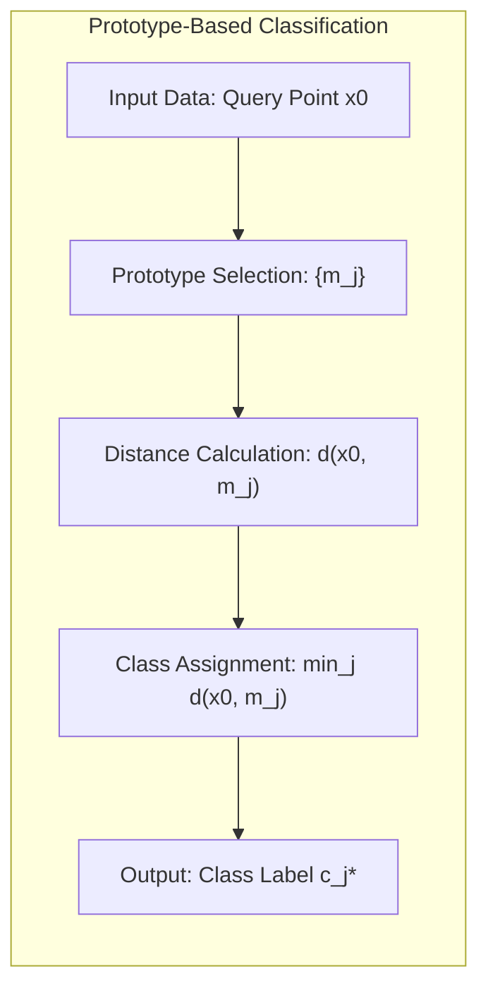
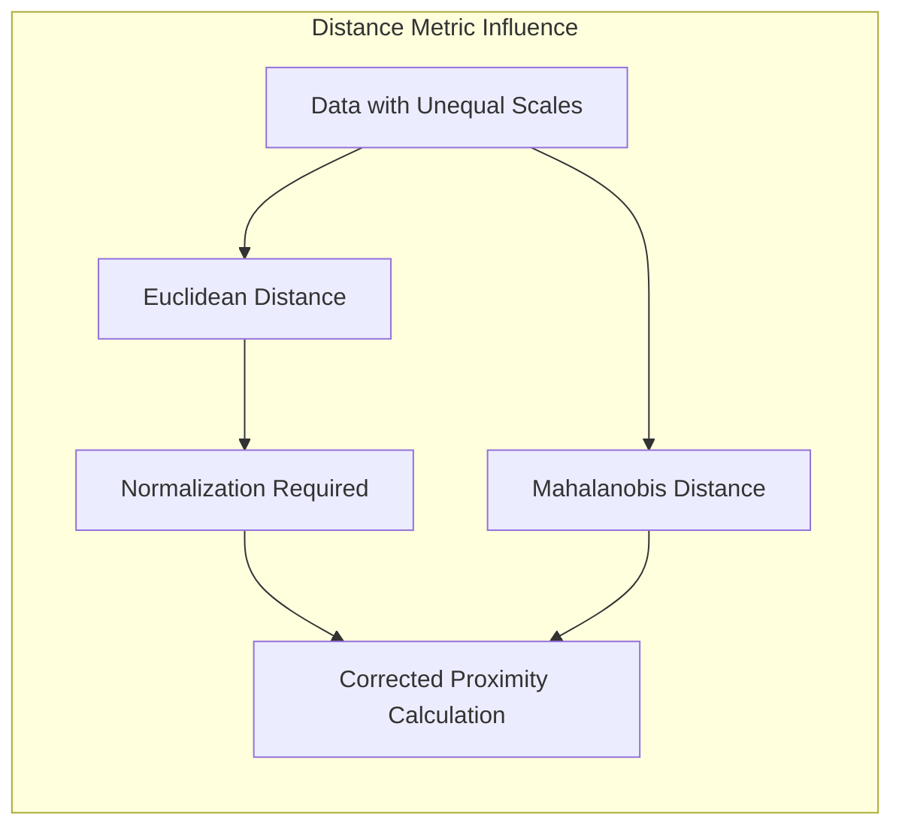
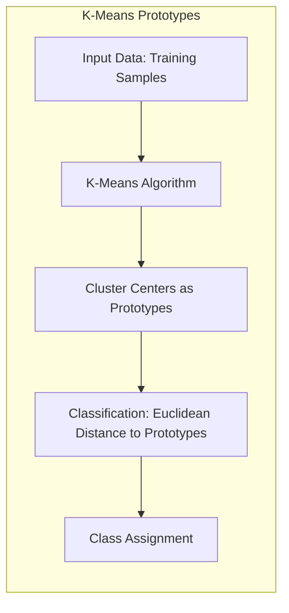
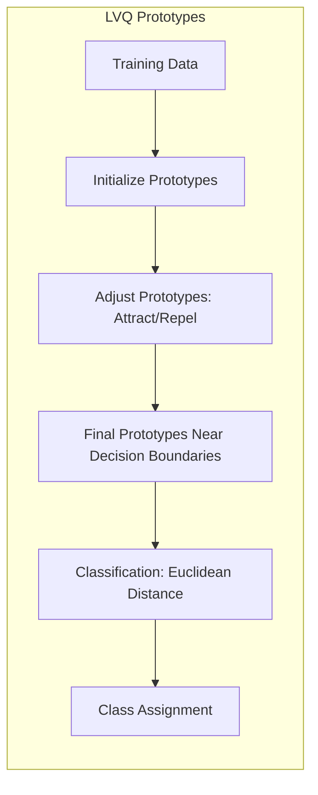
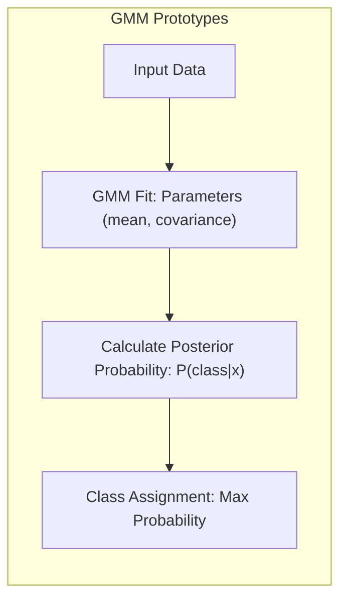
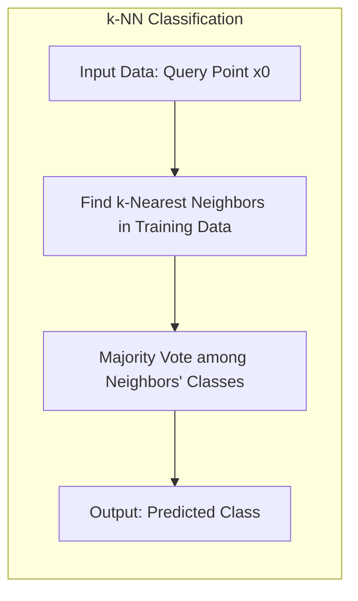

## Classificação Baseada em Protótipos: Atribuindo Pontos de Consulta à Classe do Protótipo Mais Próximo



### Introdução

Este capítulo detalha o processo de **classificação baseada em protótipos**, explorando como um ponto de consulta é atribuído à classe do protótipo mais próximo no espaço de *features* [^13.2]. A abordagem central dos métodos baseados em protótipos é a representação do conjunto de dados por meio de um conjunto selecionado de pontos, ou protótipos, cada um com um rótulo de classe associado. Discutiremos como a proximidade entre um ponto de consulta e os protótipos é avaliada, geralmente utilizando a distância Euclidiana, e como essa avaliação determina a classe à qual o ponto de consulta será atribuído. Abordaremos também o papel da métrica de distância na eficácia do método e como diferentes métricas podem ser utilizadas em situações específicas. Além disso, analisaremos a diferença entre esse processo de classificação e o método de k-vizinhos mais próximos (k-NN), onde a classificação é baseada na votação majoritária dos vizinhos mais próximos.

### Classificação por Proximidade a Protótipos

A essência da classificação baseada em protótipos reside na ideia de que pontos no espaço de *features* pertencem à mesma classe se estiverem próximos de um mesmo protótipo [^13.2]. O processo de classificação consiste em três passos principais:

1.  **Seleção dos Protótipos:** O primeiro passo é a determinação de um conjunto de protótipos que representam as classes. Esses protótipos são pontos no espaço de *features* que, idealmente, capturam as principais características da distribuição de cada classe. Métodos como K-Means, LVQ (Learning Vector Quantization) e GMMs (Gaussian Mixture Models) são usados para gerar esses protótipos.
2.  **Cálculo da Proximidade:** Dado um ponto de consulta (novo ponto a ser classificado), é necessário calcular sua proximidade a cada protótipo. A métrica de distância mais comum é a distância Euclidiana, que quantifica a distância "em linha reta" entre dois pontos no espaço de *features*. Outras métricas, como distância de Mahalanobis, podem ser usadas em situações específicas.
3.  **Atribuição da Classe:** O ponto de consulta é atribuído à classe do protótipo mais próximo. Isso significa que, após calcular a distância do ponto de consulta a cada protótipo, o ponto é classificado na classe do protótipo que possui a menor distância.

Formalmente, seja $x_0$ um ponto de consulta a ser classificado, e seja $\{m_j\}_{j=1}^P$ o conjunto de protótipos, cada um com um rótulo de classe $c_j$. A classe atribuída a $x_0$ é dada por:

$$\hat{c}(x_0) = c_{j^*}, \quad \text{onde} \quad j^* = \arg\min_j d(x_0, m_j)$$

onde $d(x_0, m_j)$ é a distância entre o ponto de consulta $x_0$ e o protótipo $m_j$, e $j^*$ é o índice do protótipo mais próximo.

> 💡 **Exemplo Numérico:**
>
> Vamos considerar um cenário de classificação binária com duas classes: A e B. Suponha que tenhamos dois protótipos:
>
> - Protótipo 1 ($m_1$): Coordenadas (2, 3), Classe A
> - Protótipo 2 ($m_2$): Coordenadas (5, 8), Classe B
>
> E um ponto de consulta $x_0$ com coordenadas (3, 5). Utilizaremos a distância Euclidiana para calcular a proximidade.
>
> **Cálculo da Distância Euclidiana:**
>
> $d(x_0, m_1) = \sqrt{(3-2)^2 + (5-3)^2} = \sqrt{1^2 + 2^2} = \sqrt{5} \approx 2.24$
>
> $d(x_0, m_2) = \sqrt{(3-5)^2 + (5-8)^2} = \sqrt{(-2)^2 + (-3)^2} = \sqrt{13} \approx 3.61$
>
> Como $d(x_0, m_1) < d(x_0, m_2)$, o ponto de consulta $x_0$ será classificado como pertencente à Classe A.
>
> ```mermaid
> graph LR
>     A(Protótipo 1 - Classe A (2,3)) -->|Distância = 2.24| C(Ponto de Consulta (3,5))
>     B(Protótipo 2 - Classe B (5,8)) -->|Distância = 3.61| C
>     style C fill:#f9f,stroke:#333,stroke-width:2px
> ```

**Lemma 15:** A escolha de uma métrica de distância apropriada é fundamental para o desempenho de modelos baseados em protótipos, pois a métrica influencia diretamente a noção de "proximidade" e, portanto, a atribuição de classe.
*Prova*: Métricas de distância que não refletem a estrutura dos dados podem levar a classificações incorretas. A distância Euclidiana é sensível a diferenças nas escalas das *features*, enquanto a distância de Mahalanobis leva em consideração a covariância das *features*, sendo mais apropriada em alguns casos. $\blacksquare$

> 💡 **Exemplo Numérico:**
>
> Imagine que temos duas *features*: "altura em centímetros" e "peso em gramas". A distância Euclidiana padrão daria muito mais peso à diferença na altura (que é da ordem de centenas) do que no peso (que pode ser da ordem de milhares, mas varia menos). Se não normalizarmos, um ponto com pouca diferença na altura e muita diferença no peso pode ser considerado mais distante do que um ponto com o inverso. Por isso, a normalização é importante.



**Corolário 15:** A normalização dos dados é um passo importante para garantir que a distância Euclidiana seja uma métrica apropriada para a comparação de protótipos em um espaço de *features*, onde *features* com escalas diferentes poderiam dominar o cálculo da distância.

> ⚠️ **Nota Importante**: O processo de classificação com protótipos é direto: o ponto de consulta é atribuído à classe do protótipo mais próximo. A complexidade reside na criação e ajuste dos protótipos.

> ❗ **Ponto de Atenção**: A distância Euclidiana é uma escolha comum para a medição da proximidade, mas outras métricas podem ser mais apropriadas dependendo da natureza dos dados.

### Protótipos e Métodos Específicos: K-Means, LVQ e GMMs

**K-Means:** Quando o K-Means é utilizado como método de classificação, os protótipos são os centros dos *clusters* encontrados para cada classe [^13.2.1]. Para classificar um novo ponto, calcula-se a distância Euclidiana do ponto a todos os centros de cluster, e o ponto é atribuído à classe do centroide mais próximo. Os protótipos do K-Means representam os centros das regiões de dados de cada classe, e a classificação se baseia na ideia de que pontos dentro da mesma região devem compartilhar a mesma classe.



**Lemma 16:** Os protótipos do K-Means representam a média dos pontos em cada cluster, e, portanto, a classificação por distância ao protótipo mais próximo equivale à atribuição à classe com a média mais próxima no espaço de *features*.
*Prova*: Os centros dos *clusters* encontrados pelo K-Means são a média dos pontos a eles atribuídos, e a classificação por proximidade se baseia nessa média como representação da região de cada classe. $\blacksquare$

> 💡 **Exemplo Numérico:**
>
> Suponha que temos dados de duas classes em 2D, e aplicamos K-Means com K=2 para cada classe. A classe A tem pontos (1,1), (2,1), (1,2), (2,2) e a classe B tem pontos (4,4), (5,4), (4,5), (5,5).
>
> Os protótipos resultantes seriam:
>
> - Protótipo Classe A: (1.5, 1.5)
> - Protótipo Classe B: (4.5, 4.5)
>
> Um novo ponto (3,3) seria classificado.
>
> $d((3,3), (1.5, 1.5)) = \sqrt{(3-1.5)^2 + (3-1.5)^2} = \sqrt{2.25 + 2.25} \approx 2.12$
>
> $d((3,3), (4.5, 4.5)) = \sqrt{(3-4.5)^2 + (3-4.5)^2} = \sqrt{2.25 + 2.25} \approx 2.12$
>
> Nesse caso, o ponto (3,3) estaria equidistante dos dois protótipos. Em um caso real, o ponto seria atribuído à classe do protótipo mais próximo (ou a um dos protótipos arbitrariamente, em caso de empate).

**Learning Vector Quantization (LVQ):** No LVQ, os protótipos são ajustados para se posicionarem estrategicamente em relação às fronteiras de decisão das classes [^13.2.2]. A classificação é feita da mesma forma: o ponto de consulta é atribuído à classe do protótipo mais próximo. A diferença é que os protótipos LVQ não são apenas representantes da média dos dados, mas também têm como objetivo discriminar entre as classes. O LVQ utiliza os dados de treino para ajustar os protótipos, atraindo-os para pontos da mesma classe e afastando-os de pontos de classes diferentes, o que resulta numa representação mais discriminativa do que a obtida com K-Means.



**Corolário 16:** Os protótipos LVQ são mais eficazes em classificar pontos próximos às fronteiras de decisão, pois o algoritmo de aprendizagem busca posicioná-los em locais que maximizem a capacidade de discriminação.

> 💡 **Exemplo Numérico:**
>
> Imagine que, após inicializar os protótipos como no exemplo do K-Means, o LVQ ajusta os protótipos com base em dados de treino. O protótipo da Classe A pode ser movido para (2, 2) e o da Classe B para (4, 4), resultando em uma fronteira de decisão mais precisa em relação aos dados de treino. A classificação de um novo ponto (3, 3) seria feita usando esses novos protótipos, resultando em uma classificação diferente do exemplo anterior.

**Misturas Gaussianas (GMMs):** Nas GMMs, os protótipos são os parâmetros das componentes gaussianas (média e covariância), e a classificação não é feita diretamente pela distância a esses protótipos [^13.2.3]. Em vez disso, a probabilidade de o ponto de consulta pertencer a cada componente gaussiana é calculada, e o ponto é atribuído à classe da componente com a maior probabilidade *a posteriori*. Embora não seja uma classificação direta por distância ao protótipo mais próximo, a atribuição é feita com base na proximidade a uma região do espaço de *features* representada por cada componente gaussiana.



> 💡 **Exemplo Numérico:**
>
> Suponha que temos uma GMM com duas componentes gaussianas, uma para cada classe. A componente da Classe A tem média (2, 2) e covariância [[1, 0], [0, 1]], e a componente da Classe B tem média (5, 5) e covariância [[1, 0], [0, 1]].
>
> Para classificar um ponto (3, 3), calculamos a probabilidade do ponto pertencer a cada componente gaussiana. A probabilidade de pertencer à componente da Classe A será maior do que a probabilidade de pertencer à componente da Classe B, então o ponto será classificado como Classe A. Este cálculo envolve a função de densidade gaussiana, que utiliza a média e a covariância de cada componente.

> ⚠️ **Nota Importante**: Enquanto o K-Means e o LVQ utilizam distâncias diretas aos protótipos para classificação, as GMMs utilizam probabilidades *a posteriori* baseadas na densidade gaussiana para atribuição de classes.

> ❗ **Ponto de Atenção**: Em todos os métodos de protótipos, a escolha da métrica de distância (ou a distribuição gaussiana no caso de GMMs) tem um impacto crucial no resultado da classificação, e a validação cruzada é essencial para otimizar esses parâmetros.

### Comparação com k-Vizinhos Mais Próximos (k-NN)

O método de **k-Vizinhos Mais Próximos (k-NN)** contrasta com os métodos de protótipos no processo de classificação [^13.3]. Enquanto os métodos de protótipos atribuem um ponto de consulta à classe do protótipo mais próximo, o k-NN atribui o ponto à classe majoritária entre seus $k$ vizinhos mais próximos no conjunto de treinamento.



A principal diferença é que o k-NN não usa protótipos; em vez disso, usa todos os dados de treinamento como referência. Para classificar um novo ponto, o k-NN calcula a distância desse ponto a todos os pontos do conjunto de treinamento e atribui ao novo ponto a classe mais frequente entre os k vizinhos mais próximos.

A classificação por protótipos, em contraste com a abordagem k-NN, busca uma representação simplificada do espaço de *features*, usando um número menor de protótipos que capturam a essência das distribuições das classes. O k-NN, por outro lado, depende diretamente dos pontos do conjunto de treinamento, o que pode ser computacionalmente mais custoso, mas também pode capturar variações mais finas na distribuição dos dados, embora com risco de *overfitting*.

**Lemma 17:** O método k-NN usa um processo de votação para atribuição de classe, ao passo que métodos de protótipo usam diretamente a proximidade a um protótipo, mas ambos os métodos dependem da noção de proximidade no espaço de *features*.
*Prova*: No k-NN, a classe é atribuída pela maioria dos rótulos entre os k vizinhos mais próximos, enquanto métodos de protótipos atribuem a classe do protótipo mais próximo. $\blacksquare$

> 💡 **Exemplo Numérico:**
>
> Considere um conjunto de treinamento com os seguintes pontos:
>
> - Classe A: (1,1), (2,1), (1,2), (2,2)
> - Classe B: (4,4), (5,4), (4,5), (5,5)
>
> Para classificar um novo ponto (3,3) usando k-NN com k=3:
>
> 1. Calculamos a distância do ponto (3,3) para todos os pontos do conjunto de treino.
> 2. Os 3 vizinhos mais próximos são (2,2), (4,4) e (2,1).
> 3. Como 2 dos 3 vizinhos mais próximos são da Classe A, o ponto (3,3) é classificado como Classe A. Se usássemos k=5, os vizinhos mais próximos seriam (2,2), (2,1), (1,2), (4,4) e (4,5), e o ponto seria classificado como Classe B.

**Corolário 17:** A escolha entre k-NN e métodos de protótipos depende da complexidade do problema, do tamanho do conjunto de dados, e da necessidade de uma representação compacta dos dados.

> ⚠️ **Nota Importante**: A classificação baseada em protótipos é mais eficiente computacionalmente do que o k-NN, pois a distância é calculada apenas em relação a um conjunto menor de protótipos.

> ❗ **Ponto de Atenção**:  O k-NN pode ser mais adequado quando a distribuição dos dados é muito irregular, pois ele não tenta aproximar a distribuição por protótipos.

> ✔️ **Destaque**:  Em problemas com fronteiras de decisão complexas, protótipos cuidadosamente ajustados podem levar a uma capacidade de generalização semelhante ao k-NN com um custo computacional menor.

### Conclusão

A classificação baseada em protótipos oferece uma abordagem eficaz e versátil para atribuir pontos de consulta a classes específicas, com base na proximidade desses pontos a um conjunto de protótipos cuidadosamente selecionados. Essa abordagem é fundamental nos métodos *model-free* e se diferencia do k-NN, que usa todos os dados de treinamento para classificação. A escolha do método de protótipos específico (K-Means, LVQ ou GMMs) e da métrica de distância adequada (ou distribuição gaussiana) depende da complexidade dos dados e do problema em questão, mas todos esses métodos compartilham a ideia central de classificar por proximidade a protótipos que representam as distribuições das classes.

### Footnotes

[^13.2]: "Throughout this chapter, our training data consists of the N pairs (x1,91),...,(xn, 9N) where gi is a class label taking values in {1, 2, . . ., K}. Prototype methods represent the training data by a set of points in feature space. These prototypes are typically not examples from the training sample, except in the case of 1-nearest-neighbor classification discussed later. Each prototype has an associated class label, and classification of a query point x is made to the class of the closest prototype." *(Trecho de "13. Prototype Methods and Nearest-Neighbors")*

[^13.2.1]: "K-means clustering is a method for finding clusters and cluster centers in a set of unlabeled data... To use K-means clustering for classification of labeled data, the steps are: apply K-means clustering to the training data in each class separately, using R prototypes per class; assign a class label to each of the K × R prototypes; classify a new feature x to the class of the closest prototype." *(Trecho de "13. Prototype Methods and Nearest-Neighbors")*

[^13.2.2]: "In this technique due to Kohonen (1989), prototypes are placed strategically with respect to the decision boundaries in an ad-hoc way...The idea is that the training points attract prototypes of the correct class, and repel other prototypes...When the iterations settle down, prototypes should be close to the training points in their class." *(Trecho de "13. Prototype Methods and Nearest-Neighbors")*

[^13.2.3]: "The Gaussian mixture model can also be thought of as a prototype method, similar in spirit to K-means and LVQ...Each cluster is described in terms of a Gaussian density, which has a centroid (as in K-means), and a covariance matrix...when Gaussian mixture models are used to represent the feature density in each class, it produces smooth posterior probabilities." *(Trecho de "13. Prototype Methods and Nearest-Neighbors")*

[^13.3]: "These classifiers are memory-based, and require no model to be fit. Given a query point xo, we find the k training points x(r), r = 1,..., k closest in distance to xo, and then classify using majority vote among the k neighbors." *(Trecho de "13. Prototype Methods and Nearest-Neighbors")*
