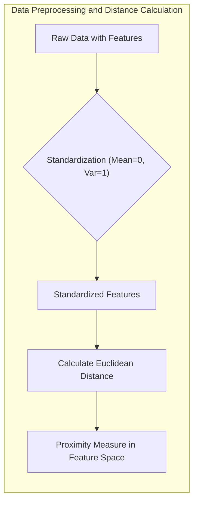
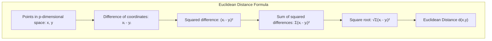
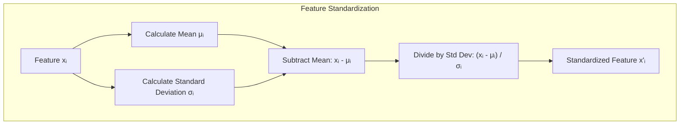
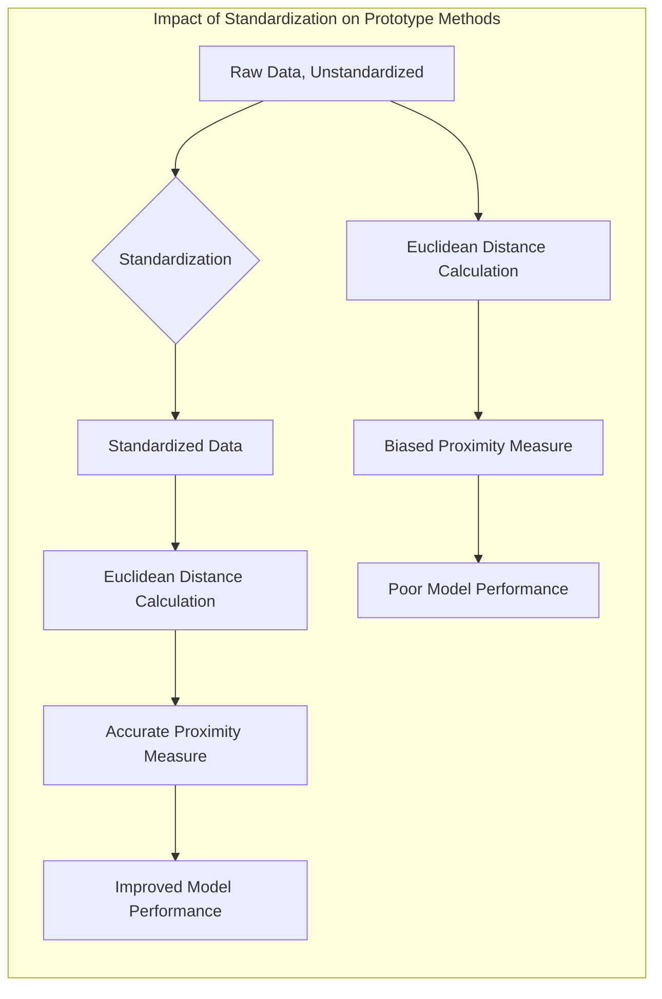

## Distância Euclidiana: A Padronização é Essencial para a Proximidade de Protótipos no Espaço de *Features*

### Introdução

Este capítulo aborda a importância da **distância Euclidiana** como métrica de proximidade no espaço de *features* e enfatiza a necessidade de **padronização** dos dados antes de calcular a distância entre pontos, especialmente em métodos baseados em protótipos [^13.2]. A distância Euclidiana é uma métrica popular e intuitiva que mede a distância "em linha reta" entre dois pontos, mas sua aplicação direta a dados brutos pode levar a resultados enviesados, especialmente quando as *features* têm escalas diferentes. Discutiremos por que a padronização dos dados, que envolve subtrair a média e dividir pelo desvio padrão de cada *feature*, é crucial para garantir que a distância Euclidiana reflita a proximidade real entre os pontos, em vez de ser dominada por *features* com valores maiores. Analisaremos também o impacto da padronização no desempenho de métodos de protótipos e em outras técnicas de aprendizado de máquina.

### Distância Euclidiana: Uma Métrica de Proximidade no Espaço de *Features*

A **distância Euclidiana** é uma métrica de distância amplamente utilizada em diversas áreas, incluindo aprendizado de máquina, visão computacional e processamento de sinais. No contexto de métodos baseados em protótipos, a distância Euclidiana é frequentemente utilizada para determinar a proximidade entre um ponto de consulta e os protótipos no espaço de *features* [^13.2]. Formalmente, a distância Euclidiana entre dois pontos $x = (x_1, x_2, \ldots, x_p)$ e $y = (y_1, y_2, \ldots, y_p)$ no espaço de *features* de $p$ dimensões é dada por:

$$d(x, y) = \sqrt{\sum_{i=1}^p (x_i - y_i)^2}$$

Onde $x_i$ e $y_i$ representam as coordenadas dos pontos $x$ e $y$ na dimensão $i$, respectivamente. A distância Euclidiana é intuitiva e fácil de calcular, e é uma métrica adequada para espaços de *features* com coordenadas numéricas.

No entanto, a aplicação direta da distância Euclidiana a dados brutos pode levar a resultados problemáticos, pois a escala das *features* pode afetar significativamente a magnitude da distância calculada. *Features* com escalas maiores tenderão a dominar a distância, fazendo com que a métrica não reflita adequadamente a proximidade entre os pontos [^13.2]. Por exemplo, se uma *feature* varia entre 0 e 1000, e outra varia entre 0 e 1, a distância euclidiana será dominada pela *feature* com escala maior.

> 💡 **Exemplo Numérico:**
>
> Imagine dois pontos em um espaço de duas dimensões: $x = (1, 1000)$ e $y = (2, 1)$.
>
> 1.  **Cálculo da Distância Euclidiana sem Padronização:**
>    $d(x, y) = \sqrt{(1-2)^2 + (1000-1)^2} = \sqrt{1 + 998001} = \sqrt{998002} \approx 999.0005$
>
>    Observe que a distância é quase totalmente determinada pela segunda dimensão (a *feature* com escala maior), ignorando a diferença na primeira dimensão.
>
> 2.  **Impacto da Escala:** A diferença de 1 na primeira dimensão é insignificante em comparação com a diferença de 999 na segunda dimensão. Isso mostra como a escala afeta a distância, onde a dimensão com maior variação domina o cálculo.

**Lemma 18:** A distância Euclidiana é sensível à escala das *features*, o que pode levar a comparações enviesadas entre pontos no espaço de *features*.
*Prova*: Conforme a definição da distância Euclidiana, se uma *feature* tem valores em uma escala muito maior que outras, a diferença na coordenada dessa *feature* terá um impacto desproporcional na distância total. $\blacksquare$

**Corolário 18:** A padronização dos dados é essencial antes de calcular a distância Euclidiana em cenários onde as *features* têm escalas diferentes, garantindo que a métrica reflita a proximidade real entre os pontos.

> ⚠️ **Nota Importante**: A distância Euclidiana é uma métrica simples e eficaz para medir a proximidade entre pontos no espaço de *features*, mas sua aplicação direta a dados brutos pode levar a resultados enviesados.

> ❗ **Ponto de Atenção**:  A padronização é necessária para garantir que todas as *features* contribuam de forma igual para o cálculo da distância, evitando que as *features* com maior escala dominem a métrica.

### A Padronização: Média Zero e Variância Um

A **padronização**, também conhecida como *z-score normalization*, é uma técnica comum de pré-processamento de dados que visa transformar as *features* para que tenham média zero e variância unitária. A padronização é realizada subtraindo a média de cada *feature* e dividindo pelo desvio padrão dessa *feature*. Formalmente, para cada *feature* $x_i$ no conjunto de dados, a *feature* padronizada $x_i'$ é obtida por:

$$x_i' = \frac{x_i - \mu_i}{\sigma_i}$$

Onde $\mu_i$ é a média da *feature* $x_i$ e $\sigma_i$ é o desvio padrão da *feature* $x_i$, ambas calculadas sobre o conjunto de dados de treinamento.

A padronização tem como objetivo remover a diferença de escala entre as *features*, fazendo com que todas contribuam de forma igual para o cálculo da distância Euclidiana. Ao padronizar os dados, a métrica de distância passa a refletir a real proximidade entre os pontos, evitando que *features* com valores maiores dominem o cálculo.

É importante destacar que a padronização é aplicada ao conjunto de dados de treinamento e também a quaisquer novos pontos de consulta, usando a média e desvio padrão do conjunto de treinamento. Isso garante que todos os dados sejam transformados da mesma forma, independentemente de onde eles se encontrem.

> 💡 **Exemplo Numérico:**
>
> Suponha que temos um conjunto de dados com duas *features*, $x_1$ e $x_2$, e os seguintes valores:
>
> | Amostra | $x_1$ | $x_2$ |
> |---|---|---|
> | 1 | 2 | 100 |
> | 2 | 4 | 200 |
> | 3 | 6 | 300 |
>
> 1.  **Cálculo das Médias:**
>     $\mu_{x_1} = \frac{2 + 4 + 6}{3} = 4$
>     $\mu_{x_2} = \frac{100 + 200 + 300}{3} = 200$
>
> 2.  **Cálculo dos Desvios Padrão:**
>     $\sigma_{x_1} = \sqrt{\frac{(2-4)^2 + (4-4)^2 + (6-4)^2}{3}} = \sqrt{\frac{4+0+4}{3}} = \sqrt{\frac{8}{3}} \approx 1.63$
>     $\sigma_{x_2} = \sqrt{\frac{(100-200)^2 + (200-200)^2 + (300-200)^2}{3}} = \sqrt{\frac{10000+0+10000}{3}} = \sqrt{\frac{20000}{3}} \approx 81.65$
>
> 3.  **Padronização dos Dados:**
>     $x_{1,1}' = \frac{2 - 4}{1.63} \approx -1.23$
>     $x_{1,2}' = \frac{4 - 4}{1.63} = 0$
>     $x_{1,3}' = \frac{6 - 4}{1.63} \approx 1.23$
>     $x_{2,1}' = \frac{100 - 200}{81.65} \approx -1.23$
>     $x_{2,2}' = \frac{200 - 200}{81.65} = 0$
>     $x_{2,3}' = \frac{300 - 200}{81.65} \approx 1.23$
>
> | Amostra | $x_1'$ | $x_2'$ |
> |---|---|---|
> | 1 | -1.23 | -1.23 |
> | 2 | 0 | 0 |
> | 3 | 1.23 | 1.23 |
>
> Após a padronização, ambas as *features* têm aproximadamente média 0 e variância 1, permitindo que contribuam de forma igual para o cálculo da distância.

**Lemma 19:** A padronização de *features* garante que cada *feature* tenha média zero e variância um, removendo a influência de diferentes escalas e permitindo que todas as *features* contribuam igualmente para a distância Euclidiana.
*Prova*: Pela definição da padronização, a média dos valores padronizados será sempre zero e a variância será sempre um, removendo a dependência da escala original. $\blacksquare$

**Corolário 19:** A padronização é um passo de pré-processamento importante para garantir a aplicabilidade da distância Euclidiana em problemas com *features* com escalas diferentes, e também para o bom desempenho de diversos métodos de aprendizagem de máquina, além dos métodos de protótipos.

> ⚠️ **Nota Importante**: A padronização é um passo essencial no pré-processamento de dados para métodos que usam distância Euclidiana, garantindo que todas as *features* contribuam de forma igual para o cálculo da distância.

> ❗ **Ponto de Atenção**: A padronização deve ser aplicada tanto ao conjunto de treino quanto ao conjunto de teste usando a média e o desvio padrão do conjunto de treino para evitar problemas de informação futura (*data leakage*).

### Impacto da Padronização nos Métodos de Protótipos

Em métodos baseados em protótipos, a padronização tem um impacto significativo no desempenho dos algoritmos. A distância Euclidiana é usada para determinar a proximidade entre um ponto de consulta e os protótipos, e essa proximidade determina a classe atribuída ao ponto de consulta.

Quando as *features* não são padronizadas, *features* com valores muito maiores podem dominar o cálculo da distância, fazendo com que protótipos de classes diferentes pareçam próximos devido a uma única *feature* com escala muito grande. A padronização garante que todas as *features* contribuam de forma igual para a distância, permitindo que a proximidade reflita a similaridade real entre os pontos no espaço de *features*.

No **K-Means**, a padronização dos dados resulta em protótipos que são mais representativos dos *clusters* de dados, pois a variância intra-cluster é calculada com *features* na mesma escala. No **LVQ**, a padronização permite que os protótipos sejam ajustados de forma mais eficaz em relação às fronteiras de decisão, pois as *features* contribuem de forma igual para o ajuste dos protótipos. Em **GMMs**, a padronização dos dados garante que as componentes gaussianas não sejam dominadas por *features* com valores maiores, levando a uma melhor modelagem da distribuição dos dados.

> 💡 **Exemplo Numérico:**
>
> Vamos considerar um problema de classificação binária com duas classes e duas *features*. Suponha que temos dois protótipos, um para cada classe:
>
> - Protótipo da Classe 1 (sem padronização): $p_1 = (1, 100)$
> - Protótipo da Classe 2 (sem padronização): $p_2 = (2, 200)$
>
> Agora, vamos analisar um ponto de consulta $q = (1.5, 150)$.
>
> 1. **Distância sem Padronização:**
>    - $d(q, p_1) = \sqrt{(1.5 - 1)^2 + (150 - 100)^2} = \sqrt{0.25 + 2500} \approx 50.00$
>    - $d(q, p_2) = \sqrt{(1.5 - 2)^2 + (150 - 200)^2} = \sqrt{0.25 + 2500} \approx 50.00$
>
>    Sem padronização, o ponto de consulta $q$ está quase equidistante dos dois protótipos, o que torna a classificação ambígua.
>
> 2. **Distância com Padronização:**
>
>    Suponha que, após a padronização, os protótipos e o ponto de consulta se tornaram:
>
>    - Protótipo da Classe 1 (padronizado): $p_1' = (-1, -1)$
>    - Protótipo da Classe 2 (padronizado): $p_2' = (1, 1)$
>    - Ponto de consulta (padronizado): $q' = (0, 0)$
>
>    - $d(q', p_1') = \sqrt{(0 - (-1))^2 + (0 - (-1))^2} = \sqrt{1 + 1} = \sqrt{2} \approx 1.41$
>    - $d(q', p_2') = \sqrt{(0 - 1)^2 + (0 - 1)^2} = \sqrt{1 + 1} = \sqrt{2} \approx 1.41$
>
>    Neste caso, o ponto de consulta $q'$ está equidistante dos dois protótipos. No entanto, a padronização garante que a distância reflita a similaridade real, e não a diferença de escala. Se o ponto de consulta $q'$ fosse ligeiramente diferente, a classificação seria mais clara. Por exemplo, se $q' = (-0.5, -0.5)$, ele estaria mais próximo de $p_1'$.
>
>    Essa mudança ocorre porque a padronização normaliza a contribuição de cada *feature* para a distância, tornando a métrica mais significativa.

**Lemma 20:** Em métodos de protótipos, a padronização das *features* é crucial para garantir que a distância Euclidiana não seja dominada por *features* com valores maiores, e para que os protótipos capturem as reais diferenças entre as classes.
*Prova*: Sem a padronização, a distância Euclidiana não reflete a real distância no espaço de *features*, influenciando negativamente o desempenho dos métodos de protótipos. $\blacksquare$

**Corolário 20:** A padronização é especialmente importante em métodos de protótipos que usam a distância Euclidiana, pois ela garante que a proximidade entre um ponto de consulta e os protótipos reflita a real similaridade entre os pontos, e não a diferença nas escalas das *features*.

> ⚠️ **Nota Importante**: A padronização dos dados, antes do cálculo da distância Euclidiana, é crucial para o desempenho de métodos baseados em protótipos, assegurando que a métrica reflita a real proximidade entre os pontos.

> ❗ **Ponto de Atenção**: Métodos de protótipos que utilizam outras métricas de distância, como a distância de Mahalanobis, também podem se beneficiar da padronização, embora a necessidade seja menos crítica.

### Conclusão

A distância Euclidiana, embora seja uma métrica popular e intuitiva, precisa ser utilizada com cautela em problemas de aprendizado de máquina, especialmente quando as *features* têm escalas diferentes. A padronização dos dados, com média zero e variância um, é essencial para garantir que a distância Euclidiana reflita a real proximidade entre os pontos, e não seja dominada por *features* com valores maiores. Métodos baseados em protótipos se beneficiam fortemente da padronização, pois ela garante que os protótipos sejam posicionados de forma estratégica e que a classificação seja feita de acordo com a similaridade real entre os pontos. A padronização é, portanto, um passo essencial no pré-processamento de dados para esses métodos, e sua aplicação adequada é crucial para o desempenho eficaz dos modelos de classificação.

### Footnotes

[^13.2]: "Throughout this chapter, our training data consists of the N pairs (x1,91),...,(xn, 9N) where gi is a class label taking values in {1, 2, . . ., K}. Prototype methods represent the training data by a set of points in feature space. These prototypes are typically not examples from the training sample, except in the case of 1-nearest-neighbor classification discussed later. Each prototype has an associated class label, and classification of a query point x is made to the class of the closest prototype. "Closest" is usually defined by Euclidean distance in the feature space, after each feature has been standardized to have overall mean 0 and variance 1 in the training sample." *(Trecho de "13. Prototype Methods and Nearest-Neighbors")*
