## Fronteiras Irregulares: A Capacidade dos Métodos de Protótipos para Modelar Regiões de Decisão Complexas

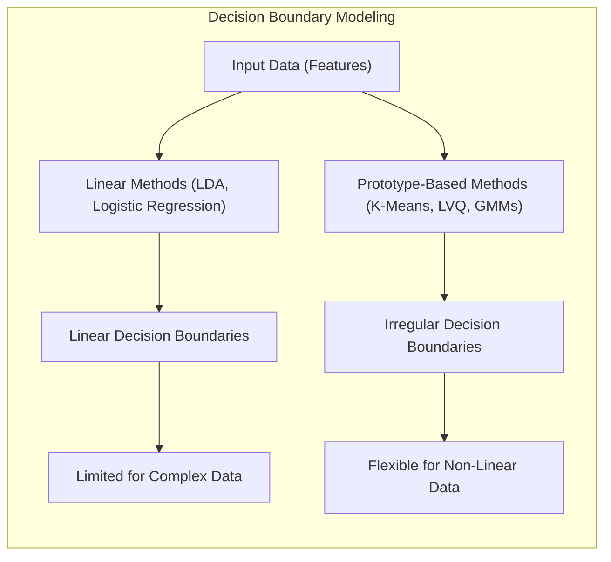

### Introdução

Este capítulo explora a capacidade dos métodos baseados em protótipos de lidar com **fronteiras de decisão irregulares**, um desafio comum em problemas de classificação e reconhecimento de padrões [^13.2]. Ao contrário dos métodos lineares, que assumem que as classes podem ser separadas por hiperplanos, os métodos baseados em protótipos são capazes de modelar regiões de decisão mais complexas e não lineares, por meio do posicionamento estratégico dos protótipos no espaço de *features*. Analisaremos como técnicas como K-Means, LVQ (Learning Vector Quantization) e Misturas Gaussianas (GMMs) podem representar fronteiras irregulares com maior precisão do que modelos lineares ou outros métodos que dependem de suposições fortes sobre a forma das fronteiras de decisão. Abordaremos também as limitações desses métodos e quando outras abordagens podem ser mais apropriadas.

### Fronteiras de Decisão: Lineares vs. Irregulares

Em problemas de classificação, o objetivo é determinar uma **fronteira de decisão** que divide o espaço de *features* em regiões correspondentes a diferentes classes. Modelos lineares, como a regressão logística ou o LDA (Linear Discriminant Analysis), assumem que as classes podem ser separadas por hiperplanos [^4.1], [^4.3]. Essas abordagens são eficazes quando as classes são linearmente separáveis ou aproximadamente separáveis, mas podem apresentar dificuldades para modelar fronteiras de decisão mais complexas e não lineares.

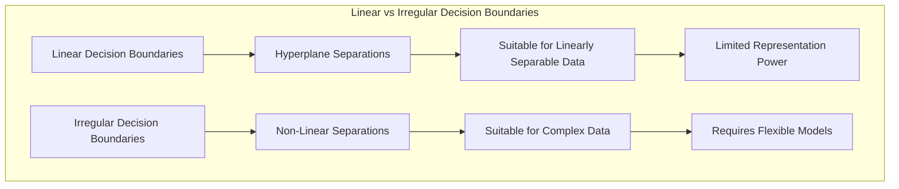

**Fronteiras de decisão irregulares** são caracterizadas por regiões de decisão com formas não lineares e, muitas vezes, complexas [^13.2]. Essas fronteiras podem surgir devido a interações não lineares entre as *features*, distribuições complexas das classes, ou ruído presente nos dados. Métodos lineares podem sofrer de *bias* quando tentam modelar essas fronteiras, pois sua capacidade de representação é limitada a transformações lineares.

Os métodos baseados em protótipos, por outro lado, são capazes de modelar fronteiras de decisão irregulares, posicionando os protótipos de forma estratégica no espaço de *features* para capturar a forma dessas regiões. Essa capacidade de modelar fronteiras complexas é uma vantagem significativa em relação a modelos lineares, tornando os métodos de protótipos mais flexíveis e adaptáveis a diversos problemas.

**Lemma 21:** A capacidade de modelar fronteiras de decisão irregulares permite que métodos baseados em protótipos capturem padrões complexos nos dados que não podem ser representados por modelos lineares.
*Prova*: Ao posicionar protótipos de forma estratégica, métodos como LVQ e GMM conseguem capturar regiões de decisão não lineares, o que modelos baseados em hiperplanos não conseguem. $\blacksquare$

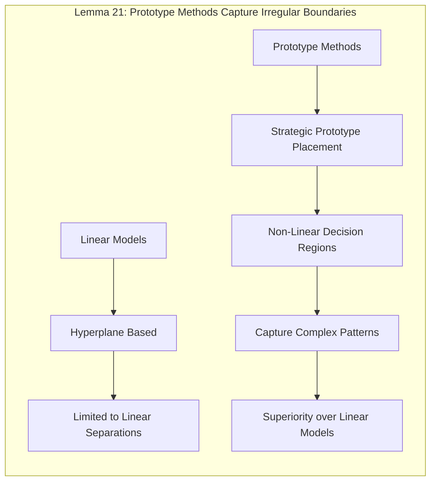

**Corolário 21:** A escolha entre modelos lineares e métodos baseados em protótipos depende da complexidade das fronteiras de decisão no problema em questão, sendo os métodos baseados em protótipos mais apropriados para dados não linearmente separáveis.

> ⚠️ **Nota Importante**:  Modelos lineares assumem fronteiras de decisão lineares, o que limita sua capacidade de representar regiões de decisão complexas e irregulares.

> ❗ **Ponto de Atenção**: A capacidade de modelar fronteiras irregulares é uma vantagem fundamental de métodos baseados em protótipos, tornando-os mais adequados para problemas com alta complexidade nas distribuições de classes.

### Métodos de Protótipos e sua Capacidade de Modelagem de Fronteiras Irregulares

**K-Means:** O **K-Means**, embora seja um método de *clustering*, pode ser usado para modelar fronteiras de decisão irregulares aplicando o algoritmo separadamente a cada classe e utilizando os centros dos clusters como protótipos [^13.2.1]. O K-Means não ajusta os protótipos para discriminar as classes, e as fronteiras de decisão resultantes são geralmente lineares ou piecewise lineares (fronteiras formadas por segmentos de linha reta), que podem aproximar regiões irregulares, mas pode não ser a escolha ideal.

> 💡 **Exemplo Numérico:**
>
> Imagine que temos duas classes de dados em 2D, onde a classe A forma um círculo e a classe B envolve esse círculo. Se aplicarmos o K-Means separadamente a cada classe com k=2, poderíamos ter 2 protótipos para A e 2 para B. As fronteiras de decisão seriam retas, dividindo o espaço em 4 regiões. Essas retas não capturam a forma circular real das classes, demonstrando que o K-Means não modela bem a fronteira irregular nesse caso.
>
> ```python
> import numpy as np
> import matplotlib.pyplot as plt
> from sklearn.cluster import KMeans
> from sklearn.preprocessing import StandardScaler
>
> # Gerando dados sintéticos para duas classes
> np.random.seed(0)
> radius = 5
> n_samples_circle = 200
> n_samples_ring = 300
>
> # Classe A (círculo)
> circle_angles = np.random.uniform(0, 2*np.pi, n_samples_circle)
> circle_radius = np.random.normal(radius, 0.5, n_samples_circle)
> circle_x = circle_radius * np.cos(circle_angles)
> circle_y = circle_radius * np.sin(circle_angles)
> class_A = np.column_stack((circle_x, circle_y))
>
> # Classe B (anel)
> ring_angles = np.random.uniform(0, 2*np.pi, n_samples_ring)
> ring_radius = np.random.normal(radius*1.8, 0.5, n_samples_ring)
> ring_x = ring_radius * np.cos(ring_angles)
> ring_y = ring_radius * np.sin(ring_angles)
> class_B = np.column_stack((ring_x, ring_y))
>
> # Combinando os dados
> X = np.vstack((class_A, class_B))
> y = np.array([0] * n_samples_circle + [1] * n_samples_ring)
>
> # Normalizando os dados
> scaler = StandardScaler()
> X_scaled = scaler.fit_transform(X)
>
> # K-Means para cada classe separadamente
> kmeans_A = KMeans(n_clusters=2, random_state=0, n_init=10)
> kmeans_B = KMeans(n_clusters=2, random_state=0, n_init=10)
>
> kmeans_A.fit(X_scaled[y == 0])
> kmeans_B.fit(X_scaled[y == 1])
>
> centroids_A = kmeans_A.cluster_centers_
> centroids_B = kmeans_B.cluster_centers_
>
> centroids = np.vstack((centroids_A, centroids_B))
>
> # Plotando os dados e os protótipos
> plt.figure(figsize=(8, 6))
> plt.scatter(X_scaled[y == 0, 0], X_scaled[y == 0, 1], label='Classe A', color='skyblue', alpha=0.6)
> plt.scatter(X_scaled[y == 1, 0], X_scaled[y == 1, 1], label='Classe B', color='coral', alpha=0.6)
> plt.scatter(centroids[:, 0], centroids[:, 1], marker='X', s=200, c=['blue', 'blue', 'red', 'red'], label='Protótipos K-Means')
>
> # Criando uma grade para visualizar as fronteiras de decisão
> x_min, x_max = X_scaled[:, 0].min() - 1, X_scaled[:, 0].max() + 1
> y_min, y_max = X_scaled[:, 1].min() - 1, X_scaled[:, 1].max() + 1
> xx, yy = np.meshgrid(np.arange(x_min, x_max, 0.02), np.arange(y_min, y_max, 0.02))
>
> # Classificando os pontos da grade usando os protótipos
> grid_points = np.c_[xx.ravel(), yy.ravel()]
> distances = np.sqrt(((grid_points[:, :, np.newaxis] - centroids.T) ** 2).sum(axis=1))
> closest_prototype = np.argmin(distances, axis=1)
> Z = (closest_prototype >= 2).reshape(xx.shape)
>
> # Plotando as fronteiras de decisão
> plt.contourf(xx, yy, Z, alpha=0.2, cmap=plt.cm.RdBu)
>
> plt.title('K-Means para Fronteiras Irregulares')
> plt.xlabel('Feature 1 (Normalizado)')
> plt.ylabel('Feature 2 (Normalizado)')
> plt.legend()
> plt.grid(True)
> plt.show()
> ```
>
> Este exemplo mostra que, mesmo com múltiplos protótipos por classe, as fronteiras de decisão do K-Means são lineares e não capturam a complexidade das formas das classes.

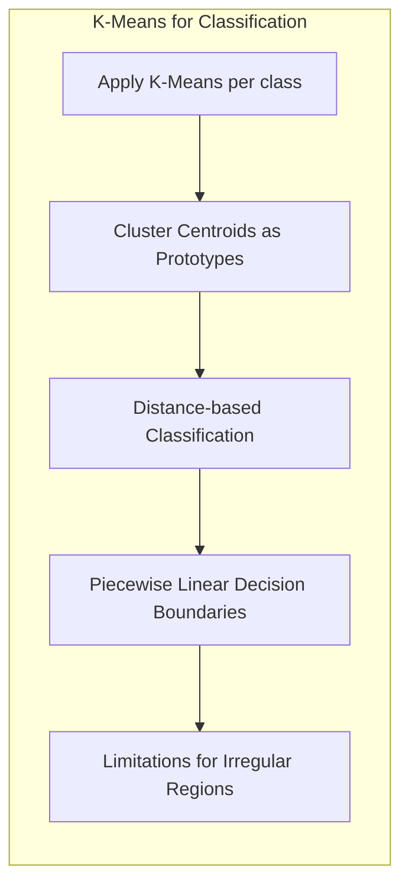

**Lemma 22:** As fronteiras de decisão do K-Means quando usado para classificação podem ser aproximadas por polígonos convexos, e não necessariamente refletem a complexidade real das fronteiras de decisão.
*Prova*: Cada região de decisão do K-means é definida pela proximidade ao centroide, e a fronteira entre regiões é o lugar geométrico onde as distâncias aos centros mais próximos se igualam, o que leva a fronteiras piecewise lineares. $\blacksquare$

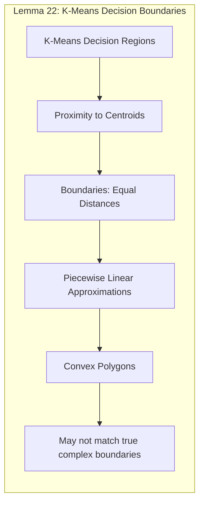

**Learning Vector Quantization (LVQ):** O **LVQ** é mais eficaz do que o K-Means para modelar fronteiras de decisão irregulares, pois ele ajusta os protótipos com base nas classes dos dados, buscando posicioná-los estrategicamente em relação às fronteiras de decisão [^13.2.2]. Ao mover os protótipos na direção de pontos da mesma classe e afastá-los de pontos de classes diferentes, o LVQ é capaz de criar regiões de decisão mais complexas e não lineares. O LVQ gera fronteiras de decisão mais precisas e próximas das reais, em relação ao K-Means.

> 💡 **Exemplo Numérico:**
>
> Usando os mesmos dados do exemplo anterior, o LVQ ajustaria os protótipos (inicialmente posicionados aleatoriamente) iterativamente. Protótipos da classe A seriam atraídos para o círculo e repelidos do anel, e vice-versa. Após algumas iterações, os protótipos se posicionariam de forma a melhor delinear a fronteira circular entre as classes, resultando em uma fronteira de decisão mais precisa do que o K-Means.
>
> ```python
> import numpy as np
> import matplotlib.pyplot as plt
> from sklearn_lvq import Gmlvq
> from sklearn.preprocessing import StandardScaler
>
> # Gerando dados sintéticos para duas classes (mesmo do exemplo K-Means)
> np.random.seed(0)
> radius = 5
> n_samples_circle = 200
> n_samples_ring = 300
>
> circle_angles = np.random.uniform(0, 2*np.pi, n_samples_circle)
> circle_radius = np.random.normal(radius, 0.5, n_samples_circle)
> circle_x = circle_radius * np.cos(circle_angles)
> circle_y = circle_radius * np.sin(circle_angles)
> class_A = np.column_stack((circle_x, circle_y))
>
> ring_angles = np.random.uniform(0, 2*np.pi, n_samples_ring)
> ring_radius = np.random.normal(radius*1.8, 0.5, n_samples_ring)
> ring_x = ring_radius * np.cos(ring_angles)
> ring_y = ring_radius * np.sin(ring_angles)
> class_B = np.column_stack((ring_x, ring_y))
>
> X = np.vstack((class_A, class_B))
> y = np.array([0] * n_samples_circle + [1] * n_samples_ring)
>
> # Normalizando os dados
> scaler = StandardScaler()
> X_scaled = scaler.fit_transform(X)
>
> # Treinando o LVQ
> lvq = Gmlvq(prototypes_per_class=2, random_state=0)
> lvq.fit(X_scaled, y)
>
> prototypes = lvq.prototypes_
>
> # Plotando os dados e os protótipos
> plt.figure(figsize=(8, 6))
> plt.scatter(X_scaled[y == 0, 0], X_scaled[y == 0, 1], label='Classe A', color='skyblue', alpha=0.6)
> plt.scatter(X_scaled[y == 1, 0], X_scaled[y == 1, 1], label='Classe B', color='coral', alpha=0.6)
> plt.scatter(prototypes[:, 0], prototypes[:, 1], marker='X', s=200, c=['blue', 'blue', 'red', 'red'], label='Protótipos LVQ')
>
> # Criando uma grade para visualizar as fronteiras de decisão
> x_min, x_max = X_scaled[:, 0].min() - 1, X_scaled[:, 0].max() + 1
> y_min, y_max = X_scaled[:, 1].min() - 1, X_scaled[:, 1].max() + 1
> xx, yy = np.meshgrid(np.arange(x_min, x_max, 0.02), np.arange(y_min, y_max, 0.02))
>
> # Classificando os pontos da grade usando o LVQ
> grid_points = np.c_[xx.ravel(), yy.ravel()]
> Z = lvq.predict(grid_points).reshape(xx.shape)
>
> # Plotando as fronteiras de decisão
> plt.contourf(xx, yy, Z, alpha=0.2, cmap=plt.cm.RdBu)
>
> plt.title('LVQ para Fronteiras Irregulares')
> plt.xlabel('Feature 1 (Normalizado)')
> plt.ylabel('Feature 2 (Normalizado)')
> plt.legend()
> plt.grid(True)
> plt.show()
>
> ```
>
> Este exemplo ilustra como o LVQ consegue posicionar os protótipos de forma mais adequada para modelar a fronteira de decisão complexa, aproximando-se melhor da forma circular.

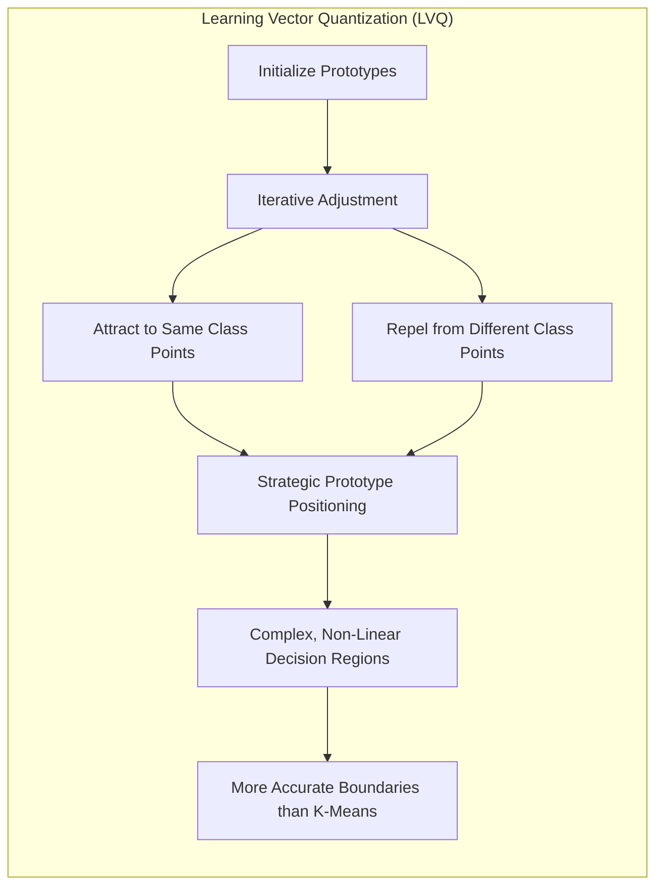

**Corolário 22:** A capacidade do LVQ de ajustar iterativamente os protótipos com base nos rótulos de classe permite que ele capture formas complexas nas fronteiras de decisão, melhorando a capacidade discriminatória do modelo.

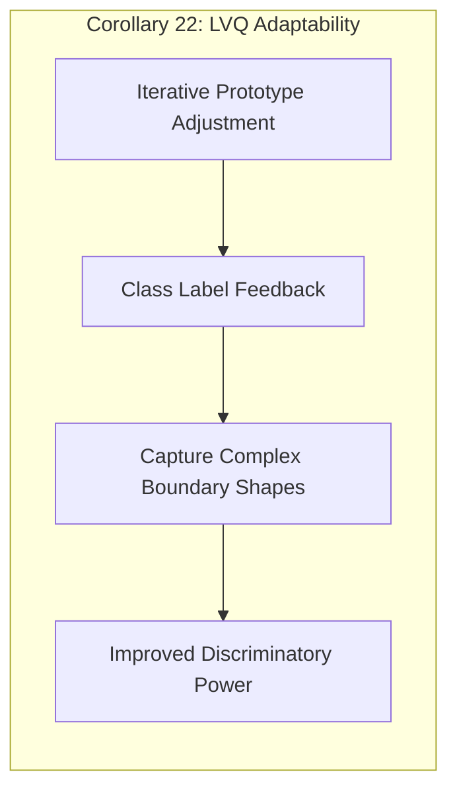

**Misturas Gaussianas (GMMs):** As **GMMs** também são capazes de modelar fronteiras de decisão irregulares, usando componentes gaussianas para representar as distribuições das classes [^13.2.3]. A combinação de múltiplas gaussianas com diferentes médias e covariâncias permite que as GMMs aproximem formas complexas no espaço de *features*. A classificação de um novo ponto é feita com base na probabilidade de pertencer a cada componente gaussiana, o que pode gerar fronteiras de decisão suaves e não lineares.

> 💡 **Exemplo Numérico:**
>
> Novamente utilizando os mesmos dados, as GMMs modelariam as classes A e B usando uma mistura de gaussianas. A classe A poderia ser representada por uma gaussiana centralizada no círculo, e a classe B por uma mistura de gaussianas formando um anel ao redor. A probabilidade de um novo ponto pertencer a cada classe seria calculada com base nessas gaussianas, gerando uma fronteira de decisão suave e não linear que acompanha a forma das classes.
>
> ```python
> import numpy as np
> import matplotlib.pyplot as plt
> from sklearn.mixture import GaussianMixture
> from sklearn.preprocessing import StandardScaler
>
> # Gerando dados sintéticos para duas classes (mesmo do exemplo K-Means e LVQ)
> np.random.seed(0)
> radius = 5
> n_samples_circle = 200
> n_samples_ring = 300
>
> circle_angles = np.random.uniform(0, 2*np.pi, n_samples_circle)
> circle_radius = np.random.normal(radius, 0.5, n_samples_circle)
> circle_x = circle_radius * np.cos(circle_angles)
> circle_y = circle_radius * np.sin(circle_angles)
> class_A = np.column_stack((circle_x, circle_y))
>
> ring_angles = np.random.uniform(0, 2*np.pi, n_samples_ring)
> ring_radius = np.random.normal(radius*1.8, 0.5, n_samples_ring)
> ring_x = ring_radius * np.cos(ring_angles)
> ring_y = ring_radius * np.sin(ring_angles)
> class_B = np.column_stack((ring_x, ring_y))
>
> X = np.vstack((class_A, class_B))
> y = np.array([0] * n_samples_circle + [1] * n_samples_ring)
>
> # Normalizando os dados
> scaler = StandardScaler()
> X_scaled = scaler.fit_transform(X)
>
> # Treinando a GMM
> gmm = GaussianMixture(n_components=2, random_state=0, covariance_type='full')
> gmm.fit(X_scaled)
>
> # Plotando os dados
> plt.figure(figsize=(8, 6))
> plt.scatter(X_scaled[y == 0, 0], X_scaled[y == 0, 1], label='Classe A', color='skyblue', alpha=0.6)
> plt.scatter(X_scaled[y == 1, 0], X_scaled[y == 1, 1], label='Classe B', color='coral', alpha=0.6)
>
> # Criando uma grade para visualizar as fronteiras de decisão
> x_min, x_max = X_scaled[:, 0].min() - 1, X_scaled[:, 0].max() + 1
> y_min, y_max = X_scaled[:, 1].min() - 1, X_scaled[:, 1].max() + 1
> xx, yy = np.meshgrid(np.arange(x_min, x_max, 0.02), np.arange(y_min, y_max, 0.02))
>
> # Classificando os pontos da grade usando a GMM
> grid_points = np.c_[xx.ravel(), yy.ravel()]
> Z = gmm.predict(grid_points).reshape(xx.shape)
>
> # Plotando as fronteiras de decisão
> plt.contourf(xx, yy, Z, alpha=0.2, cmap=plt.cm.RdBu)
>
> plt.title('GMM para Fronteiras Irregulares')
> plt.xlabel('Feature 1 (Normalizado)')
> plt.ylabel('Feature 2 (Normalizado)')
> plt.legend()
> plt.grid(True)
> plt.show()
> ```
>
> Este exemplo mostra como as GMMs conseguem modelar fronteiras de decisão suaves e não lineares, adaptando-se bem à forma complexa das classes.

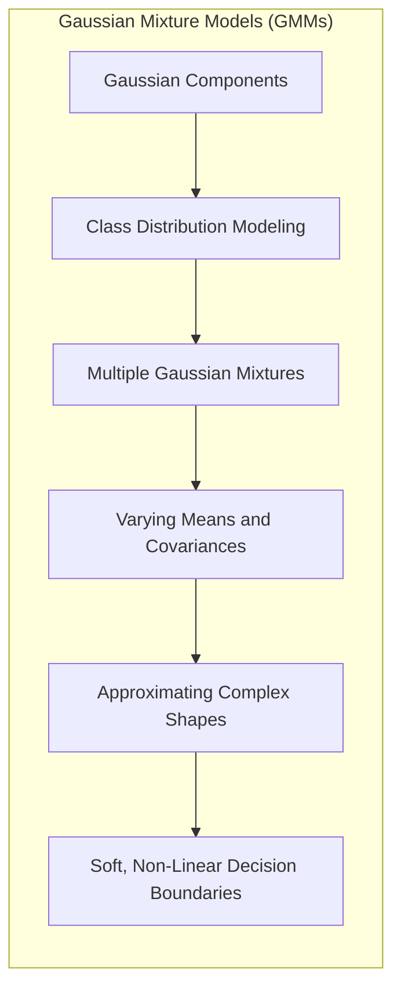

> ⚠️ **Nota Importante**: O LVQ e as GMMs são mais eficazes do que o K-Means para modelar fronteiras de decisão irregulares, pois eles incorporam informações sobre os rótulos de classe no processo de aprendizado dos protótipos.

> ❗ **Ponto de Atenção**: A escolha do número de protótipos e o método de otimização (LVQ ou EM) influenciam a capacidade dos métodos de protótipos de representar as fronteiras de decisão com precisão.

### k-Vizinhos Mais Próximos (k-NN): Uma Abordagem Alternativa para Fronteiras Irregulares

O método de **k-Vizinhos Mais Próximos (k-NN)** oferece uma abordagem alternativa para modelar fronteiras de decisão irregulares, sem depender de um conjunto de protótipos [^13.3]. O k-NN usa os próprios dados de treinamento para classificar um novo ponto, atribuindo a ele a classe majoritária entre seus $k$ vizinhos mais próximos. A flexibilidade do k-NN em modelar fronteiras de decisão irregulares está relacionada com o fato de que ele não assume nenhuma forma específica para a fronteira, adaptando-se à distribuição dos dados.

> 💡 **Exemplo Numérico:**
>
> Usando os mesmos dados das classes A e B, o k-NN classificaria um novo ponto com base nos rótulos dos seus k vizinhos mais próximos no conjunto de treinamento. Para k=1, a fronteira de decisão seria altamente irregular, seguindo a forma dos pontos de treinamento. Para valores maiores de k, a fronteira se tornaria mais suave.
>
> ```python
> import numpy as np
> import matplotlib.pyplot as plt
> from sklearn.neighbors import KNeighborsClassifier
> from sklearn.preprocessing import StandardScaler
>
> # Gerando dados sintéticos para duas classes (mesmo do exemplo K-Means, LVQ e GMM)
> np.random.seed(0)
> radius = 5
> n_samples_circle = 200
> n_samples_ring = 300
>
> circle_angles = np.random.uniform(0, 2*np.pi, n_samples_circle)
> circle_radius = np.random.normal(radius, 0.5, n_samples_circle)
> circle_x = circle_radius * np.cos(circle_angles)
> circle_y = circle_radius * np.sin(circle_angles)
> class_A = np.column_stack((circle_x, circle_y))
>
> ring_angles = np.random.uniform(0, 2*np.pi, n_samples_ring)
> ring_radius = np.random.normal(radius*1.8, 0.5, n_samples_ring)
> ring_x = ring_radius * np.cos(ring_angles)
> ring_y = ring_radius * np.sin(ring_angles)
> class_B = np.column_stack((ring_x, ring_y))
>
> X = np.vstack((class_A, class_B))
> y = np.array([0] * n_samples_circle + [1] * n_samples_ring)
>
> # Normalizando os dados
> scaler = StandardScaler()
> X_scaled = scaler.fit_transform(X)
>
> # Treinando o k-NN
> knn = KNeighborsClassifier(n_neighbors=5) # Usando k=5
> knn.fit(X_scaled, y)
>
> # Plotando os dados
> plt.figure(figsize=(8, 6))
> plt.scatter(X_scaled[y == 0, 0], X_scaled[y == 0, 1], label='Classe A', color='skyblue', alpha=0.6)
> plt.scatter(X_scaled[y == 1, 0], X_scaled[y == 1, 1], label='Classe B', color='coral', alpha=0.6)
>
> # Criando uma grade para visualizar as fronteiras de decisão
> x_min, x_max = X_scaled[:, 0].min() - 1, X_scaled[:, 0].max() + 1
> y_min, y_max = X_scaled[:, 1].min() - 1, X_scaled[:, 1].max() + 1
> xx, yy = np.meshgrid(np.arange(x_min, x_max, 0.02), np.arange(y_min, y_max, 0.02))
>
> # Classificando os pontos da grade usando o k-NN
> grid_points = np.c_[xx.ravel(), yy.ravel()]
> Z = knn.predict(grid_points).reshape(xx.shape)
>
> # Plotando as fronteiras de decisão
> plt.contourf(xx, yy, Z, alpha=0.2, cmap=plt.cm.RdBu)
>
> plt.title('k-NN para Fronteiras Irregulares')
> plt.xlabel('Feature 1 (Normalizado)')
> plt.ylabel('Feature 2 (Normalizado)')
> plt.legend()
> plt.grid(True)
> plt.show()
> ```
>
> Este exemplo demonstra como o k-NN se adapta bem a fronteiras irregulares, com a forma da fronteira de decisão dependendo da distribuição dos dados de treinamento e do valor de k.

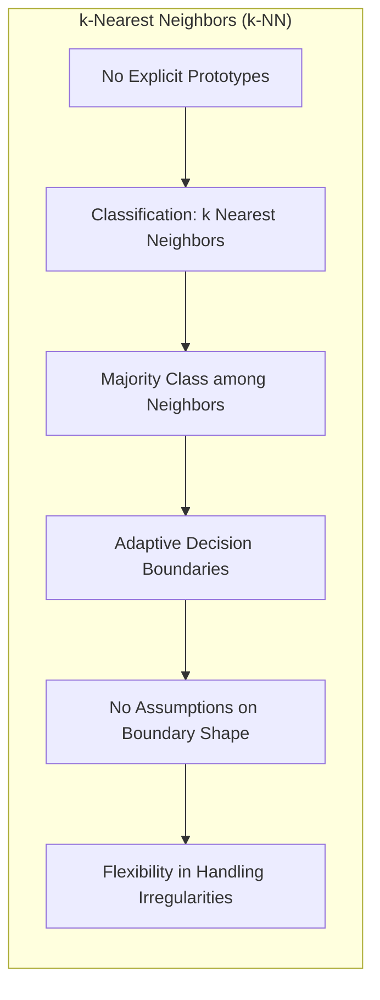

O k-NN pode se sair muito bem em problemas com fronteiras de decisão irregulares, mas também apresenta algumas limitações. A complexidade computacional do k-NN é maior do que os métodos de protótipos, especialmente quando o conjunto de treinamento é grande, e a escolha do valor de $k$ e da métrica de distância podem afetar significativamente o desempenho do modelo. A maldição da dimensionalidade também pode ser um problema para k-NN em problemas com alta dimensionalidade.

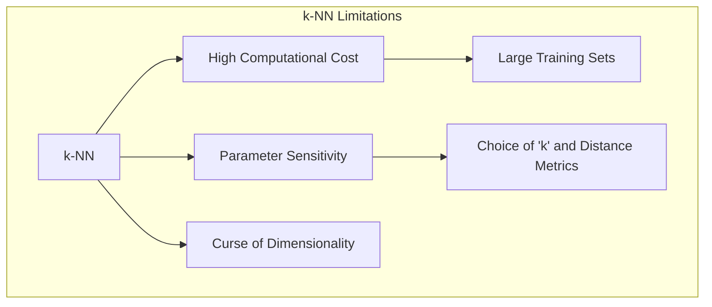

**Lemma 23:** A complexidade do k-NN em modelar fronteiras de decisão irregulares depende do número de pontos no conjunto de treinamento e da complexidade da distribuição de dados, tendo dificuldade em generalizar para regiões com poucos pontos de treino.
*Prova*: O k-NN não generaliza por si só, a forma da fronteira de decisão é definida pelos pontos próximos, e a capacidade de adaptação à irregularidade dos dados é diretamente proporcional à densidade do conjunto de dados de treino. $\blacksquare$

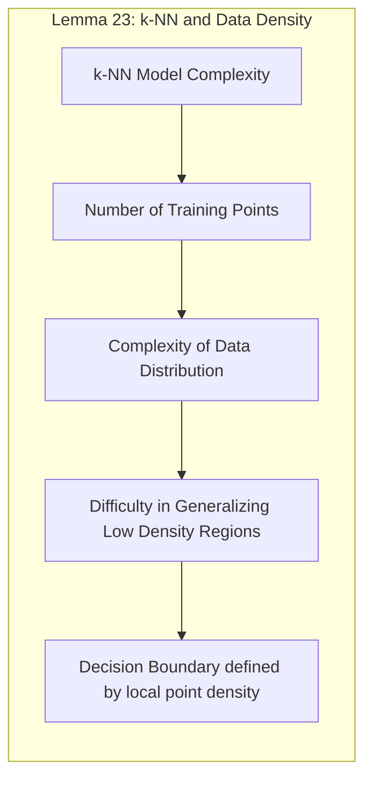

**Corolário 23:** A escolha entre k-NN e métodos de protótipos para modelar fronteiras irregulares deve levar em consideração o tamanho do conjunto de dados, a necessidade de uma representação compacta, a complexidade das fronteiras de decisão e a necessidade de evitar o *overfitting*.

> ⚠️ **Nota Importante**: O k-NN é uma abordagem não paramétrica que se adapta bem a fronteiras irregulares, mas pode ser computacionalmente mais custoso do que métodos de protótipos para grandes conjuntos de dados.

> ❗ **Ponto de Atenção**:  A escolha do valor de $k$ e a métrica de distância apropriada podem melhorar a capacidade do k-NN de modelar fronteiras irregulares.

### Conclusão

Os métodos baseados em protótipos oferecem uma forma eficaz e flexível de modelar fronteiras de decisão irregulares, usando o posicionamento estratégico dos protótipos no espaço de *features*. Técnicas como o LVQ e as GMMs, em particular, são mais eficazes do que o K-Means para modelar fronteiras complexas, pois incorporam informações sobre os rótulos de classe. O k-NN oferece uma abordagem alternativa que se adapta bem a fronteiras irregulares, mas pode ser computacionalmente mais custoso do que métodos de protótipos. A escolha do método mais apropriado depende da complexidade do problema, da quantidade de dados e dos recursos computacionais disponíveis. A compreensão das vantagens e limitações de cada método é crucial para obter um desempenho eficaz em diferentes aplicações.

### Footnotes

[^13.2]: "Throughout this chapter, our training data consists of the N pairs (x1,91),...,(xn, 9N) where gi is a class label taking values in {1, 2, . . ., K}. Prototype methods represent the training data by a set of points in feature space. These prototypes are typically not examples from the training sample, except in the case of 1-nearest-neighbor classification discussed later. Each prototype has an associated class label, and classification of a query point x is made to the class of the closest prototype. "Closest" is usually defined by Euclidean distance in the feature space, after each feature has been standardized to have overall mean 0 and variance 1 in the training sample." *(Trecho de "13. Prototype Methods and Nearest-Neighbors")*

[^13.2.1]: "K-means clustering is a method for finding clusters and cluster centers in a set of unlabeled data... To use K-means clustering for classification of labeled data, the steps are: apply K-means clustering to the training data in each class separately, using R prototypes per class; assign a class label to each of the K × R prototypes; classify a new feature x to the class of the closest prototype." *(Trecho de "13. Prototype Methods and Nearest-Neighbors")*

[^13.2.2]: "In this technique due to Kohonen (1989), prototypes are placed strategically with respect to the decision boundaries in an ad-hoc way...The idea is that the training points attract prototypes of the correct class, and repel other prototypes...When the iterations settle down, prototypes should be close to the training points in their class." *(Trecho de "13. Prototype Methods and Nearest-Neighbors")*

[^13.2.3]: "The Gaussian mixture model can also be thought of as a prototype method, similar in spirit to K-means and LVQ...Each cluster is described in terms of a Gaussian density, which has a centroid (as in K-means), and a covariance matrix...when Gaussian mixture models are used to represent the feature density in each class, it produces smooth posterior probabilities." *(Trecho de "13. Prototype Methods and Nearest-Neighbors")*

[^13.3]: "These classifiers are memory-based, and require no model to be fit. Given a query point xo, we find the k training points x(r), r = 1,..., k closest in distance to xo, and then classify using majority vote among the k neighbors." *(Trecho de "13. Prototype Methods and Nearest-Neighbors")*

[^4.1]: "This chapter focuses on linear methods for classification, which are linear in the parameters and lead to linear decision boundaries." *(Trecho de "4. Linear Methods for Classification")*

[^4.3]: "Linear Discriminant Analysis (LDA) is a classical method for classification. It assumes that the classes are normally distributed and that their covariance matrices are the same." *(Trecho de "4. Linear Methods for Classification")*
