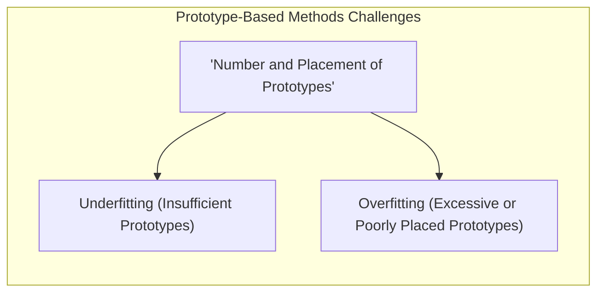
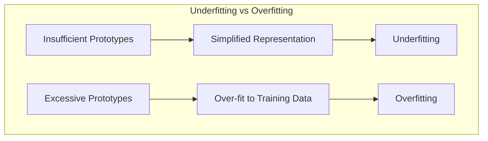
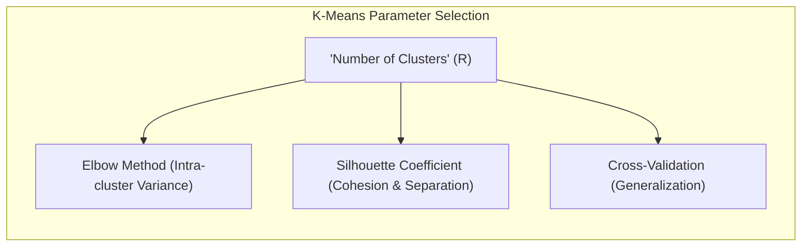
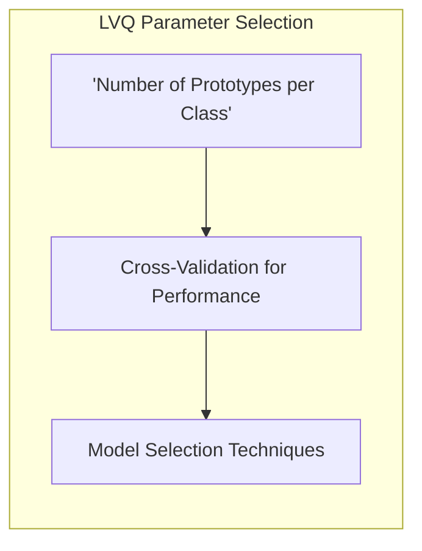
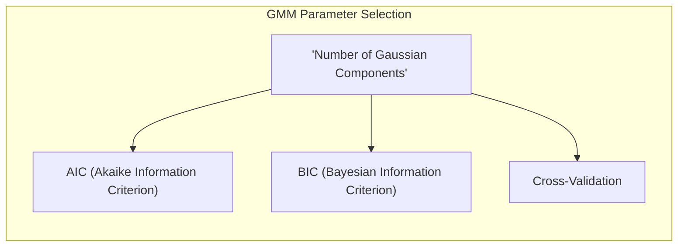
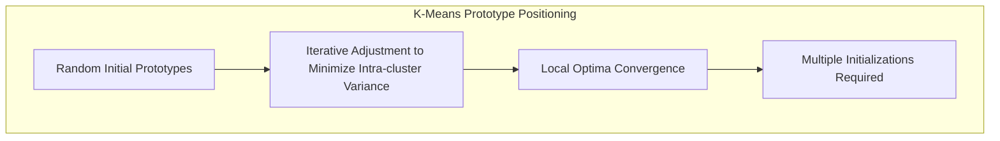
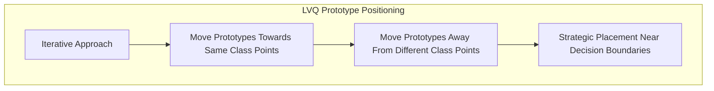
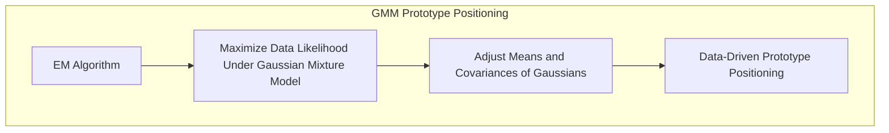

## Desafios nos Métodos de Protótipos: A Escolha do Número e Posicionamento dos Protótipos



### Introdução

Este capítulo aprofunda a discussão sobre os desafios enfrentados pelos métodos baseados em protótipos, com foco na **escolha do número e posicionamento dos protótipos** no espaço de *features* [^13.2]. A eficácia desses métodos depende criticamente da capacidade de selecionar um conjunto de protótipos que representem adequadamente as distribuições das classes. Abordaremos como a escolha incorreta do número e da localização dos protótipos pode levar a *underfitting* ou *overfitting*, e como diferentes técnicas (K-Means, LVQ, GMMs) tentam lidar com esses desafios. Analisaremos também métodos de validação cruzada e outras abordagens para auxiliar na seleção desses parâmetros cruciais, e como um bom ajuste pode levar a uma modelagem eficiente de fronteiras de decisão complexas.

### O Dilema do Número e Posicionamento dos Protótipos

A escolha do **número de protótipos** e seu **posicionamento** no espaço de *features* são dois dos maiores desafios nos métodos baseados em protótipos [^13.2]. Um número insuficiente de protótipos pode levar a uma representação simplificada dos dados, incapaz de capturar a complexidade das distribuições das classes, resultando em um modelo com *underfitting*. Por outro lado, um número excessivo de protótipos pode levar a *overfitting*, onde o modelo se ajusta demais aos dados de treinamento e não generaliza bem para novos dados.



O posicionamento dos protótipos também é crucial. Protótipos mal posicionados podem não representar adequadamente as regiões de decisão das classes, levando a classificações incorretas. A localização ideal dos protótipos depende da distribuição dos dados e da forma das fronteiras de decisão, o que pode ser difícil de determinar sem uma análise cuidadosa dos dados.

A natureza *model-free* dos métodos baseados em protótipos, embora ofereça flexibilidade, também implica que não existem modelos explícitos para auxiliar na escolha do número e localização dos protótipos. Essa escolha, em geral, é feita por meio de métodos de validação cruzada e ajustes iterativos, buscando um equilíbrio entre viés e variância do modelo.

**Lemma 24:** A escolha inadequada do número e posicionamento dos protótipos pode comprometer a capacidade de generalização do modelo, levando a *underfitting* (quando há poucos protótipos) ou *overfitting* (quando há muitos protótipos ou protótipos mal posicionados).
*Prova*: Com poucos protótipos, o modelo simplifica a estrutura dos dados, ignorando detalhes relevantes. Com muitos, o modelo aprende ruídos nos dados, tendo dificuldade em generalizar para novos pontos. $\blacksquare$

> 💡 **Exemplo Numérico:**
> Imagine um problema de classificação binária onde temos dados distribuídos em duas classes, com uma forma de "lua crescente" para cada classe.
>
> - **Underfitting (Poucos protótipos):** Se usarmos apenas um protótipo por classe (dois protótipos no total), esses protótipos provavelmente ficarão localizados no centro de cada lua crescente. Isso resultaria em uma fronteira de decisão linear que separa as duas classes, o que é uma simplificação excessiva e levaria a muitos erros de classificação.
>
> - **Overfitting (Muitos protótipos):** Se usarmos muitos protótipos (por exemplo, 10 por classe), esses protótipos se ajustarão muito bem aos dados de treinamento, inclusive aos ruídos. A fronteira de decisão resultante seria muito complexa, com pequenas ilhas de uma classe dentro da outra, e o modelo teria dificuldade em classificar novos pontos.
>
> A escolha ideal seria um número intermediário de protótipos (por exemplo, 3 ou 4 por classe) que capturem a forma geral das luas crescentes sem se ajustar excessivamente aos ruídos.

**Corolário 24:** Técnicas de validação cruzada e outros métodos de seleção de modelo são fundamentais para determinar o número e posicionamento ideais dos protótipos em métodos baseados em protótipos.

> ⚠️ **Nota Importante**: A escolha do número de protótipos e sua localização são decisões críticas que afetam diretamente o desempenho dos métodos baseados em protótipos.

> ❗ **Ponto de Atenção**:  Não existe uma regra única para determinar o número e posicionamento ótimos dos protótipos, e a melhor escolha depende das características específicas de cada problema.

### Abordagens para a Escolha do Número de Protótipos

A escolha do número de protótipos é uma tarefa que exige atenção e cuidadosa consideração. Diferentes métodos de protótipos apresentam estratégias distintas para auxiliar nessa tarefa.

**K-Means:** No **K-Means**, a escolha do número de *clusters* ($R$) é um hiperparâmetro crucial [^13.2.1]. Métodos como o *elbow method*, análise do coeficiente de silhueta e técnicas de validação cruzada são frequentemente utilizados para determinar o número ideal de *clusters* em cada classe. O *elbow method* busca o ponto em que o decréscimo da variância intra-cluster se torna menos acentuado. O coeficiente de silhueta avalia a coesão e a separação dos *clusters*, buscando valores altos. E a validação cruzada avalia o desempenho do modelo para diferentes valores de R no conjunto de treino, escolhendo o valor que generaliza melhor para dados não vistos no treino.



**Lemma 25:** A escolha do número ideal de protótipos no K-Means busca um equilíbrio entre a captura da estrutura dos dados e a capacidade de generalização do modelo.
*Prova*: Número baixo de protótipos leva a modelos simplificados, enquanto muitos protótipos levam ao *overfitting*, e os métodos de validação e avaliação de cluster buscam o ponto de ótimo equilíbrio. $\blacksquare$

> 💡 **Exemplo Numérico:**
>
> Considere um dataset 2D com 100 pontos, visualmente formando 3 grupos distintos. Ao aplicar o K-Means, podemos variar o número de clusters (R) e observar como a variância intra-cluster (a soma das distâncias quadráticas de cada ponto ao centro do seu cluster) se comporta:
>
> | R | Variância Intra-Cluster |
> |---|---|
> | 1 | 1250 |
> | 2 | 450 |
> | 3 | 150 |
> | 4 | 140 |
> | 5 | 135 |
>
>  O *elbow method* sugere que R=3 é o número ideal, pois a diminuição na variância intra-cluster se torna menos acentuada após esse ponto. A análise do coeficiente de silhueta também confirmaria essa escolha, com um valor alto para R=3, indicando boa coesão e separação dos clusters. A validação cruzada reforçaria essa escolha através da avaliação do desempenho do modelo com diferentes valores de R no conjunto de validação.
>
> ```python
> import numpy as np
> from sklearn.cluster import KMeans
> from sklearn.metrics import silhouette_score
>
> # Criando dados de exemplo
> np.random.seed(0)
> data_1 = np.random.rand(30, 2) + np.array([1, 1])
> data_2 = np.random.rand(30, 2) + np.array([4, 4])
> data_3 = np.random.rand(40, 2) + np.array([7, 1])
> data = np.concatenate((data_1, data_2, data_3))
>
> # Calculando variância intra-cluster e silhueta para diferentes valores de R
> for R in range(1, 6):
>     kmeans = KMeans(n_clusters=R, random_state=0, n_init=10)
>     kmeans.fit(data)
>     inertia = kmeans.inertia_
>     if R > 1:
>         silhouette = silhouette_score(data, kmeans.labels_)
>     else:
>         silhouette = "N/A"
>     print(f"R={R}, Inertia={inertia:.2f}, Silhouette={silhouette}")
> ```

**Learning Vector Quantization (LVQ):** No **LVQ**, o número de protótipos por classe também é um hiperparâmetro [^13.2.2]. A validação cruzada é uma ferramenta importante para selecionar o número de protótipos que leva ao melhor desempenho. Uma estratégia comum é iniciar com um número grande de protótipos e depois reduzi-lo por meio de técnicas de seleção de modelo. Diferente do K-means, a escolha dos protótipos inicial já é guiada pelos rótulos das classes.



**Corolário 25:** A escolha do número de protótipos no LVQ deve considerar a complexidade das fronteiras de decisão das classes e o tamanho do conjunto de treinamento.

> 💡 **Exemplo Numérico:**
>
> Considere um problema de classificação com duas classes, onde a classe A tem uma distribuição mais complexa do que a classe B. Ao usar o LVQ, podemos experimentar diferentes números de protótipos por classe:
>
> - **Cenário 1: Poucos protótipos (ex: 2 para classe A e 1 para classe B):** A fronteira de decisão resultante será simples e pode não capturar bem a complexidade da classe A.
>
> - **Cenário 2: Muitos protótipos (ex: 6 para classe A e 2 para classe B):** A fronteira de decisão se tornará mais complexa e se ajustará melhor aos dados de treinamento. No entanto, pode levar ao overfitting se o número de protótipos for muito alto em relação ao tamanho do conjunto de treinamento.
>
> - **Cenário Ideal: Número intermediário de protótipos (ex: 4 para classe A e 2 para classe B):** A validação cruzada nos indicaria que essa configuração generaliza melhor para novos dados, equilibrando a capacidade de modelagem e a complexidade do modelo.
>
>  Podemos usar validação cruzada para avaliar o desempenho do modelo com diferentes números de protótipos para cada classe e escolher aquele que apresentar a melhor acurácia no conjunto de teste.

**Misturas Gaussianas (GMMs):** Nas **GMMs**, o número de componentes gaussianas é um hiperparâmetro que afeta a capacidade do modelo de aproximar a distribuição dos dados [^13.2.3]. Critérios de informação como o AIC (Akaike Information Criterion) e o BIC (Bayesian Information Criterion) são frequentemente usados para escolher o número de componentes que melhor equilibram a complexidade do modelo e o ajuste aos dados. O BIC tende a escolher modelos mais simples, enquanto o AIC tende a escolher modelos mais complexos. A validação cruzada também pode ser usada para validar os resultados dos critérios de informação.



> 💡 **Exemplo Numérico:**
>
> Suponha que temos dados que parecem ter 3 grupos distintos. Ao aplicar uma GMM, podemos variar o número de componentes gaussianas e calcular o AIC e BIC:
>
> | Componentes | AIC    | BIC    |
> |------------|--------|--------|
> | 1          | 1500   | 1510   |
> | 2          | 1200   | 1220   |
> | 3          | 1100   | 1130   |
> | 4          | 1120   | 1160   |
>
> Nesse caso, o AIC e o BIC indicam que 3 componentes é o melhor número, pois o AIC e o BIC são minimizados nesse valor. O BIC penaliza modelos complexos (com mais componentes) mais fortemente do que o AIC, tendendo a escolher modelos mais simples.
>
> ```python
> import numpy as np
> from sklearn.mixture import GaussianMixture
> from sklearn.metrics import make_scorer, log_loss
>
> # Criando dados de exemplo
> np.random.seed(0)
> data_1 = np.random.randn(30, 2) + np.array([1, 1])
> data_2 = np.random.randn(30, 2) + np.array([4, 4])
> data_3 = np.random.randn(40, 2) + np.array([7, 1])
> data = np.concatenate((data_1, data_2, data_3))
>
> # Calculando AIC e BIC para diferentes números de componentes
> for n_components in range(1, 5):
>     gmm = GaussianMixture(n_components=n_components, random_state=0, n_init=10)
>     gmm.fit(data)
>     aic = gmm.aic(data)
>     bic = gmm.bic(data)
>     print(f"Componentes={n_components}, AIC={aic:.2f}, BIC={bic:.2f}")
> ```

> ⚠️ **Nota Importante**: A validação cruzada é uma ferramenta essencial para avaliar o desempenho do modelo em diferentes escolhas do número de protótipos, garantindo que o modelo generalize bem para novos dados.

> ❗ **Ponto de Atenção**: A seleção do número de protótipos não deve ser vista como um processo isolado, mas sim como parte do ajuste geral do modelo, que envolve a escolha de outros parâmetros e métricas.

### Abordagens para o Posicionamento dos Protótipos

O posicionamento dos protótipos no espaço de *features* é tão importante quanto a escolha do número de protótipos. Diferentes métodos de protótipos usam estratégias distintas para localizar os protótipos:

**K-Means:** No K-Means, o posicionamento inicial dos protótipos é geralmente aleatório, e os protótipos são ajustados iterativamente para minimizar a variância intra-cluster [^13.2.1]. O problema com esta abordagem é que o K-means converge para um ótimo local e a escolha dos centros iniciais pode ter impacto sobre a qualidade da convergência, sendo necessário o uso de técnicas de múltiplas inicializações com escolha do melhor resultado.



**Lemma 26:** O K-Means é sensível à inicialização aleatória dos protótipos, e diferentes inicializações podem levar a resultados diferentes no ajuste dos protótipos e na capacidade do modelo de generalizar.
*Prova*: Como o K-means converge para um mínimo local, diferentes inicializações podem levar o algoritmo a diferentes soluções. $\blacksquare$

> 💡 **Exemplo Numérico:**
>
> Imagine um dataset com 2 clusters bem definidos. Se o K-Means for inicializado com dois protótipos muito próximos um do outro, eles podem convergir para o mesmo cluster, dividindo-o em dois, ao invés de encontrar os dois clusters verdadeiros. Por outro lado, uma inicialização com os protótipos bem separados, cada um perto do centro de um cluster, levará a uma convergência correta.
>
> Para lidar com isso, é comum executar o K-Means várias vezes com inicializações aleatórias diferentes e escolher o resultado com a menor variância intra-cluster.

**Learning Vector Quantization (LVQ):** O LVQ usa uma abordagem iterativa que move os protótipos em direção aos pontos de treino da mesma classe e se afasta de pontos de treino de classes diferentes [^13.2.2]. Essa abordagem supervisionada busca posicionar os protótipos estrategicamente nas regiões de decisão, o que resulta em fronteiras mais complexas e precisas em comparação com o K-Means. A taxa de aprendizagem do LVQ também afeta o posicionamento dos protótipos e precisa ser cuidadosamente escolhida.



**Corolário 26:** O LVQ usa o rótulo das classes para posicionar os protótipos perto das fronteiras de decisão, melhorando a capacidade discriminatória do modelo e, consequentemente, seu desempenho.

> 💡 **Exemplo Numérico:**
>
> Considere um problema de classificação binária com duas classes que se sobrepõem parcialmente.
>
> - **K-Means:** Se usarmos o K-means para gerar protótipos, eles se posicionarão nos centros dos grupos, o que pode não corresponder bem às fronteiras de decisão.
>
> - **LVQ:** O LVQ, por outro lado, posiciona os protótipos nas regiões de decisão, ou seja, nas áreas de sobreposição das classes. Ao iterar, os protótipos da classe A se aproximam dos pontos de treino da classe A e se afastam dos pontos da classe B, e vice-versa. Isso permite que o LVQ crie fronteiras de decisão mais precisas, especialmente em regiões de sobreposição. A taxa de aprendizado controla o quão rápido os protótipos se movem durante as iterações, e uma escolha inadequada pode levar a um posicionamento subótimo.

**Misturas Gaussianas (GMMs):** Nas GMMs, os protótipos (média e covariância das gaussianas) são ajustados pelo algoritmo EM, que busca maximizar a verossimilhança dos dados sob o modelo de mistura gaussiana [^13.2.3]. O posicionamento dos protótipos é guiado pelos dados e pela estrutura da distribuição, permitindo que as GMMs modelem regiões de decisão com formas complexas.



> 💡 **Exemplo Numérico:**
>
> Considere um dataset que parece ter 2 grupos com formatos elípticos. O K-Means tenderá a criar clusters esféricos, enquanto o GMM ajustará gaussianas elípticas, capturando melhor a forma dos grupos.
>
> O algoritmo EM, usado para ajustar os parâmetros (médias e covariâncias) das gaussianas, iterativamente atualiza esses parâmetros para maximizar a verossimilhança dos dados. Inicialmente, as gaussianas podem ser posicionadas aleatoriamente, mas o EM irá ajustá-las de modo que cada gaussiana se alinhe com um dos grupos elípticos presentes nos dados.

> ⚠️ **Nota Importante**: O LVQ utiliza um método supervisionado para ajustar o posicionamento dos protótipos, ao contrário do K-Means que usa um método não supervisionado, e do GMM que usa um método probabilístico.

> ❗ **Ponto de Atenção**:  A inicialização dos protótipos no K-Means e no LVQ, ou dos parâmetros das Gaussianas nas GMMs, influencia o resultado da otimização, e deve-se utilizar múltiplas inicializações com escolha do melhor resultado.

### Conclusão

A escolha do número e posicionamento dos protótipos é um desafio fundamental nos métodos baseados em protótipos. Um número insuficiente de protótipos pode levar a *underfitting*, enquanto um número excessivo ou protótipos mal posicionados podem levar a *overfitting*. Técnicas como validação cruzada, critérios de informação e algoritmos específicos para ajuste de protótipos são essenciais para encontrar um equilíbrio entre o ajuste aos dados e a capacidade de generalização. A compreensão desses desafios e das abordagens para superá-los é crucial para a utilização eficaz de métodos baseados em protótipos em problemas de classificação e reconhecimento de padrões.

### Footnotes

[^13.2]: "Throughout this chapter, our training data consists of the N pairs ($x_1$,$g_1$),...,($x_n$, $g_N$) where $g_i$ is a class label taking values in {1, 2, . . ., K}. Prototype methods represent the training data by a set of points in feature space. These prototypes are typically not examples from the training sample, except in the case of 1-nearest-neighbor classification discussed later. Each prototype has an associated class label, and classification of a query point x is made to the class of the closest prototype. "Closest" is usually defined by Euclidean distance in the feature space, after each feature has been standardized to have overall mean 0 and variance 1 in the training sample." *(Trecho de "13. Prototype Methods and Nearest-Neighbors")*

[^13.2.1]: "K-means clustering is a method for finding clusters and cluster centers in a set of unlabeled data. One chooses the desired number of cluster centers, say R, and the K-means procedure iteratively moves the centers to minimize the total within cluster variance." *(Trecho de "13. Prototype Methods and Nearest-Neighbors")*

[^13.2.2]: "In this technique due to Kohonen (1989), prototypes are placed strategically with respect to the decision boundaries in an ad-hoc way. LVQ is an online algorithm-observations are processed one at a time. The idea is that the training points attract prototypes of the correct class, and repel other prototypes. When the iterations settle down, prototypes should be close to the training points in their class." *(Trecho de "13. Prototype Methods and Nearest-Neighbors")*

[^13.2.3]: "The Gaussian mixture model can also be thought of as a prototype method, similar in spirit to K-means and LVQ. We discuss Gaussian mixtures in some detail in Sections 6.8, 8.5 and 12.7. Each cluster is described in terms of a Gaussian density, which has a centroid (as in K-means), and a covariance matrix." *(Trecho de "13. Prototype Methods and Nearest-Neighbors")*
