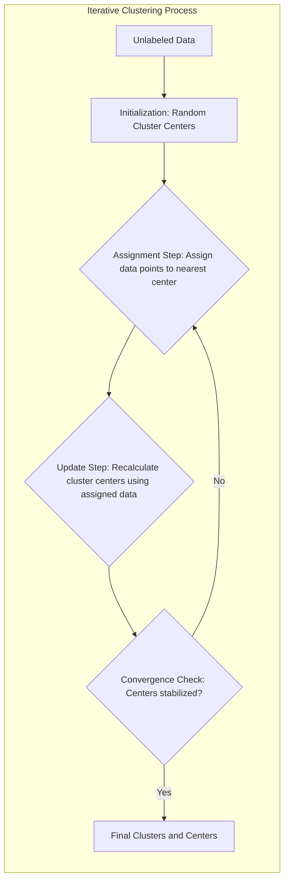
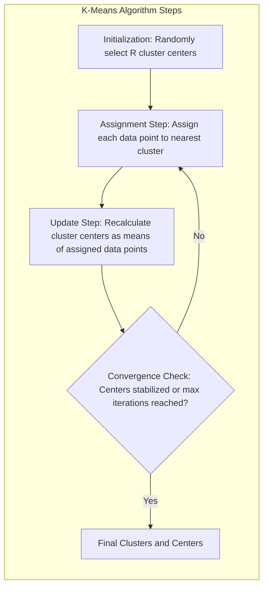
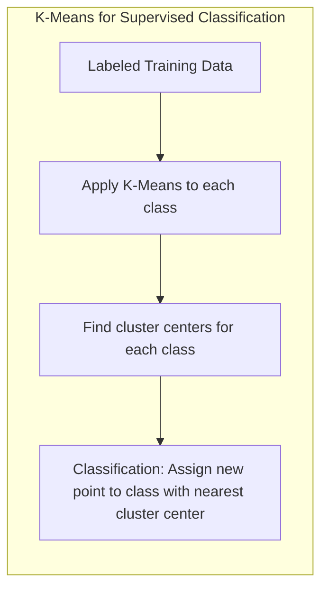
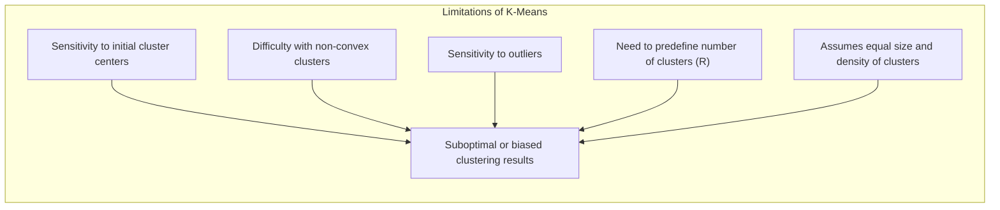

## Métodos Iterativos para *Clustering*: Encontrando Agrupamentos e Centros em Dados Não Rotulados

### Introdução

Este capítulo explora métodos iterativos para **clustering**, com foco especial na identificação de **agrupamentos (clusters)** e seus respectivos **centros** em dados não rotulados [^13.2.1]. O *clustering* é uma técnica fundamental em análise de dados e aprendizado de máquina que busca descobrir estruturas nos dados sem a necessidade de informações sobre os rótulos de classe. Discutiremos como métodos iterativos, como o K-Means, operam para encontrar grupos de dados similares e determinar seus centros, e como essa abordagem é útil na exploração de dados e na preparação de modelos para classificação supervisionada. Analisaremos os passos fundamentais do algoritmo K-Means, seus pontos fortes e limitações, e como ele se diferencia de outros algoritmos de *clustering*.

### A Natureza Iterativa do *Clustering*

O *clustering* iterativo é um processo que busca identificar agrupamentos de dados e determinar seus centros por meio de um procedimento que se repete até que uma condição de convergência seja atingida. A ideia central é que, em um conjunto de dados não rotulado, existem regiões onde os dados são mais similares entre si do que com o resto dos dados, e o objetivo é descobrir essas regiões e representá-las por seus centros.

Métodos iterativos, como o K-Means, alternam entre duas etapas principais:

1.  **Atribuição (Assignment):** Nesta etapa, cada ponto de dados é atribuído ao *cluster* cujo centro é o mais próximo, de acordo com alguma métrica de distância (normalmente a distância Euclidiana).
2.  **Atualização (Update):** Nesta etapa, os centros dos *clusters* são recalculados com base na média dos pontos a eles atribuídos na etapa anterior.

Essas duas etapas são repetidas iterativamente até que os centros dos *clusters* se estabilizem, o que indica que o algoritmo convergiu para uma solução. A convergência significa que os pontos não mudam mais de *cluster* e os centros dos *clusters* não se movem significativamente entre iterações.

**Lemma 27:** O processo iterativo de *clustering* busca convergir para uma solução que minimize a variância intra-cluster, ou seja, que os pontos dentro de um mesmo *cluster* sejam o mais similar possível.
*Prova*: A fase de atribuição realoca cada ponto para o cluster cujo centro é o mais próximo, e a fase de atualização move os centros para o ponto central dos clusters atuais, levando a uma redução gradual da distância de cada ponto ao seu centro de cluster, garantindo a convergência para um ponto de ótimo local. $\blacksquare$

**Corolário 27:** A inicialização dos centros dos *clusters* tem um impacto significativo na solução final, e diferentes inicializações podem levar a resultados diferentes, necessitando da execução do algoritmo várias vezes com inicializações aleatórias para escolha do melhor resultado.

> 💡 **Exemplo Numérico:**
> Imagine que temos 5 pontos de dados em um espaço 2D: A(1, 2), B(1.5, 1.8), C(5, 8), D(8, 8), E(1, 0.6). Inicializamos 2 centros de clusters aleatoriamente: C1(1,1) e C2(7,7).
>
> **Iteração 1:**
>
> *   **Atribuição:**
>     *   Distância(A, C1) = $\sqrt{(1-1)^2 + (2-1)^2}$ = 1
>     *   Distância(A, C2) = $\sqrt{(1-7)^2 + (2-7)^2}$ = 7.81
>     *   A é atribuído ao cluster 1
>     *   Distância(B, C1) = $\sqrt{(1.5-1)^2 + (1.8-1)^2}$ = 0.94
>     *   Distância(B, C2) = $\sqrt{(1.5-7)^2 + (1.8-7)^2}$ = 7.56
>     *   B é atribuído ao cluster 1
>     *   Distância(C, C1) = $\sqrt{(5-1)^2 + (8-1)^2}$ = 8.06
>     *   Distância(C, C2) = $\sqrt{(5-7)^2 + (8-7)^2}$ = 2.23
>     *   C é atribuído ao cluster 2
>     *   Distância(D, C1) = $\sqrt{(8-1)^2 + (8-1)^2}$ = 9.90
>     *   Distância(D, C2) = $\sqrt{(8-7)^2 + (8-7)^2}$ = 1.41
>     *  D é atribuído ao cluster 2
>     *   Distância(E, C1) = $\sqrt{(1-1)^2 + (0.6-1)^2}$ = 0.4
>     *   Distância(E, C2) = $\sqrt{(1-7)^2 + (0.6-7)^2}$ = 8.96
>     *   E é atribuído ao cluster 1
>
> *   **Atualização:**
>     *   Novo centro C1 = Média(A, B, E) = ((1+1.5+1)/3, (2+1.8+0.6)/3) = (1.17, 1.47)
>     *   Novo centro C2 = Média(C, D) = ((5+8)/2, (8+8)/2) = (6.5, 8)
>
>   Este processo se repetiria até que os centros dos clusters não se movessem significativamente, indicando convergência.

> ⚠️ **Nota Importante**: O *clustering* iterativo é uma abordagem fundamental para identificar estruturas em dados não rotulados, permitindo descobrir agrupamentos de pontos similares e representar esses grupos por seus centros.

> ❗ **Ponto de Atenção**: A escolha da métrica de distância e do número de *clusters* são hiperparâmetros cruciais que afetam o resultado do *clustering*, sendo necessário o uso de técnicas de seleção de modelo para otimizar esses parâmetros.

### K-Means: Um Algoritmo Iterativo para *Clustering*

O algoritmo **K-Means** é um dos algoritmos de *clustering* iterativos mais populares e amplamente utilizados [^13.2.1]. O objetivo do K-Means é particionar um conjunto de dados não rotulado em $R$ *clusters*, onde $R$ é um hiperparâmetro a ser definido. O algoritmo busca determinar os centros dos *clusters* e atribuir cada ponto de dados ao *cluster* mais próximo, de forma a minimizar a variância intra-cluster, ou seja, a soma das distâncias quadráticas entre cada ponto e o centro de seu *cluster*.

O algoritmo K-Means opera em três passos principais:

1.  **Inicialização:** O algoritmo começa com a escolha aleatória de $R$ pontos no espaço de *features* como centros dos *clusters*.
2.  **Atribuição:** Cada ponto de dados é atribuído ao *cluster* cujo centro é o mais próximo (menor distância Euclidiana).
3.  **Atualização:** Os centros dos *clusters* são recalculados como a média dos pontos a eles atribuídos na etapa anterior.

As etapas 2 e 3 são repetidas iterativamente até que os centros dos *clusters* não se movam mais significativamente ou até que um número máximo de iterações seja atingido.

**Lemma 28:** O algoritmo K-Means converge para um mínimo local da função de custo, que é a soma das distâncias quadráticas dos pontos ao centroide de seu *cluster*.
*Prova*: A cada iteração, o algoritmo realoca cada ponto ao centroide mais próximo e depois calcula os novos centroides, diminuindo a variância intra-cluster até convergir em um mínimo local. $\blacksquare$

**Corolário 28:** A inicialização dos centros dos *clusters* no K-Means afeta a solução final, e múltiplas inicializações com escolha do melhor resultado, com base na variância intra-cluster, são necessárias para encontrar soluções mais adequadas.

> 💡 **Exemplo Numérico:**
>
> Vamos usar o mesmo conjunto de dados anterior: A(1, 2), B(1.5, 1.8), C(5, 8), D(8, 8), E(1, 0.6). Desta vez, vamos usar K-means com R=2. Inicializamos os centroides aleatoriamente como C1(1,1) e C2(7,7).
>
> **Iteração 1:** (como no exemplo anterior)
> *   **Atribuição:** A, B, E -> Cluster 1; C, D -> Cluster 2
> *   **Atualização:** C1 = (1.17, 1.47), C2 = (6.5, 8)
>
> **Iteração 2:**
> *   **Atribuição:**
>     *   Distância(A, C1) = $\sqrt{(1-1.17)^2 + (2-1.47)^2}$ = 0.56
>     *   Distância(A, C2) = $\sqrt{(1-6.5)^2 + (2-8)^2}$ = 7.93
>     *   A é atribuído ao cluster 1
>     *   Distância(B, C1) = $\sqrt{(1.5-1.17)^2 + (1.8-1.47)^2}$ = 0.46
>     *   Distância(B, C2) = $\sqrt{(1.5-6.5)^2 + (1.8-8)^2}$ = 8.03
>     *   B é atribuído ao cluster 1
>     *   Distância(C, C1) = $\sqrt{(5-1.17)^2 + (8-1.47)^2}$ = 7.63
>     *   Distância(C, C2) = $\sqrt{(5-6.5)^2 + (8-8)^2}$ = 1.5
>     *   C é atribuído ao cluster 2
>     *    Distância(D, C1) = $\sqrt{(8-1.17)^2 + (8-1.47)^2}$ = 9.22
>     *   Distância(D, C2) = $\sqrt{(8-6.5)^2 + (8-8)^2}$ = 1.5
>     *    D é atribuído ao cluster 2
>     *   Distância(E, C1) = $\sqrt{(1-1.17)^2 + (0.6-1.47)^2}$ = 0.89
>     *   Distância(E, C2) = $\sqrt{(1-6.5)^2 + (0.6-8)^2}$ = 9.29
>     *   E é atribuído ao cluster 1
> *   **Atualização:**
>     *   Novo centro C1 = Média(A, B, E) = ((1+1.5+1)/3, (2+1.8+0.6)/3) = (1.17, 1.47)
>     *   Novo centro C2 = Média(C, D) = ((5+8)/2, (8+8)/2) = (6.5, 8)
>
> Neste caso, os centros não mudaram entre iterações, então o K-means convergiu. Os clusters são {A, B, E} e {C, D} com centros em (1.17, 1.47) e (6.5, 8) respectivamente.

> ⚠️ **Nota Importante**: O algoritmo K-Means é um método iterativo simples e eficiente para *clustering* de dados não rotulados, mas sua convergência para um mínimo local e sua sensibilidade à inicialização devem ser consideradas.

> ❗ **Ponto de Atenção**: A escolha do número de *clusters* (R) é um hiperparâmetro crítico do K-Means e deve ser escolhido utilizando métricas de qualidade do *clustering* e técnicas de validação cruzada.

###  K-Means para Classificação Supervisionada

Embora o K-Means seja originalmente um algoritmo de *clustering* não supervisionado, ele pode ser adaptado para problemas de classificação supervisionada [^13.2.1]. Para isso, o algoritmo é aplicado separadamente a cada classe no conjunto de treinamento. Assim, para cada classe, o K-Means encontra os centros de *clusters* que representam a distribuição dos dados dessa classe.

Após a obtenção dos centros de *clusters* por classe, a classificação de um novo ponto de consulta é feita atribuindo-o à classe cujo centro de *cluster* é o mais próximo, usando a distância Euclidiana. Essa adaptação do K-Means para classificação supervisionada permite usar a estrutura dos agrupamentos no espaço de *features* para tomar decisões de classificação.

A aplicação do K-Means a dados rotulados resulta em uma forma mais eficiente para classificar novos pontos, pois a distância é calculada apenas em relação aos centros, que são muito menos numerosos que os dados originais.

**Lemma 29:** A adaptação do K-Means para classificação supervisionada permite representar a distribuição dos dados de cada classe por um conjunto de protótipos (centros dos *clusters*), o que simplifica o processo de classificação em relação ao uso do conjunto de dados completo.
*Prova*: Ao particionar os dados de cada classe em *clusters*, o K-means cria uma forma compacta de representação da distribuição. $\blacksquare$

**Corolário 29:** Em problemas de classificação supervisionada, o número de *clusters* por classe no K-Means pode ser ajustado por validação cruzada, buscando o melhor equilíbrio entre a capacidade de representar a distribuição da classe e evitar *overfitting*.

> 💡 **Exemplo Numérico:**
>
> Suponha que temos dados de treinamento com duas classes: Classe A e Classe B. Os dados da Classe A são: A1(1, 2), A2(1.5, 1.8), A3(1, 0.6) e os dados da Classe B são: B1(5, 8), B2(8, 8).
>
> 1. **K-Means por Classe:**
>   * **Classe A:** Aplicamos K-Means com R=1 (ou seja, encontramos o centroide dos dados da classe A). O centroide será a média: C_A = ((1+1.5+1)/3, (2+1.8+0.6)/3) = (1.17, 1.47).
>   * **Classe B:** Aplicamos K-Means com R=1 (encontramos o centroide dos dados da classe B). O centroide será a média: C_B = ((5+8)/2, (8+8)/2) = (6.5, 8).
>
> 2. **Classificação:**
>   * Para classificar um novo ponto, digamos X(2, 2), calculamos a distância de X aos centros de cada classe:
>     * Distância(X, C_A) = $\sqrt{(2-1.17)^2 + (2-1.47)^2}$ = 1.0
>     * Distância(X, C_B) = $\sqrt{(2-6.5)^2 + (2-8)^2}$ = 7.5
>   * Como a distância para C_A é menor, X seria classificado como Classe A.
>
> Este exemplo ilustra como o K-Means pode ser usado para criar protótipos (centros de clusters) para cada classe, e como a classificação é feita com base na proximidade a esses protótipos.

> ⚠️ **Nota Importante**: A adaptação do K-Means para classificação supervisionada envolve a criação de protótipos, que são os centros dos *clusters* de cada classe, permitindo uma abordagem mais eficiente para classificação com base na proximidade a esses protótipos.

> ❗ **Ponto de Atenção**: O K-Means, quando usado para classificação supervisionada, é uma forma de aplicar a ideia de representação por protótipos, simplificando a forma como a classificação é realizada.

### Limitações do K-Means

Apesar de sua popularidade e eficiência, o K-Means apresenta algumas limitações que devem ser consideradas:

1.  **Sensibilidade à Inicialização:** O K-Means converge para um mínimo local da função de custo, e a solução final pode depender da inicialização aleatória dos centros dos *clusters*. Múltiplas inicializações com escolha do melhor resultado podem ajudar a mitigar este problema, mas não o resolve completamente.
2.  **Dificuldade com *Clusters* Não Convexos:** O K-Means assume que os *clusters* são aproximadamente convexos, o que pode levar a resultados inadequados quando os *clusters* têm formas mais complexas.
3.  **Sensibilidade a *Outliers*:** A média, utilizada para calcular os centros dos *clusters*, é sensível a *outliers*, o que pode levar a resultados enviesados.
4.  **Necessidade de Definir o Número de *Clusters*:** A escolha do número de *clusters* é um hiperparâmetro que precisa ser determinado antes de executar o algoritmo, e a escolha incorreta pode prejudicar o desempenho do *clustering*.
5. **Assume igualdade de tamanho e densidade:** O K-means tenta encontrar *clusters* de tamanho e densidade comparável, e pode ter dificuldade em representar regiões de dados com grande diferença nesses parâmetros.

**Lemma 30:** As limitações do K-Means decorrem de suas suposições sobre a forma e distribuição dos *clusters*, e da natureza iterativa do algoritmo que converge para um mínimo local.
*Prova*: O uso da distância Euclidiana e da média na definição da variância intra-cluster faz com que o K-means seja sensível à escala dos dados e aos *outliers*. $\blacksquare$

**Corolário 30:** Em problemas de *clustering* com distribuições complexas, é importante usar técnicas adicionais, como padronização dos dados e análise de critérios de qualidade do *clustering*, para mitigar as limitações do K-Means.

> 💡 **Exemplo Numérico (Outliers):**
>
> Considere os pontos A(1,1), B(2,1), C(1,2), e um outlier D(10,10).  Vamos usar K-Means com R=2 e inicializar os centroides como C1(0,0) e C2(10,10).
>
> **Iteração 1:**
> *   **Atribuição:** A, B, C -> Cluster 1; D -> Cluster 2
> *   **Atualização:** C1 = (1.33, 1.33), C2 = (10, 10)
>
> **Iteração 2:**
> *   **Atribuição:** A, B, C -> Cluster 1; D -> Cluster 2
> *   **Atualização:** C1 = (1.33, 1.33), C2 = (10, 10)
>
> Os centros convergem sem que o outlier tenha sido separado, e ele influenciou o centro do Cluster 2. Se não tivéssemos o outlier, os centroides seriam mais próximos de A, B, C. Isso mostra a sensibilidade do K-Means a outliers.

> 💡 **Exemplo Numérico (Clusters Não Convexos):**
>
> Imagine um conjunto de dados em forma de "lua crescente". O K-Means, devido à sua busca por clusters convexos, teria dificuldade em separar esses dois grupos, que são naturalmente não convexos. Ele tentaria criar clusters mais circulares, o que não se encaixa na forma dos dados.

> ⚠️ **Nota Importante**: Embora o K-Means seja um algoritmo eficaz para *clustering* de dados não rotulados, ele apresenta limitações que devem ser consideradas ao escolher essa técnica.

> ❗ **Ponto de Atenção**:  Métodos de *clustering* mais sofisticados podem ser mais adequados para lidar com distribuições de dados complexas, *outliers* ou quando a escolha do número de *clusters* não é clara.

### Conclusão

Os métodos iterativos para *clustering*, como o K-Means, são ferramentas poderosas para explorar a estrutura de dados não rotulados, identificar agrupamentos e determinar seus centros. Embora o K-Means seja um algoritmo popular e eficiente, ele apresenta limitações que devem ser consideradas, como a sensibilidade à inicialização, dificuldade com *clusters* não convexos e necessidade de definir o número de *clusters* antes da execução do algoritmo. A compreensão dessas limitações e o uso de técnicas de pré-processamento, avaliação e validação são essenciais para a aplicação eficaz do K-Means e de outros algoritmos iterativos de *clustering* em problemas de análise de dados.

### Footnotes

[^13.2.1]: "K-means clustering is a method for finding clusters and cluster centers in a set of unlabeled data. One chooses the desired number of cluster centers, say R, and the K-means procedure iteratively moves the centers to minimize the total within cluster variance. Given an initial set of centers, the K-means algorithm alternates the two steps: for each center we identify the subset of training points (its cluster) that is closer to it than any other center; the means of each feature for the data points in each cluster are computed, and this mean vector becomes the new center for that cluster." *(Trecho de "13. Prototype Methods and Nearest-Neighbors")*
