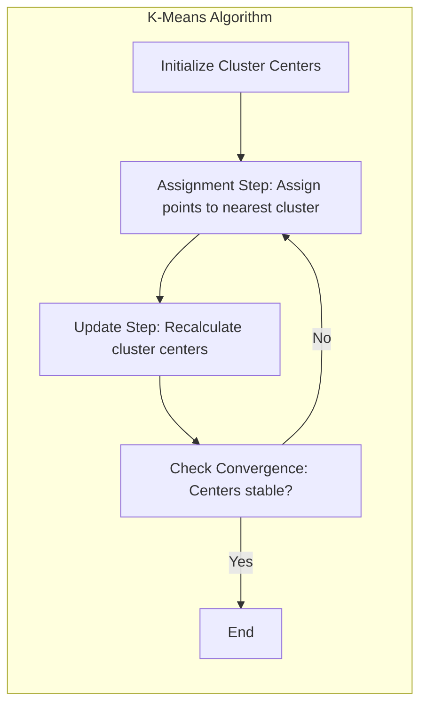
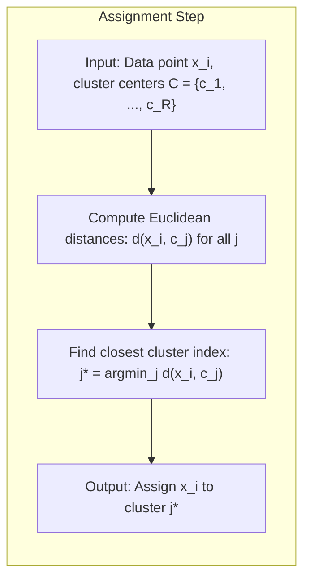
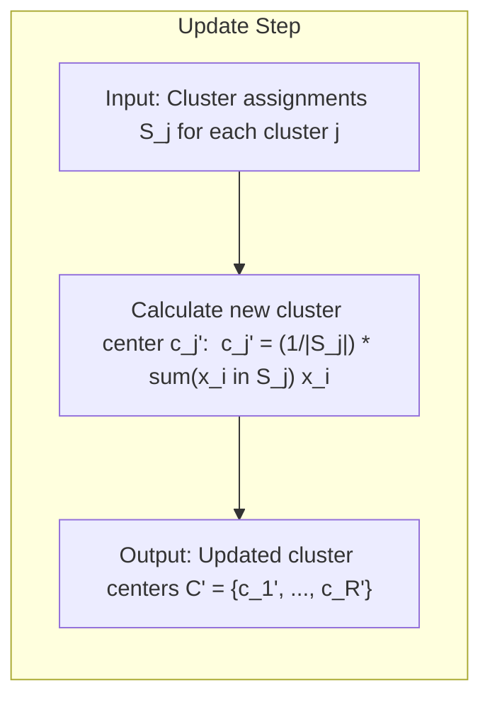
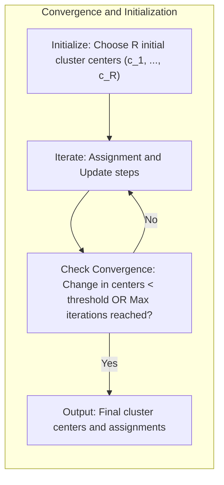

## Algoritmo Iterativo K-Means: Atribuição e Atualização de Centros de *Clusters*

### Introdução

Este capítulo detalha o **algoritmo iterativo K-Means**, focando na descrição precisa dos passos de **atribuição de pontos a centros de *clusters*** e **recálculo da média desses pontos como novos centros** [^13.2.1]. O K-Means é um dos algoritmos de *clustering* mais populares, e sua compreensão requer um olhar cuidadoso sobre como os dados são particionados em grupos (clusters) e como os centros desses grupos são determinados iterativamente. Analisaremos cada etapa do algoritmo em detalhes, suas implicações na qualidade do *clustering* e como o algoritmo busca convergir para uma solução estável, com os protótipos representando os dados de forma concisa.

### A Essência do Algoritmo K-Means: Atribuição e Atualização

O algoritmo K-Means é um método iterativo que busca particionar um conjunto de dados não rotulado em $R$ *clusters*, onde $R$ é um hiperparâmetro previamente definido [^13.2.1]. A essência do algoritmo está na alternância entre duas etapas principais:

1.  **Atribuição de pontos a centros de *clusters* (Assignment):** Nesta etapa, cada ponto de dados é atribuído ao *cluster* cujo centro é o mais próximo. A proximidade é tipicamente medida pela distância Euclidiana entre o ponto e o centro do *cluster*. O resultado dessa etapa é um agrupamento dos dados em $R$ *clusters*.
2.  **Recálculo da média dos pontos como novos centros (Update):** Nesta etapa, os centros dos *clusters* são recalculados com base na média dos pontos a eles atribuídos na etapa anterior. O novo centro de cada *cluster* é a média de todas as coordenadas dos pontos pertencentes àquele *cluster*.

Essas duas etapas são repetidas iterativamente até que os centros dos *clusters* se estabilizem, ou seja, não se movam significativamente entre iterações. A condição de convergência também pode ser um número máximo de iterações. O objetivo do K-Means é minimizar a soma das distâncias quadráticas entre cada ponto de dados e o centro de seu respectivo *cluster*, que é uma medida da variância intra-cluster.

**Lemma 31:** O algoritmo K-Means busca minimizar a variância intra-cluster por meio da alternância entre as etapas de atribuição e atualização, e sua convergência para um mínimo local é garantida pelo decréscimo da função objetivo a cada iteração.
*Prova*: A fase de atribuição realoca cada ponto ao centroide mais próximo, o que diminui a soma das distâncias quadráticas, e a fase de atualização move os centroides para o ponto médio dos clusters atuais, também diminuindo essa distância. $\blacksquare$

**Corolário 31:** A sensibilidade à inicialização do K-means é consequência do algoritmo convergir para mínimos locais, onde a solução obtida depende da posição inicial aleatória dos centros.

> 💡 **Exemplo Numérico:**
>
> Imagine que temos 3 pontos em um espaço 2D: $x_1 = (1, 2)$, $x_2 = (1.5, 1.8)$, e $x_3 = (5, 8)$. Queremos dividi-los em 2 clusters ($R=2$). Inicializamos os centros aleatoriamente como $c_1 = (1, 1)$ e $c_2 = (5, 5)$.
>
> **Iteração 1:**
>
> *   **Atribuição:**
>     *   Calculamos a distância Euclidiana de cada ponto aos centros:
>         *   $d(x_1, c_1) = \sqrt{(1-1)^2 + (2-1)^2} = 1$
>         *   $d(x_1, c_2) = \sqrt{(1-5)^2 + (2-5)^2} = 5$
>         *   $d(x_2, c_1) = \sqrt{(1.5-1)^2 + (1.8-1)^2} \approx 1.03$
>         *   $d(x_2, c_2) = \sqrt{(1.5-5)^2 + (1.8-5)^2} \approx 4.66$
>         *   $d(x_3, c_1) = \sqrt{(5-1)^2 + (8-1)^2} \approx 8.06$
>         *   $d(x_3, c_2) = \sqrt{(5-5)^2 + (8-5)^2} = 3$
>     *   Atribuímos os pontos aos clusters: $x_1$ e $x_2$ ao cluster 1, e $x_3$ ao cluster 2.  $S_1 = \{x_1, x_2\}$, $S_2 = \{x_3\}$.
> *   **Atualização:**
>     *   Recalculamos os centros dos clusters:
>         *   $c_1' = \frac{(1, 2) + (1.5, 1.8)}{2} = (1.25, 1.9)$
>         *   $c_2' = \frac{(5, 8)}{1} = (5, 8)$
>
> Os novos centros são $c_1' = (1.25, 1.9)$ e $c_2' = (5, 8)$. O algoritmo continuaria iterando até que os centros não mudassem significativamente.

> ⚠️ **Nota Importante**: O algoritmo K-Means alterna entre as etapas de atribuição e atualização, buscando convergir para uma solução que minimize a variância intra-cluster.

> ❗ **Ponto de Atenção**:  A escolha da distância Euclidiana como métrica de proximidade implica que o K-Means pode ser sensível à escala das *features*, sendo necessário o pré-processamento dos dados com padronização antes de aplicar o algoritmo.

### Detalhes da Etapa de Atribuição

A etapa de **atribuição** no algoritmo K-Means envolve a alocação de cada ponto de dados ao *cluster* cujo centro é o mais próximo [^13.2.1]. Para isso, cada ponto de dados é comparado com os centros de todos os *clusters* utilizando a distância Euclidiana como medida de proximidade.

Formalmente, seja $X = \{x_1, x_2, \ldots, x_N\}$ o conjunto de $N$ pontos de dados, e seja $C = \{c_1, c_2, \ldots, c_R\}$ o conjunto de $R$ centros de *clusters*. A atribuição de um ponto $x_i$ ao *cluster* $j$ é feita utilizando a seguinte regra:

$$j^* = \arg\min_j d(x_i, c_j)$$

Onde $d(x_i, c_j)$ é a distância Euclidiana entre o ponto $x_i$ e o centro do *cluster* $c_j$, e $j^*$ é o índice do *cluster* mais próximo de $x_i$. Após a atribuição, cada ponto $x_i$ pertence a um dos $R$ *clusters*.

**Lemma 32:** A etapa de atribuição no K-Means garante que cada ponto seja alocado ao *cluster* que minimiza a distância entre o ponto e o centro desse *cluster*.
*Prova*: A regra de atribuição é baseada na distância Euclidiana, e o ponto é atribuído ao centroide mais próximo, o que garante que a distância do ponto ao seu centro de cluster seja minimizada. $\blacksquare$

**Corolário 32:** A complexidade computacional da etapa de atribuição é linear em relação ao número de pontos de dados e ao número de *clusters*, o que a torna computacionalmente eficiente para grandes conjuntos de dados.

> 💡 **Exemplo Numérico:**
>
> Usando o exemplo anterior, na primeira iteração, o ponto $x_1 = (1, 2)$ é comparado com $c_1 = (1, 1)$ e $c_2 = (5, 5)$.
>
> *   $d(x_1, c_1) = \sqrt{(1-1)^2 + (2-1)^2} = 1$
> *   $d(x_1, c_2) = \sqrt{(1-5)^2 + (2-5)^2} = 5$
>
> Como $d(x_1, c_1) < d(x_1, c_2)$, o ponto $x_1$ é atribuído ao cluster 1. Este processo é repetido para todos os pontos e todos os centros.

> ⚠️ **Nota Importante**: A etapa de atribuição é o coração do algoritmo K-Means, garantindo que cada ponto seja alocado ao *cluster* mais próximo.

> ❗ **Ponto de Atenção**:  O cálculo da distância Euclidiana em cada iteração é a operação mais custosa do algoritmo, sendo fundamental otimizar essa etapa para obter bom desempenho em grandes conjuntos de dados.

### Detalhes da Etapa de Atualização

A etapa de **atualização** do algoritmo K-Means envolve o recálculo dos centros dos *clusters* com base nos pontos a eles atribuídos na etapa anterior [^13.2.1]. O novo centro de cada *cluster* é a média de todas as coordenadas dos pontos pertencentes àquele *cluster*.

Formalmente, seja $S_j$ o conjunto de pontos de dados atribuídos ao *cluster* $j$. O novo centro do *cluster* $c_j'$ é dado por:

$$c_j' = \frac{1}{|S_j|} \sum_{x_i \in S_j} x_i$$

Onde $|S_j|$ é o número de pontos no *cluster* $j$, e a soma é feita sobre todos os pontos $x_i$ que pertencem ao *cluster* $j$. O novo centro $c_j'$ é um vetor que representa o ponto médio do *cluster* $j$.

**Lemma 33:** A etapa de atualização garante que os centros dos *clusters* sejam reposicionados na média dos pontos a eles atribuídos, o que diminui a distância entre cada ponto e o centro de seu *cluster*.
*Prova*: A média é o valor que minimiza a soma das distâncias quadráticas dos pontos, o que significa que mover o centro para a média dos seus pontos diminui essa distância. $\blacksquare$

**Corolário 33:** O processo iterativo de atualização dos centros dos *clusters* leva à convergência para um mínimo local da função de custo, onde os centros não se movem mais significativamente e as atribuições dos pontos aos clusters se estabilizam.

> 💡 **Exemplo Numérico:**
>
> Após a atribuição na primeira iteração, tínhamos $S_1 = \{x_1, x_2\}$ e $S_2 = \{x_3\}$.
>
> *   O novo centro do cluster 1, $c_1'$, é calculado como a média de $x_1$ e $x_2$:
>     $c_1' = \frac{(1, 2) + (1.5, 1.8)}{2} = (1.25, 1.9)$
> *   O novo centro do cluster 2, $c_2'$, é calculado como a média de $x_3$:
>     $c_2' = \frac{(5, 8)}{1} = (5, 8)$
>
> Estes novos centros serão usados na próxima iteração para a etapa de atribuição.

> ⚠️ **Nota Importante**: A etapa de atualização é responsável por ajustar os centros dos *clusters* para refletir a distribuição dos dados e minimizar a variância intra-cluster.

> ❗ **Ponto de Atenção**:  A média, utilizada no cálculo dos novos centros, é sensível a *outliers*, o que pode afetar negativamente o desempenho do K-Means quando os dados apresentam ruído.

### Condição de Convergência e Inicialização

O algoritmo K-Means itera as etapas de atribuição e atualização até que uma **condição de convergência** seja satisfeita [^13.2.1]. A condição de convergência mais comum é que os centros dos *clusters* não se movam mais significativamente entre iterações, o que indica que o algoritmo encontrou um mínimo local da função de custo. Outras condições de convergência podem ser um número máximo de iterações ou um limiar para a variação dos centros entre iterações.

A **inicialização** do K-Means, ou seja, a escolha dos centros dos *clusters* na primeira iteração, é um aspecto crucial que afeta a solução final do algoritmo [^13.2.1]. A inicialização mais comum é a escolha aleatória de $R$ pontos de dados como centros iniciais, mas essa abordagem pode levar a resultados subótimos. Estratégias de inicialização mais sofisticadas podem ser usadas para melhorar a convergência e a qualidade do *clustering*.

**Lemma 34:** A inicialização dos centros dos *clusters* no K-Means afeta a solução final, devido à convergência do algoritmo para mínimos locais, e uma inicialização ruim pode levar a soluções subótimas.
*Prova*: Como o algoritmo K-means busca o mínimo local da função de custo, uma escolha ruim dos centros iniciais pode levar o algoritmo a um mínimo local de pior desempenho. $\blacksquare$

**Corolário 34:** A repetição do K-means várias vezes, com inicializações aleatórias e seleção do melhor resultado (menor variância intra-cluster) é uma forma de reduzir a influência da inicialização na qualidade do *clustering*.

> 💡 **Exemplo Numérico:**
>
> Suponha que, em vez de inicializar os centros em $c_1 = (1, 1)$ e $c_2 = (5, 5)$, tivéssemos inicializado em $c_1 = (1.2, 2.1)$ e $c_2 = (1.4, 1.9)$.
>
> *   Com essa inicialização, na primeira iteração, $x_1$, $x_2$ e $x_3$ poderiam ser atribuídos de forma diferente, levando a uma convergência para um mínimo local diferente.
>
> Para mitigar isso, podemos executar o K-Means várias vezes com diferentes inicializações aleatórias e escolher o resultado com a menor soma das distâncias intra-cluster.

> ⚠️ **Nota Importante**: A escolha da condição de convergência e da estratégia de inicialização afeta o tempo de execução do K-Means e a qualidade do *clustering*.

> ❗ **Ponto de Atenção**:  A convergência do K-Means para um mínimo local não garante que a solução seja a melhor possível, e é necessário avaliar a qualidade do *clustering* por meio de métricas e validação cruzada.

### Conclusão

O algoritmo K-Means é um método iterativo fundamental para *clustering* de dados não rotulados, que se baseia na alternância entre a atribuição de pontos aos *clusters* mais próximos e o recálculo dos centros dos *clusters* pela média dos pontos a eles atribuídos. A compreensão detalhada de cada etapa do algoritmo, bem como a consciência de suas limitações e da importância da inicialização e da escolha do número de *clusters*, são essenciais para aplicar e interpretar os resultados do K-Means em problemas de análise de dados.

### Footnotes

[^13.2.1]: "K-means clustering is a method for finding clusters and cluster centers in a set of unlabeled data. One chooses the desired number of cluster centers, say R, and the K-means procedure iteratively moves the centers to minimize the total within cluster variance. Given an initial set of centers, the K-means algorithm alternates the two steps: for each center we identify the subset of training points (its cluster) that is closer to it than any other center; the means of each feature for the data points in each cluster are computed, and this mean vector becomes the new center for that cluster." *(Trecho de "13. Prototype Methods and Nearest-Neighbors")*
