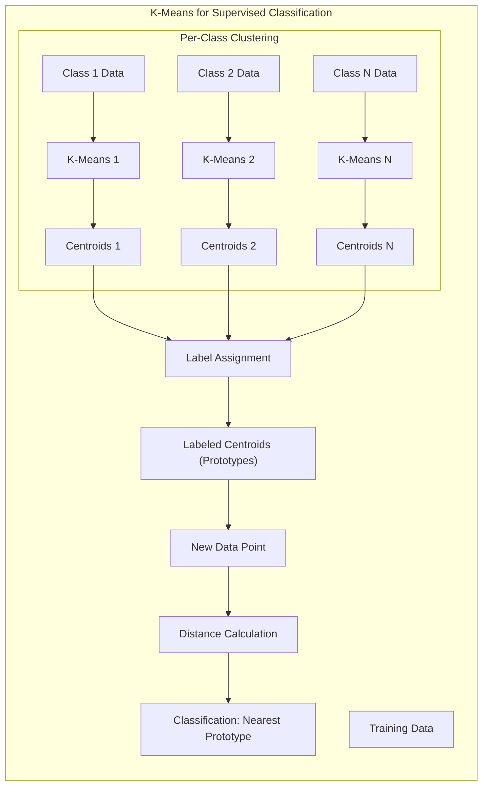
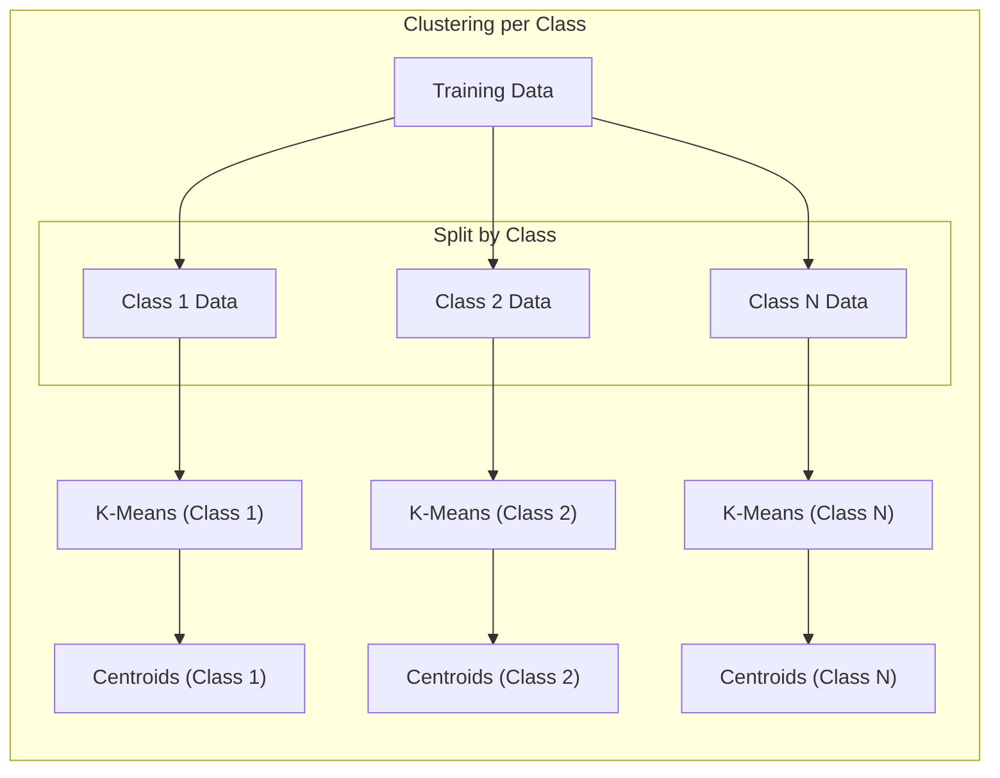
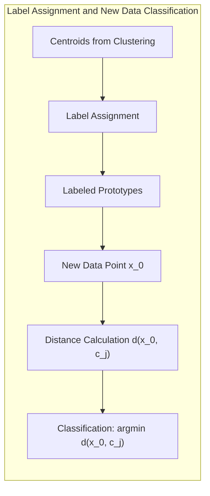
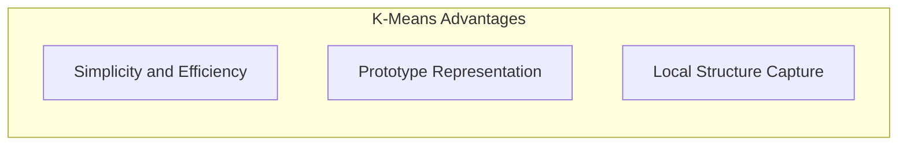
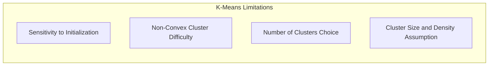

## Classificação com K-Means: *Clustering* por Classe e Atribuição de Rótulos a Centróides



### Introdução

Este capítulo explora como o algoritmo **K-Means** pode ser adaptado para tarefas de **classificação supervisionada**, detalhando os passos que envolvem o *clustering* independente por classe, a atribuição de rótulos de classe aos **centróides** resultantes e a classificação de novos dados com base na proximidade ao protótipo mais próximo [^13.2.1]. Embora o K-Means seja originalmente um método de *clustering* não supervisionado, sua aplicação em classificação supervisionada permite utilizar sua capacidade de identificar agrupamentos nos dados para realizar a atribuição de classes a novos pontos. Analisaremos cada passo desse processo, suas vantagens e limitações, e como ele se diferencia de abordagens mais tradicionais de classificação.

### Adaptação do K-Means para Classificação Supervisionada

A adaptação do algoritmo **K-Means** para classificação supervisionada envolve uma abordagem que utiliza o K-Means em cada classe separadamente, seguida pela atribuição de rótulos aos centróides e posterior classificação de novos pontos [^13.2.1]. Em vez de aplicar o K-Means a todo o conjunto de dados, o algoritmo é aplicado independentemente a cada classe do conjunto de treinamento, buscando identificar *clusters* dentro de cada classe. O procedimento geral pode ser descrito nos seguintes passos:

1.  **Agrupamento (Clustering) por Classe:** Para cada classe no conjunto de treinamento, o algoritmo K-Means é executado para identificar os *clusters* de dados e seus respectivos centros (centróides). O número de *clusters* para cada classe pode ser um hiperparâmetro a ser definido, e a escolha desse número pode ser feita utilizando técnicas de validação cruzada.
2.  **Atribuição de Rótulos aos Centróides:** Após o *clustering* por classe, cada centróide obtido pelo K-Means recebe o rótulo da classe a qual ele pertence. Esses centróides rotulados passam a ser considerados protótipos que representam a distribuição dos dados em cada classe.
3.  **Classificação de Novos Dados:** Para classificar um novo ponto de consulta, a distância Euclidiana entre o ponto e todos os protótipos é calculada. O ponto é então atribuído à classe do protótipo mais próximo. Essa etapa é análoga à etapa de classificação em métodos tradicionais de protótipos, mas os protótipos são criados utilizando o K-means separadamente em cada classe.

**Lemma 35:** A adaptação do K-Means para classificação supervisionada busca representar a distribuição de cada classe por um conjunto de protótipos (centróides), o que possibilita a classificação de novos pontos com base na proximidade a esses protótipos.
*Prova*: Ao aplicar K-Means separadamente em cada classe, a distribuição de cada classe é resumida em um conjunto de protótipos que capturam a variabilidade dos dados naquela classe. $\blacksquare$

**Corolário 35:** O uso do K-Means para criar protótipos por classe reduz a complexidade computacional e de armazenamento em relação ao uso direto de todo o conjunto de treinamento para classificação, como no caso do 1-NN.

> 💡 **Exemplo Numérico:**
>
> Imagine que temos um conjunto de dados de treinamento com duas classes (A e B), cada uma com 100 pontos de duas dimensões.
>
> ```python
> import numpy as np
> import matplotlib.pyplot as plt
> from sklearn.cluster import KMeans
> from sklearn.preprocessing import StandardScaler
>
> # Gerando dados sintéticos para duas classes
> np.random.seed(42)
> class_A = np.random.randn(100, 2) + [2, 2]
> class_B = np.random.randn(100, 2) + [-2, -2]
> data = np.concatenate((class_A, class_B), axis=0)
> labels = np.array([0] * 100 + [1] * 100) # 0 para classe A, 1 para classe B
>
> # Normalizando os dados
> scaler = StandardScaler()
> scaled_data = scaler.fit_transform(data)
>
> # Separando dados por classe
> class_A_data = scaled_data[labels == 0]
> class_B_data = scaled_data[labels == 1]
>
> # Aplicando K-Means em cada classe (com 2 clusters por classe)
> kmeans_A = KMeans(n_clusters=2, random_state=42, n_init=10)
> kmeans_B = KMeans(n_clusters=2, random_state=42, n_init=10)
>
> kmeans_A.fit(class_A_data)
> kmeans_B.fit(class_B_data)
>
> centroids_A = kmeans_A.cluster_centers_
> centroids_B = kmeans_B.cluster_centers_
>
> # Atribuindo rótulos aos centróides (0 para classe A, 1 para classe B)
> labeled_centroids = np.concatenate((centroids_A, centroids_B), axis=0)
> centroid_labels = np.array([0] * 2 + [1] * 2)
>
> # Visualização dos dados e centróides
> plt.figure(figsize=(8, 6))
> plt.scatter(class_A_data[:, 0], class_A_data[:, 1], label='Classe A', marker='o')
> plt.scatter(class_B_data[:, 0], class_B_data[:, 1], label='Classe B', marker='x')
> plt.scatter(centroids_A[:, 0], centroids_A[:, 1], color='red', marker='*', s=200, label='Centróides A')
> plt.scatter(centroids_B[:, 0], centroids_B[:, 1], color='blue', marker='*', s=200, label='Centróides B')
> plt.title('Dados e Centróides após K-Means por Classe')
> plt.xlabel('Feature 1 (Normalizada)')
> plt.ylabel('Feature 2 (Normalizada)')
> plt.legend()
> plt.grid(True)
> plt.show()
>
> # Exibindo os centróides
> print("Centróides da Classe A:\n", centroids_A)
> print("Centróides da Classe B:\n", centroids_B)
> ```
>
> Neste exemplo, aplicamos o K-Means separadamente em cada classe, encontrando 2 centróides por classe. Os centróides resultantes (em vermelho e azul) são usados como protótipos para classificar novos pontos.

> ⚠️ **Nota Importante**:  A adaptação do K-Means para classificação supervisionada permite usar a capacidade do algoritmo de identificar *clusters* em dados não rotulados para criar protótipos que representam as distribuições de cada classe.

> ❗ **Ponto de Atenção**: A escolha do número de *clusters* em cada classe é um hiperparâmetro importante que influencia o desempenho do modelo de classificação e que deve ser otimizado usando validação cruzada.

### Detalhes do *Clustering* por Classe

O passo de **clustering por classe** é fundamental na adaptação do K-Means para classificação supervisionada [^13.2.1]. Neste passo, o algoritmo K-Means é aplicado independentemente a cada classe do conjunto de treinamento, ou seja, o conjunto de treinamento é dividido em subconjuntos, um para cada classe, e o K-Means é aplicado a cada subconjunto individualmente.



O objetivo de aplicar o K-Means em cada classe separadamente é identificar os agrupamentos (clusters) de dados que são característicos da distribuição de cada classe. O número de *clusters* por classe ($R_k$, onde $k$ é o índice da classe) pode ser um hiperparâmetro a ser definido, e a escolha desse hiperparâmetro é importante para a capacidade do modelo de capturar a variabilidade dos dados dentro de cada classe.

Após a aplicação do K-Means a cada classe, obtemos um conjunto de $R_k$ centróides para a classe $k$. Esses centróides são os protótipos que serão utilizados para classificar novos dados na próxima etapa.

**Lemma 36:** A aplicação do K-Means por classe permite identificar os padrões específicos de agrupamento de cada classe, e os protótipos resultantes são representações dos centros das regiões de alta densidade de dados de cada classe.
*Prova*: Ao usar dados específicos de cada classe, o K-means se adapta melhor às características próprias de cada classe. $\blacksquare$

**Corolário 36:** A escolha do número de *clusters* em cada classe ($R_k$) afeta a capacidade do modelo de representar a variabilidade dos dados de cada classe, e a validação cruzada é necessária para determinar valores ótimos de $R_k$.

> 💡 **Exemplo Numérico:**
>
> Continuando com o exemplo anterior, vamos ilustrar como a escolha do número de clusters ($R_k$) afeta os centróides.
>
> ```python
> # Aplicando K-Means com 3 clusters na classe A
> kmeans_A_3 = KMeans(n_clusters=3, random_state=42, n_init=10)
> kmeans_A_3.fit(class_A_data)
> centroids_A_3 = kmeans_A_3.cluster_centers_
>
> # Visualização dos centróides com 3 clusters na classe A
> plt.figure(figsize=(8, 6))
> plt.scatter(class_A_data[:, 0], class_A_data[:, 1], label='Classe A', marker='o')
> plt.scatter(class_B_data[:, 0], class_B_data[:, 1], label='Classe B', marker='x')
> plt.scatter(centroids_A_3[:, 0], centroids_A_3[:, 1], color='green', marker='*', s=200, label='Centróides A (3 clusters)')
> plt.scatter(centroids_B[:, 0], centroids_B[:, 1], color='blue', marker='*', s=200, label='Centróides B (2 clusters)')
> plt.title('Centróides com 3 clusters na Classe A e 2 na Classe B')
> plt.xlabel('Feature 1 (Normalizada)')
> plt.ylabel('Feature 2 (Normalizada)')
> plt.legend()
> plt.grid(True)
> plt.show()
>
> print("Centróides da Classe A (3 clusters):\n", centroids_A_3)
> ```
>
> Ao aumentar o número de *clusters* para 3 na classe A, observamos que os centróides se ajustam melhor à distribuição dos dados dentro dessa classe, capturando mais detalhes. Isso demonstra como a escolha de $R_k$ influencia a representação da classe.

> ⚠️ **Nota Importante**:  O passo de *clustering* por classe é crucial para a adaptação do K-Means para classificação supervisionada, e a aplicação separada do algoritmo permite que ele capture as particularidades da distribuição dos dados de cada classe.

> ❗ **Ponto de Atenção**: A escolha de aplicar o mesmo número de *clusters* para todas as classes ou usar um número diferente de *clusters* para cada classe é uma decisão de projeto que deve ser feita com base no problema específico.

### Detalhes da Atribuição de Rótulos e Classificação de Novos Dados

Após a aplicação do K-Means em cada classe e a obtenção dos centróides de cada *cluster*, cada centróide é associado a um **rótulo de classe**, que é o mesmo rótulo da classe para a qual o algoritmo foi aplicado [^13.2.1]. Esses centróides rotulados passam a ser os protótipos que serão utilizados na etapa de classificação.



A etapa de **classificação de novos dados** envolve a atribuição de um novo ponto de consulta à classe do protótipo mais próximo. A proximidade é tipicamente medida pela distância Euclidiana entre o novo ponto e os protótipos de todas as classes.

Formalmente, seja $x_0$ o novo ponto de consulta, e seja $C = \{c_1, c_2, \ldots, c_P\}$ o conjunto de todos os protótipos (centróides de todos os *clusters* de todas as classes), cada um com um rótulo de classe $l_j$. A classe atribuída a $x_0$ é dada por:

$$\hat{l}(x_0) = l_{j^*}, \quad \text{onde} \quad j^* = \arg\min_j d(x_0, c_j)$$

Onde $d(x_0, c_j)$ é a distância Euclidiana entre o ponto de consulta $x_0$ e o protótipo $c_j$, e $l_{j^*}$ é o rótulo de classe associado ao protótipo mais próximo $c_{j^*}$.

**Lemma 37:** A atribuição de um novo ponto de consulta à classe do protótipo mais próximo no K-Means adaptado para classificação é equivalente à atribuição à região do espaço de *features* com densidade de dados da classe mais próxima.
*Prova*: A região de dados da classe é representada pelo conjunto de centros de cluster, e a atribuição é feita com base na proximidade aos centros de cluster. $\blacksquare$

**Corolário 37:** A etapa de classificação do K-Means adaptado para classificação utiliza os protótipos (centróides) como um resumo das distribuições das classes, permitindo classificar novos pontos com base na proximidade a esses resumos.

> 💡 **Exemplo Numérico:**
>
> Vamos demonstrar a classificação de um novo ponto de consulta usando os centróides calculados anteriormente.
>
> ```python
> from sklearn.metrics.pairwise import euclidean_distances
>
> # Definindo um novo ponto de consulta
> new_point = np.array([[0, 0]]) # Ponto no centro do espaço
> new_point_scaled = scaler.transform(new_point)
>
> # Calculando distâncias entre o novo ponto e todos os centróides
> all_centroids = np.concatenate((centroids_A, centroids_B), axis=0)
> distances = euclidean_distances(new_point_scaled, all_centroids)
>
> # Encontrando o índice do centróide mais próximo
> closest_centroid_index = np.argmin(distances)
>
> # Obtendo o rótulo do centróide mais próximo
> predicted_label = centroid_labels[closest_centroid_index]
>
> print(f"Novo ponto de consulta: {new_point}")
> print(f"Centróides:\n{all_centroids}")
> print(f"Distâncias do novo ponto aos centróides: {distances}")
> print(f"Índice do centróide mais próximo: {closest_centroid_index}")
> print(f"Classe predita para o novo ponto: {predicted_label}")
>
> # Visualização do novo ponto e do centróide mais próximo
> plt.figure(figsize=(8, 6))
> plt.scatter(class_A_data[:, 0], class_A_data[:, 1], label='Classe A', marker='o')
> plt.scatter(class_B_data[:, 0], class_B_data[:, 1], label='Classe B', marker='x')
> plt.scatter(all_centroids[:, 0], all_centroids[:, 1], color='red', marker='*', s=200, label='Centróides')
> plt.scatter(new_point_scaled[:, 0], new_point_scaled[:, 1], color='purple', marker='D', s=200, label='Novo Ponto')
> plt.title('Classificação de um Novo Ponto')
> plt.xlabel('Feature 1 (Normalizada)')
> plt.ylabel('Feature 2 (Normalizada)')
> plt.legend()
> plt.grid(True)
> plt.show()
> ```
>
> Neste exemplo, o novo ponto (em roxo) é classificado como pertencente à classe cujo centróide mais próximo (em vermelho) é da classe A (label 0). A distância Euclidiana é usada para determinar essa proximidade.

> ⚠️ **Nota Importante**: A classificação de novos dados utilizando os protótipos do K-Means é um processo direto de atribuição à classe do protótipo mais próximo, que depende da qualidade dos protótipos encontrados no passo anterior.

> ❗ **Ponto de Atenção**: A distância Euclidiana é utilizada para classificar novos dados, o que implica que as *features* devem ser padronizadas para evitar que *features* com escalas maiores dominem o cálculo da distância.

### Vantagens e Limitações do K-Means para Classificação

A adaptação do K-Means para classificação supervisionada oferece algumas vantagens em relação a outros métodos:

1.  **Simplicidade e Eficiência:** O algoritmo K-Means é simples de implementar e computacionalmente eficiente, o que o torna adequado para grandes conjuntos de dados.
2.  **Representação por Protótipos:** O K-Means permite representar a distribuição dos dados de cada classe por um conjunto de protótipos (centróides), o que reduz a complexidade de armazenamento e computacional durante a classificação.
3.  **Capacidade de Capturar Estruturas Locais:** O K-Means busca identificar agrupamentos de dados dentro de cada classe, o que permite capturar estruturas locais na distribuição dos dados que podem ser ignoradas por métodos lineares.



No entanto, a adaptação do K-Means para classificação também apresenta algumas limitações:

1.  **Sensibilidade à Inicialização:** O K-Means é sensível à inicialização aleatória dos centróides, o que pode levar a resultados subótimos.
2.  **Dificuldade com *Clusters* Não Convexos:** O K-Means assume que os *clusters* são aproximadamente convexos, o que pode ser problemático em dados onde as classes formam regiões mais complexas.
3.  **Escolha do Número de *Clusters*:** A escolha do número de *clusters* para cada classe é um hiperparâmetro que precisa ser ajustado, o que pode ser um desafio.
4. **Suposição de igualdade de tamanho e densidade dos clusters:** O K-means tenta encontrar *clusters* de tamanho e densidade comparável, o que pode ser uma limitação na modelagem de dados reais.



**Lemma 38:** A adaptação do K-means para classificação é um método eficiente para representação de distribuições e classificação por proximidade, mas com limitações devido às hipóteses simplificadoras do K-means original.
*Prova*: A derivação das vantagens e limitações do K-means quando usado para classificação supervisionada surge das limitações do algoritmo K-means e de seu uso como um criador de protótipos. $\blacksquare$

**Corolário 38:** Métodos mais sofisticados para ajuste dos protótipos, como o LVQ (Learning Vector Quantization), podem superar algumas das limitações do K-Means adaptado para classificação.

> ⚠️ **Nota Importante**: A adaptação do K-Means para classificação supervisionada oferece um método simples e eficiente para representação dos dados, mas é importante considerar suas limitações.

> ❗ **Ponto de Atenção**: A validação cruzada é fundamental para otimizar o número de *clusters* por classe e avaliar o desempenho do modelo de classificação.

### Conclusão

A utilização do K-Means para classificação supervisionada, com o *clustering* independente por classe, a atribuição de rótulos aos centróides e a classificação de novos dados com base na proximidade aos protótipos, oferece uma abordagem interessante e eficiente para problemas de classificação. A capacidade do K-Means de identificar agrupamentos de dados em cada classe separadamente permite criar protótipos que representam a variabilidade dos dados de cada classe. Apesar de suas limitações, o K-Means adaptado para classificação é uma ferramenta útil quando se deseja explorar os dados por meio da representação por protótipos, com um custo computacional relativamente baixo e capacidade de adaptação a distribuições de dados complexas.

### Footnotes

[^13.2.1]: "K-means clustering is a method for finding clusters and cluster centers in a set of unlabeled data... To use K-means clustering for classification of labeled data, the steps are: apply K-means clustering to the training data in each class separately, using R prototypes per class; assign a class label to each of the K × R prototypes; classify a new feature x to the class of the closest prototype." *(Trecho de "13. Prototype Methods and Nearest-Neighbors")*
