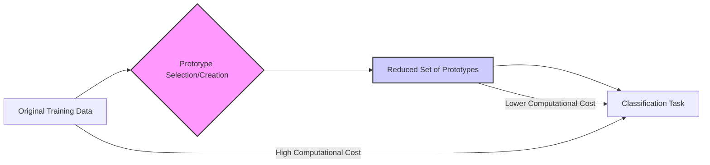
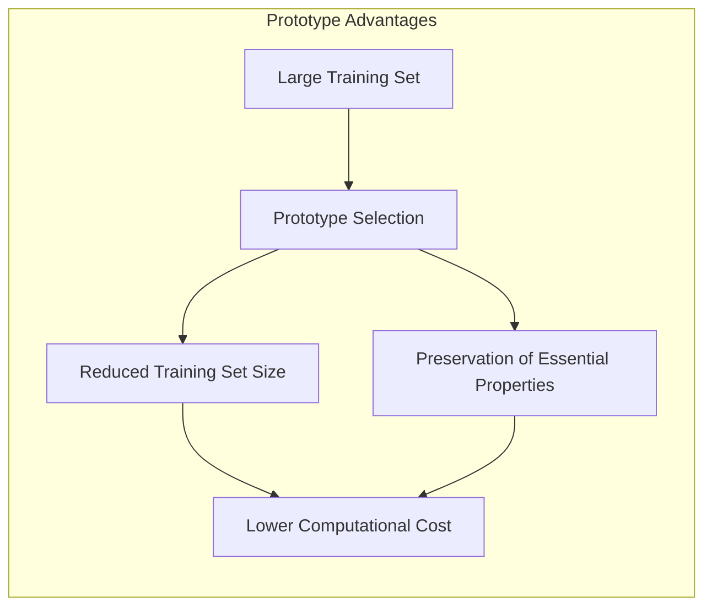
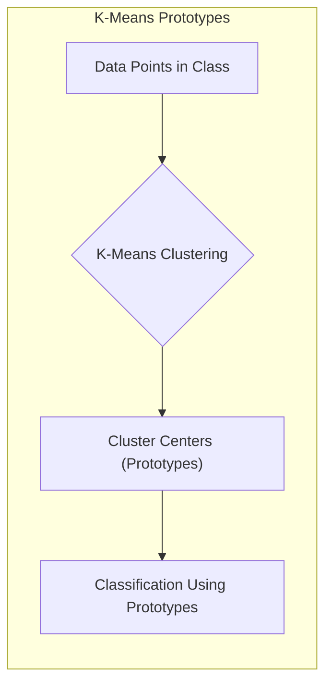
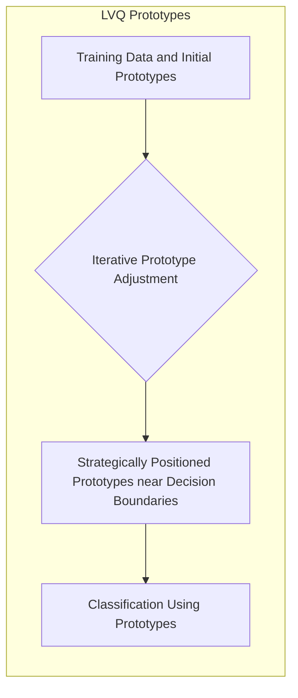
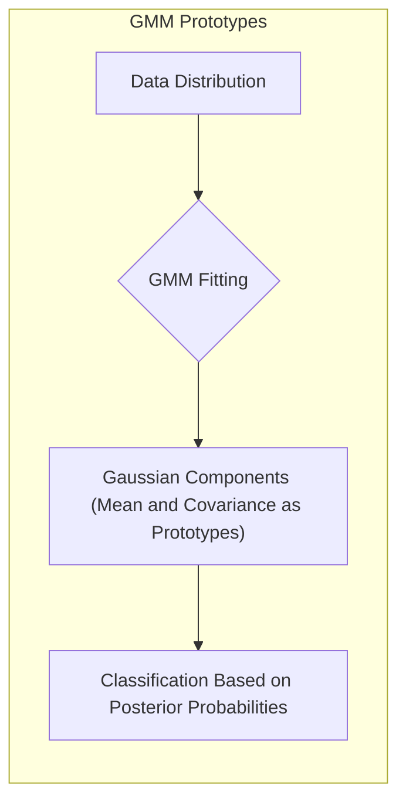
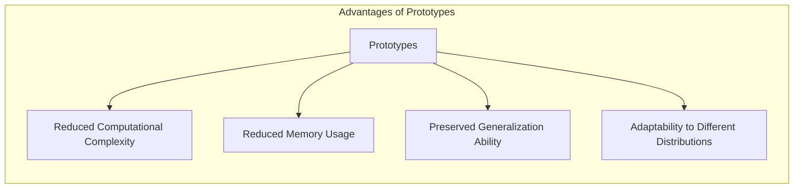
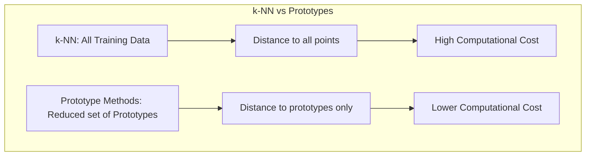

## Protótipos como Redutores de Amostras de Treinamento: Representando Propriedades Essenciais em Espaços Reduzidos



### Introdução

Este capítulo aprofunda o conceito de **protótipos** como um meio eficaz para **reduzir o tamanho das amostras de treinamento** e, ao mesmo tempo, representar as **propriedades essenciais do conjunto de dados** em um espaço reduzido [^13.2]. Em muitos problemas de aprendizado de máquina, o tamanho do conjunto de treinamento pode ser muito grande, o que implica em altos custos computacionais e dificuldades de armazenamento. Os métodos baseados em protótipos oferecem uma alternativa, permitindo que a informação do conjunto de dados seja resumida em um conjunto menor de pontos representativos, que são os protótipos. Exploraremos como técnicas como K-Means, LVQ (Learning Vector Quantization) e Misturas Gaussianas (GMMs) utilizam protótipos para condensar a informação dos dados, mantendo a capacidade de generalização e realizando a classificação de forma eficiente. Analisaremos as vantagens e limitações dessa abordagem, e como ela se diferencia do método de k-vizinhos mais próximos (k-NN), onde a representação da informação é feita pelo próprio conjunto de treinamento.

### Protótipos: Redução e Representação da Informação

A ideia central por trás do uso de **protótipos** é a criação de um conjunto reduzido de pontos que resume a informação contida em um conjunto de dados de treinamento potencialmente grande [^13.2]. Em vez de usar todas as amostras de treinamento para realizar a classificação, métodos baseados em protótipos representam as distribuições das classes por meio de um conjunto menor de pontos, que são os protótipos.

Essa abordagem oferece duas vantagens principais:

1.  **Redução do Tamanho das Amostras de Treinamento:** Ao usar protótipos, o tamanho do conjunto de dados a ser considerado durante a classificação é significativamente reduzido, o que diminui a complexidade computacional e o consumo de memória. Essa vantagem é particularmente relevante para problemas com grandes conjuntos de dados e alta dimensionalidade.
2.  **Preservação das Propriedades Essenciais:** Protótipos são selecionados ou construídos de forma que representem as propriedades essenciais da distribuição dos dados, incluindo a localização das classes, as formas das regiões de decisão e a variabilidade dentro de cada classe. Ao usar protótipos bem construídos, os modelos podem manter a capacidade de generalização, mesmo com uma representação reduzida dos dados.

A escolha de como criar e selecionar os protótipos é crucial para o sucesso dessa abordagem, e diferentes técnicas oferecem formas distintas de realizar essa tarefa. K-Means, LVQ e GMMs são métodos que se destacam por sua capacidade de criar protótipos que resumem a informação dos dados e permitem classificar novos pontos com base na proximidade aos protótipos.



**Lemma 39:** A representação de dados por meio de protótipos oferece um *tradeoff* entre a complexidade computacional e a capacidade de generalização, reduzindo o tamanho do conjunto de dados necessário para a classificação, mantendo as principais características da distribuição dos dados.
*Prova*: Ao usar um conjunto menor de protótipos, o custo computacional da classificação é menor, mas a capacidade de representar distribuições complexas é limitada pelo número de protótipos. $\blacksquare$

**Corolário 39:** A escolha do número e localização dos protótipos influencia a qualidade da representação e, consequentemente, o desempenho do modelo na classificação de novos dados.

> ⚠️ **Nota Importante**: O uso de protótipos permite reduzir o tamanho das amostras de treinamento, preservando as propriedades essenciais do conjunto de dados e mantendo a capacidade de generalização.

> ❗ **Ponto de Atenção**: A criação de protótipos envolve um processo de compressão de informações, o que pode levar a uma perda de detalhes, mas também pode remover ruídos e detalhes irrelevantes.

### Técnicas de Protótipos: K-Means, LVQ e GMMs como Redutores de Dimensionalidade

**K-Means:** Ao aplicar o **K-Means** para criar protótipos para classificação, o algoritmo busca identificar os centros de *clusters* dentro de cada classe, resultando em um conjunto de protótipos que representam as regiões de dados de cada classe [^13.2.1]. Em vez de usar todos os dados originais, apenas os centros dos *clusters* são usados como protótipos para classificar novos pontos. Essa abordagem reduz significativamente o tamanho do conjunto de dados usado na classificação, mas mantém a capacidade de representar a distribuição dos dados.



> 💡 **Exemplo Numérico:**
>
> Suponha que temos um conjunto de dados com 1000 pontos em duas classes, e cada ponto tem duas características (x1, x2). Ao aplicar o K-Means com 2 clusters para cada classe, obtemos 4 protótipos (centróides). Para classificar um novo ponto, em vez de calcular a distância para os 1000 pontos, calculamos a distância para apenas 4 protótipos, reduzindo drasticamente o custo computacional.
>
> ```python
> import numpy as np
> from sklearn.cluster import KMeans
> import matplotlib.pyplot as plt
>
> # Gerando dados de exemplo (2 classes)
> np.random.seed(42)
> class1_x = np.random.normal(loc=2, scale=1, size=(500, 1))
> class1_y = np.random.normal(loc=2, scale=1, size=(500, 1))
> class2_x = np.random.normal(loc=7, scale=1, size=(500, 1))
> class2_y = np.random.normal(loc=7, scale=1, size=(500, 1))
> data_class1 = np.concatenate((class1_x, class1_y), axis=1)
> data_class2 = np.concatenate((class2_x, class2_y), axis=1)
> data = np.concatenate((data_class1, data_class2), axis=0)
> labels = np.concatenate((np.zeros(500), np.ones(500)))
>
> # K-Means para cada classe
> kmeans_class1 = KMeans(n_clusters=2, random_state=42, n_init=10)
> kmeans_class2 = KMeans(n_clusters=2, random_state=42, n_init=10)
> kmeans_class1.fit(data_class1)
> kmeans_class2.fit(data_class2)
>
> # Protótipos (centróides)
> prototypes = np.concatenate((kmeans_class1.cluster_centers_, kmeans_class2.cluster_centers_), axis=0)
>
> # Plotting
> plt.scatter(data_class1[:,0], data_class1[:,1], label='Classe 1', alpha=0.5)
> plt.scatter(data_class2[:,0], data_class2[:,1], label='Classe 2', alpha=0.5)
> plt.scatter(prototypes[:,0], prototypes[:,1], marker='x', s=200, c='red', label='Protótipos')
> plt.xlabel('Feature x1')
> plt.ylabel('Feature x2')
> plt.title('K-Means Protótipos')
> plt.legend()
> plt.grid(True)
> plt.show()
>
> print("Protótipos (centróides):\n", prototypes)
> ```
>
> Neste exemplo, os 1000 pontos de dados foram reduzidos a 4 protótipos, que representam os centros dos clusters de cada classe.

**Lemma 40:** Os protótipos gerados pelo K-Means são representativos dos centros dos *clusters* de dados e, portanto, uma forma compacta de resumir a distribuição dos dados de cada classe.
*Prova*: Como o K-means busca a média da variabilidade de cada cluster, o centróide é o ponto que melhor representa os pontos pertencentes a ele. $\blacksquare$

**Learning Vector Quantization (LVQ):** O **LVQ** cria protótipos que são estrategicamente posicionados em relação às fronteiras de decisão entre as classes [^13.2.2]. Ao ajustar iterativamente os protótipos, o LVQ busca criar um conjunto menor de pontos que representam de forma mais eficaz as regiões de decisão das classes. O uso do LVQ como redutor de dimensionalidade se dá pela utilização apenas desses protótipos no processo de classificação, em vez das amostras de treinamento originais.



> 💡 **Exemplo Numérico:**
>
> Imagine que temos duas classes com dados sobrepostos. Inicialmente, posicionamos alguns protótipos aleatoriamente. O LVQ ajusta iterativamente esses protótipos, movendo os protótipos da mesma classe em direção aos dados e os protótipos de classes diferentes para longe dos dados. Por exemplo, se um ponto de dados da classe A está perto de um protótipo da classe B, esse protótipo é movido para longe, enquanto um protótipo da classe A é movido para perto. Esse processo iterativo faz com que os protótipos se posicionem perto das fronteiras de decisão.
>
> ```python
> import numpy as np
> import matplotlib.pyplot as plt
>
> # Função para calcular a distância euclidiana
> def euclidean_distance(point1, point2):
>     return np.sqrt(np.sum((point1 - point2)**2))
>
> # Função para inicializar os protótipos
> def initialize_prototypes(data, num_prototypes, labels):
>     prototypes = []
>     unique_labels = np.unique(labels)
>     for label in unique_labels:
>         class_data = data[labels == label]
>         indices = np.random.choice(len(class_data), num_prototypes, replace=False)
>         for index in indices:
>           prototypes.append((class_data[index],label))
>     return prototypes
>
> # Função para atualizar os protótipos
> def update_prototypes(prototypes, data_point, learning_rate, labels):
>     min_dist = float('inf')
>     closest_prototype_index = -1
>
>     for i, (prototype,label) in enumerate(prototypes):
>       dist = euclidean_distance(data_point, prototype)
>       if dist < min_dist:
>         min_dist = dist
>         closest_prototype_index = i
>
>     closest_prototype, closest_label = prototypes[closest_prototype_index]
>
>     if labels == closest_label:
>       prototypes[closest_prototype_index] = (closest_prototype + learning_rate * (data_point - closest_prototype),closest_label)
>     else:
>       prototypes[closest_prototype_index] = (closest_prototype - learning_rate * (data_point - closest_prototype),closest_label)
>
>     return prototypes
>
> # Gerando dados de exemplo (2 classes)
> np.random.seed(42)
> class1_x = np.random.normal(loc=2, scale=1, size=(50, 1))
> class1_y = np.random.normal(loc=2, scale=1, size=(50, 1))
> class2_x = np.random.normal(loc=5, scale=1, size=(50, 1))
> class2_y = np.random.normal(loc=5, scale=1, size=(50, 1))
> data_class1 = np.concatenate((class1_x, class1_y), axis=1)
> data_class2 = np.concatenate((class2_x, class2_y), axis=1)
> data = np.concatenate((data_class1, data_class2), axis=0)
> labels = np.concatenate((np.zeros(50), np.ones(50)))
>
> # Inicializar protótipos
> num_prototypes_per_class = 2
> learning_rate = 0.1
> num_epochs = 100
> prototypes = initialize_prototypes(data, num_prototypes_per_class, labels)
>
> # Treinar LVQ
> for epoch in range(num_epochs):
>   for i in range(len(data)):
>     prototypes = update_prototypes(prototypes, data[i], learning_rate, labels[i])
>
> # Extrair protótipos e labels
> prototype_points = [p[0] for p in prototypes]
> prototype_labels = [p[1] for p in prototypes]
> prototype_points = np.array(prototype_points)
>
> # Plotting
> plt.scatter(data_class1[:, 0], data_class1[:, 1], label='Classe 1', alpha=0.5)
> plt.scatter(data_class2[:, 0], data_class2[:, 1], label='Classe 2', alpha=0.5)
> plt.scatter(prototype_points[:, 0], prototype_points[:, 1], marker='x', s=200, c='red', label='Protótipos')
> plt.xlabel('Feature x1')
> plt.ylabel('Feature x2')
> plt.title('LVQ Protótipos')
> plt.legend()
> plt.grid(True)
> plt.show()
>
> print("Protótipos:\n", prototype_points)
> ```
>
> Neste exemplo, os protótipos foram ajustados para ficarem próximos às fronteiras de decisão. O LVQ cria protótipos que discriminam melhor as classes do que os centróides do K-Means.

**Corolário 40:** O LVQ cria protótipos que são não apenas representativos das classes, mas também projetados para discriminar entre elas, tornando-o uma técnica eficaz de redução do tamanho do conjunto de dados com manutenção da capacidade de generalização.

**Misturas Gaussianas (GMMs):** As **GMMs** modelam a distribuição dos dados como uma combinação de componentes gaussianas [^13.2.3]. Os parâmetros das gaussianas (média e covariância) são os protótipos que representam a distribuição dos dados em cada classe, permitindo classificar novos pontos usando as probabilidades *a posteriori* de pertencer a cada componente gaussiana. O número de componentes gaussianas é tipicamente menor que o número de amostras de treino.



> 💡 **Exemplo Numérico:**
>
> Suponha que temos uma classe de dados que parece ter duas subestruturas. Em vez de usar um único protótipo (como o centróide no K-Means), o GMM pode modelar essa classe usando duas gaussianas. Cada gaussiana tem um vetor de média e uma matriz de covariância, que são os protótipos. Para classificar um novo ponto, calculamos a probabilidade de ele pertencer a cada gaussiana e, em seguida, atribuímos o ponto à classe com maior probabilidade.
>
> ```python
> import numpy as np
> from sklearn.mixture import GaussianMixture
> import matplotlib.pyplot as plt
>
> # Gerando dados de exemplo (1 classe com duas subestruturas)
> np.random.seed(42)
> data1_x = np.random.normal(loc=2, scale=1, size=(250, 1))
> data1_y = np.random.normal(loc=2, scale=1, size=(250, 1))
> data2_x = np.random.normal(loc=7, scale=1, size=(250, 1))
> data2_y = np.random.normal(loc=7, scale=1, size=(250, 1))
> data_class = np.concatenate((np.concatenate((data1_x, data1_y), axis=1), np.concatenate((data2_x, data2_y), axis=1)), axis=0)
>
> # GMM com 2 componentes
> gmm = GaussianMixture(n_components=2, random_state=42, n_init=10)
> gmm.fit(data_class)
>
> # Protótipos (médias e covariâncias)
> means = gmm.means_
> covariances = gmm.covariances_
>
> # Plotting
> x = np.linspace(min(data_class[:, 0])-1, max(data_class[:, 0])+1, 100)
> y = np.linspace(min(data_class[:, 1])-1, max(data_class[:, 1])+1, 100)
> X, Y = np.meshgrid(x, y)
> positions = np.vstack([X.ravel(), Y.ravel()]).T
> Z = -gmm.score_samples(positions).reshape(X.shape)
>
> plt.contourf(X, Y, Z, cmap='viridis', alpha=0.6)
> plt.scatter(data_class[:, 0], data_class[:, 1], label='Dados', alpha=0.5)
> plt.scatter(means[:, 0], means[:, 1], marker='x', s=200, c='red', label='Protótipos (Médias)')
> plt.xlabel('Feature x1')
> plt.ylabel('Feature x2')
> plt.title('GMM Protótipos')
> plt.legend()
> plt.grid(True)
> plt.show()
>
> print("Protótipos (médias):\n", means)
> print("Protótipos (covariâncias):\n", covariances)
> ```
>
> Neste exemplo, os dados foram modelados por duas gaussianas, com médias e covariâncias que representam as subestruturas dos dados. As médias são os protótipos centrais, e as covariâncias indicam a forma de cada gaussiana.

> ⚠️ **Nota Importante**: As três abordagens (K-Means, LVQ, GMMs) oferecem formas distintas de criar protótipos para reduzir o tamanho dos dados, e a escolha da técnica mais adequada depende do problema específico e da distribuição dos dados.

> ❗ **Ponto de Atenção**:  A escolha do número de protótipos em cada técnica tem um impacto significativo na eficácia da redução do tamanho do conjunto de dados e na manutenção da capacidade de generalização, sendo necessário o uso de validação cruzada para otimizar esse parâmetro.

### Vantagens da Redução de Amostras com Protótipos

O uso de protótipos como redutores de amostras de treinamento oferece diversas vantagens em relação a abordagens que utilizam todo o conjunto de dados:

1.  **Redução da Complexidade Computacional:** Ao classificar um novo ponto de consulta, apenas as distâncias entre o ponto e os protótipos precisam ser calculadas, o que é muito mais eficiente do que calcular a distância para todos os pontos do conjunto de treinamento, especialmente quando o conjunto de treinamento é grande.
2.  **Redução do Consumo de Memória:** O armazenamento dos protótipos requer significativamente menos memória do que o armazenamento de todos os dados de treinamento, o que permite que esses métodos sejam utilizados em problemas com grandes conjuntos de dados.
3.  **Preservação da Capacidade de Generalização:** Protótipos bem construídos podem capturar as características essenciais da distribuição dos dados e, portanto, manter a capacidade de generalização do modelo, mesmo com uma representação reduzida dos dados.
4.  **Adaptação a Diferentes Distribuições:** A flexibilidade dos métodos de protótipos permite que eles se adaptem a diferentes formas de distribuição de dados e a fronteiras de decisão complexas.



**Lemma 41:** O uso de protótipos para representar os dados de treinamento reduz o custo computacional e de armazenamento da classificação, mantendo a capacidade do modelo de generalizar quando os protótipos são adequadamente selecionados.
*Prova*: As etapas de classificação envolvem o cálculo da distância de um novo ponto apenas para os protótipos e não para todos os pontos de treino, reduzindo significativamente a carga computacional. $\blacksquare$

**Corolário 41:** A escolha adequada do número e localização dos protótipos pode balancear a redução do tamanho das amostras com a manutenção da capacidade de generalização.

> ⚠️ **Nota Importante**: O uso de protótipos é uma forma eficiente de reduzir o tamanho das amostras de treinamento, mantendo a capacidade de generalização e reduzindo a complexidade computacional e de armazenamento.

> ❗ **Ponto de Atenção**:  Em comparação com métodos como o k-NN, o uso de protótipos pode resultar em um modelo mais eficiente e menos suscetível a *overfitting*, mas também pode apresentar uma perda de detalhes finos sobre a distribuição dos dados.

### Comparação com k-Vizinhos Mais Próximos (k-NN)

O método de **k-Vizinhos Mais Próximos (k-NN)**, embora seja uma abordagem popular para classificação, não oferece a mesma capacidade de redução de tamanho das amostras de treinamento como os métodos baseados em protótipos [^13.3]. No k-NN, todo o conjunto de dados de treinamento é usado para classificar novos pontos, pois o processo de classificação envolve a busca pelos $k$ pontos de treinamento mais próximos do novo ponto de consulta.

> 💡 **Exemplo Numérico:**
>
> Considere um conjunto de treinamento com 1000 pontos. No k-NN, para classificar um novo ponto, precisamos calcular a distância entre esse ponto e todos os 1000 pontos do conjunto de treinamento. Se usarmos protótipos, como 10 protótipos por classe, precisaríamos calcular a distância para apenas 20 protótipos (supondo duas classes), uma redução significativa na complexidade computacional.



Embora o k-NN possa se adaptar bem a fronteiras de decisão complexas, sua complexidade computacional e de armazenamento aumenta linearmente com o tamanho do conjunto de treinamento, o que pode tornar seu uso impraticável para grandes conjuntos de dados. O uso de protótipos, por outro lado, oferece uma alternativa mais escalável e eficiente, com uma redução significativa do tamanho das amostras de treinamento e uma manutenção razoável da capacidade de generalização.

**Lemma 42:** O k-NN não realiza redução do tamanho do conjunto de dados, e portanto a sua capacidade de generalização é limitada pela complexidade do conjunto de treino.
*Prova*: Como a classificação é feita usando todos os pontos de treino para determinar os k vizinhos, nenhuma redução no tamanho dos dados é feita. $\blacksquare$

**Corolário 42:** Métodos de protótipos podem ser considerados uma forma de compressão de dados, onde um conjunto menor de protótipos substitui um conjunto de dados maior, com o objetivo de reduzir a complexidade computacional e de armazenamento.

> ⚠️ **Nota Importante**: O k-NN depende de todos os dados de treinamento para classificação, enquanto métodos de protótipos reduzem o tamanho das amostras, utilizando um conjunto menor de protótipos.

> ❗ **Ponto de Atenção**:  A escolha entre k-NN e métodos de protótipos depende do tamanho do conjunto de dados, da necessidade de uma representação compacta e da complexidade das fronteiras de decisão.

### Conclusão

O uso de protótipos como redutores de amostras de treinamento oferece uma abordagem eficaz para lidar com problemas de classificação e reconhecimento de padrões com conjuntos de dados grandes e complexos. Técnicas como K-Means, LVQ e GMMs permitem criar protótipos que representam as propriedades essenciais dos dados em um espaço reduzido, mantendo a capacidade de generalização e reduzindo os custos computacionais e de armazenamento. A escolha do método de protótipos mais adequado depende das características do problema e da distribuição dos dados, mas todos compartilham a ideia central de que um conjunto menor de pontos pode substituir um conjunto de dados maior na tarefa de classificação.

### Footnotes

[^13.2]: "Throughout this chapter, our training data consists of the N pairs (x1,91),...,(xn, 9N) where gi is a class label taking values in {1, 2, . . ., K}. Prototype methods represent the training data by a set of points in feature space. These prototypes are typically not examples from the training sample, except in the case of 1-nearest-neighbor classification discussed later. Each prototype has an associated class label, and classification of a query point x is made to the class of the closest prototype. "Closest" is usually defined by Euclidean distance in the feature space, after each feature has been standardized to have overall mean 0 and variance 1 in the training sample." *(Trecho de "13. Prototype Methods and Nearest-Neighbors")*

[^13.2.1]: "K-means clustering is a method for finding clusters and cluster centers in a set of unlabeled data... To use K-means clustering for classification of labeled data, the steps are: apply K-means clustering to the training data in each class separately, using R prototypes per class; assign a class label to each of the K × R prototypes; classify a new feature x to the class of the closest prototype." *(Trecho de "13. Prototype Methods and Nearest-Neighbors")*

[^13.2.2]: "In this technique due to Kohonen (1989), prototypes are placed strategically with respect to the decision boundaries in an ad-hoc way. LVQ is an online algorithm-observations are processed one at a time. The idea is that the training points attract prototypes of the correct class, and repel other prototypes. When the iterations settle down, prototypes should be close to the training points in their class." *(Trecho de "13. Prototype Methods and Nearest-Neighbors")*

[^13.2.3]: "The Gaussian mixture model can also be thought of as a prototype method, similar in spirit to K-means and LVQ...Each cluster is described in terms of a Gaussian density, which has a centroid (as in K-means), and a covariance matrix...when Gaussian mixture models are used to represent the feature density in each class, it produces smooth posterior probabilities." *(Trecho de "13. Prototype Methods and Nearest-Neighbors")*

[^13.3]: "These classifiers are memory-based, and require no model to be fit. Given a query point xo, we find the k training points x(r), r = 1,..., k closest in distance to xo, and then classify using majority vote among the k neighbors." *(Trecho de "13. Prototype Methods and Nearest-Neighbors")*
